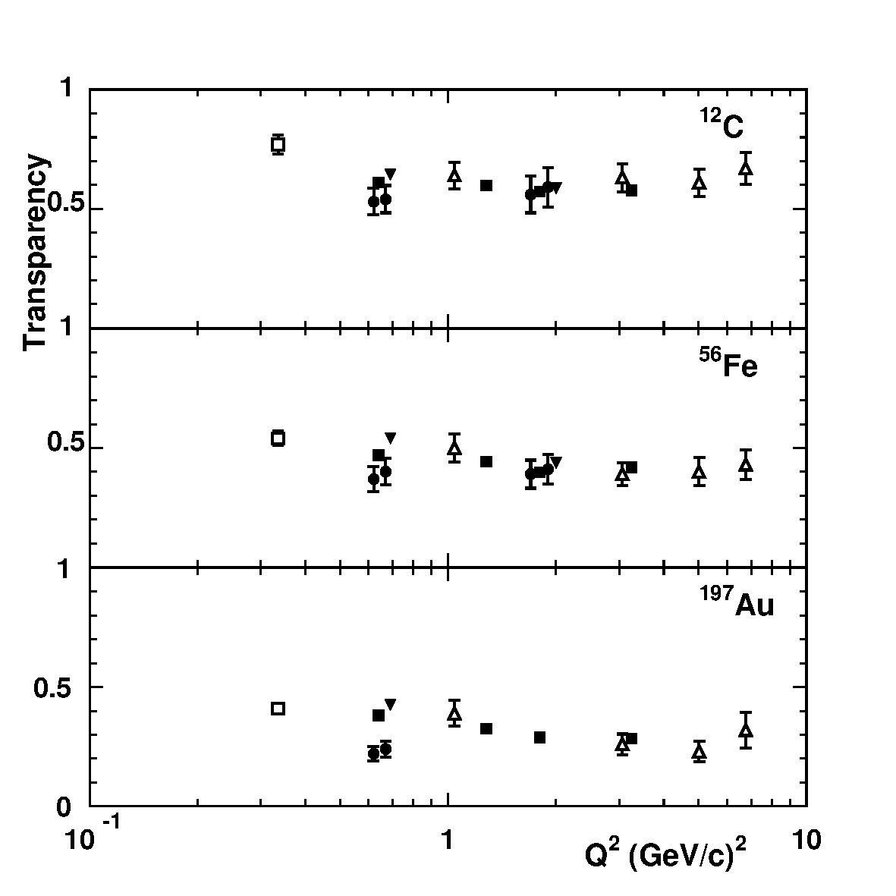
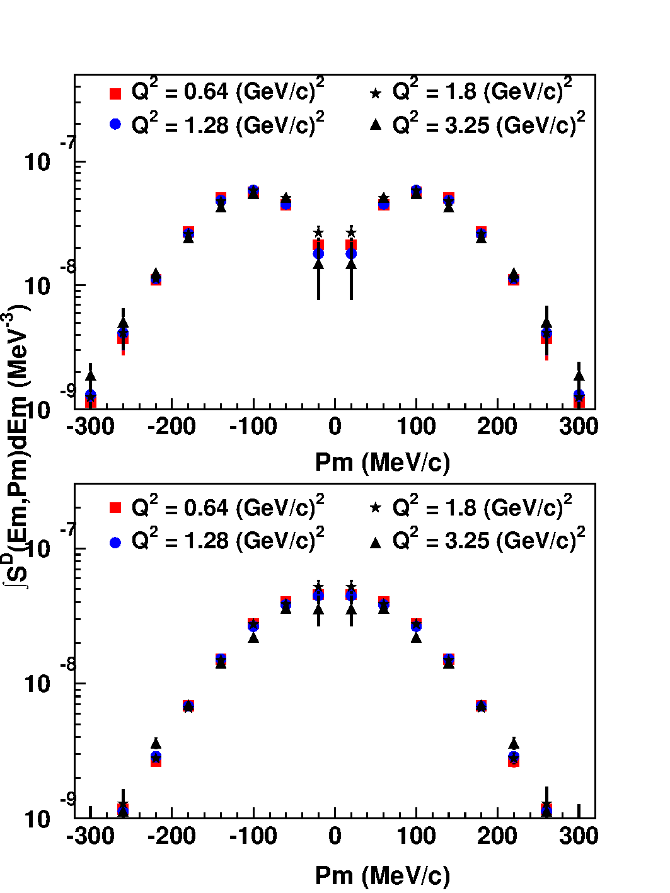
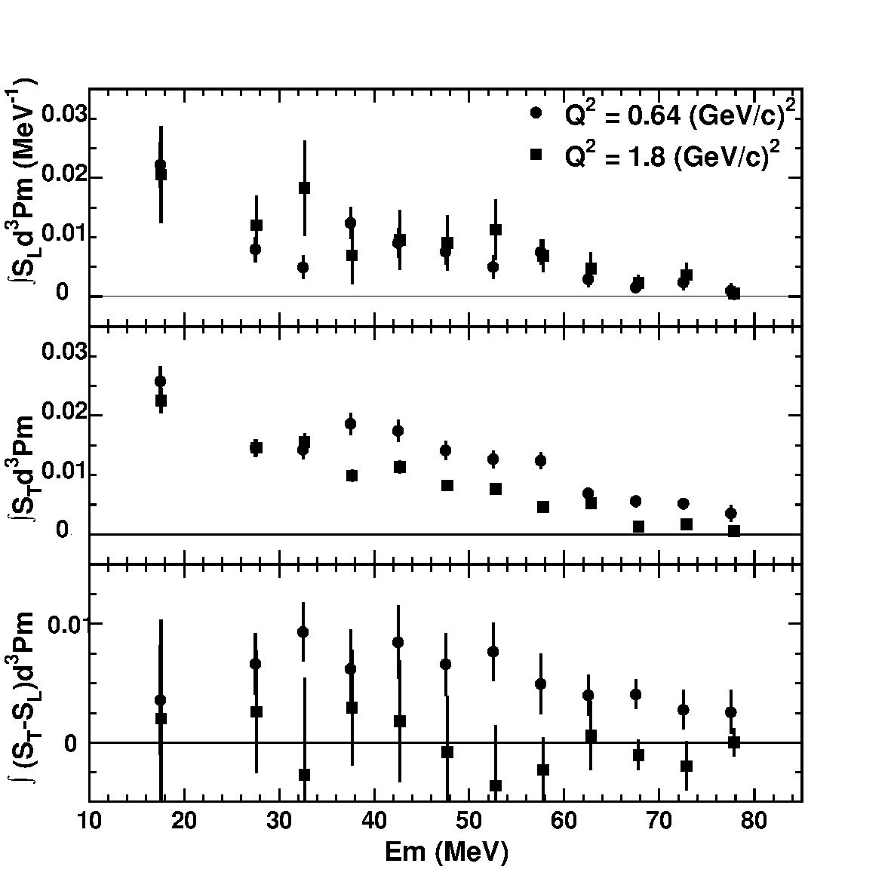
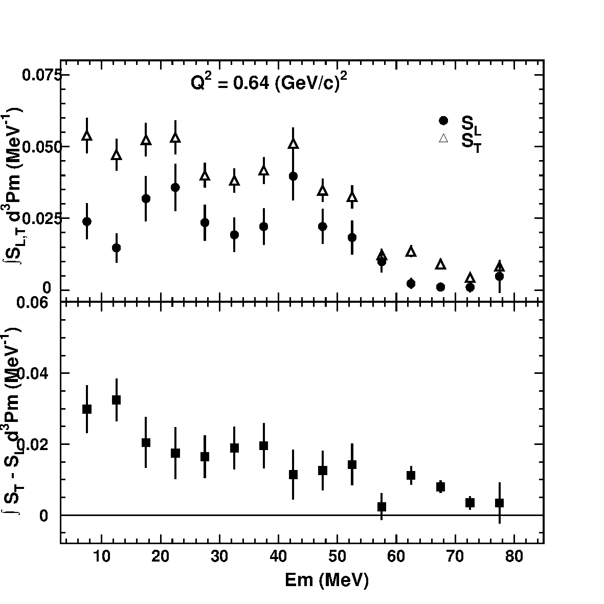

# A Study of the Quasi-elastic (e,e'p) Reaction on ¹²C, ⁵⁶Fe and ¹⁹⁷Au

- **Authors:** D. Dutta, D. van Westrum, et al. (Jefferson Lab Hall C, experiment E91-013)
- **arXiv:** [nucl-ex/0303011](https://arxiv.org/abs/nucl-ex/0303011)
- **Journal reference / DOI:** (not stated in paper)
- **PACS:** 25.30.Fj, 25.30.Rw

> Note: this is an electron-scattering coincidence (e,e'p) paper, not a neutrino measurement. The standard neutrino-cross-section rubric sections (signal definition, D'Agostini/SVD unfolding, neutrino flux) do not all apply; the analogous (e,e'p) sections (spectral functions, missing energy/momentum, transparency) are filled in instead. Omitted/non-applicable sections are noted.

## Beam / probe / exposure

- **Probe:** continuous CEBAF electron beam, Hall C, JLab (commissioning experiment, 1995–1996).
- **Beam energies:** nominal E_e = (0.8N + 0.045) GeV with N = 1–4 passes. Settings used (from Table I): 0.845, 1.645, 2.445, 3.245 GeV.
- **Absolute beam-energy calibration:** two independent methods (dispersion calibration via ¹²C 4.43891 ± 0.00031 MeV excited state with BeO target; diffraction-minimum method using ¹²C first excited state at Q² = 0.129 ± 0.0006 (GeV/c)²). The two methods agreed to 1 part in 2000; absolute energy accuracy believed to be 10⁻³. Three-pass beam energy from elastic e-p scattering known to 1 part in 500.
- **Beam current:** 10 to 60 μA, monitored by 3 microwave cavities calibrated against an Unser cavity; overall accuracy ±1%.
- **Target nuclei:** ¹²C, ⁵⁶Fe, ¹⁹⁷Au (≈ 200 mg/cm² solid targets, thickness known to ≈ 0.1%), mounted on a steel ladder in an aluminum scattering chamber. Calibration data taken with the 4.0 cm Hall C cryogenic (liquid hydrogen) target.
- **Integrated luminosity / collected charge:** (not stated in paper as a single number; absolute yield normalization done from experimental luminosity, phase-space volume, and number of generated events in SIMC).
- **N_nucleons / N_targets:** (not stated in paper).
- **Q² range covered:** 0.64 – 3.25 (GeV/c)². L–T separations at Q² = 0.64 and 1.8 (GeV/c)².

## Detector / spectrometer setup

Coincidence measurement: **HMS** (High Momentum Spectrometer) detected electrons and **SOS** (Short Orbit Spectrometer) detected protons, except at the highest Q² = 3.25 (GeV/c)² where the roles were reversed.

**HMS** — 25° vertical-bend, superconducting QQQD:
- Rotation range 12.5°–90° from beam line.
- Maximum central momentum 7.3 GeV/c (tested to 4.4 GeV/c; highest used 2.6 GeV/c).
- Usable momentum bite ≈ 20%.
- Momentum resolution (σ) < 1.4 × 10⁻³.
- In-plane (out-of-plane) angular resolution 0.8 (1.0) mrad.
- Solid angle 8.1 msr (point target); 6.8 msr with 6.35 cm HEAVYMET octagonal collimator.

**SOS** — QDD̄, vertical net bend 18° at central momentum, path length 11 m:
- Rotation range 13.1°–168.4° (minimum used 14.5°); can go ±20° out of plane (not used here).
- Maximum central momentum 1.8 GeV/c, nominal momentum bite 40%.
- Momentum resolution (σ) < 1.0 × 10⁻³.
- In-plane (out-of-plane) angular resolution quoted as 4.5 (0.5) msr [text uses "msr"; likely mrad — see open_questions].
- Solid angle ≈ 9 msr (point target); 7.5 msr with collimator.

**Detector stacks (both arms, near-identical):** drift chambers → hodoscope pair → gas Čerenkov → hodoscope pair → lead-glass calorimeter. Two drift chambers per arm, 6 wire planes each; position resolution < 250 μm (HMS), < 200 μm (SOS). Wire-chamber tracking efficiency typically > 97%, known to better than 1%.

**Arm settings (central momenta / angles)** — Table I (kinematics, E91-013); conjugate proton angle in bold:

| Beam E (GeV) | Central e′ E (GeV) | Central e′ angle (deg) | Central p E (MeV) | Central p angles (deg) | Q² (GeV²/c²) | ε |
|---|---|---|---|---|---|---|
| 2.445 | 2.075 | 20.5 | 350 | 36.4, 39.4, 43.4, 47.4, 51.4, **55.4**, 59.4, 63.4, 67.4, 71.4, 75.4 | 0.64 | 0.93 |
| 0.845 | 0.475 | 78.5 | 350 | 27.8, **31.8**, 35.8, 39.8, 43.8, 47.8 | 0.64 | 0.38 |
| 3.245 | 2.255 | 28.6 | 970 | 32.6, 36.6, **40.6**, 44.6, 48.6, 52.6 | 1.80 | 0.83 |
| 1.645 | 0.675 | 80.0 | 970 | **22.8**, 26.8, 30.8, 34.8 | 1.83 | 0.31 |
| 2.445 | 1.725 | 32.0 | 700 | 31.5, 35.5, 39.5, **43.5**, 47.5, 51.4, 55.4 | 1.28 | 0.81 |
| 3.245 | 1.40 | 50.0 | 1800 | **25.5**, 28.0, 30.5 | 3.25 | 0.54 |

## Simulation

- **Code:** SIMC, the JLab Hall C adaptation of the (e,e'p) simulation code originally written for SLAC experiment NE18.
- Uses COSY-generated transport matrices to model HMS and SOS; includes energy loss and multiple scattering in intervening material.
- Surviving events weighted by PWIA cross section, radiative corrections, and Coulomb corrections.
- **Off-shell e-p cross section:** deForest prescription σ_cc1.
- **Spectral function input:** Independent Particle Shell Model (IPSM); momentum distributions per shell from solving the Schrödinger equation in a Woods-Saxon potential using the code DWEEPY. Perey factor (β = 0.85) applied for Fe and Au.
- **Radiative corrections:** Mo and Tsai formulation adapted for coincidence (e,e'p) per Ent et al. (Phys. Rev. C 64, 054610).
- **Form factors used in simulation:** G_E dipole form G_E = (1 + Q²/0.71)⁻²; G_M from Gari-Krümpelmann (≈ μ_p G_E), with μ_p G_E/G_M = 1 in the "traditional" PWIA.
- Magnetic-field models: HMS dipole B-to-I from TOSCA (later corrected by 0.9% from elastic e-p data); SOS dipole corrected by 0.55%. Optics model built with COSY; matrix elements optimized with CMOP (singular value decomposition).

## Signal definition (truth-level / extraction phase space)

Quasi-elastic (e,e'p) knockout: an electron scatters from a single bound proton, the proton is detected in coincidence with the scattered electron. Key kinematic variables:
- Missing energy: E_m = ω − T_p′ − T_{A−1}
- Missing momentum: p⃗_m = p⃗_p′ − q⃗

Extraction/integration windows:
- Spectral functions measured for **|p_m| < 300 MeV/c** and **missing energy E_m up to 80 MeV**.
- Transparency yields integrated over **|p_m| ≤ ±300 MeV/c** and **E_m ≤ 80 MeV**.
- L–T separations restricted to **|p_m| < 80 MeV/c** (to suppress W_LT, W_TT interference terms).
- Shell-region E_m cuts for carbon momentum distributions: p-shell 10 < E_m < 25 MeV; s-shell 30 < E_m < 50 MeV. Fe and Au momentum distributions integrated over 0 < E_m < 80 MeV.

## Event selection

- Trigger: coincidence between the two spectrometer arm triggers selects (e,e'p) events. Electron-arm PID can be folded into the trigger via Čerenkov signal and/or large calorimeter pulse.
- Spectra reported as "so clean that it was not necessary to use time-of-flight for particle identification."
- Wire-chamber tracking requires 5 of 6 planes with good hits.
- **Selected event count:** (not stated in paper as a single number).
- **Background fraction:** (not stated in paper; spectra described as clean).
- **Selection / system efficiency components:** wire-chamber tracking efficiency > 97% (known to < 1%); proton nuclear-interaction transmission ≈ 95% in both arms (known to 1%); electronic deadtime < 0.1% per arm; computer deadtime < 10% for > 80% of data (up to 60% in a few runs, loss known to < 0.5%).

## Binning

The paper does not tabulate explicit (E_m, p_m) bin edges. Stated integration windows / region definitions (effective binning) are:

| Variable | Region / window | Value |
|---|---|---|
| Missing momentum p_m (spectral functions) | full integration window | \|p_m\| < 300 MeV/c |
| Missing energy E_m (spectral functions / transparency) | full integration window | E_m ≤ 80 MeV |
| Missing momentum p_m (L–T separation) | restricted window | \|p_m\| < 80 MeV/c |
| E_m (carbon p-shell) | shell window | 10 < E_m < 25 MeV |
| E_m (carbon s-shell) | shell window | 30 < E_m < 50 MeV |
| E_m (Fe, Au momentum dist.) | shell window | 0 < E_m < 80 MeV |
| Lowest E_m point in L–T separation figures | averaged over | 10 < E_m < 25 MeV |

(Explicit per-bin edges in (E_m, p_m) not stated in paper.)

## Unfolding / acceptance correction (de-radiation + phase-space)

Iterative model-based correction (not D'Agostini/SVD):
- SIMC populates (p_m, E_m) bins with radiative corrections on and off; the ratio C^rad(E_m,p_m) is applied bin-by-bin to "deradiate" the experimental spectral functions.
- The Monte Carlo also supplies the experimental phase space H(E_m,p_m) per bin.
- The deradiated experimental spectral function is compared to the input model spectral function; if they differ by more than a specified amount, the experimental one becomes the new model and the process iterates until convergence.
- Validation: non-physical input spectral functions converge after several iterations to results virtually independent of the initial model; consistency also checked with MC-generated data.
- Note: the corrected spectral functions still include final-state-interaction distortions (including absorption).

## Efficiency correction

System efficiency folds in wire-chamber tracking efficiency (> 97%), proton nuclear-interaction transmission (≈ 95%), and deadtime corrections; the SIMC acceptance model is validated against elastic e-p data (Fig. 1 compares calculated vs measured momentum, angle, out-of-plane angle and target-length distributions).

## Cross-section formula

Coincidence (e,e'p) cross section in PWIA:

```
d⁶σ/(dE_e′ dΩ_e′ dE_p′ dΩ_p′) = p′ E_p′ σ_Mott ·
  [ λ² W_L(q,ω) + (λ/2 + tan²(θ/2)) W_T(q,ω)
    + λ (λ + tan²(θ/2))^{1/2} W_LT(q,ω) cos(φ)
    + (λ/2) W_TT(q,ω) cos(2φ) ]
```

with λ = Q²/|q⃗|²; θ the electron scattering angle; φ the azimuthal angle between the scattering plane and the (q⃗, p⃗′) plane; W_L, W_T, W_LT, W_TT the longitudinal, transverse, and interference response functions; σ_Mott the Mott cross section.

Elastic e-p (Rosenbluth) reference:

```
dσ/dΩ = (dσ/dΩ)_Mott · (Q²/|q⃗|²) · [ G_E²(Q²) + τ ε⁻¹ G_M²(Q²) ]
```

with ε = 1/(1 + 2(1+τ) tan²(θ/2)), τ = |q⃗|²/Q² − 1, G_E and G_M the proton electric and magnetic form factors.

"Experimental" (deradiated) spectral function:

```
S^derad(E_m, p_m) = (1 / [ L · H(E_m,p_m) ]) · Σ_counts [ 1 / (σ_ep E_e′ p_p′ (E_m,p_m)) ] · C^rad(E_m,p_m)
```

where L = luminosity; H(E_m,p_m) = phase space for the bin; C^rad = radiative correction factor; σ_ep E_e′ p_p′ = off-shell e-p cross section and kinematic factors averaged over the bin.

Separated spectral functions:

```
S(E_m, p_m) = [ σ_L S_L(E_m,p_m) + σ_T S_T(E_m,p_m) ] / (σ_L + σ_T)
```

Transparency: T = (measured e-p coincidence yield, integrated over |p_m| ≤ 300 MeV/c and E_m ≤ 80 MeV) / (PWIA-predicted yield). Correlation factors applied to PWIA: 1.11 ± 0.03 (C), 1.26 ± 0.08 (Fe), 1.32 ± 0.08 (Au).

## Systematic uncertainties

- **Beam current:** ±1%.
- **Target thickness:** ≈ 0.1%.
- **Wire-chamber tracking efficiency:** known to < 1%.
- **Proton nuclear-interaction transmission:** ≈ 95%, known to 1%.
- **Deadtime:** electronic < 0.1%; computer-deadtime loss known to < 0.5%.
- **Hydrogen yield (data/simulation):** typical systematic 2.3%; agreement ≈ 1% except the Q² = 3.25 (GeV/c)² (e,e'p) point (additional ±0.06 systematic from malfunctioning HMS wire chambers when protons were detected in HMS).
- **Transparency errors:** (i) statistical ~0.01, never > 0.02; (ii) systematic ≈ 2.5% overall, ≈ 2% point-to-point; (iii) model dependence (radiative corrections, off-shell e-p cross section, correlation corrections) summed in quadrature ≈ 5% (C) and ≈ 8% (Fe, Au); relative same-target uncertainties < 5%.
- **Energy resolution:** the SIMC zero-missing-energy peak is consistently narrower than observed (resolution not fully modeled); flagged by the authors as not of primary importance.

## Main results

Headline statements (verbatim from abstract / conclusions):

> "We have measured nuclear transparency and extracted spectral functions (corrected for radiation) over a Q² range of 0.64 - 3.25 (GeV/c)² for all three nuclei."

> "The measured spectral functions differ in detail but not in overall shape from most of the theoretical models. In all three targets the measured spectral functions show considerable excess transverse strength at Q² = 0.64 (GeV/c)², which is much reduced at 1.8 (GeV/c)²."

> "Longitudinal - Transverse separations were performed at 0.64 (GeV/c)² and 1.8 (GeV/c)² with the iron and gold separations being the first such data on medium and heavy nuclei. Considerable excess transverse strength is found at Q² = 0.64 (GeV/c)² which is much reduced at 1.8 (GeV/c)²."

Transparencies (Table III; parentheses = statistical errors only):

| Q² (GeV/c)² | carbon | iron | gold |
|---|---|---|---|
| 0.64 (θ_e forward) | 0.61(0.02) | 0.47(0.01) | 0.38(0.01) |
| 0.64 (θ_e backward) | 0.64(0.02) | 0.54(0.01) | 0.43(0.01) |
| 1.28 | 0.60(0.02) | 0.44(0.01) | 0.32(0.01) |
| 1.80 (θ_e forward) | 0.57(0.01) | 0.40(0.01) | 0.29(0.01) |
| 1.83 (θ_e backward) | 0.59(0.01) | 0.44(0.01) | — |
| 3.25 | 0.58(0.02) | 0.42(0.01) | 0.28(0.01) |

Hydrogen yield ratios (data/simulation), Table II (statistical errors unless noted):

| Q² (GeV/c)² | ε | H(e,e'p) | H(e,e') |
|---|---|---|---|
| 0.64 | 0.93 | 1.006 ± 0.005 | 1.015 ± 0.005 |
| 0.64 | 0.38 | 0.986 ± 0.005 | 0.997 ± 0.005 |
| 1.28 | 0.81 | 1.007 ± 0.005 | 1.009 ± 0.005 |
| 1.80 | 0.83 | 0.991 ± 0.005 | 1.003 ± 0.005 |
| 1.83 | 0.31 | 0.987 ± 0.005 | 0.989 ± 0.005 |
| 3.25 | 0.54 | 0.94 ± 0.012 ± 0.06 | 0.991 ± 0.007 |

Selected result figures (renders in `figures/`):

- **Fig. 16** (`fig:transp`) — Transparencies vs Q² for C, Fe, Au with prior Bates/SLAC data and longitudinal-extracted transparencies. 
- **Fig. 6** (`fig:carbonpm`) — Carbon p-shell / s-shell missing-momentum distributions. 
- **Fig. 17** (`fig:feslst`) — Iron separated (L/T) spectral functions, |p_m| < 80 MeV/c. 
- **Fig. 18** (`fig:auslst`) — Gold separated (L/T) spectral functions at Q² = 0.64 (GeV/c)². 

(See `keep_proposal.md` for the full figure list and proposed keep/drop actions.)

## Released numerical data

(no ancillary data released — no `anc/` directory in the arXiv source tarball)
