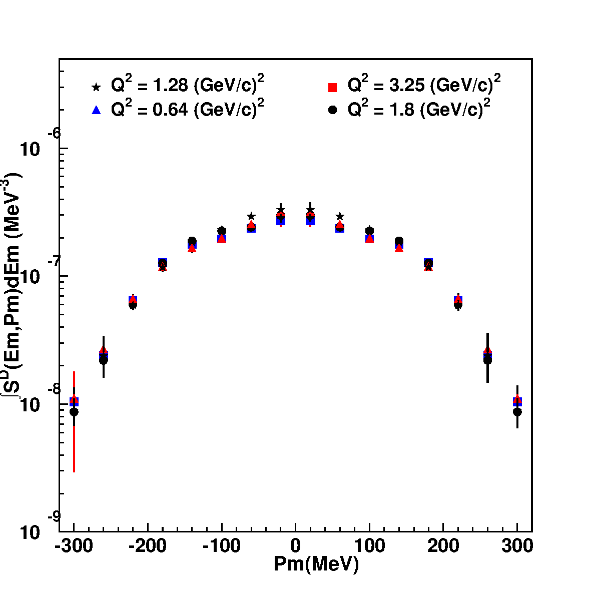
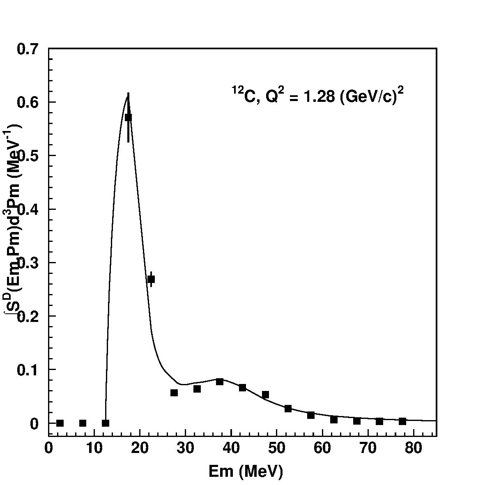
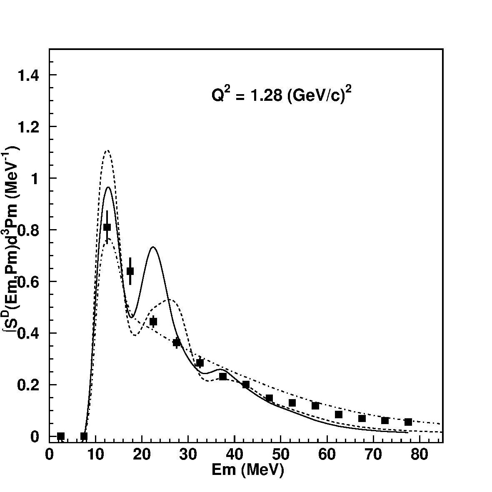

# Dutta E91-013: the four data-backed figures (6, 7, 9, 11)

Report on the Dutta *et al.* JLab Hall C **E91-013** quasi-elastic (e,e′p) measurement
([nucl-ex/0303011](https://arxiv.org/abs/nucl-ex/0303011)), focused on the four figures
for which author-provided numerical data exist in this repo — the comparison targets
for the GENIE (e,e′p) replication.

- Paper source: [`papers/nucl-ex_0303011/`](../papers/nucl-ex_0303011/paper_nucl-ex_0303011.md)
  (tex `longpaper2.tex`; every `tex:line` below anchors to it); figure renders in
  `papers/nucl-ex_0303011/figures/`
- Author data: [`data/Dipingkar-dutta-data-prc_figs/`](../data/Dipingkar-dutta-data-prc_figs)
  — 14 files covering **exactly** figs 6, 7, 9, 11 (nothing else); "prc_figs" in the
  directory name is consistent with the PRC publication of this manuscript (journal
  reference not stated in the arXiv source — see
  [`open_questions.md`](../papers/nucl-ex_0303011/open_questions.md))
- Known caveats on these data (error-bar content, normalization scale) are tracked in
  [`open_questions.md`](../papers/nucl-ex_0303011/open_questions.md); wiki synthesis at
  [`wiki/source/nucl-ex_0303011.md`](../wiki/source/nucl-ex_0303011.md)
- Replication analysis: [`results/prd-analyzer-v0/`](../results/prd-analyzer-v0/README.md)
  (frozen exploratory phase) → `results/prd-analyzer-v0.1/` (active)
- All integrals below computed from the `.dat` files on 2026-07-11 (`pixi run python`, rectangle rule)

---

## 1. The measurement in brief

CEBAF continuous electron beam on solid **¹²C, ⁵⁶Fe, ¹⁹⁷Au** targets (~200 mg/cm²),
1995–96 Hall C commissioning run. Coincidence (e,e′p): **HMS** detects the electron,
**SOS** the proton (roles reversed only at Q² = 3.25 (GeV/c)²). Six kinematic settings
span **Q² = 0.64–3.25 (GeV/c)²**; the one this repo replicates is Table I row 5:

| Beam E | e′ E / angle | p E / conjugate angle | Q² | ε |
|---|---|---|---|---|
| 2.445 GeV | 2.075 GeV / 20.5° | 350 MeV… — central p arm swept 31.5°–55.4°, conjugate **43.5°** | **1.28 (GeV/c)²** | 0.81 |

Observables: **distorted spectral functions** S^D(E_m, p_m) for |p_m| < 300 MeV/c,
E_m ≤ 80 MeV, and **nuclear transparencies** (yield / PWIA over that window;
T(C, 1.28) = 0.60 ± 0.02).

Extraction (tex:837–873): SIMC populates (E_m, p_m) bins with radiative effects on/off;
the bin-by-bin ratio "deradiates" the data, the MC phase space H(E_m, p_m) divides out
acceptance, and the e–p vertex is divided out with the deForest **σ_cc1** off-shell
cross section. The model spectral function is iterated until the result is
model-independent. Crucially, the published S^D **still contains final-state
interactions, including absorption** (tex:871–873) — it is a *distorted* spectral
function, not the bare ground state.

## 2. The author data files

14 files, 16 rows each, four columns:

| column | content |
|---|---|
| 1 | x as plotted — p_m in MeV/c (figs 6, 7) or E_m in MeV (figs 9, 11) |
| 2 | y as plotted — ∫S^D dE_m in MeV⁻³ (figs 6, 7) or ∫S^D d³p_m in MeV⁻¹ (figs 9, 11) |
| 3 | x/200 (ħc ≈ 200 MeV·fm units); **do not use** — one row (`fig7_q1p2.dat` row 1, p_m = −300) has a sign glitch (+1.5) |
| 4 | statistical error on column 2 (0 where y = 0); **statistical only** — see §5 caveat |

Grids: p_m = −300…+300 MeV/c in 40 MeV/c steps (16 bins); E_m = 2.5…77.5 MeV in
5 MeV steps (16 bins). Spot-checked against the published plots: fig9 p-shell peak
0.5713 MeV⁻¹ at E_m = 17.5 ✓, fig11 peak 0.8098 MeV⁻¹ at 12.5 ✓, fig6-top edge
points ~1.3×10⁻⁹ at |p_m| = 300 ✓.

## 3. Fig. 6 — carbon shell-resolved momentum distributions

Caption facts (tex:891–893): **top = p-shell window 10 < E_m < 25 MeV**, **bottom =
s-shell window 30 < E_m < 50 MeV**; all four Q² overlaid, each dataset rescaled so its
spectral-function integral over |p_m| < 300 MeV/c equals the **Q² = 1.8** one — a
deliberate normalization that removes the Q²-dependence of FSI absorption and leaves a
pure *shape* comparison.

What the paper reads off it (tex:916–926):

- **Shapes are nearly Q²-independent** — the distorted momentum distribution is stable
  from 0.64 to 3.25 (GeV/c)².
- The **dip at p_m = 0 in the p-shell window** is the ℓ = 1 signature (only ℓ = 0 can
  reach zero missing momentum); the s-shell window peaks at p_m = 0 as ℓ = 0 should.
- A visible **left–right (±p_m) asymmetry**, attributed later in the paper
  (tex:1141–1161) to an interference response (W_LT beyond the σ_cc1 prescription)
  and/or Coulomb distortion of the electron waves.

Data files: `fig6_{top,bot}_{q0p6,q1p2,q1p8,q3p2}.dat`. In-window 1D integrals
(Σy·40 MeV/c):

| window | Q²=0.64 | 1.28 | 1.8 | 3.25 |
|---|---|---|---|---|
| p-shell (top) | 2.33×10⁻⁵ | 1.71×10⁻⁵ | 1.80×10⁻⁵ | 1.65×10⁻⁵ |
| s-shell (bottom) | 1.51×10⁻⁵ | 1.24×10⁻⁵ | 1.15×10⁻⁵ | 1.23×10⁻⁵ |

The global (full-E_m) normalization is equalized by construction, but these
*windowed* projections still differ — most visibly Q² = 0.64 sits ~30 % above the rest
in both windows, i.e. relatively more strength inside E_m < 50 MeV at low Q²,
consistent with the paper's low-Q² excess (transverse) strength and with
resolution-driven migration across the shell windows.

## 4. Fig. 7 — iron momentum distribution

Caption facts (tex:901–902): iron, integrated over the full **0 < E_m < 80 MeV**
window, same rescale-to-Q²=1.8 convention. Like carbon, the shape is essentially
Q²-independent (tex:923–926); no shell separation is attempted (Fe shells unresolved).

Data files: `fig7_{q0p6,q1p2,q1p8,q3p2}.dat`. Full-window integrals: 1.047, 1.047,
1.000, 1.018 ×10⁻⁴ — equal to ≤ 5 %, as the normalization convention implies (the
residual spread reflects the plotted-grid discretization of the underlying 2D
equalization). Remember the row-1 column-3 sign glitch in `fig7_q1p2.dat` (§2).

## 5. Fig. 9 — carbon missing-energy spectral function at Q² = 1.28 (the replication target)

Caption facts (tex:965–966): measured ∫S^D d³p_m for ¹²C at Q² = 1.28 (GeV/c)²,
compared to the **IPSM** model (Saclay-constrained s₁/₂ + p₃/₂ Woods-Saxon shells,
DWEEPY momentum distributions). Structure: sharp **p₃/₂ peak at E_m ≈ 17.5 MeV**
(0.571 ± 0.005 MeV⁻¹), dip near 25–30 MeV, broad **s₁/₂ bump around 30–50 MeV**, tail
to 80 MeV. The paper's one physics comment (tex:948–952): IPSM puts slightly **too
much yield in the s–p dip**, possibly implying the s-shell is more tightly bound than
assumed.

Verified integrals of `fig9_q1p2.dat` (Σy·5 MeV):

| window | integral | reading |
|---|---|---|
| full 0–80 MeV | **6.080 ± 0.029** | ≈ Z = 6 — plotted on the **full-occupancy scale** |
| p-shell 10–25 | 4.20 | ≈ 4 p₃/₂ protons |
| s-shell 30–50 | 1.30 | partial s₁/₂ strength in-window |

Two caveats, tracked in [`open_questions.md`](../papers/nucl-ex_0303011/open_questions.md),
that any quantitative use must respect:

1. **Normalization is undocumented.** The text says S^D still contains FSI absorption,
   and the same kinematics give T = 0.60 — so a raw distorted integral should be
   ≈ T/1.11 × 6 ≈ 3.2, not 6. The plotted data were evidently renormalized to the
   IPSM/full-occupancy scale for the shape comparison (the captions of figs 6–8 state
   their normalization; fig 9's does not). Treat the file as **shape + relative shell
   occupancy only**.
2. **Error bars are undocumented.** Column 4 is statistical only (0.84 % at the peak);
   the *published* bars, pixel-measured, are ±8.1 % at E_m = 17.5 and ±4.7 % at
   22.5 MeV — 5–10× larger, consistent with stat ⊕ ~2 % point-to-point ⊕ ~5 % (largely
   correlated) model dependence. Recommended fit errors: σᵢ = col4 ⊕ 2 % ⊕ 5 %, with
   the 17.5/22.5 bins overridden by the measured published bars, and the overall
   normalization floated.

## 6. Fig. 11 — iron missing-energy spectral function at Q² = 1.28

Caption facts (tex:999–1004): measured ∫S^D d³p_m for ⁵⁶Fe at Q² = 1.28 (GeV/c)²
against **three** models — the only one of the four figures with beyond-IPSM theory:

- solid: **IPSM** (Saclay ⁵⁸Ni-based shells, Perey factor β = 0.85);
- dashed: **Benhar et al.** correlated-basis-function spectral function;
- dot-dashed: relativistic mean-field (**TIMORA**) with IPSM spreading widths.

Paper's reading (tex:983–993): IPSM predicts **sharper shell structure than observed**
(spreading widths underestimated) and **too few loosely-bound nucleons**; the
dot-dashed relativistic curve tracks the E_m > 40 MeV tail best. For transparencies
this hardly matters — integrating to E_m = 80 MeV averages the structure differences out.

Data file: `fig11_q1p2.dat`; full-window integral **18.200 ± 0.079** — again the
renormalized (in-window IPSM strength) scale, not raw distorted yield; the same two
§5 caveats apply.

## 7. Use in the GENIE replication

- **Fig 9 is the primary target** of the prd-analyzer study: the E_m ladder plots
  (`em_ladder_fig9.png`, `em_dutta_fig9_q1p28.png`, `sd_extraction_fig9.png`, … in
  [`results/prd-analyzer-v0/`](../results/prd-analyzer-v0/README.md)) reconstruct
  Dutta's PWIA estimator S^D from GENIE events in the same Q² = 1.28 slice and
  acceptance, and overlay these 16 data points.
- **Fig 6** provides the shell-resolved p_m shapes for the same C12 kinematics —
  the natural next comparison axis (p-shell dip depth is where GENIE ground-state +
  FSI models differ most).
- **Figs 7/11** extend the same observables to Fe — untouched by the replication so
  far; a future target if the C12 comparison converges.
- When fitting or χ²-ing against any of these files: **float the normalization, use
  shape + occupancy ratios, and inflate errors per §5** — the on-disk numbers alone
  understate the published uncertainties and sit on a renormalized scale.
