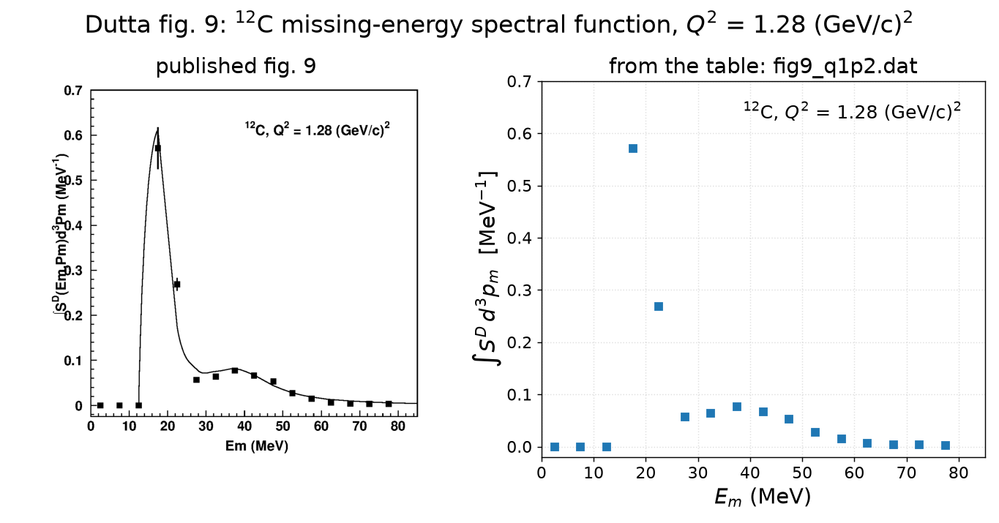
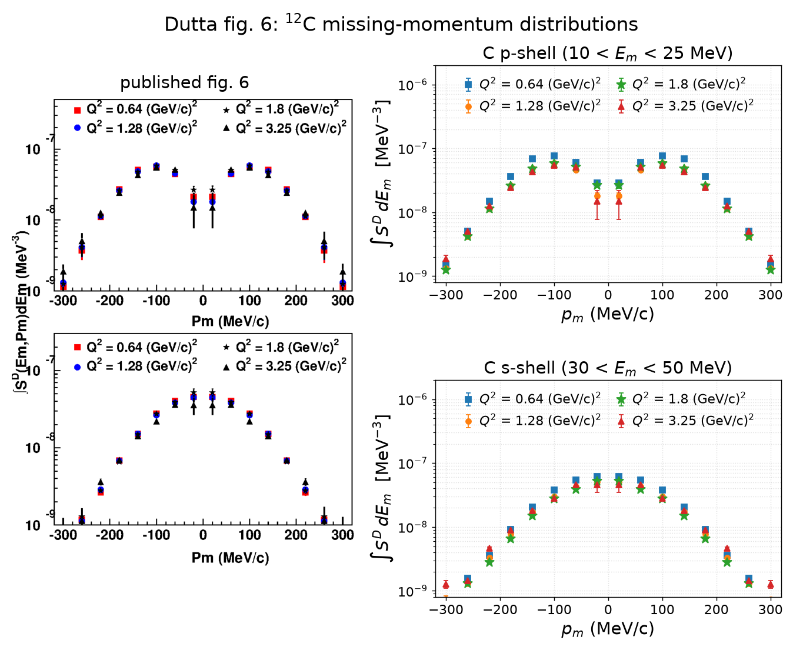
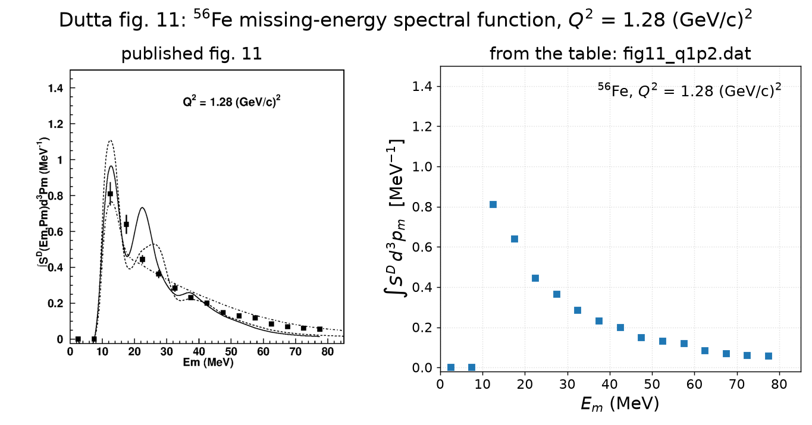
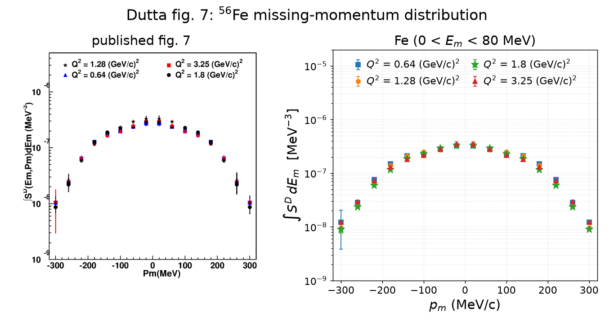

# Dutta E91-013: integrals of the (e,e′p) spectral-function data

Summary of what the author data tables behind the Dutta *et al.* JLab Hall C
**E91-013** paper ([nucl-ex/0303011](https://arxiv.org/abs/nucl-ex/0303011),
¹²C / ⁵⁶Fe / ¹⁹⁷Au quasi-elastic (e,e′p)) integrate to, and on which scale.
This document is the write-up that goes with
[`integrate_dutta.py`](integrate_dutta.py) (the integrator) and
[`make_published_vs_table.py`](make_published_vs_table.py) (the
published-vs-table figures of section 1). A LaTeX/PDF version,
[`dutta-integral.tex`](dutta-integral.tex) / [`dutta-integral.pdf`](dutta-integral.pdf),
is generated from the same data files by
[`make_report_tex.py`](make_report_tex.py) and compiled with tectonic.

- Paper source: [`papers/nucl-ex_0303011/`](../../papers/nucl-ex_0303011/paper_nucl-ex_0303011.md)
  (tex `longpaper2.tex`; every `tex:line` below anchors to it); published
  figure renders in `papers/nucl-ex_0303011/figures/`
- Author data: [`data/Dipingkar-dutta-data-prc_figs/`](../../data/Dipingkar-dutta-data-prc_figs)
  — 14 files, exactly figs 6, 7, 9, 11 of the paper
- Earlier per-figure report: [`report/dutta-e91013-figures.md`](../dutta-e91013-figures.md).
  Its normalization reading of figs 9/11 ("≈ Z, full-occupancy scale") is the
  old one; the sections after section 1 here supersede it.

Sections:

1. [E_m and p_m for C12 and Fe56: each published figure next to its data table](#1-e_m-and-p_m-for-c12-and-fe56-each-published-figure-next-to-its-data-table)
2. Missing energy at Q² = 1.28 for ¹²C (fig 9) and ⁵⁶Fe (fig 11): the tabulated points and their sums (section 2 below)
3. Missing momentum at Q² = 1.28 for ¹²C (fig 6) and ⁵⁶Fe (fig 7): the tabulated points and their integrals (section 3 below)
4. *(to be written)* the conventions behind the factor ½ and the positive-half 3D integral; nucleon counts against T·Z/f_corr
5. *(to be written)* windowed integrals (shell occupancies) and caveats

---

## 1. E_m and p_m for C12 and Fe56: each published figure next to its data table

### 1.1 The four figures, published vs table

Left: the paper's render (autocropped). Right: the same quantity drawn from
the `.dat` files on the paper's axes — points with the tabulated statistical
errors, **no rescaling** (no ½ on the E_m files, no L+R fold on the p_m
files; those conventions are the subject of the next sections). The p_m
replots use the house colour cycle with fig 6's marker shapes per Q²
(fig 7 in print assigns markers differently; the legends identify the sets).
Numbers quoted below come from
[`dutta_published_vs_table.txt`](figures/dutta_published_vs_table.txt): a
per-file ratio to the Q² = 1.8 reference and a histdiag `describe1d` readout
of all 14 files, computed on the tabulated values.

**¹²C missing energy (fig 9)**



The 16 tabulated points are the published ones: 0.571 ± 0.005 MeV⁻¹ at
E_m = 17.5 MeV, 0.269 at 22.5, the s-shell bump peaking at 0.077 at 37.5, and
three exact zeros below 15 MeV. The IPSM curve exists only in print. The one
visible difference is the error bars: the file's column 4 is statistical
(0.8 % at the peak), while the published bars at 17.5 and 22.5 MeV are
several times larger (pixel-measured in
[`dutta-e91013-figures.md` §5](../dutta-e91013-figures.md)).

**¹²C missing momentum, p-shell and s-shell windows (fig 6)**



Three of the four Q² sets sit on the published points: relative to the
Q² = 1.8 reference file the bin-wise median ratio is 1.01 (Q² = 1.28) and
0.97 (3.25) in the p-shell panel, 1.14 and 1.20 in the s-shell panel, with the
signed-axis sums equal to within 5–8 %. The **Q² = 0.64 files do not**: their
median ratio to the reference is 1.27 (p-shell) and 1.33 (s-shell) with a
p_m-dependent spread (1.07–1.44), whereas in print all four Q² coincide within
marker size. Those two files are excluded from every integral in this
document (open question tracked in
[`open_questions.md`](../../papers/nucl-ex_0303011/open_questions.md)).
The ℓ = 1 dip at p_m = 0 in the p-shell window and the ℓ = 0 peak in the
s-shell window (tex:920–922) are in the tables as printed: in the Q² = 1.28
file the p-shell dip bin is 0.31 of its peak at |p_m| = 100 MeV/c.

**⁵⁶Fe missing energy (fig 11)**



The table reproduces the published points (0.810 ± 0.009 MeV⁻¹ at
E_m = 12.5 MeV, then a monotone fall to 0.055 at 77.5; two exact zeros below
10 MeV). The three theory curves (IPSM, Benhar, TIMORA) exist only in print.

**⁵⁶Fe missing momentum (fig 7)**



All four files coincide as printed: median ratios to the Q² = 1.8 reference
1.17 (0.64), 1.09 (1.28), 1.08 (3.25), signed-axis sums equal to within 5 %
(the caption's normalization). No fig 6-type anomaly here. Bin-wise
statistical errors are 1–5 %, largest at |p_m| = 20 and 300 MeV/c.

### 1.2 Reproduce

From the repo root:

```bash
pixi run python report/dutta-integral/make_published_vs_table.py
# -> figures/dutta_fig{9,6,11,7}_*_published_vs_table.png, dutta_published_vs_table.txt
pixi run python report/dutta-integral/make_report_tex.py      # -> dutta-integral.tex
cd report/dutta-integral && pixi run \
    --manifest-path /exp/dune/data/users/liangliu/texenv/pixi.toml \
    tectonic --outdir . dutta-integral.tex                    # -> dutta-integral.pdf
```

The script reads the `.dat` files directly, uses the house plot style
(`results/template/plot_style.py`) and writes its histdiag readout with
`results/template/histdiag.py`; the published renders come from
`papers/nucl-ex_0303011/figures/`.

---

## 2. Missing energy at Q² = 1.28 (GeV/c)²: the tabulated points and their sums

### 2.1 ¹²C (fig 9)

The 16 rows of `fig9_q1p2.dat` (column 1 = bin centre, column 2 = S(E_m) as
plotted):

| bin | E_m (MeV) | S(E_m) (MeV⁻¹) |
|---|---|---|
| 1 | 2.5 | 0.00000 |
| 2 | 7.5 | 0.00000 |
| 3 | 12.5 | 0.00000 |
| 4 | 17.5 | 0.57130 |
| 5 | 22.5 | 0.26883 |
| 6 | 27.5 | 0.05668 |
| 7 | 32.5 | 0.06362 |
| 8 | 37.5 | 0.07718 |
| 9 | 42.5 | 0.06606 |
| 10 | 47.5 | 0.05315 |
| 11 | 52.5 | 0.02708 |
| 12 | 57.5 | 0.01514 |
| 13 | 62.5 | 0.00608 |
| 14 | 67.5 | 0.00436 |
| 15 | 72.5 | 0.00359 |
| 16 | 77.5 | 0.00297 |
| **sum** | | **1.21604** |

Sums over the 16 points (errors: column 4 in quadrature, statistical only):

| quantity | value |
|---|---|
| Σ S(E_m), plain sum of the tabulated values | **1.21604 ± 0.00578 MeV⁻¹** |
| Σ S(E_m) ΔE with ΔE = 5 MeV (the plotted area, 0–80 MeV) | **6.0802 ± 0.0289** |
| ½ Σ S(E_m) ΔE | 3.0401 ± 0.0145 |

Where the strength sits: the two p-shell bins at 17.5 and 22.5 MeV carry
69.1 % of the sum, the four s-shell bins 30–50 MeV carry 21.4 %, the dip bin
at 27.5 MeV 4.7 % and the tail above 50 MeV 4.9 %. The author's integral for
this figure is **3.04**, i.e. half of Σ S(E_m) ΔE; why the plotted area is
twice the nucleon count (the signed −300…+300 MeV/c p_m axis) is the subject
of section 3.

Reproduce (the plotted sum and its half are the `plotted sum` and `N`
columns):

```bash
pixi run python report/dutta-integral/integrate_dutta.py --files fig9_q1p2
```

### 2.2 ⁵⁶Fe (fig 11)

The 16 rows of `fig11_q1p2.dat` (column 1 = bin centre, column 2 = S(E_m) as
plotted):

| bin | E_m (MeV) | S(E_m) (MeV⁻¹) |
|---|---|---|
| 1 | 2.5 | 0.00000 |
| 2 | 7.5 | 0.00000 |
| 3 | 12.5 | 0.80983 |
| 4 | 17.5 | 0.63965 |
| 5 | 22.5 | 0.44406 |
| 6 | 27.5 | 0.36284 |
| 7 | 32.5 | 0.28453 |
| 8 | 37.5 | 0.23175 |
| 9 | 42.5 | 0.20011 |
| 10 | 47.5 | 0.14872 |
| 11 | 52.5 | 0.13002 |
| 12 | 57.5 | 0.11820 |
| 13 | 62.5 | 0.08474 |
| 14 | 67.5 | 0.06965 |
| 15 | 72.5 | 0.06070 |
| 16 | 77.5 | 0.05527 |
| **sum** | | **3.64006** |

Sums over the 16 points (errors: column 4 in quadrature, statistical only):

| quantity | value |
|---|---|
| Σ S(E_m), plain sum of the tabulated values | **3.64006 ± 0.01579 MeV⁻¹** |
| Σ S(E_m) ΔE with ΔE = 5 MeV (the plotted area, 0–80 MeV) | **18.2003 ± 0.0790** |
| ½ Σ S(E_m) ΔE | 9.1001 ± 0.0395 |

Where the strength sits: the three bins 10–25 MeV carry 52.0 % of the
sum, 25–50 MeV 33.7 %, and the tail 50–80 MeV 14.2 % (the last
bin alone 1.5 %), against 4.9 % above 50 MeV for carbon. No author-quoted
integral exists for this figure; the same ½ convention as for fig 9 gives
9.10, to be cross-checked against the fig 7 momentum-distribution integral
in section 4.

Reproduce:

```bash
pixi run python report/dutta-integral/integrate_dutta.py --files fig11_q1p2
```

---

## 3. Missing momentum at Q² = 1.28 (GeV/c)²: the tabulated points and their integrals

The p_m files are tabulated on the signed axis, 16 bins of Δp = 40 MeV/c
centred at −300 … +300 MeV/c, and every file is exactly left–right symmetric,
y(−p_m) ≡ y(+p_m) to full precision. Two integrals are quoted per file:

- **the plotted area** Σ S(p_m) Δp over all 16 signed bins (MeV⁻²) — the
  quantity the paper's rescale-to-Q² = 1.8 caption equalizes;
- **the 3D integral** N = 4π Σ_{p_m>0} S(p_m) p_m² Δp over the **positive
  half only** (p_m at the bin centre, rectangle rule), dimensionless — the
  number of protons in the file's E_m window. Summing both halves would count
  each |p_m| twice, since the files are symmetrized.

Errors are column 4 in quadrature (statistical only). All numbers are the
`plotted sum` / `N` columns of `integrate_dutta.py`.

### 3.1 ¹²C (fig 6, p-shell and s-shell windows)

The 16 rows of `fig6_top_q1p2.dat` (p-shell window) and `fig6_bot_q1p2.dat`
(s-shell window), column 1 = bin centre, column 2 = S(p_m) as plotted, with
the per-bin 3D weights (Δp = 40 MeV/c, p_m at the bin centre). As for iron,
the 2π column summed over all 16 signed bins is the 3D integral N and the
4π column over all 16 bins is twice that.

**p-shell window, 10 < E_m < 25 MeV**

| bin | p_m (MeV/c) | S(p_m), p-shell 10 < E_m < 25 MeV (MeV⁻³) | 4π S(p_m) p_m² Δp | 2π S(p_m) p_m² Δp |
|---|---|---|---|---|
| 1 | -300 | 1.31822e-09 | 0.0596 | 0.0298 |
| 2 | -260 | 4.15417e-09 | 0.1412 | 0.0706 |
| 3 | -220 | 1.13985e-08 | 0.2773 | 0.1387 |
| 4 | -180 | 2.61633e-08 | 0.4261 | 0.2130 |
| 5 | -140 | 4.86048e-08 | 0.4789 | 0.2394 |
| 6 | -100 | 5.89047e-08 | 0.2961 | 0.1480 |
| 7 | -60 | 4.55982e-08 | 0.0825 | 0.0413 |
| 8 | -20 | 1.81916e-08 | 0.0037 | 0.0018 |
| 9 | +20 | 1.81916e-08 | 0.0037 | 0.0018 |
| 10 | +60 | 4.55982e-08 | 0.0825 | 0.0413 |
| 11 | +100 | 5.89047e-08 | 0.2961 | 0.1480 |
| 12 | +140 | 4.86048e-08 | 0.4789 | 0.2394 |
| 13 | +180 | 2.61633e-08 | 0.4261 | 0.2130 |
| 14 | +220 | 1.13985e-08 | 0.2773 | 0.1387 |
| 15 | +260 | 4.15417e-09 | 0.1412 | 0.0706 |
| 16 | +300 | 1.31822e-09 | 0.0596 | 0.0298 |
| **sum, all 16 bins** | | **4.28667e-07** | **3.5306** | **1.7653** |

**s-shell window, 30 < E_m < 50 MeV**

| bin | p_m (MeV/c) | S(p_m), s-shell 30 < E_m < 50 MeV (MeV⁻³) | 4π S(p_m) p_m² Δp | 2π S(p_m) p_m² Δp |
|---|---|---|---|---|
| 1 | -300 | 7.38319e-10 | 0.0334 | 0.0167 |
| 2 | -260 | 1.29075e-09 | 0.0439 | 0.0219 |
| 3 | -220 | 3.29055e-09 | 0.0801 | 0.0400 |
| 4 | -180 | 7.72794e-09 | 0.1259 | 0.0629 |
| 5 | -140 | 1.72738e-08 | 0.1702 | 0.0851 |
| 6 | -100 | 3.00671e-08 | 0.1511 | 0.0756 |
| 7 | -60 | 4.34589e-08 | 0.0786 | 0.0393 |
| 8 | -20 | 5.10294e-08 | 0.0103 | 0.0051 |
| 9 | +20 | 5.10294e-08 | 0.0103 | 0.0051 |
| 10 | +60 | 4.34589e-08 | 0.0786 | 0.0393 |
| 11 | +100 | 3.00671e-08 | 0.1511 | 0.0756 |
| 12 | +140 | 1.72738e-08 | 0.1702 | 0.0851 |
| 13 | +180 | 7.72794e-09 | 0.1259 | 0.0629 |
| 14 | +220 | 3.29055e-09 | 0.0801 | 0.0400 |
| 15 | +260 | 1.29075e-09 | 0.0439 | 0.0219 |
| 16 | +300 | 7.38319e-10 | 0.0334 | 0.0167 |
| **sum, all 16 bins** | | **3.09754e-07** | **1.3868** | **0.6934** |

| quantity | p-shell window | s-shell window |
|---|---|---|
| Σ S(p_m), plain sum of the 16 values (MeV⁻³) | 4.28667e-07 ± 4.3e-09 | 3.09754e-07 ± 3.8e-09 |
| Σ S(p_m) Δp, Δp = 40 MeV/c, signed axis (MeV⁻²) | 1.7147e-05 ± 1.7e-07 | 1.2390e-05 ± 1.5e-07 |
| 4π Σ_{p_m>0} S(p_m) p_m² Δp, positive half | **1.7653 ± 0.0198** | **0.6934 ± 0.0065** |

### 3.2 ⁵⁶Fe (fig 7, full 0–80 MeV window)

The 16 rows of `fig7_q1p2.dat`, with the per-bin 3D weights (Δp = 40 MeV/c,
p_m at the bin centre): the 2π column summed over all 16 signed bins is the
3D integral N; the 4π column over all 16 bins is twice that, since the file
is symmetric and each |p_m| appears on both sides:

| bin | p_m (MeV/c) | S(p_m), 0 < E_m < 80 MeV (MeV⁻³) | 4π S(p_m) p_m² Δp | 2π S(p_m) p_m² Δp |
|---|---|---|---|---|
| 1 | -300 | 9.66999e-09 | 0.4375 | 0.2187 |
| 2 | -260 | 2.45150e-08 | 0.8330 | 0.4165 |
| 3 | -220 | 6.71838e-08 | 1.6345 | 0.8172 |
| 4 | -180 | 1.41263e-07 | 2.3006 | 1.1503 |
| 5 | -140 | 2.10452e-07 | 2.0734 | 1.0367 |
| 6 | -100 | 2.52322e-07 | 1.2683 | 0.6342 |
| 7 | -60 | 2.69957e-07 | 0.4885 | 0.2443 |
| 8 | -20 | 3.33847e-07 | 0.0671 | 0.0336 |
| 9 | +20 | 3.33847e-07 | 0.0671 | 0.0336 |
| 10 | +60 | 2.69957e-07 | 0.4885 | 0.2443 |
| 11 | +100 | 2.52322e-07 | 1.2683 | 0.6342 |
| 12 | +140 | 2.10452e-07 | 2.0734 | 1.0367 |
| 13 | +180 | 1.41263e-07 | 2.3006 | 1.1503 |
| 14 | +220 | 6.71838e-08 | 1.6345 | 0.8172 |
| 15 | +260 | 2.45150e-08 | 0.8330 | 0.4165 |
| 16 | +300 | 9.66999e-09 | 0.4375 | 0.2187 |
| **sum, all 16 bins** | | **2.61842e-06** | **18.2057** | **9.1029** |

| quantity | value |
|---|---|
| Σ S(p_m), plain sum of the 16 values (MeV⁻³) | 2.61842e-06 ± 2.4e-08 |
| Σ S(p_m) Δp, Δp = 40 MeV/c, signed axis (MeV⁻²) | 1.0474e-04 ± 9.4e-07 |
| 4π Σ_{p_m>0} S(p_m) p_m² Δp, positive half | **9.1029 ± 0.0498** |

Reproduce:

```bash
pixi run python report/dutta-integral/integrate_dutta.py --files fig6_top_q1p2 fig6_bot_q1p2 fig7_q1p2
```
