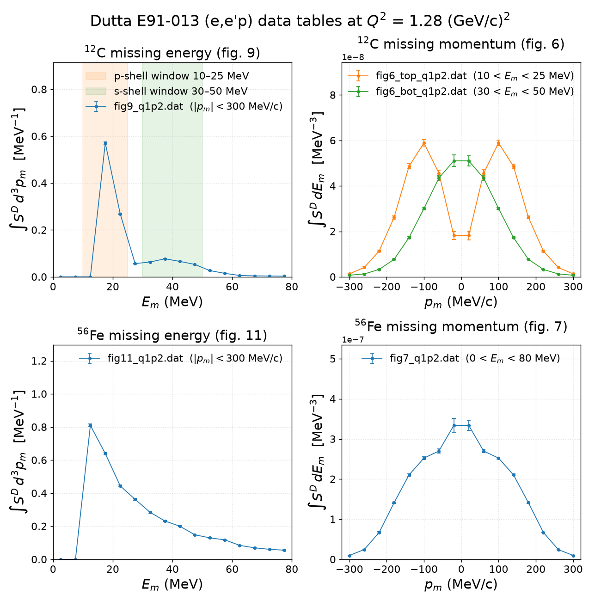

# Dutta E91-013: integrals of the (e,e′p) spectral-function data

Summary of what the author data tables behind the Dutta *et al.* JLab Hall C
**E91-013** paper ([nucl-ex/0303011](https://arxiv.org/abs/nucl-ex/0303011),
¹²C / ⁵⁶Fe / ¹⁹⁷Au quasi-elastic (e,e′p)) integrate to, and on which scale.
This document is the write-up that goes with
[`integrate_dutta.py`](integrate_dutta.py) (the integrator),
[`make_published_vs_table.py`](make_published_vs_table.py) (the
published-vs-table figures of section 1) and
[`make_empm_sidebyside.py`](make_empm_sidebyside.py) (the one-canvas overview).

- Paper source: [`papers/nucl-ex_0303011/`](../../papers/nucl-ex_0303011/paper_nucl-ex_0303011.md)
  (tex `longpaper2.tex`; every `tex:line` below anchors to it); published
  figure renders in `papers/nucl-ex_0303011/figures/`
- Author data: [`data/Dipingkar-dutta-data-prc_figs/`](../../data/Dipingkar-dutta-data-prc_figs)
  — 14 files, exactly figs 6, 7, 9, 11 of the paper
- Earlier per-figure report: [`report/dutta-e91013-figures.md`](../dutta-e91013-figures.md).
  Its normalization reading of figs 9/11 ("≈ Z, full-occupancy scale") is the
  old one; the sections after section 1 here supersede it.

Sections:

1. [E_m and p_m for C12 and Fe56: the paper's definitions, and each published figure next to its data table](#1-e_m-and-p_m-for-c12-and-fe56-from-the-paper-and-from-the-data-tables)
2. *(to be written)* integration conventions on the tabulated grids
3. *(to be written)* nucleon counts per file and the fig 7 / fig 11 consistency check
4. *(to be written)* the scale of figs 9/11 against T·Z/f_corr
5. *(to be written)* windowed integrals (shell occupancies) and caveats

---

## 1. E_m and p_m for C12 and Fe56, from the paper and from the data tables

### 1.1 What the paper measures

For an electron knocking a proton out of nucleus A with energy transfer ω and
three-momentum transfer **q**, leaving a scattered proton p′ and a residual
nucleus A−1, the paper defines (tex:221–227)

    E_m = ω − T_p′ − T_{A−1}          missing energy
    p_m = p_p′ − q                    missing momentum (vector)

with T_p′ and T_{A−1} the kinetic energies of the knocked-out proton and the
recoiling nucleus. The spectral function S(E_s, **p**_m) is "the probability of
finding a proton with separation energy E_s and momentum **p**_m inside that
nucleus" (tex:700–702).

The experimental spectral function is built bin by bin in (E_m, p_m)
(tex:852–856): counts in each bin are weighted by the inverse off-shell e–p
cross section and kinematic factors (σ_cc1), divided by luminosity and by the
SIMC phase space H(E_m, p_m), and multiplied by a SIMC radiative-correction
factor C^rad(E_m, p_m); the model spectral function is iterated until the
result no longer depends on it. The result is a **distorted** spectral
function S^D: "these corrected spectral functions still include distortions
due the effects of final state nuclear interactions, including absorption"
(tex:871–873). Nothing in the paper renormalizes S^D back to full occupancy.

The paper shows two projections of S^D (tex:881–884): "the missing momentum
was integrated over in order to obtain the energy spectral functions and the
missing energy was integrated over to obtain momentum distributions". The
acceptance window in both variables is |p_m| ≤ 300 MeV/c and E_m ≤ 80 MeV
(tex:1086–1087, the transparency window).

### 1.2 Kinematics of the data used here

The two missing-energy figures exist only at **Q² = 1.28 (GeV/c)²**; the two
momentum-distribution figures overlay four Q² settings. Table I of the paper
(tex:682–685) gives for the Q² = 1.28 setting:

| beam energy | central e′ energy / angle | central proton energy | proton angles (conjugate in bold) | Q² | ε |
|---|---|---|---|---|---|
| 2.445 GeV | 1.725 GeV / 32.0° | 700 MeV | 31.5, 35.5, 39.5, **43.5**, 47.5, 51.4, 55.4° | 1.28 (GeV/c)² | 0.81 |

Two more numbers from the paper belong to the same setting and enter the
later sections: the nuclear transparencies at Q² = 1.28, **T(C) = 0.60(2)**
and **T(Fe) = 0.44(1)** (Table III, tex:1227, statistical errors), and the
short-range-correlation factors applied to the PWIA yield, **1.11 ± 0.03 (C)**
and **1.26 ± 0.08 (Fe)** (tex:1134–1135).

### 1.3 The four figures and the 14 data files

| figure | nucleus | quantity plotted (y) | integrated over | x grid | Q² sets in the files | files |
|---|---|---|---|---|---|---|
| fig 6 top | ¹²C | ∫S^D dE_m, p-shell window | 10 < E_m < 25 MeV | p_m = −300 … +300 MeV/c, 16 bins of 40 MeV/c | 0.64, 1.28, 1.8, 3.25 | `fig6_top_{q0p6,q1p2,q1p8,q3p2}.dat` |
| fig 6 bottom | ¹²C | ∫S^D dE_m, s-shell window | 30 < E_m < 50 MeV | same | same | `fig6_bot_{…}.dat` |
| fig 7 | ⁵⁶Fe | ∫S^D dE_m | 0 < E_m < 80 MeV | same | same | `fig7_{…}.dat` |
| fig 9 | ¹²C | ∫S^D d³p_m | −300 < p_m < 300 MeV/c (signed) | E_m = 2.5 … 77.5 MeV, 16 bins of 5 MeV | 1.28 only | `fig9_q1p2.dat` |
| fig 11 | ⁵⁶Fe | ∫S^D d³p_m | −300 < p_m < 300 MeV/c (signed) | same | 1.28 only | `fig11_q1p2.dat` |

Caption facts: fig 6 (tex:891–893) and fig 7 (tex:901–902) are "normalized so
that the integral of the measured spectral functions over |p_m| < 300 MeV/c is
equal to the integral of the spectral function at Q² of 1.8 (GeV/c)²" — a
shape-comparison convention across Q²; the Q² = 1.8 file is therefore the
unrescaled reference. Figs 9 (tex:965–966) and 11 (tex:999–1004) carry no
normalization statement at all; they are compared with IPSM (and, for iron,
Benhar and TIMORA) curves that exist only in print.

Columns of every file, per the author's description: x, y as plotted, an
x-uncertainty of 0.5 % of x (unused; one sign glitch in `fig7_q1p2.dat` row 1),
and the **statistical** error on y. Units: y in MeV⁻³ for the p_m files and
MeV⁻¹ for the E_m files. The E_m files' y is S^D integrated over the *signed*
p_m axis from −300 to +300 MeV/c (author's column description; this is what
makes the later factor 2).

Two structural facts about the tables:

- every p_m file is **exactly left–right symmetrized**, y(−p_m) ≡ y(+p_m) to
  full precision, so each holds 8 independent values (the ± asymmetry the
  paper discusses at tex:922 is absent by construction);
- the E_m files are **zero below the first shell**: fig 9 has no strength
  below E_m = 15 MeV (three empty bins), fig 11 none below 10 MeV (two).

### 1.4 Each published figure next to its data table

Left: the paper's render (autocropped). Right: the same quantity drawn from
the `.dat` files on the paper's axes — points with the tabulated statistical
errors, **no rescaling** (no ½ on the E_m files, no L+R fold on the p_m
files; those conventions are the subject of the next sections). The p_m
replots use the house colour cycle with fig 6's marker shapes per Q²
(fig 7 in print assigns markers differently; the legends identify the sets).
Numbers quoted below come from
[`dutta_published_vs_table.txt`](figures/dutta_published_vs_table.txt): a
per-file ratio to the Q² = 1.8 reference and a histdiag `describe1d` readout
of all 14 files, computed on the tabulated values.

**¹²C missing energy (fig 9)**


The 16 tabulated points are the published ones: 0.571 ± 0.005 MeV⁻¹ at
E_m = 17.5 MeV, 0.269 at 22.5, the s-shell bump peaking at 0.077 at 37.5, and
three exact zeros below 15 MeV. The IPSM curve exists only in print. The one
visible difference is the error bars: the file's column 4 is statistical
(0.8 % at the peak), while the published bars at 17.5 and 22.5 MeV are
several times larger (pixel-measured in
[`dutta-e91013-figures.md` §5](../dutta-e91013-figures.md)).

**¹²C missing momentum, p-shell and s-shell windows (fig 6)**


Three of the four Q² sets sit on the published points: relative to the
Q² = 1.8 reference file the bin-wise median ratio is 1.01 (Q² = 1.28) and
0.97 (3.25) in the p-shell panel, 1.14 and 1.20 in the s-shell panel, with the
signed-axis sums equal to within 5–8 %. The **Q² = 0.64 files do not**: their
median ratio to the reference is 1.27 (p-shell) and 1.33 (s-shell) with a
p_m-dependent spread (1.07–1.44), whereas in print all four Q² coincide within
marker size. Those two files are excluded from every integral in this
document (open question tracked in
[`open_questions.md`](../../papers/nucl-ex_0303011/open_questions.md)).
The ℓ = 1 dip at p_m = 0 in the p-shell window and the ℓ = 0 peak in the
s-shell window (tex:920–922) are in the tables as printed: in the Q² = 1.28
file the p-shell dip bin is 0.31 of its peak at |p_m| = 100 MeV/c.

**⁵⁶Fe missing energy (fig 11)**


The table reproduces the published points (0.810 ± 0.009 MeV⁻¹ at
E_m = 12.5 MeV, then a monotone fall to 0.055 at 77.5; two exact zeros below
10 MeV). The three theory curves (IPSM, Benhar, TIMORA) exist only in print.

**⁵⁶Fe missing momentum (fig 7)**


All four files coincide as printed: median ratios to the Q² = 1.8 reference
1.17 (0.64), 1.09 (1.28), 1.08 (3.25), signed-axis sums equal to within 5 %
(the caption's normalization). No fig 6-type anomaly here. Bin-wise
statistical errors are 1–5 %, largest at |p_m| = 20 and 300 MeV/c.

### 1.5 The Q² = 1.28 tables on one canvas



Rows ¹²C / ⁵⁶Fe; left the missing-energy spectral function with the E_m
windows of the right-hand panels shaded, right the missing-momentum
distributions at the same Q². Log-y version:
[`dutta_empm_sidebyside_log.png`](figures/dutta_empm_sidebyside_log.png);
histdiag readout of the five series:
[`dutta_empm_sidebyside.txt`](figures/dutta_empm_sidebyside.txt).

| series | file | peak | width / spread | share of the plotted sum |
|---|---|---|---|---|
| ¹²C E_m | `fig9_q1p2.dat` | 0.571 ± 0.005 MeV⁻¹ at E_m = 17.5 MeV | FWHM 7.2 MeV; median 20.7 MeV | p-shell window 10–25: **69.1 %**; dip bin 25–30: 4.7 %; s-shell window 30–50: **21.4 %**; tail 50–80: 4.9 % |
| ⁵⁶Fe E_m | `fig11_q1p2.dat` | 0.810 ± 0.009 MeV⁻¹ at E_m = 12.5 MeV | FWHM 14.9 MeV; median 24.2 MeV; monotone fall | 10–25: 52.0 %; 25–50: 33.8 %; 50–80: 14.3 % (last bin alone 1.5 %) |
| ¹²C p_m, p-shell window | `fig6_top_q1p2.dat` | 5.89 × 10⁻⁸ MeV⁻³ at \|p_m\| = 100 MeV/c | σ(p_m) = 128 MeV/c; median \|p_m\| = 110 MeV/c | dip at \|p_m\| = 20: 1.82 × 10⁻⁸ = 0.31 × peak |
| ¹²C p_m, s-shell window | `fig6_bot_q1p2.dat` | 5.10 × 10⁻⁸ MeV⁻³ at \|p_m\| = 20 MeV/c | σ(p_m) = 94 MeV/c; median \|p_m\| = 64 MeV/c | peaks at p_m = 0 as ℓ = 0 should |
| ⁵⁶Fe p_m, 0–80 MeV | `fig7_q1p2.dat` | 3.34 × 10⁻⁷ MeV⁻³ at \|p_m\| = 20 MeV/c | σ(p_m) = 118 MeV/c; median \|p_m\| = 88 MeV/c | no dip: the unresolved Fe shells mix ℓ = 0 and ℓ > 0 |

On carbon the E_m spectrum separates the p₃/₂ peak from the s₁/₂ bump and
the p_m panel shows the matching ℓ = 1 (dip) and ℓ = 0 (peak) shapes for the
two windows; on iron neither variable resolves shells.

### 1.6 Reproduce

From the repo root:

```bash
pixi run python report/dutta-integral/make_published_vs_table.py
# -> figures/dutta_fig{9,6,11,7}_*_published_vs_table.png, dutta_published_vs_table.txt
pixi run python report/dutta-integral/make_empm_sidebyside.py
# -> figures/dutta_empm_sidebyside{,_log}.png, dutta_empm_sidebyside.txt
```

Both scripts read the `.dat` files directly, use the house plot style
(`results/template/plot_style.py`) and write their histdiag readouts with
`results/template/histdiag.py`; the published renders come from
`papers/nucl-ex_0303011/figures/`.
