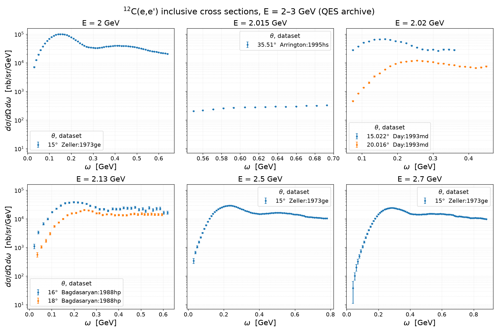
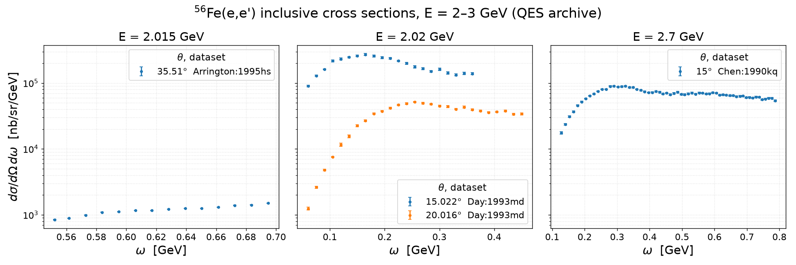

# Inclusive (e,e') data: 12C and 56Fe, beam energy 2.0–3.0 GeV

Data from the [Quasielastic Electron Nucleus Scattering Archive](https://discovery.phys.virginia.edu/research/groups/qes-archive/index.html)
(Donal Day, UVA; cite as nucl-ex/0603032), downloaded 2026-08-17 into
`data/qes-archive/{12C,56Fe}.dat`. Cross sections are inclusive
dσ/dΩdω in nb/sr/GeV, radiatively corrected, **no Coulomb corrections**.
Error bars are the archive's random (statistical) errors only.

Figures generated by `report/make_electron_scattering_data.py`
(`pixi run python report/make_electron_scattering_data.py`); one panel per
beam energy, one series per scattering angle.

## 12C — 6 beam energies, 350 points

| E (GeV) | θ (deg) | points | ω range (GeV) | dataset |
|---|---|---|---|---|
| 2.000 | 15 | 62 | 0.030–0.640 | Zeller:1973ge |
| 2.015 | 35.51 | 14 | 0.550–0.693 | Arrington:1995hs |
| 2.020 | 15.02, 20.02 | 46 | 0.075–0.450 | Day:1993md |
| 2.130 | 16, 18 | 67 | 0.021–0.619 | Bagdasaryan:1988hp |
| 2.500 | 15 | 76 | 0.030–0.780 | Zeller:1973ge |
| 2.700 | 15 | 85 | 0.040–0.880 | Zeller:1973ge |

## 56Fe — 3 beam energies, 122 points

| E (GeV) | θ (deg) | points | ω range (GeV) | dataset |
|---|---|---|---|---|
| 2.015 | 35.51 | 14 | 0.552–0.695 | Arrington:1995hs |
| 2.020 | 15.02, 20.02 | 48 | 0.060–0.450 | Day:1993md |
| 2.700 | 15 | 60 | 0.129–0.787 | Chen:1990kq |

## Notes

- **12C↔56Fe overlaps** (same beam/angle on both nuclei, useful for A-scaling
  tests of a tune): Arrington:1995hs at 2.015 GeV / 35.51° (high-Q² tail only)
  and Day:1993md at 2.020 GeV / 15.02° + 20.02° (QE-peak coverage, the best
  matched pair). Zeller (12C) vs Chen (56Fe) at 2.7 GeV / 15° nearly match.
- The Arrington:1995hs panels cover only the deep quasielastic tail
  (x > 1 side), hence the narrow ω window and flat shape.
