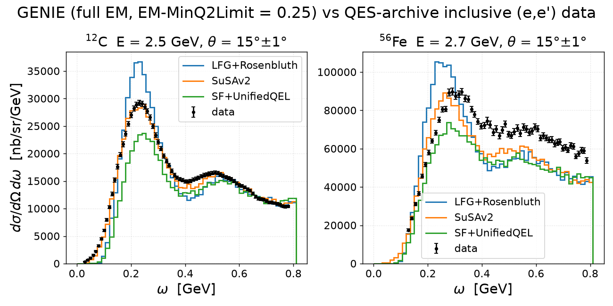
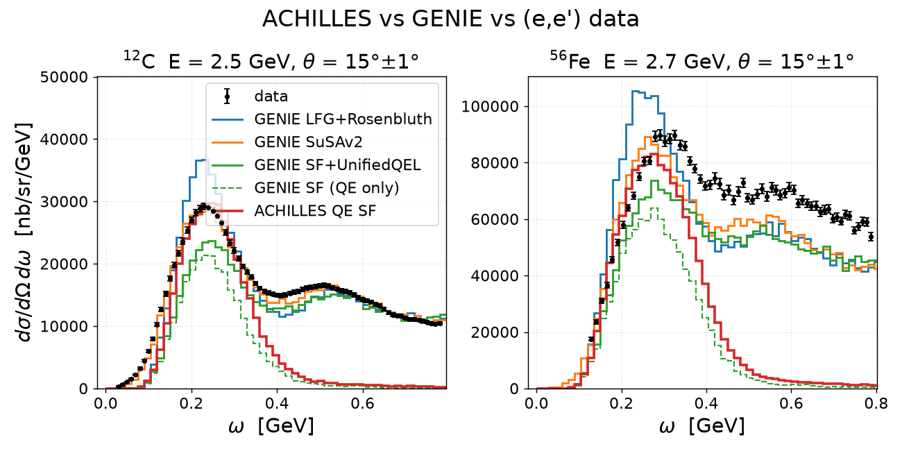

# Inclusive (e,e') data: 12C and 56Fe, beam energy 2.0–3.0 GeV

Data from the [Quasielastic Electron Nucleus Scattering Archive](https://discovery.phys.virginia.edu/research/groups/qes-archive/index.html)
(Donal Day, UVA; cite as nucl-ex/0603032), downloaded 2026-08-17 into
`data/qes-archive/{12C,56Fe}.dat`. Cross sections are inclusive
dσ/dΩdω in nb/sr/GeV, radiatively corrected, **no Coulomb corrections**.
Error bars are the archive's random (statistical) errors only.

Figures generated by `report/make_electron_scattering_data.py`
(`pixi run python report/make_electron_scattering_data.py`); one panel per
beam energy, one series per scattering angle.

## 12C — 6 beam energies, 350 points

| E (GeV) | θ (deg) | points | ω range (GeV) | dataset |
|---|---|---|---|---|
| 2.000 | 15 | 62 | 0.030–0.640 | Zeller:1973ge |
| 2.015 | 35.51 | 14 | 0.550–0.693 | Arrington:1995hs |
| 2.020 | 15.02, 20.02 | 46 | 0.075–0.450 | Day:1993md |
| 2.130 | 16, 18 | 67 | 0.021–0.619 | Bagdasaryan:1988hp |
| 2.500 | 15 | 76 | 0.030–0.780 | Zeller:1973ge |
| 2.700 | 15 | 85 | 0.040–0.880 | Zeller:1973ge |

## 56Fe — 3 beam energies, 122 points

| E (GeV) | θ (deg) | points | ω range (GeV) | dataset |
|---|---|---|---|---|
| 2.015 | 35.51 | 14 | 0.552–0.695 | Arrington:1995hs |
| 2.020 | 15.02, 20.02 | 48 | 0.060–0.450 | Day:1993md |
| 2.700 | 15 | 60 | 0.129–0.787 | Chen:1990kq |

## Full archive coverage

All available settings (every beam energy, not just the 2–3 GeV window),
generated by `report/make_electron_scattering_all.py`. Panels are linear by
default and switch to log y when a panel's settings span more than two decades
in σ (the multi-angle ≥ 4 GeV sets). The 12C figure includes the 2024
Mihovilovic 855 MeV / 70° set from `Miho_12C.dat`.

- **12C** — 39 beam energies, 2,937 points: 
- **56Fe** — 46 beam energies, 2,429 points: 

## Q² maps of single settings

At fixed beam energy and angle each ω point carries Q² = 4E(E−ω)sin²(θ/2).
Generator: `report/make_q2_setting.py --target 12C|56Fe -e <GeV> --theta <deg>`.
Both settings below lie entirely above typical EM-MinQ2Limit guards.

**12C, Zeller:1973ge, 2.5 GeV / 15°** — 76 points spanning
**Q² = 0.293–0.421 (GeV/c)²**; the QE peak (ω = 0.230 GeV) sits at
Q² ≈ 0.387 (GeV/c)², i.e. Bjorken x ≈ 0.90.

**56Fe, Chen:1990kq, 2.7 GeV / 15°** — 60 points spanning
**Q² = 0.352–0.473 (GeV/c)²**; the cross-section maximum (ω = 0.290 GeV)
sits at Q² ≈ 0.443 (GeV/c)², i.e. x ≈ 0.81 — further below 1 than carbon,
consistent with iron's broader QE peak and larger removal energy.

## GENIE comparison at EM-MinQ2Limit = 0.25

Three tunes, each with a new `_09_000` override setting **EM-MinQ2Limit =
0.25 GeV²** (`genie-agent/tunes/{GEM26_11a,GEM21_11a,GEM26_22b}/<CMC>_09_000/`):
GEM26_11a (LFG + Rosenbluth), GEM21_11a (SuSAv2), GEM26_22b (Benhar SF +
UnifiedQEL). Per tune: full-EM splines (55 each, `-e 3`) and 500k-event local
gevgen samples — e⁻ C12 at 2.5 GeV and e⁻ Fe56 at 2.7 GeV (run records in
`genie-agent/run-manifest.jsonl`, date 2026-08-17). Both data settings sit
entirely above the cut (Q² ≥ 0.293), so the cut removes nothing in-acceptance.

Comparison (`report/make_incl_ee_comparison.py`): events in θ = 15°±1°
(~90k per sample), ω in 15 MeV bins, normalized absolutely via
dσ/dΩdω = σ_tot·N_bin/(N_gen·ΔΩ·Δω) with σ_tot = Σ splines at E
(1 GeV⁻² = 3.8938e10 ×1e-38 cm²; gst QE channels cross-checked to <5%).
σ_tot(full EM, Q²>0.25): C12 4.39/4.37/3.95 μb, Fe56 21.2/20.7/19.4 μb
(LFG+Rosenbluth / SuSAv2 / SF+UnifiedQEL).

Findings:

- **12C**: SuSAv2 reproduces the QE peak height and position almost exactly;
  LFG+Rosenbluth is ~25% high at the peak; SF+UnifiedQEL is ~20% low with the
  peak shifted right (ω = 0.240 vs 0.230 GeV). All three track the dip and Δ
  region well (slight undershoot at ω ≈ 0.40–0.45 GeV).
- **56Fe**: LFG+Rosenbluth overshoots the QE peak (~15%); SuSAv2 matches the
  peak but all three tunes undershoot the dip/Δ plateau by ~15–25% — the
  classic transverse-strength deficit, larger in iron than carbon.
- Data are radiatively corrected, no Coulomb corrections; GENIE curves are
  unradiated. Statistical archive errors only.

## ACHILLES overlay (QE spectral function)

100k ACHILLES events per setting (v0.3.1 content, `main` @ e02d266; install +
runs at `/exp/dune/app/users/liangliu/ACHILLES/runs/`): `QESpectral` with
Benhar-family spectral functions, cascade off, generated directly inside
θ = 15°±1° (HardCuts AngleTheta [14, 16]), so the normalization is
σ_cut·N_bin/(N_gen·ΔΩ·Δω) with the same ΔΩ as the GENIE θ-mask window.

- **¹²C 2.5 GeV** (`e_C12_2500MeV_15deg`, seed 20260819): shipped
  `pke12{p,n}_tot.data`; σ_cut = 329.66 ± 2.19 nb/atom (p 263.9 + n 65.7).
- **⁵⁶Fe 2.7 GeV** (`e_Fe56_2700MeV_15deg`, seed 20260820): iron is **not**
  shipped in v0.3.1 — inputs custom-built by
  `report/make_achilles_fe56_inputs.py` (Benhar pke56 table from GENIE_INCLXX
  with a format transform validated byte-identically on C12; 2pF densities
  c = 4.106, z = 0.519 fm from de Vries 1987; 5000 sampled configurations;
  `Particles.yml` patched with PID 1000260560). σ_cut = 1096.62 ± 5.36 nb/atom
  (p 834.9 + n 261.7). Unlike GENIE's Fe56 SuSAv2 (a scaled-C12 surrogate,
  see prd-analyzer open questions), this is a genuine Fe56 SF calculation.

The overlay (`report/make_incl_ee_achilles.py`) adds a dashed QE-only
projection of GEM26_22b (qel mask on the same 500k samples) — the direct
GENIE counterpart: Benhar SF + UnifiedQEL.

Findings (peak values in nb/sr/GeV, 15 MeV bins):

- **ACHILLES sits on the data QE peak**: 29655 in ω ∈ [0.240, 0.255] vs data
  29200 at ω = 0.230 — height within ~2% (of a data peak that still contains
  some non-QE strength), position one bin right of the data, same rightward
  shift GENIE SF shows.
- **The two Benhar-SF QE curves differ by ~40%**: GENIE SF QE-only peaks at
  21336 (GENIE SF full EM: 23685) vs ACHILLES 29655. Same ground-state family,
  very different elementary-current treatment — consistent with the hypothesis
  that ACHILLES's exact leptonic⊗hadronic tensor contraction (interference
  terms retained) carries the missing peak strength; form-factor choices and
  off-shell/Ward prescriptions (`Ward: None`, default `FormFactors.yml`) are
  not yet disentangled from that.
- For reference, GENIE QE-only peaks: LFG+Rosenbluth 34713, SuSAv2 26235.
- **⁵⁶Fe repeats the pattern** (data peak 89740 at ω = 0.290): ACHILLES 83022
  in [0.270, 0.285] — 7% under a data peak that carries more non-QE strength
  than carbon's — vs GENIE SF QE-only 63802 (−29% vs data) and SF full 73645,
  both peaking in the same bin as ACHILLES. The ACHILLES/GENIE-SF-QE ratio is
  +30% in iron vs +39% in carbon, i.e. the same current-treatment gap, mildly
  A-dependent. LFG+Rosenbluth overshoots (105406) and peaks early
  ([0.225, 0.240]); SuSAv2 matches the height (89107, in [0.255, 0.270]) but
  recall its Fe56 EM tensor is rescaled C12.
- ACHILLES here is QE-only, so the curves die past the QE region: the dip/Δ
  region needs its DCC resonance model (a second `RES_Spectral_Func` run)
  before a full-spectrum comparison.

## Notes

- **12C↔56Fe overlaps** (same beam/angle on both nuclei, useful for A-scaling
  tests of a tune): Arrington:1995hs at 2.015 GeV / 35.51° (high-Q² tail only)
  and Day:1993md at 2.020 GeV / 15.02° + 20.02° (QE-peak coverage, the best
  matched pair). Zeller (12C) vs Chen (56Fe) at 2.7 GeV / 15° nearly match.
- The Arrington:1995hs panels cover only the deep quasielastic tail
  (x > 1 side), hence the narrow ω window and flat shape.
