# Axial form factor comparison: LQCD vs deuterium

GENIE vs MicroBooNE CC1μ1p / CC1μNp argon cross sections, **isolating the nucleon
axial form factor F_A**: the lattice-QCD z-expansion form factor (`LQCD`) against
the deuterium bubble-chamber fit (`Deu`). Within each comparison the nuclear
ground state and the final-state-interaction (FSI) model are held fixed, so the
only thing changing is F_A.

- **Blue = F_A(LQCD)**, **orange = F_A(Deu)**, **black points = MicroBooNE data**.
- χ²/ndf (p-value) is relative to MicroBooNE data (from [`chisq_table.tex`](chisq_table.tex), Table `tab:chisq`).
- Six panels (a–f): **(a)** 2D δp_T for δα_T < 45°, **(b)** 2D δp_T for 135° < δα_T < 180°,
  **(c)** 1D δp_T, **(d)** 1D δα_T, **(e)** p_μ, **(f)** p_p.
  Panels (a) and (b) are two slices of the full 2D δp_T–δα_T measurement; its χ²
  (the "δp_T vs δα_T" row) covers all δα_T bins, including the two intermediate
  slices not shown.

---

## LFG + hA2018 — F_A: LQCD vs Deuterium

Tunes: `LFG26_24a_00_000` (LQCD) vs `LFG26_14a_00_000` (Deu). Identical N/LFG
ground state and hA2018 FSI; F_A is the only difference.

| Observable | F_A(LQCD) — χ²/ndf (p) | F_A(Deu) — χ²/ndf (p) |
|---|---|---|
| δp_T vs δα_T (2D) | 35.98/49 (0.92) | 44.21/49 (0.67) |
| δp_T | 6.78/13 (0.91) | 9.59/13 (0.73) |
| δα_T | 3.47/7 (0.84) | 10.19/7 (0.18) |
| p_μ | 16.29/26 (0.93) | 20.89/26 (0.75) |
| p_p | 16.05/15 (0.38) | 19.95/15 (0.17) |

LQCD lowers χ² in every observable — most strongly in δα_T and p_μ — so the
LQCD F_A is clearly favoured for the LFG + hA2018 configuration.

| (a) δp_T, δα_T < 45° | (b) δp_T, 135° < δα_T < 180° |
|---|---|
| 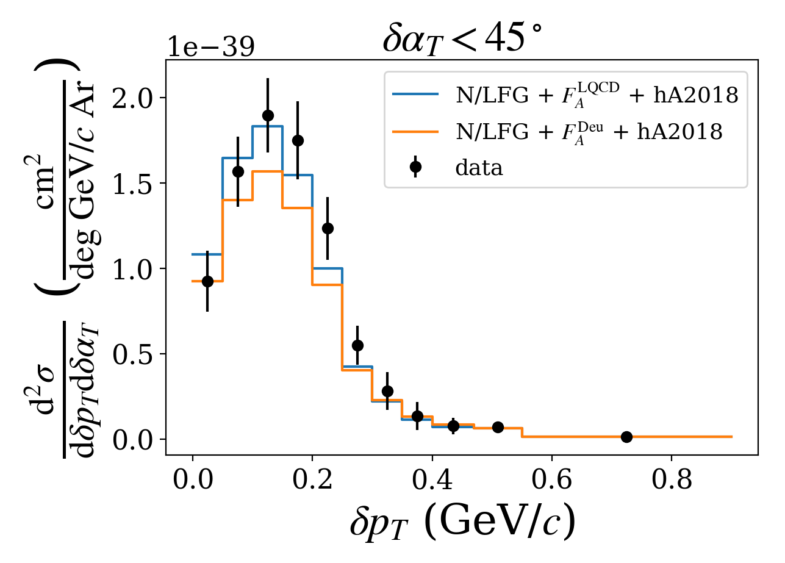 | 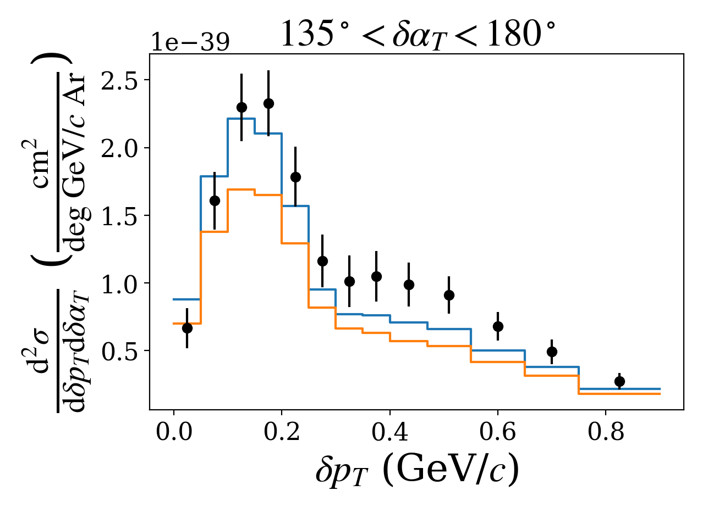 |
| **(c) δp_T** | **(d) δα_T** |
| 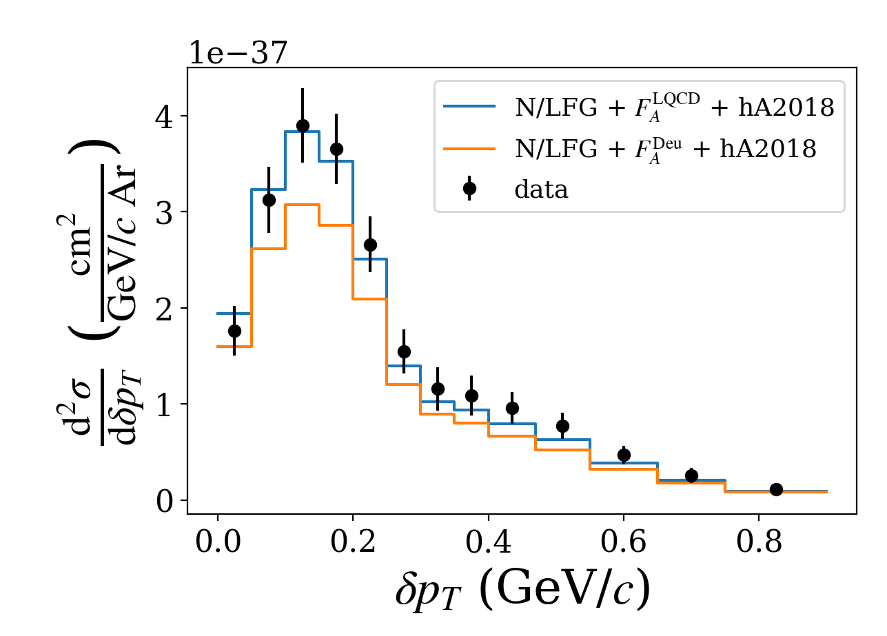 | 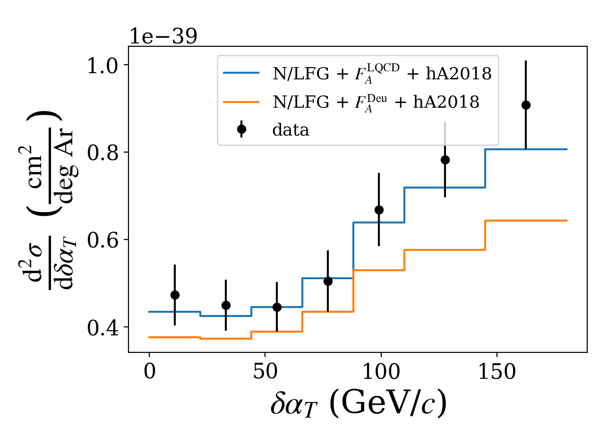 |
| **(e) p_μ** | **(f) p_p** |
| 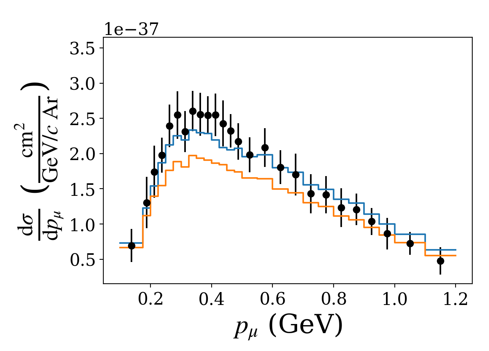 | 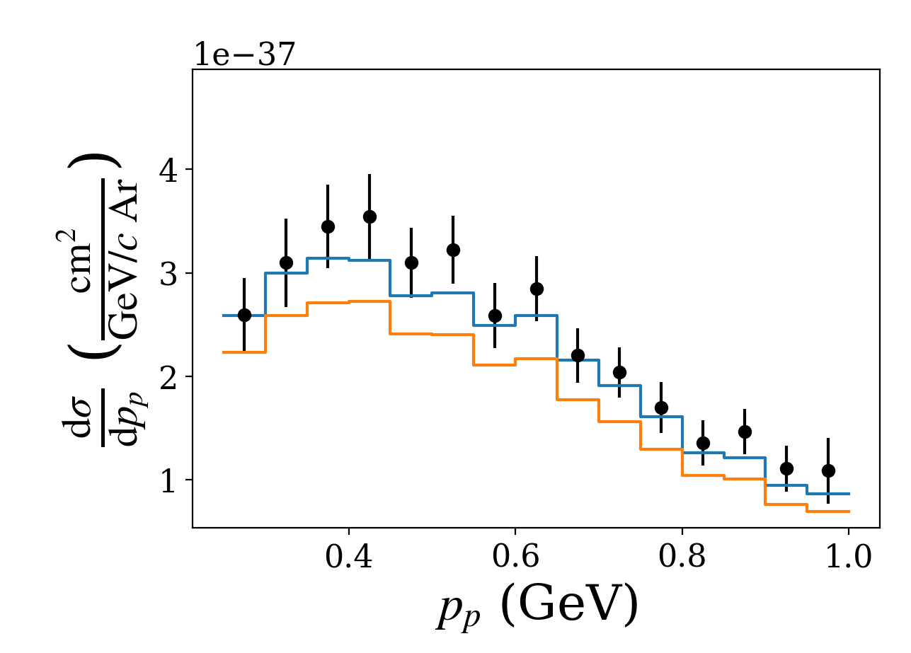 |

---

## SF + INCL — F_A: LQCD vs Deuterium

Tunes: `SF26_21b_00_000` (LQCD) vs `SF26_11b_00_000` (Deu). Identical spectral-
function ground state and INCL FSI; F_A is the only difference.

| Observable | F_A(LQCD) — χ²/ndf (p) | F_A(Deu) — χ²/ndf (p) |
|---|---|---|
| δp_T vs δα_T (2D) | 66.61/49 (0.05) | 81.91/49 (0.00) |
| δp_T | 15.72/13 (0.26) | 23.94/13 (0.03) |
| δα_T | 5.47/7 (0.60) | 10.01/7 (0.19) |
| p_μ | 23.91/26 (0.58) | 35.08/26 (0.11) |
| p_p | 32.25/15 (0.01) | 38.83/15 (0.00) |

LQCD again improves every observable, but with INCL FSI both options sit well
below the data (low p-values for the 2D and p_p), so F_A alone does not rescue
the SF + INCL configuration.

| (a) δp_T, δα_T < 45° | (b) δp_T, 135° < δα_T < 180° |
|---|---|
| 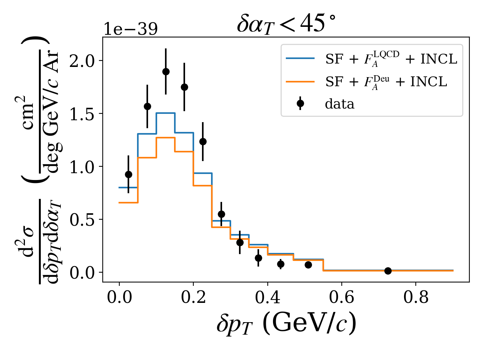 | 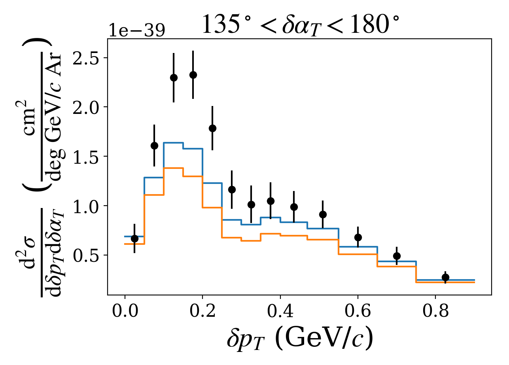 |
| **(c) δp_T** | **(d) δα_T** |
| 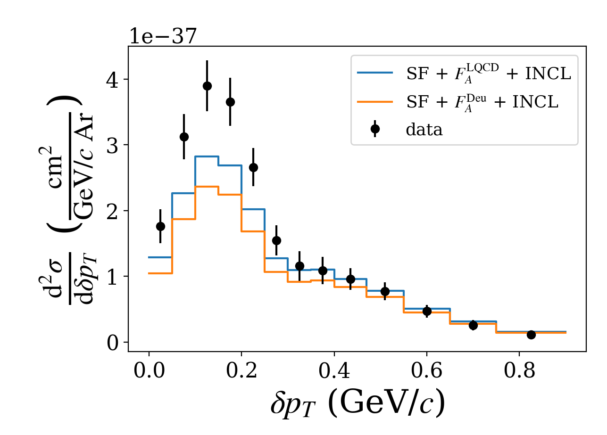 | 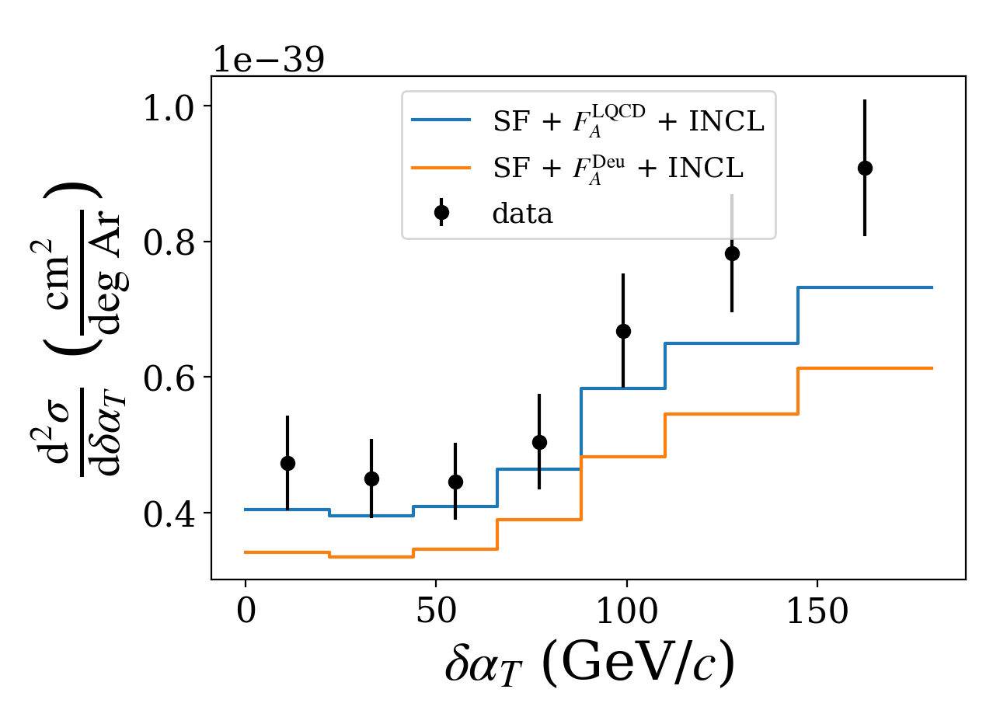 |
| **(e) p_μ** | **(f) p_p** |
| 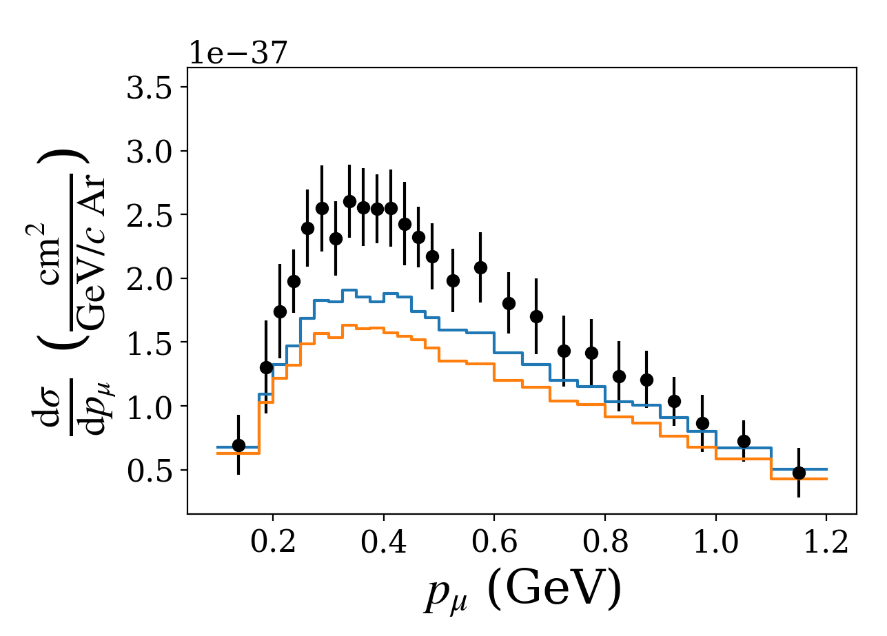 | 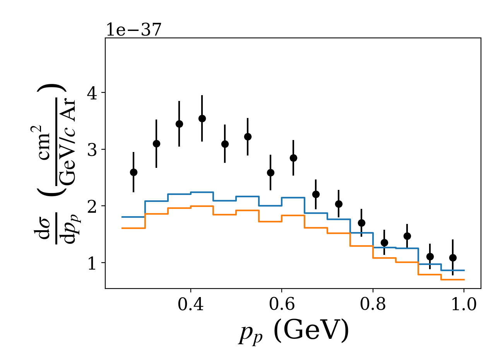 |

---

*Figures produced with `INCLInterface` `Analysis.GENIE().paper_plot` (per-panel
PNGs from `save_subplots`). Source tunes are NUISANCE `.comp.root` files under
`runarea/INCL/nuisance/`.*
