[← Results home](../README.md)

# Spectral-function table normalization integrals

*2026-07-30 · script: [`integrate_all_pke.py`](integrate_all_pke.py)*

Normalization check of every `pke*` 2D spectral-function table
`P(|k|, E)` in the active GENIE installation (`genie_inclxx`,
`data/evgen/nucl/spectral_functions/`):

$$I \;=\; \int 4\pi k^2\, P(k,E)\, dk\, dE$$

The tables are tabulated in GENIE's **"N·P" convention** — the density carries
an overall factor of the nucleon count of the tabulated species, which
`genie::SpectralFunc` divides out (`targetN`) at read time. So `I` should equal
**Z** for a proton spectral function and **N** for a neutron one.

## Results

| Table | Species | ∫4πk²P dk dE | Expected | I/N | Grid |
|-------|---------|-------------:|:--------:|:---:|------|
| `pke12_tot.data` | C12 p | 5.999988 | Z = 6 | 0.999998 | 40k × 80E, dE=5 MeV |
| `pke12_2024.table` | C12 p | 5.999783 | Z = 6 | 0.999964 | 40k × 11480E, dE=0.025 MeV |
| `pke12_2024.table.origin` | C12 p | 5.999783 | Z = 6 | 0.999964 | 40k × 3125E, non-uniform |
| `pke16_tot.data` | O16 p | 7.999143 | Z = 8 | 0.999893 | 200k × 150E |
| `pke40p_tot.data` | Ar40 p | 18.107865 | Z = 18 | **1.005993** | 200k × 400E |
| `pke40n_tot.data` | Ar40 n | 22.131857 | N = 22 | **1.005993** | 200k × 400E |
| `pke56_tot.data` | Fe56 p | 25.998110 | Z = 26 | 0.999927 | 40k × 80E, dE=5 MeV |

### In the Dutta E91-013 window (E_miss 0–80 MeV, P_miss 0–300 MeV/c)

The same integral restricted to the measured (e,e′p) acceptance of the
[Dutta data below](#dutta-e91-013-author-data-prc-figs-67911), with partial
bins clipped exactly (`--e-window 0 80 --k-window 0 300`):

| Table | I_window | fraction of total |
|-------|---------:|:-----------------:|
| `pke12_tot.data` | 5.249 | 87.5% |
| `pke12_2024.table` (= `.origin`) | 5.234 | 87.2% |
| `pke16_tot.data` | 6.710 | 83.9% |
| `pke40p_tot.data` | 15.127 | 83.5% |
| `pke40n_tot.data` | 19.284 | 87.1% |
| `pke56_tot.data` | 22.629 | 87.0% |

- Every table puts **~83–88% of its strength in the mean-field window**; the
  missing ~13–17% is the correlated (SRC-like) tail at high `E_miss`/`P_miss`
  that the measurement window excludes.
- The old and 2024 C12 tables agree in-window (5.249 vs 5.234) — the 2024
  p-shell restructuring moves strength *within* the window, not across it.
- Context for the Dutta scales: theory input puts ≈ 5.23–5.25 of Z = 6 protons
  in the window, so fig 9's renormalized 6.080 exceeds even the *undistorted*
  in-window strength — consistent with its full-occupancy renormalization.
  For Fe56 the window holds 22.63, of which fig 11's 18.2 is 80%.

### C12 shell windows (fig 6 definitions, P_miss 0–300 MeV/c)

The same windowed integral in the two fig 6 `E_miss` windows
(`--e-window 10 25` / `--e-window 30 50`, each with `--k-window 0 300`),
against the corresponding Dutta strengths:

| window | `pke12_tot` | `pke12_2024` | IPSM occupancy | fig 9 window sum (renorm.) | fig 6 3D strength (Q²=1.8 ref.) |
|--------|------------:|-------------:|:--------------:|:--------------------------:|:-------------------------------:|
| p-shell, `E_m` 10–25 MeV | 3.305 (55.1% of Z) | 3.226 (53.8%) | 4 (p₃/₂) | 4.20 | 1.75 |
| s-shell, `E_m` 30–50 MeV | 1.186 (19.8%) | 1.211 (20.2%) | 2 (s₁/₂) | 1.30 | 0.61 |

- The input tables put **81–83% of the 4 p₃/₂ protons** in the p-shell window,
  but only **59–61% of the 2 s₁/₂ protons** in 30–50 MeV — the s-shell is broad
  and leaks well outside its nominal window.
- The 2024 refit moves ≈ 0.08 protons out of the p-shell window (3.305 → 3.226)
  with ≈ 0.03 reappearing in the s-shell window — a within-acceptance
  reshuffle, matching the near-identical full-window totals above.
- The fig 6 strengths sit at ≈ ½ of the input-table strength in both shells
  *as tabulated* — **but that is the signed-axis convention (each side carries
  half the `|p_m|` density), not absorption**: folded left+right they match
  the tables to 6–16% (see the folded overlay below).
- fig 9's renormalized scale conversely *exceeds* the input tables in-window
  (×1.27–1.30 in the p window, ×1.07–1.10 in the s window).

## Findings

- **All seven tables follow the N·P convention** — each integrates to the
  nucleon count of its species to ≲0.01%, except the Ar40 pair (below). This
  includes `pke56_tot.data`, confirming the Benhar Fe56 source
  (`benhar-sf-56fe.data`) is a **proton** SF normalized to Z = 26, same
  convention as the C12/O16 stock tables.
- **The 2024 C12 conversion is lossless.** `pke12_2024.table` (uniform
  0.025 MeV grid written by `convert_pke12_2024.py`) and its non-uniform
  source `pke12_2024.table.origin` integrate to the same value to all printed
  digits (5.999783), independently reproducing the converter's self-test.
  The repo copy [`data/pke12_2024.table`](../../data/pke12_2024.table) is the
  *origin*-format table and gives the identical integral. The 4×10⁻⁵ deficit
  from exactly 6 is the precision of the published Ankowski–Benhar–Sakuda
  table itself.
- **Both stock Ar40 tables sit +0.60% above their nucleon count**, with an
  identical relative excess for protons (18.1079/18) and neutrons
  (22.1319/22) — a shared normalization artifact of how those tables were
  produced (tabulation precision / grid-boundary truncation), not a parsing
  issue and not a p-vs-n asymmetry.
- **The excess is harmless in GENIE.** `SpectralFunc` samples the ground state
  from the *shape* (area-normalized `TH2::GetRandom2`), so an overall scale
  factor cancels; the integral is a data-integrity check, not a physics knob.

## 2D views

One figure per table (script: [`make_sf2d_all.py`](make_sf2d_all.py)), same
orientation as the [tune-resolved SF figures](../template/make_sf2d_table.py):
left = the tabulated density `P(P_miss, E_miss)` (N·P convention), right = the
**sampled density** `4πk²P/I`, area-normalized with this page's integral. The
right panel carries no bin-width factor, so it is grid-independent — which is
why the `.origin` figure below is pixel-identical to the converted one. The
linear E axis squashes the 2024 table's 0.025-MeV p-shell peaks into the thin
strip at the bottom; the
[2024 SF page](../prd-analyzer-v0/spectral_function_c12_2024.md) resolves them.

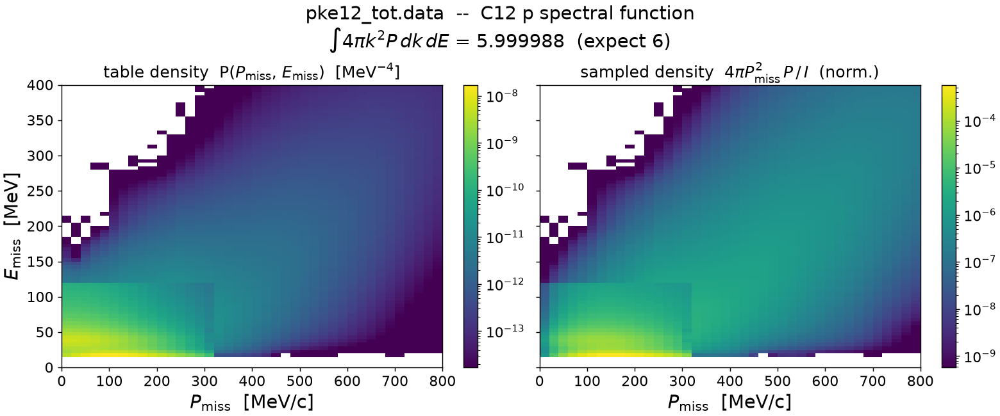
*`pke12_tot.data` — stock Benhar C12 proton SF (I = 5.999988).*

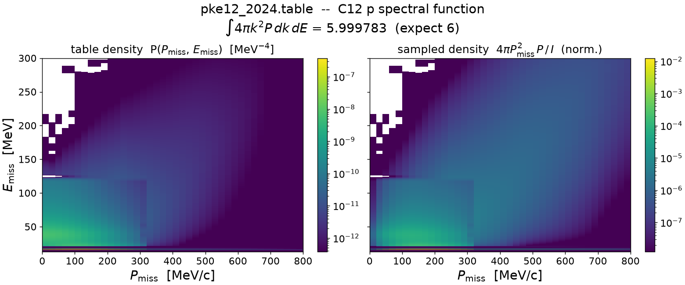
*`pke12_2024.table` — 2024 Ankowski–Benhar–Sakuda C12 proton SF, uniform-grid
conversion (I = 5.999783).*


*`pke12_2024.table.origin` — the non-uniform-grid source; identical to the
converted figure above, the visual lossless-conversion check.*

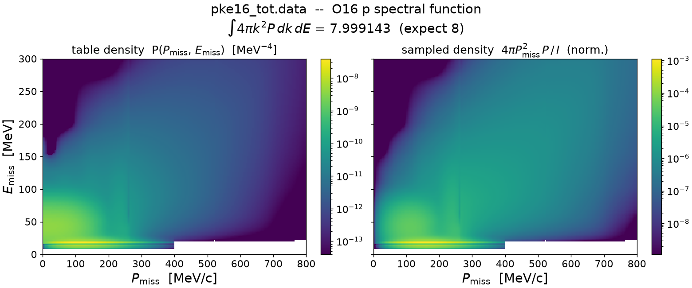
*`pke16_tot.data` — stock O16 proton SF (I = 7.999143).*

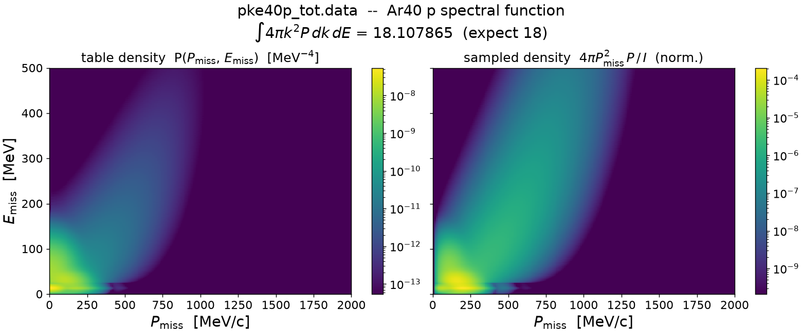
*`pke40p_tot.data` — stock Ar40 proton SF (I = 18.107865, the +0.60% pair).
Note the wider grid: k to 2000 MeV/c, E to 500 MeV.*

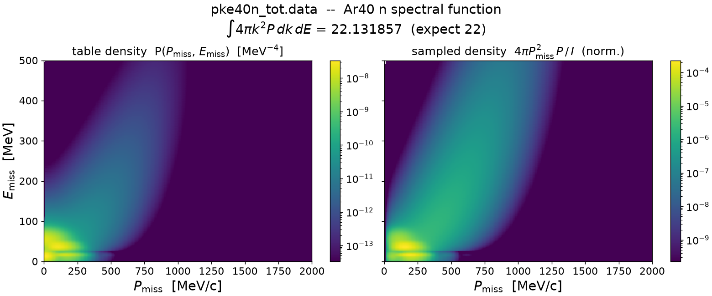
*`pke40n_tot.data` — stock Ar40 neutron SF (I = 22.131857, the +0.60% pair).*

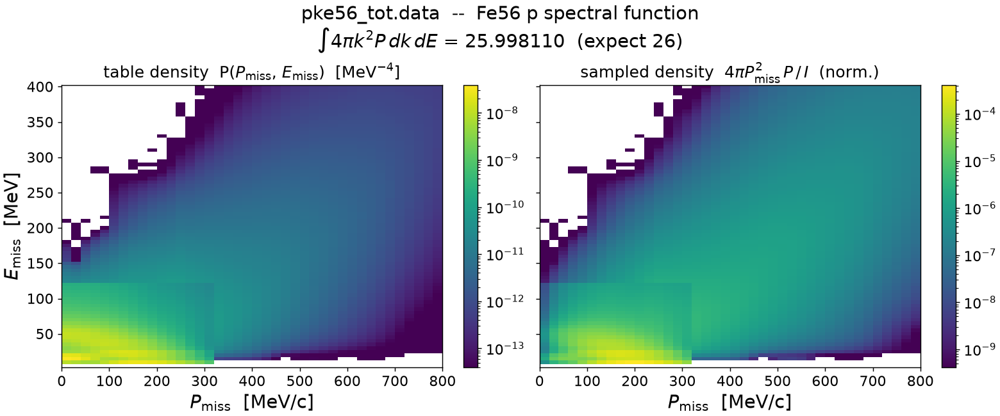
*`pke56_tot.data` — Fe56 proton SF converted from `benhar-sf-56fe.data`
(I = 25.998110).*

## Marginal profiles

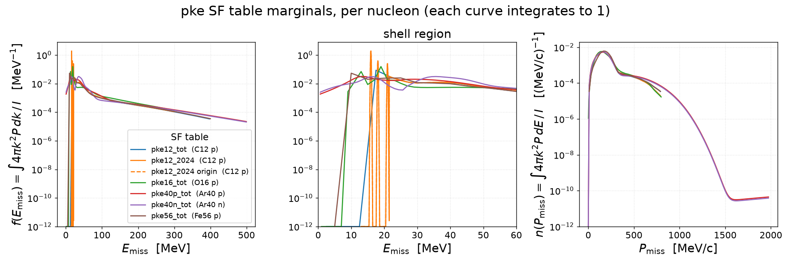
*All tables overlaid, per nucleon (each curve integrates to 1); script:
[`make_sf_profiles.py`](make_sf_profiles.py). Non-positive values are clamped
to the 10⁻¹² log floor (not physical).*

- **`f(E_miss)` (left + shell-region zoom):** the structure is all below
  ~60 MeV. The 2024 C12 table (orange) resolves discrete quasiparticle spikes
  at 15.9 / 18.5 / 21 MeV where the old `pke12_tot` (blue) has one broad
  17.5 MeV bump; O16 shows its two shells (~12, 19 MeV); Fe56 turns on at
  ~10 MeV; the Ar40 pair is smooth, with the neutron table peaking much higher
  (35.6 MeV) than the proton one (13.1 MeV). All tables share the same
  exponential-like continuum tail at high E_miss.
- **`n(P_miss)` (right):** the momentum distributions are nearly universal —
  peak at 146–170 MeV/c, common shape through the ~250 MeV/c shoulder and the
  high-k tail. Only the grid reach differs: the Ar40 tables extend to
  2000 MeV/c, flattening into a ~10⁻¹⁰ plateau beyond ~1600 MeV/c.
- The dashed `pke12_2024.table.origin` curve sits exactly on the solid
  converted one in every panel — both marginals are invariant under the
  lossless rebinning (the converter self-test checks `n(k)` bin by bin).

## Dutta E91-013 author data (PRC figs 6/7/9/11)

The *measured* counterpart of the input-table checks above: all 14 author data
files in [`data/Dipingkar-dutta-data-prc_figs/`](../../data/Dipingkar-dutta-data-prc_figs)
— the JLab Hall C E91-013 quasi-elastic (e,e′p) **distorted** spectral
functions (they contain FSI absorption, and are renormalized for publication).
Full provenance, column semantics, and caveats:
[`report/dutta-e91013-figures.md`](../../report/dutta-e91013-figures.md).

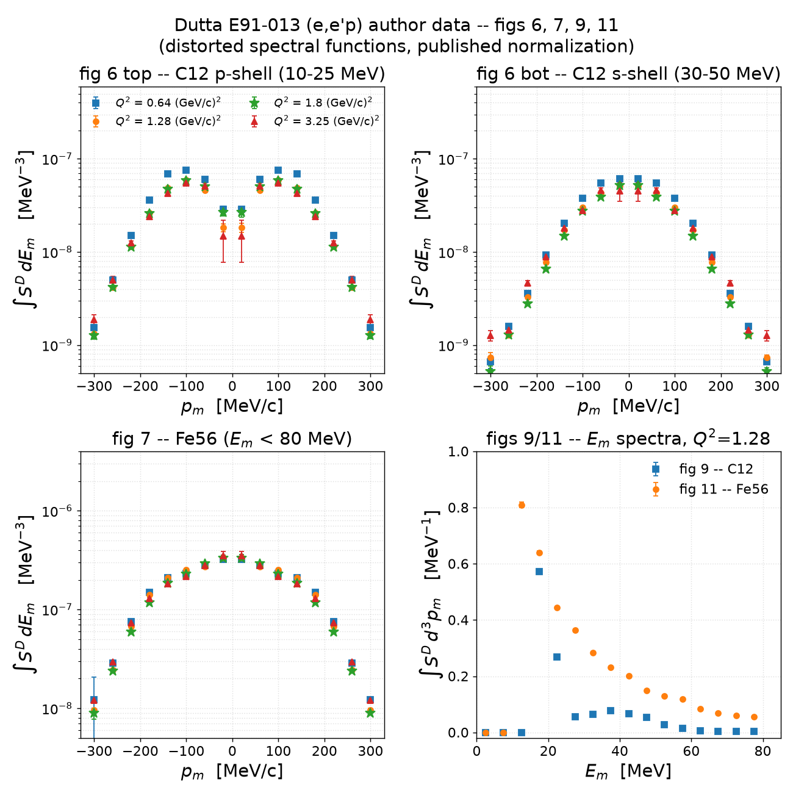
*Script: [`make_dutta_prc.py`](make_dutta_prc.py); markers mirror the paper's,
error bars are the files' statistical-only column 4.*

Integrals (stat errors in quadrature). The `E_m` spectra are already
`∫S^D d³p_m`, so their strength is the plain Σy·5 MeV; the `p_m` sets are
`y(p_m) = ∫S^D dE_m` [MeV⁻³], so their strength is the **3D momentum
integral** `4π Σ y p_m² Δp_m` — dimensionless, taken over the positive-half
bins only (the files are exactly left–right symmetrized, so the positive
half covers `|p_m| ∈ [0, 320)` MeV/c once):

| dataset | strength integral | normalization convention |
|---------|-------------------|--------------------------|
| fig 9 — C12 `E_m` spectrum | **6.080 ± 0.029** | ≈ Z = 6: renormalized to the full-occupancy scale — the *measured* analogue of the pke Z-checks above, but by construction (raw distorted yield would be ≈ 3.2 given transparency T = 0.60) |
| fig 11 — Fe56 `E_m` spectrum | **18.200 ± 0.079** | ≪ Z = 26: in-window renormalized IPSM strength, *not* a Z-normalization |
| fig 7 — Fe56 `p_m`, 4 Q² | 9.62 / 9.10 / 8.15 / 8.91 | the rescale-to-Q² = 1.8 convention equalizes the plotted 1D integrals to ≤ 5%, but the p²-weighted strengths spread ±9% — the weighting emphasizes the large-`|p_m|` tails where the shapes differ |
| fig 6 top — C12 p-shell `p_m` | 2.37 / **1.77 / 1.75 / 1.74** | the three Q² ≥ 1.28 sets agree to 2%; **the Q² = 0.64 file is anomalous** (×1.35 high — excluded from quantitative use, see the report §3) |
| fig 6 bot — C12 s-shell `p_m` | 0.82 / 0.69 / 0.61 / 0.78 | 〃 (q0p6 high again) |

At face value the `p_m` strengths sit ≈ ×2 below the corresponding
`E_m`-spectrum windows — but that factor is a **convention, not a scale
difference**: the signed-axis files tabulate *half* the `|p_m|` density on
each side. Summing left+right makes fig 7 match fig 11 exactly
(2 × 9.103 = 18.206 vs 18.200 — **0.03%**): the two projections of the same
S^D are mutually consistent on one published scale. For C12, 2× the fig 6
windows lands within +19% / −6% of the fig 9 sub-window sums (3.53 vs 4.20 in
10–25 MeV; 1.39 vs 1.30 in 30–50 MeV) — residuals plausibly from the
rescale-to-Q² = 1.8 convention and shell cross-talk, not a different scale.
See the folded overlay below.

Unlike the pke tables, these integrals are **not** data-integrity checks of a
sampling input — they document which published normalization each dataset
sits on (shape + relative occupancy only; float the normalization in any fit).

## Input tables vs Dutta, same phase space

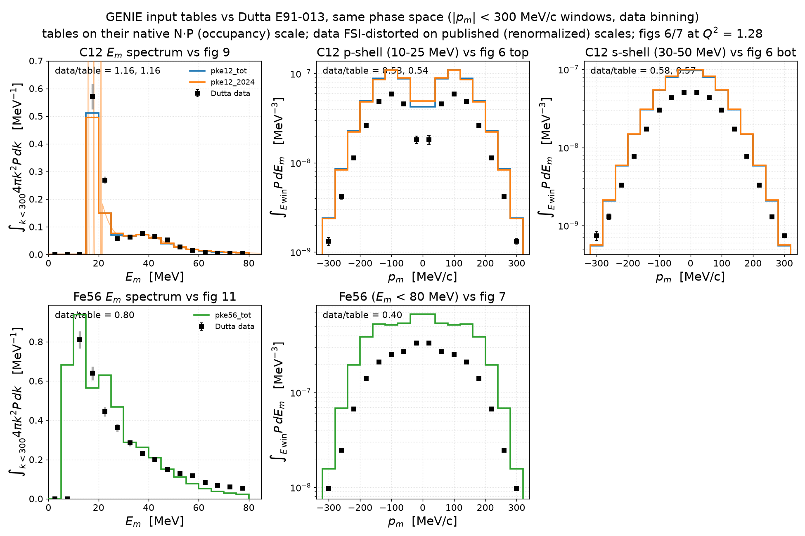
*Script: [`make_dutta_overlay.py`](make_dutta_overlay.py). Each panel projects
the input tables through the measurement's phase space and binning: `E_m`
spectra as `∫_{k<300} 4πk²P dk` in the data's 5-MeV bins; `p_m` panels as
`∫_window P dE_m` in the data's 40-MeV/c bins, mirrored to signed `p_m`.
Tables stay on their native N·P (occupancy) scale; data on their published
scales; figs 6/7 overlays use the Q² = 1.28 files. The thin orange curve is
the 2024 table's resolved quasiparticle structure, clipped by the axis.*

The same overlay **without rebinning the tables** — each table drawn on its
native grid (0.025-MeV E bins for `pke12_2024`, the offset 2–402 MeV 5-MeV
grid for `pke56`, 20-MeV/c k bins in the `p_m` panels); only the data keep
the published binning:

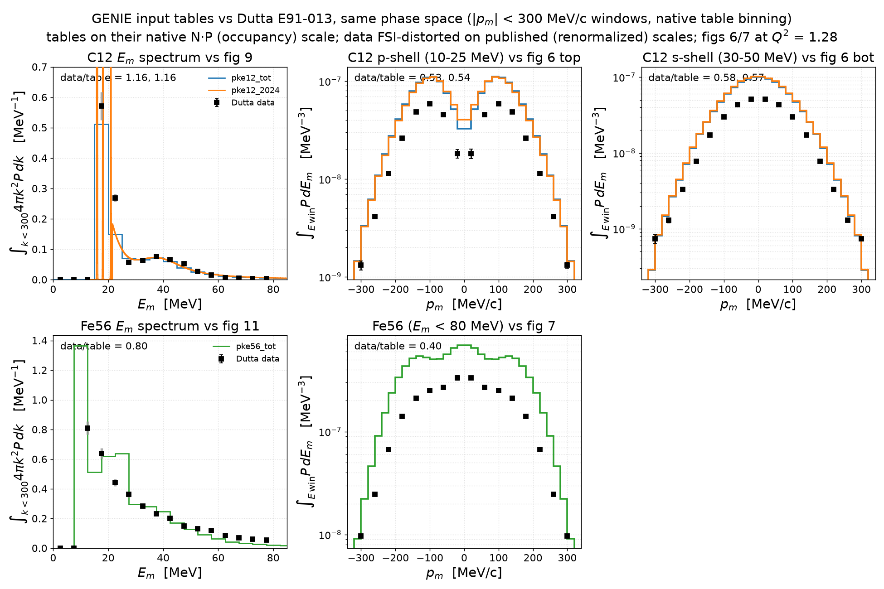
*`make_dutta_overlay.py --native`. What the data binning hides: the 2024
quasiparticle spikes (clipped), the deeper native ℓ = 1 dip at `p_m` = 0, and
`pke56`'s sharp 7–12 MeV peak bin reaching 1.37 MeV⁻¹ — averaged down to
≈ 0.68 in the aligned 5-MeV bins vs the data's 0.81.*

Per-panel strength ratios (identical in both variants: exact windowed sums on
the native grids — `p_m` panels 4πp²-weighted over the plotted
`|p_m| < 320` MeV/c, hence slightly different from the k < 300 shell-window
table above):

- **C12 `E_m` vs fig 9: 1.16 for both tables.** The rebinned tables track the
  measured shape well; the largest shape difference is at `E_m` = 22.5 MeV,
  where the data hold more strength than the tables — the same s–p-dip excess
  the paper notes against IPSM.
- **C12 p-shell vs fig 6 top: 0.53 / 0.54; s-shell vs fig 6 bot: 0.58 / 0.57**
  — *per-side* ratios: the signed axis carries half the `|p_m|` density on
  each side, so these double to ≈ 1.06–1.16 once folded (next subsection).
  In the p-shell window the data's ℓ = 1 dip at `p_m` = 0 is visibly *deeper*
  than the undistorted tables'.
- **Fe56 `E_m` vs fig 11: 0.80.** The table tracks the measured tail closely;
  the deficit concentrates near the peak, where the data are broader than the
  Benhar-table shell structure (the paper's spreading-width remark).
- **Fe56 `p_m` vs fig 7: 0.40 per side → 0.80 folded** — identical to the
  fig 11 ratio, and the measured distribution is flatter than the table's.

### Folded `|p_m|`: left + right summed

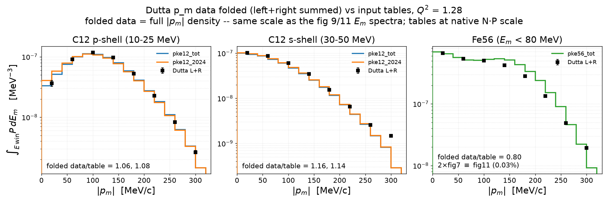
*Script: [`make_dutta_folded.py`](make_dutta_folded.py). Folded value =
`y(+p) + y(−p)` = 2 `y(+p)` (the files are exactly symmetrized; error bars
drawn as 2× the stat column since the sides are duplicated, not independent),
against the tables' native-grid `∫_window P dE` — directly comparable, with
no factor-2 convention in between.*

- **The fold closes the apparent scale gap.** 2×fig 7 ≡ fig 11 to 0.03%, and
  the folded ratios line up with the `E_m` panels: **C12 1.06 / 1.08
  (p-shell) and 1.16 / 1.14 (s-shell) vs fig 9's 1.16; Fe56 0.80 vs
  fig 11's 0.80.** All four Q² = 1.28 projections sit on one renormalized
  scale relative to the tables.
- Consequently the ≈ ×0.55 in the per-side panels above is **not FSI
  absorption** — it is the ×½ side-splitting. (The confusion is easy: the raw
  distorted yield ≈ T/1.11 ≈ 0.54 of the table would look identical per side;
  the published, renormalized data just don't sit on that raw scale.)
- Shape-wise, the folded C12 data track the tables bin by bin, including the
  low-`|p_m|` ℓ = 1 depletion in the p-shell window; the s-shell runs
  slightly high with the largest excess in the outermost (300 MeV/c) bin.
  Fe56 shows a real shape difference: the data are flatter, with the deficit
  concentrated at mid-`|p_m|`.

The combined summary — both projections per nucleus in one figure
([`make_dutta_em_folded.py`](make_dutta_em_folded.py)): top row C12
(`E_m` vs fig 9, folded p-shell, folded s-shell), bottom row Fe56
(`E_m` vs fig 11, folded fig 7):

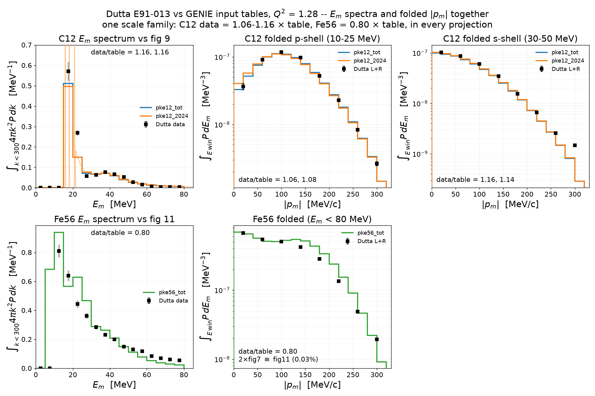
*One scale family in every projection: C12 data = 1.06–1.16 × table,
Fe56 = 0.80 × table.*

## Method

- Uniform-format tables (`pke*_tot.data`, `pke12_2024.table`) are parsed
  exactly as `SpectralFunc::LoadSFDataFile` does (header
  `nE np / Emin pmin / Emax pmax`, then `np` blocks of
  `{k_center, nE (E_center, P) pairs}`), and the Riemann sum uses
  `dk = (p_max−p_min)/np`, `dE = (E_max−E_min)/nE` from the header edge
  ranges — exactly the bin widths of the `TH2D` GENIE builds.
- The origin-format table uses its native per-segment `dE`
  (340 × 0.025 MeV fine NIKHEF region + 2785 × 0.1 MeV Benhar continuum)
  and the header `dk = 20 MeV/c`.

## Reproduce

```bash
pixi run python results/normalization/integrate_all_pke.py            # active install
pixi run python results/normalization/integrate_all_pke.py <data_dir> # explicit dir
pixi run python results/normalization/integrate_all_pke.py \
    --e-window 0 80 --k-window 0 300                                  # Dutta window
pixi run python results/normalization/make_sf2d_all.py                # 2D figures
pixi run python results/normalization/make_sf_profiles.py             # marginals
pixi run python results/normalization/make_dutta_prc.py               # Dutta data
pixi run python results/normalization/make_dutta_overlay.py           # overlay
pixi run python results/normalization/make_dutta_overlay.py --native  # native bins
pixi run python results/normalization/make_dutta_folded.py            # folded |p_m|
pixi run python results/normalization/make_dutta_em_folded.py         # combined view
```
