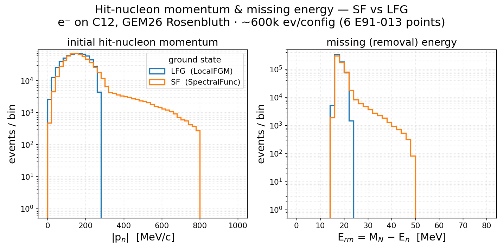

[← Results home](../README.md)

# Hit-nucleon momentum & missing energy: SF vs LFG (C12)

The ground-state signature from the grid campaign (`e-` on C12, GEM26 Rosenbluth), aggregating
all 6 E91-013 points per config (~600k events each). Initial hit-nucleon branches from the gst:
`|pₙ|` from `pn`, and the missing/removal energy `E_rm = M_N − Eₙ` (the spectral function's
removal-energy axis).

| Quantity | LFG (`GEM26_11a`) | SF (`GEM26_22a`) |
|----------|-------------------|------------------|
| `|pₙ|` shape | sharp Fermi cutoff ~280 MeV/c | correlated tail to ~800 MeV/c |
| `E_rm` shape | near-fixed spike ~20 MeV | broad ~15–50 MeV distribution |

This is where the two ground states diverge: the spectral function carries both the short-range
**high-momentum tail** and a realistic **removal-energy spread**, while the Local Fermi Gas has a
hard momentum edge and an essentially fixed removal energy. The total cross-section spline is the
same for both (see [the spline page](spline_gem26_q2cut.md)); the difference is entirely in these
per-event initial-state kinematics.

- **Figure:** [`groundstate_gem26_sf_lfg.png`](../groundstate_gem26_sf_lfg.png)
- **Generator:** [`template/make_groundstate_gem26_sf_lfg.py`](../template/make_groundstate_gem26_sf_lfg.py)
