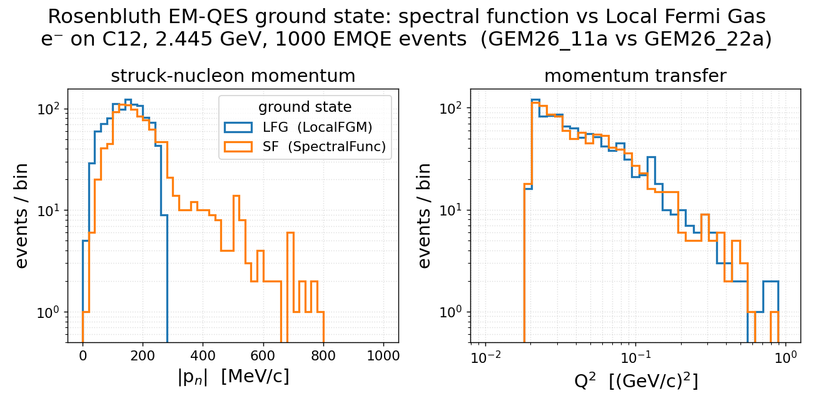

[← Results home](../README.md)

# Rosenbluth EM-QES ground state: spectral function vs Local Fermi Gas (C12)

Test of two custom EM tunes that share **identical** Rosenbluth quasi-elastic
physics (`XSecModel@QEL-EM = genie::RosenbluthPXSec/Default`) and differ only in
the **C12 ground-state nuclear model**. Both run `e-` on C12 at a 2.445 GeV beam
(JLab E91-013 point), 1000 `EMQE` events each.

| Tune | Ground state (C12) | QEL-EM model | EventGenerator |
|------|--------------------|--------------|----------------|
| `GEM26_11a` | `genie::LocalFGM/Default` (Local Fermi Gas) | `RosenbluthPXSec/Default` | global standard chain |
| `GEM26_22a` | `genie::SpectralFunc/Default` (Benhar 2D SF, `pke12_tot.data`) | `RosenbluthPXSec/Default` | global standard chain |

Both tunes are `genie-agent/tunes/` overlays based on the stock EM tune
`GEM21_11a`, with `EventGenerator.xml` **dropped** so the global standard QEL-EM
chain (`genie::QELEventGenerator/EM-Default` + `PauliBlocker`) is used — required
by Rosenbluth, in place of GEM21_11a's SuSAv2-specific `QELEventGeneratorSuSA`.

## Splines are identical; the ground state lives in the events

`gmkspl` produces **numerically identical** EM-QES cross-section splines for the
two tunes (all 60 knots agree to 10+ significant figures; the files differ only
in the `<genie_tune name=…>` tag). This is expected: Pauli blocking in the
integrated cross section uses the Fermi momentum `kF` from the shared
`CommonParam[FermiGas]`, while the momentum distribution `P(k,E)` only enters
when the struck nucleon is sampled at **event generation**. The ground-state
effect is therefore visible only in the per-event kinematics above.

## Result

| Quantity | LFG (`GEM26_11a`) | SF (`GEM26_22a`) |
|----------|-------------------|------------------|
| struck-nucleon \|p\| mean | 146 MeV/c | **207 MeV/c** |
| \|p\| width (std) | 60 MeV/c | **125 MeV/c** |
| fraction \|p\| > 250 MeV/c | 2.6 % | **23.7 %** |
| Q² mean | 0.066 (GeV/c)² | 0.065 (GeV/c)² |

The **left panel** is the signature: the Local Fermi Gas has a sharp momentum
edge (~280 MeV/c) and essentially nothing beyond it, while the spectral function
carries the **correlated high-momentum tail** out to ~800 MeV/c that the Fermi
gas lacks — the textbook SF-vs-FG difference (short-range correlations). The
**right panel** shows Q² is barely changed at this beam energy (means equal to
~1 %, SF marginally broader), consistent with the identical total-xsec splines:
the QE Q² is set by the elastic kinematics, only mildly smeared by the initial
nucleon motion.

- **Figure:** [`groundstate_sf_lfg.png`](../groundstate_sf_lfg.png)
- **Generator:** [`template/make_groundstate_sf_lfg.py`](../template/make_groundstate_sf_lfg.py)
- **Style:** [`template/plot_style.py`](../template/plot_style.py)
- **Tunes:** `genie-agent/tunes/GEM26_11a` (LFG), `genie-agent/tunes/GEM26_22a` (SF)
