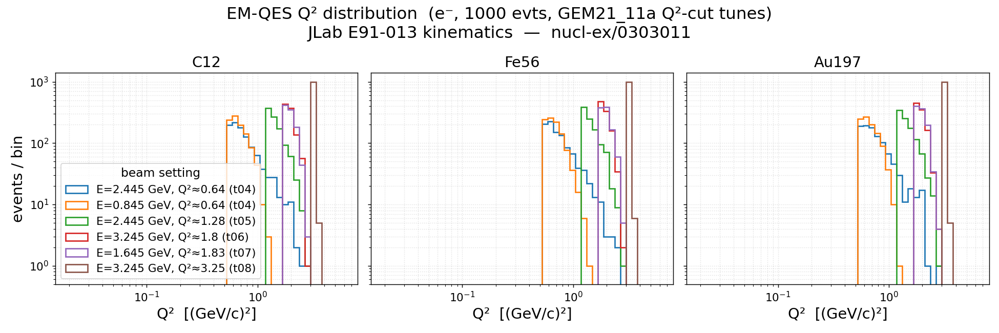

[← Results home](../README.md)

# EM-QES Q² distribution (E91-013 kinematics)

Per-event Q² distributions for the 18 EM-QES `e-` gevgen grid jobs at the
JLab Hall C experiment **E91-013** kinematics (paper
[nucl-ex/0303011](../../papers/nucl-ex_0303011/paper_nucl-ex_0303011.md)),
1000 events each. Three panels (one per target, C12 / Fe56 / Au197); one curve
per beam-energy setting, colored by setting.

| Beam E (GeV) | Q² point (GeV/c)² | Tune | EM-MinQ2Limit (GeV²) |
|--------------|-------------------|------|----------------------|
| 2.445 | 0.64 | GEM21_11a_04_000 | 0.54 |
| 0.845 | 0.64 | GEM21_11a_04_000 | 0.54 |
| 2.445 | 1.28 | GEM21_11a_05_000 | 1.18 |
| 3.245 | 1.80 | GEM21_11a_06_000 | 1.70 |
| 1.645 | 1.83 | GEM21_11a_07_000 | 1.73 |
| 3.245 | 3.25 | GEM21_11a_08_000 | 3.15 |

Each curve has a sharp low-Q² cutoff exactly at its tune's `EM-MinQ2Limit`, so
the floors step out as the tune index climbs (t04 → t08). QES confines Q² to a
narrow band per beam energy; the two ε settings at the same Q² point share a cut
floor but populate Q² differently because the accessible Q² range scales with
beam energy. Heavier targets (Fe56, Au197) show broader peaks from increased
Fermi smearing.

- **Figure:** [`q2_dist_emqes.png`](../q2_dist_emqes.png)
- **Generator:** [`template/make_q2_dist.py`](../template/make_q2_dist.py)
- **Style:** [`template/plot_style.py`](../template/plot_style.py)
