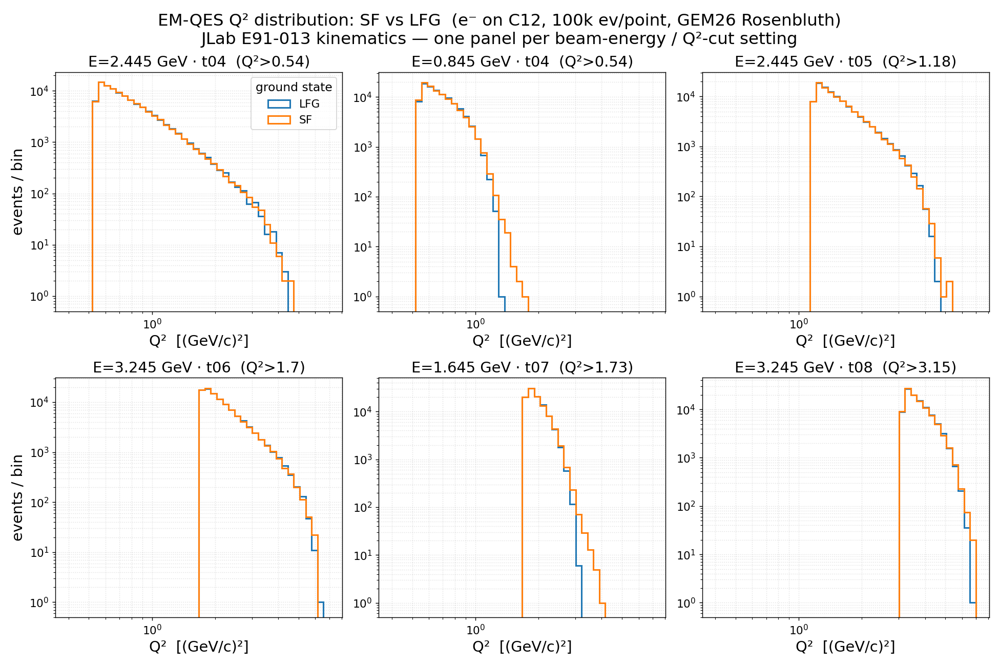
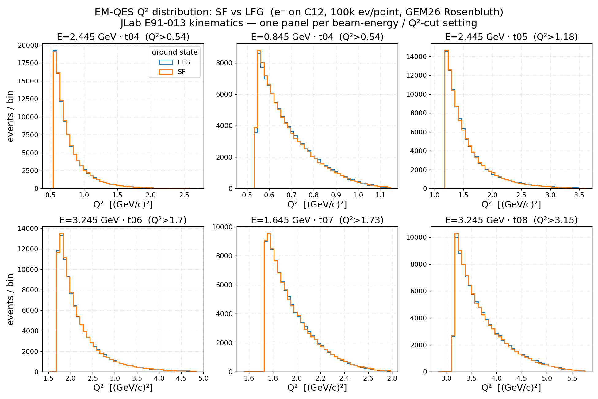

[← Results home](../README.md)

# EM-QES Q² distribution: SF vs LFG (C12, E91-013)

Per-event Q² for `e-` on C12 from the grid campaign (`gevgen`, 10M events per point;
100k-event sample shown per panel). Six panels, one per JLab **E91-013** beam-energy / Q²-cut
setting; each overlays **LFG (`GEM26_11a`)** and **SF (`GEM26_22a`)** — identical Rosenbluth
QEL-EM physics, differing only in the C12 ground-state nuclear model.

*Log-log view.*

*Linear (normal) axes — per-panel range scaled to each setting's Q² band.*

| Beam E (GeV) | cut tune | EM-MinQ2Limit (GeV²) |
|--------------|----------|----------------------|
| 2.445 | t04 | 0.54 |
| 0.845 | t04 | 0.54 |
| 2.445 | t05 | 1.18 |
| 3.245 | t06 | 1.70 |
| 1.645 | t07 | 1.73 |
| 3.245 | t08 | 3.15 |

Each distribution is bounded below by its tune's `EM-MinQ2Limit`. SF and LFG track each other
closely at every setting: the QE Q² is set by the lepton kinematics and only weakly smeared by
the initial-nucleon motion, so the ground-state choice barely shifts Q² (the difference lives in
the struck-nucleon kinematics — see [the ground-state page](groundstate_gem26_sf_lfg.md)).

- **Figures:** [`q2_gem26_sf_lfg.png`](../q2_gem26_sf_lfg.png) (log-log) · [`q2_gem26_sf_lfg_linear.png`](../q2_gem26_sf_lfg_linear.png) (linear)
- **Generator:** [`template/make_q2_gem26_sf_lfg.py`](../template/make_q2_gem26_sf_lfg.py)
