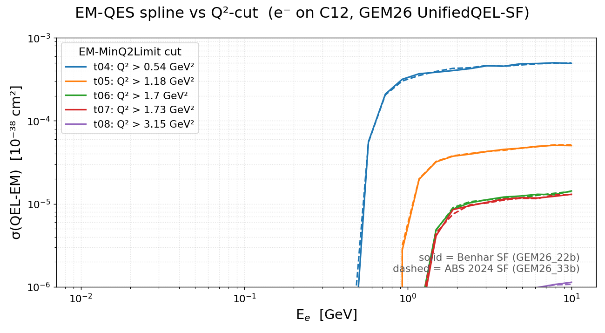
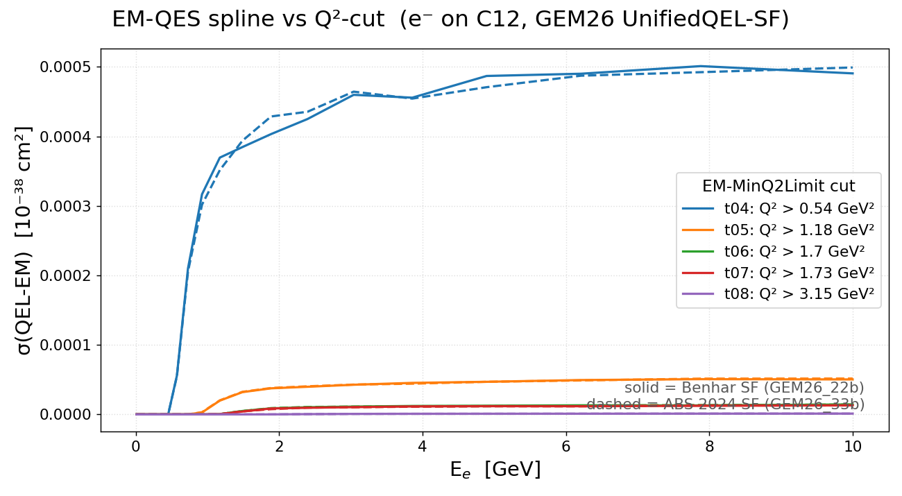

[← Results home](../README.md)

# EM-QES spline vs Q²-cut: Benhar SF vs ABS 2024 SF (GEM26 UnifiedQEL, C12)

Total `EM-QES` (QEL-EM) cross-section spline σ(E) for `e-` on C12, comparing the two
spectral-function ground states under the SF-consistent `genie::UnifiedQELPXSec/Dipole`
model: **`GEM26_22b` = Benhar SF (`pke12_tot.data`, solid)** vs **`GEM26_33b` = 2024
Ankowski-Benhar-Sakuda SF (`pke12_2024.table`, dashed)**, for the five `EM-MinQ2Limit`
cut tunes `_{04..08}_000`. The same Q² cut keeps the same color in both families.
Splines were generated on the grid (`gmkspl`, `genie_inclxx` install: 22b on
2026-06-03, 33b on 2026-06-09); each curve sums the two bound-nucleon sub-splines.

*Log-log view.*

*Linear (normal) axes — t04 dominates; the 22b/33b difference is largest around the
threshold shoulder (~1–4 GeV).*

| Cut tune | EM-MinQ2Limit (GeV²) |
|----------|----------------------|
| t04 | 0.54 |
| t05 | 1.18 |
| t06 | 1.70 |
| t07 | 1.73 |
| t08 | 3.15 |

Unlike the Rosenbluth tunes (where SF vs LFG splines coincide exactly — see
[spline_gem26_q2cut](spline_gem26_q2cut.md)), the spectral function **enters** the
UnifiedQEL cross section, so the splines genuinely differ — but only mildly: at
E ≥ 2 GeV the 33b/22b ratio stays within ~±5% knot-to-knot (mean within ~2.5% per cut,
largest for the hardest cut t08), with the biggest local deviations near each
threshold shoulder where σ is still climbing. The 2024 SF's resolved p-shell
quasiparticle peaks redistribute strength in (E_m, p_m) but `n(k)` is unchanged, so the
integrated σ(E) moves little.

- **Figures:** [`spline_22b_vs_33b_q2cut.png`](../spline_22b_vs_33b_q2cut.png) (log-log) · [`spline_22b_vs_33b_q2cut_linear.png`](../spline_22b_vs_33b_q2cut_linear.png) (linear)
- **Generator:** [`template/make_spline_22b_vs_33b_q2cut.py`](../template/make_spline_22b_vs_33b_q2cut.py)
- **Tunes:** `genie-agent/tunes/GEM26_{22b,33b}/…_{04..08}_000`
- **Spline XMLs:** staged under `genie-agent/splines/GEM26_{22b,33b}_{04..08}_000/` (gitignored; pulled from the grid jobs' PNFS output dirs — see `jobsub-agent/jobsub-runs/gmkspl_grid-2026-06-{03,09}/*.gridlog`)
