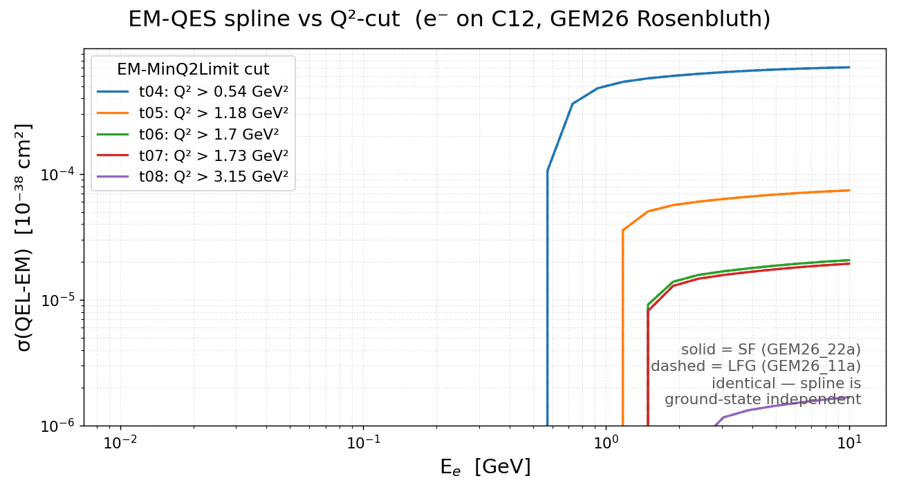
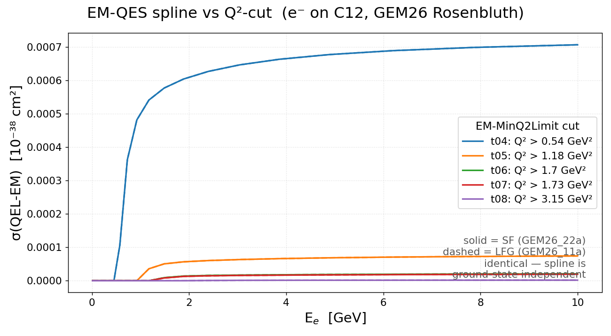

[← Results home](../README.md)

# EM-QES spline vs Q²-cut (GEM26 Rosenbluth, C12)

Total `EM-QES` (QEL-EM) cross-section spline σ(E) for `e-` on C12, for the five
`EM-MinQ2Limit` cut tunes `GEM26_{11a,22a}_{04..08}_000` (QEL-EM = `RosenbluthPXSec`).
Splines were generated on the grid (`gmkspl`, `genie_inclxx` + `gem26_emq2lim` tarballs);
each curve sums the two bound-nucleon sub-splines.

*Log-log view.*

*Linear (normal) axes — same σ(E); t04 dominates, the higher cuts are tiny on a linear scale.*

| Cut tune | EM-MinQ2Limit (GeV²) |
|----------|----------------------|
| t04 | 0.54 |
| t05 | 1.18 |
| t06 | 1.70 |
| t07 | 1.73 |
| t08 | 3.15 |

Each higher cut pushes the turn-on to higher E (σ is zero until the accessible Q² range
reaches the cut) and suppresses the plateau cross section by orders of magnitude
(t04 ~5×10⁻⁴ → t08 ~2×10⁻⁶, in 10⁻³⁸ cm²). The **SF (`GEM26_22a`, solid)** and
**LFG (`GEM26_11a`, dashed)** curves coincide exactly — the integrated QE-EM spline is
ground-state independent (Pauli blocking uses the shared `CommonParam[FermiGas]` kF; the
momentum distribution only enters at event generation).

- **Figures:** [`spline_gem26_q2cut.png`](../spline_gem26_q2cut.png) (log-log) · [`spline_gem26_q2cut_linear.png`](../spline_gem26_q2cut_linear.png) (linear)
- **Generator:** [`template/make_spline_gem26_q2cut.py`](../template/make_spline_gem26_q2cut.py)
- **Tunes:** `genie-agent/tunes/GEM26_{11a,22a}/…_{04..08}_000`
