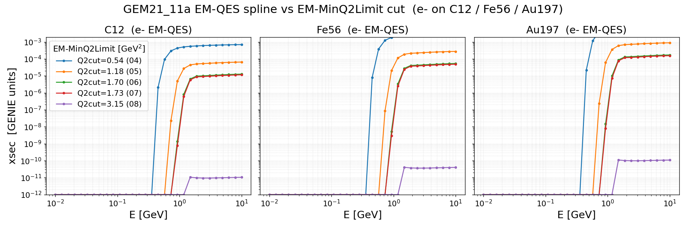

[← Results home](../README.md)

# EM-QES spline vs EM-MinQ2Limit cut

Total electromagnetic quasi-elastic (EM-QES) cross-section splines for `e-`
on C12 / Fe56 / Au197, generated on the grid for `GEM21_11a` custom tunes
that differ only in the `EM-MinQ2Limit` (minimum-Q²) parameter.

| Tune             | EM-MinQ2Limit (GeV²) |
|------------------|----------------------|
| GEM21_11a_04_000 | 0.54 |
| GEM21_11a_05_000 | 1.18 |
| GEM21_11a_06_000 | 1.70 |
| GEM21_11a_07_000 | 1.73 |
| GEM21_11a_08_000 | 3.15 |

Raising the Q² floor strips low-Q² phase space: the cross-section turn-on shifts
to higher energy and the plateau drops by roughly an order of magnitude per step.
The 3.15 GeV² tune sits on the plot's 1e-12 floor (effectively no surviving
EM-QES). Curves are clamped at 1e-12 so the log axis renders zeros. The 1.70 and
1.73 GeV² curves nearly overlap (0.03 GeV² apart).

- **Figure:** [`spline_q2cut.png`](../spline_q2cut.png)
- **Generator:** [`template/make_spline_q2cut.py`](../template/make_spline_q2cut.py)
- **Style:** [`template/plot_style.py`](../template/plot_style.py)
