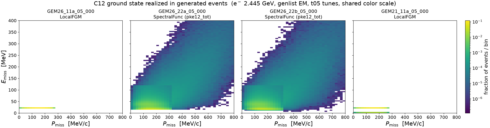
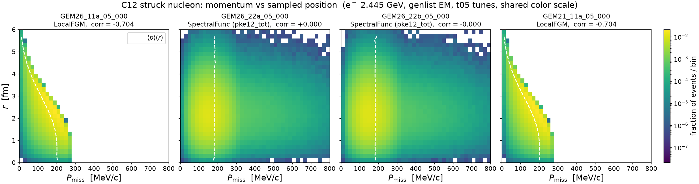
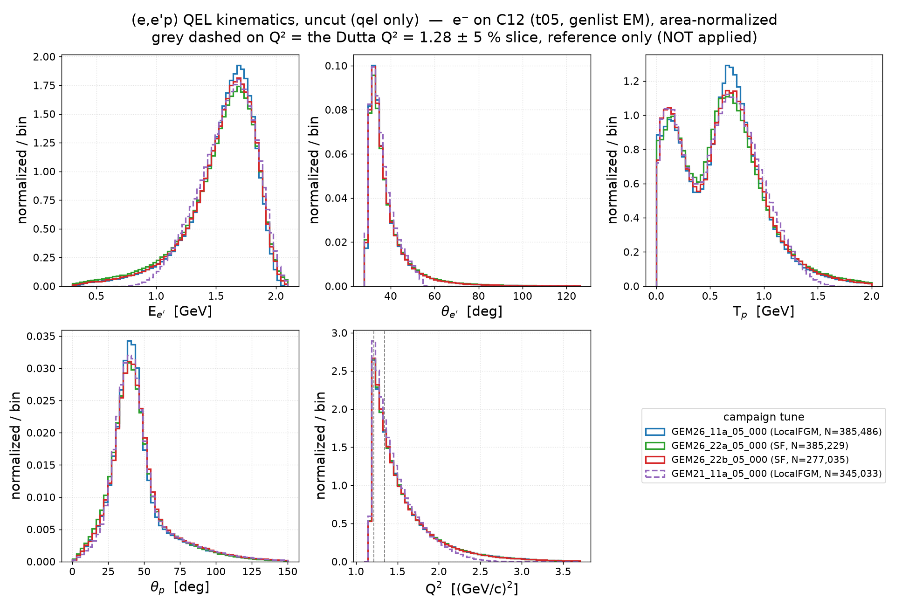
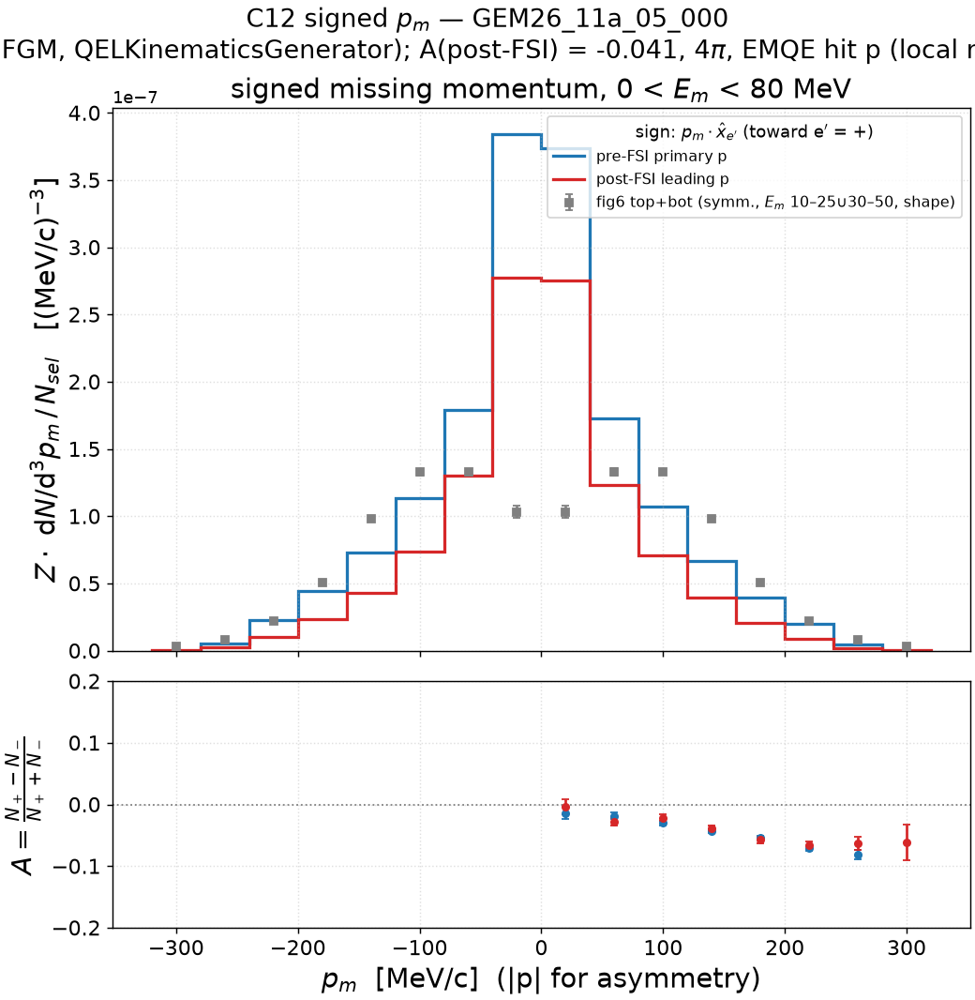
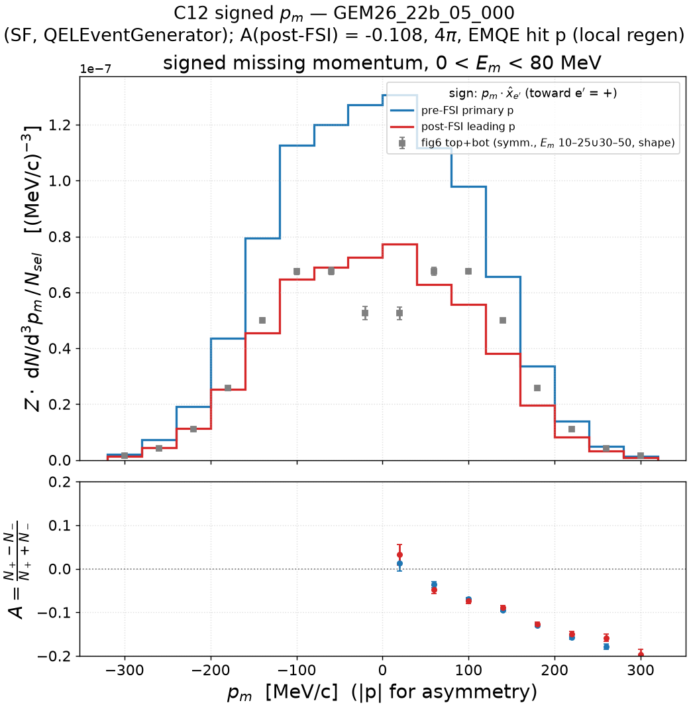
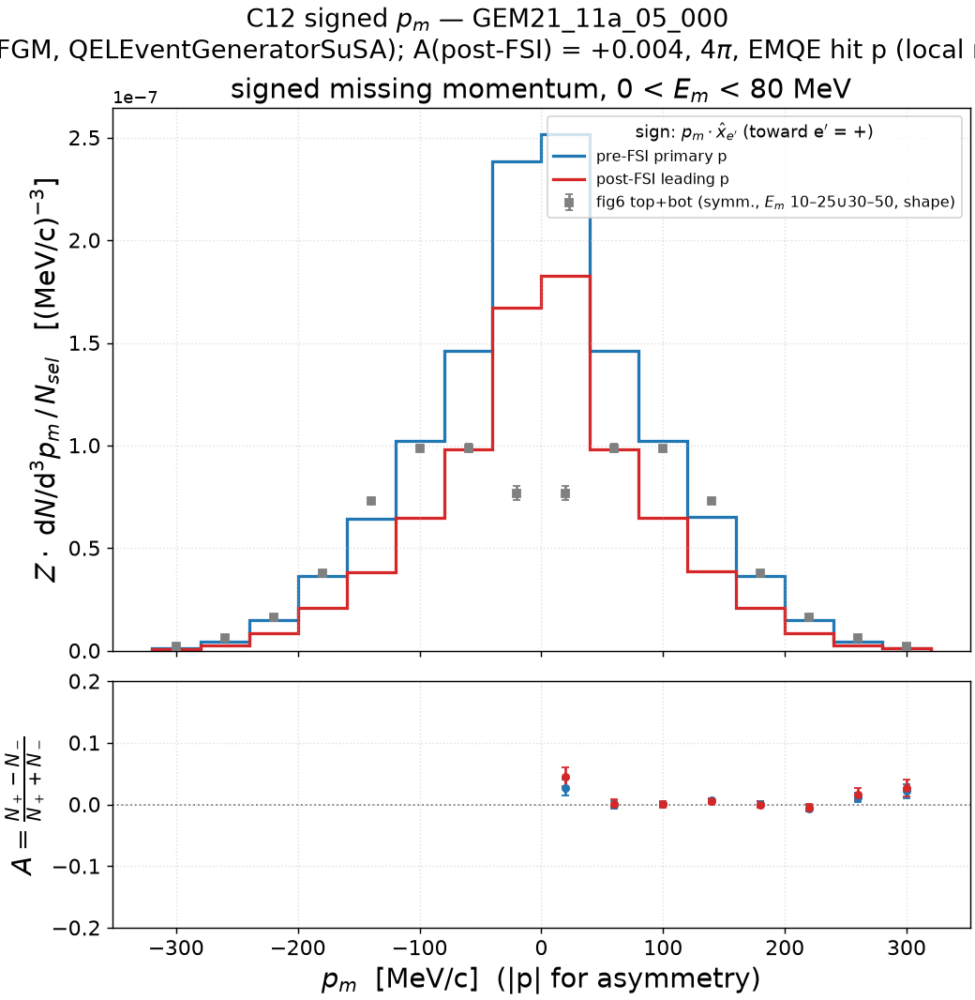

# Electron–C12 scattering

C12 sibling of [`electron_fe56_scattering.md`](electron_fe56_scattering.md), same
plot series and tune set. **Provenance difference**: the original C12 grid
samples (2026-06-11, genlist **EMQE**, e⁻ 2.445 GeV, t05 generation cut) have
been purged from scratch dCache (verified 2026-07-17: all four
`pnfs_output_dir`s empty), so the ladder and momentum sections (4–5) read the
surviving `cache/ladder/<model>.npz` caches built by `results/prd-analyzer-v0/`
`build_cache_ladder.py` from 2M events/model before the purge, section 6 runs
on locally regenerated samples, and sections 2–3 on the fresh 2026-07-26 full-EM
grid campaign. Cache key →
tune: LFG = GEM26_11a_05_000, SF = GEM26_22a_05_000, UnifiedQEL =
GEM26_22b_05_000, SuSAv2 = GEM21_11a_05_000 (`samples.py`; the fifth key
UnifiedQEL2024 = GEM26_33b_05_000 is outside this four-tune series).

## 1. C12 2D spectral function — the GENIE input table

`pke12_tot.data` resolved exactly as at run time (`GEM26_22a` →
`NuclearModel@Pdg=1000060120` = `genie::SpectralFunc/Default` →
`SpectFuncTable@Pdg=1000060120_{2212,2112}`; one table shared by p and n).
Raw 4πk² integral = **6.000 = Z**: proton-number normalized, same convention
as the Fe56 table. Sampled tails: **P(P_miss > 250 MeV/c) = 0.146**,
**P(E_miss > 100 MeV) = 0.077**.

Grid: 40 P_miss bins [0, 800] MeV/c × 80 E_miss bins **[0, 400] MeV** — note
the C12 E grid has edges at multiples of 5 MeV (centers 2.5, 7.5, …), i.e. it
is **aligned** with the Dutta/plot grid, unlike Fe56's half-bin-offset grid
(edges 2.5, 7.5, …). GEM26_22b resolves to the identical table; GEM26_11a and
GEM21_11a use LocalFGM (no table).

Regenerate: `pixi run python results/template/make_sf2d_table.py --all-tunes --target C12`

## 2. Struck nucleon in the record: sampled (P_miss, E_rm) and (P_miss, r)

C12 instance of the Fe56 note's section 2, with a **fresh sample**: the
2026-07-26 C12 full-EM grid campaign (genlist **EM**, not the EMQE of the
other sections; e⁻ 2.445 GeV, all four tunes on the `genie_inclxx_q2guard`
install with the `gem26/gem21_emq2lim` overlays, splines from the persistent
mirror — see `.claude/plans/submit_c12_em_gevgen.sh`). First 20 ghep files =
2M events/tune (the 22a list skips process 5, still running at dump time),
all single-nucleon events (~1.92M/tune), both species, no other cuts, dumped
by `results/template/dump_hitnuc.cxx` to `cache/hitnuc_c12/<tune>.csv`.

**Momentum vs removal energy** (`sf2d_events_c12_<tune>.png` per tune, shared
color scale above): the SF tunes realize the full pke12 table — mean-field
blob, SRC continuum, seam — with realized tail weights
P(p > 250 MeV/c) = 0.137/0.130 and P(E > 100 MeV) = 0.070/0.064 (22a/22b) vs
the table's sampling weights 0.146/0.077 (section 1). The LFG tunes collapse
onto the near-fixed-w band (11a median w = 20.0 MeV) below the local-k_F
cutoff. **GEM21's w = 0 QEL population is visible here**: 18% of its
single-nucleon events (all scat = 1) store `RemovalEnergy` = 0 exactly —
`QELEventGeneratorSuSA` applies its binding internally and never fills the
field — and because the C12 E grid starts at 0 (aligned edges, section 1)
they land **in-grid** as the second band in the bottom [0,5) MeV bin, where
on Fe56 (grid edge 2.5 MeV) the same population fell out of grid entirely.
The generator behavior is target-blind; only the table grid decides whether
you see it.

**Momentum vs position** (`struck_pr_c12_<tune>.png` per tune; white dashed =
⟨p⟩(r)): the mechanism is chain-identical to Fe56 (VertexGenerator Module-1
samples r ∝ r²ρ(r), identical ⟨r⟩ = 2.30 fm in all four tunes; every chain
passes r = |X4| to the nuclear model; code walk in the Fe56 note section 2):

| tune | ground state | corr(p, r) | P(p > 250 MeV/c) |
|---|---|---|---|
| GEM26_11a_05_000 | LocalFGM | −0.704 | 0.008 |
| GEM26_22a_05_000 | 2D SF | +0.000 | 0.137 |
| GEM26_22b_05_000 | 2D SF | −0.000 | 0.130 |
| GEM21_11a_05_000 | LocalFGM | −0.704 | 0.008 |

The Fe56 taxonomy repeats with one size effect: the LFG k_F(r) correlation is
**stronger on carbon** (corr = −0.704 vs Fe56's −0.619 — the lighter nucleus
has no saturated-density plateau, so k_F falls with r essentially everywhere),
and the SF tunes are exactly factorized as before (a 600 MeV/c SRC nucleon
draws the same r distribution as a shell-model one — relevant when reading
the C12 > Fe56 FSI transparency of section 4).

Regenerate: build `dump_hitnuc` (recipe in-file), dump the 20-file lists to
`cache/hitnuc_c12/<tune>.csv`, then
`pixi run python results/template/make_sf2d_events.py --dump-dir results/prd-analyzer-v0.1/cache/hitnuc_c12 --all-tunes --target C12`
and the same for `make_struck_pr.py`.

## 3. QEL kinematics — E_e′, θ_e′, T_p, θ_p, Q²

v0 README §6 descendant on the fresh campaign sample (same 20-file gst streams
as section 2's ghep dumps): the five kinematic variables **uncut** — the only
selection is `qel` (EMQE-equivalent on the full-EM sample; v0's §6 needed no
`qel` because its samples were EMQE, but it also applied the Q² window, which
is **not** applied here). The grey dashed lines on the Q² panel mark the Dutta
Q² = 1.28 ± 5 % slice as **reference only**; the hard lower edge at 1.18 GeV²
is the t05 generation cut. Leading proton = highest-momentum final-state
proton; T_p/θ_p panels drop no-proton events. Panel ranges are pooled
p0.2–p99.8. Area-normalized above; raw-counts companion
`kin_qel_c12_counts.png` (equal ntot = 2M/tune).

| tune | N (qel, of 2M) | has_p |
|---|---|---|
| GEM26_11a_05_000 | 385,486 (19.3 %) | 78.5 % |
| GEM26_22a_05_000 | 385,229 (19.3 %) | 76.9 % |
| GEM26_22b_05_000 | 277,035 (13.9 %) | 79.5 % |
| GEM21_11a_05_000 | 345,033 (17.3 %) | 79.0 % |

Read: Q² falls steeply from the 1.18 generation edge with the Dutta slice at
its peak; E_e′ peaks at ≈1.7 GeV, θ_e′ at ≈32°. As on iron, **GEM21 is the
coverage outlier** — no E_e′ < 0.9 GeV tail, Q² tail gone by ≈2.6 GeV² (the
SuSAv2 tensor's kinematic reach; here the C12 tensor is the genuine one, so
this is table coverage, not the surrogate). **T_p is double-peaked with the
QE bump at ≈0.7 GeV dominant over the low-T_p FSI population** — the mirror
image of Fe56, where the FSI population wins (Fe56 note section 3): the
cleanest kinematic display of the C12 > Fe56 transparency ordering
(in-window survival 0.55–0.60 vs 0.38–0.41). θ_p peaks at ≈42° with a
moderate tail. 22b's lower N (277k vs ~385k) is the smaller SF-folded
UnifiedQEL σ; GEM21's mild deficit (345k, cf. its 322k on iron) is the SuSAv2
σ. The electron arm is otherwise nearly tune-degenerate — the discrimination
lives in the proton arm and in E_m/p_m (sections 4–6).

Figures regenerated 2026-07-26 with the **has-proton fix** (see the Fe56
note section 3): the T_p/θ_p panels previously included the index-0 particle
for the ~20 % no-proton events. Electron-arm panels and the table are
unaffected.

Regenerate: `pixi run python results/template/make_kin_qel.py --target C12`
(cache: `cache/kin_qel_c12/`; delete to re-stream).

## 4. Missing energy: table vs simulation vs Dutta Fig. 9

The four-stage **restored ladder** (input-table axis E_m + T_rec; record =
m_N − E_n, protons = ω − T_p, remnant **B11**; selection `hitnuc==2212` — the
EMQE genlist makes every event QEL, so no explicit `qel` cut is needed),
p_m < 300 MeV/c, occupancy normalization Z·hist/(N_sel·5 MeV) with **Z = 6**.
S_p(C12 → B11 + p) = 15.96 MeV (masses from the install `genie_pdg_table.txt`).
Data: `fig9_q1p2.dat` at its published scale — integral **6.080 ≈ Z** (unlike
Fe56's 18.2 ≠ 26, the C12 normalization identity holds), with the v0
`fig9_common` error model (2% pt-to-pt ⊕ 5% model, pixel-measured p-shell
bars). The hit-proton fraction is ~69.8% of EMQE events (EM couples more
strongly to protons than the naive Z/A = 50%).

Summary (occupancy units, E < 80 MeV, p_s < 300 MeV/c; N of 2M events):

| tune | N_hitp | I1 (table) | I2r = I3r | I4r | I4r/I3r | record median [p5, p95] MeV |
|---|---|---|---|---|---|---|
| GEM26_11a_05_000 | 1,395,232 | — | 6.000 | 3.517 | 0.586 | 17.09 [16.09, 18.80] |
| GEM26_22a_05_000 | 1,395,134 | 5.249 | 5.439 | 2.965 | 0.545 | 17.15 [16.17, 19.34] |
| GEM26_22b_05_000 | 1,373,273 | 5.249 | 5.538 | 3.218 | 0.581 | 20.37 [15.51, 61.58] |
| GEM21_11a_05_000 | 1,391,608 | — | 0.000 / 5.413 | 3.258 | 0.602 | −12.28 [−30.54, −1.48] |

Same structure as Fe56 — I2r = I3r everywhere (energy-conserving chain;
GEM21's I2r = 0 is in-window only, its record is entirely below E = 0) — with
one clean nuclear-size difference: **FSI in-window survival is 0.55–0.60 on
C12 vs 0.38–0.41 on Fe56** (transparency ordering).
**Caveat (2026-07-26):** these stage-4 numbers are built from the surviving
v0 caches, which carry the unguarded-argmax defect (a non-proton posing as
"leading proton" in the ~2–4 % no-proton events; see the Fe56 note section
4). The June source samples are purged, so they cannot be re-derived — the
fixed C12 ladder (fresh sample, windowed) lives in v0.2 section 4.

Regenerate: `pixi run python results/template/make_emiss_ladder_c12.py --all-tunes`

### 4.1 GEM26_11a_05_000 — LocalFGM + Rosenbluth

| piece | algorithm |
|---|---|
| C12 ground state | `genie::LocalFGM/Default` (no 2D SF table) |
| QEL-EM cross section | `genie::RosenbluthPXSec/Default` |
| QEL-EM event chain | install default: `FermiMover/Default` → `genie::QELKinematicsGenerator/EM-Default` |

Record δ at 17.1 MeV (S_p + the B11-recoil spread); all 6 protons in-window
(I2r = 6.000). The δ misses the data's two-component structure entirely; FSI
smears it into the tail but cannot create the s-shell bump.

### 4.2 GEM26_22a_05_000 — 2D SpectralFunc + Rosenbluth (FermiMover chain)

| piece | algorithm |
|---|---|
| C12 ground state | `genie::SpectralFunc/Default` → `pke12_tot.data` |
| QEL-EM cross section | `genie::RosenbluthPXSec/Default` |
| QEL-EM event chain | install default: `FermiMover/Default` → `genie::QELKinematicsGenerator/EM-Default` |

The a-tune finding on C12: the 2D SF is sampled (I1 = 5.249 in-window; the
rest is the k > 300 SRC tail) but FermiMover drops the sampled w — the record
is a δ at 17.2 MeV, not the table. The sampled physics survives only in
`GHepParticle::RemovalEnergy`.

### 4.3 GEM26_22b_05_000 — 2D SpectralFunc + UnifiedQEL (QELEventGenerator)

| piece | algorithm |
|---|---|
| C12 ground state | `genie::SpectralFunc/Default` → `pke12_tot.data` |
| QEL-EM cross section | `genie::UnifiedQELPXSec/Dipole` |
| QEL-EM event chain | tune override: `genie::QELEventGenerator/EM-Default` (SF-consistent) |

The b-tune restoration on C12 (record median 20.4 MeV, p5–p95 [15.5, 61.6]):
`QELEventGenerator` keeps the sampled w, and the record reproduces the
table's **shell structure** — the p₃/₂ peak at [15,20) and the s-shell bump
at 30–50 MeV — landing on the data's p-shell peak (with the grids aligned,
no half-bin correction is involved here, unlike Fe56). FSI (panel 4) scales
the strength down (I4r/I3r = 0.581) while roughly preserving the shape.

### 4.4 GEM21_11a_05_000 — LocalFGM + SuSAv2

| piece | algorithm |
|---|---|
| C12 ground state | `genie::LocalFGM/Default` (no 2D SF table) |
| QEL-EM cross section | `genie::HybridXSecAlgorithm/SuSAv2-QEL` (genuine C12 EM tensor — no surrogate caveat here, unlike Fe56) |
| QEL-EM event chain | tune override: `genie::QELEventGeneratorSuSA/Default` |

The SuSA record is entirely below the axis (m_N − E_n = −T_N < 0, median
−12.3 MeV; I2r = 0 in-window). Note that on C12 the SuSAv2 EM tensor is the
genuine calculation — the scaled-C12 surrogate caveat applies only to the
Fe56 note.

## 5. Missing momentum: table vs QEL struck-nucleon record

Same construction as the Fe56 section (table-native 20 MeV/c grid, occupancy
scale, every curve integrates to Z = 6):

| tune | median |p_n| [MeV/c] | P(p > 250 MeV/c) |
|---|---|---|
| table (sampling weight) | — | 0.146 |
| GEM26_11a_05_000 (LFG) | 152.3 | 0.027 |
| GEM26_22a_05_000 (SF) | 165.1 | 0.166 |
| GEM26_22b_05_000 (SF) | 159.8 | 0.124 |
| GEM21_11a_05_000 (LFG) | 152.3 | 0.026 |

The Fe56 pattern repeats: 22a ≈ table (FermiMover samples k unweighted; mild
Q²-window tail enhancement 0.166 vs 0.146), 22b's SRC tail is
xsec-suppressed, and the two LFG tunes coincide with the local-k_F cutoff.
Regenerate: `pixi run python results/template/make_pmiss_c12.py`

## 6. Signed missing momentum (± asymmetry)

The ladder caches lack the per-event vectors and the grid gst files are
purged, so this section runs on **locally regenerated** samples with the
patched genie_inclxx install — per tune: EMQE spline + 500k-event
`run_gevgen.py` (seed 20260717) + `run_gntpc -f gst`, all 2026-07-17
(22a: gmkspl `104034-615` 36 s + gevgen `104229-e7e` 671 s;
11a: `133602-f82` 28 s + `134141-fcf` 780 s;
GEM21: `133602-cb9` 136 s + `134141-b8d` 1537 s;
22b: `134141-619` **5751 s** (SF-folded QE) + `151857-a1e` 3869 s).
Same sign convention and construction as the Fe56 section 6 (sign of p_m·x̂,
density with 4πp² divided out, B11 recoil, 0 < E_m < 80 MeV, selection
hitnuc==2212 with EMQE making every event QEL).

Data overlay on every figure: **fig6 top + bottom combined** (p-shell 10–25 ⊕
s-shell 30–50 MeV, summed, errors in quadrature; shape-scaled to each
post-FSI integral). The combined windows cover E_m ∈ (10,25) ∪ (30,50) with a
gap at 25–30 and nothing outside, while the MC window is 0–80 — deliberate,
left as-is. The overlay exposes a feature no GENIE curve has: the **p-shell
dip at p_m = 0** (l = 1 node); all chains peak at zero.

**Headline — the Fe56 generator taxonomy replicates on carbon, tune by tune:**

| tune | ground state | QEL kinematics generator | A pre-FSI | A post-FSI | Fe56 A pre-FSI |
|---|---|---|---|---|---|
| GEM26_11a_05_000 | LFG | `QELKinematicsGenerator` | −0.0467 ± 0.0017 | −0.0414 ± 0.0022 | −0.0466 |
| GEM26_22a_05_000 | SF | `QELKinematicsGenerator` | −0.0483 ± 0.0018 | −0.0452 ± 0.0024 | −0.0546 |
| GEM26_22b_05_000 | SF | `QELEventGenerator` | **−0.1111 ± 0.0017** | **−0.1084 ± 0.0023** | −0.1283 |
| GEM21_11a_05_000 | LFG | `QELEventGeneratorSuSA` | **+0.0030 ± 0.0018** | **+0.0037 ± 0.0023** | +0.0028 |

The asymmetry is target-blind to remarkable precision (11a and GEM21 match
their Fe56 twins within 1σ) — a pure **generator fingerprint**, kinematic in
origin (pre-FSI p_m ≡ p_n), FSI-blind, with no W_LT in any chain:
`QELKinematicsGenerator` ≈ −0.05, `QELEventGenerator` more than doubles it,
`QELEventGeneratorSuSA` samples symmetrically → 0.

### 6.1 GEM26_11a_05_000 — LocalFGM, QELKinematicsGenerator

A = −0.047 (pre) → −0.041 (post), matching Fe56's 11a (−0.047).

### 6.2 GEM26_22a_05_000 — 2D SpectralFunc, QELKinematicsGenerator

A = −0.048 (pre) → −0.045 (post); same generator as 11a on the SF ground
state — near-identical asymmetry, the ground state is a minor lever.
In-window survival 176k/320k = 0.549, cross-checking the ladder's 0.545.

### 6.3 GEM26_22b_05_000 — 2D SpectralFunc, QELEventGenerator

A = **−0.111** (pre) → −0.108 (post) — more than double the
`QELKinematicsGenerator` tunes on the same ground state, the C12 instance of
the Fe56 22b outlier (−0.128): the modern generator's full struck-nucleon +
off-shell-xsec sampling imprints a much stronger direction–acceptance
correlation.

### 6.4 GEM21_11a_05_000 — LocalFGM, QELEventGeneratorSuSA

A = **+0.003 (pre), +0.004 (post)** — consistent with zero, as on Fe56: the
SuSA generator samples the proton azimuth symmetrically about q. On C12 the
SuSAv2 tensor is genuine (no surrogate caveat).

Regenerate: per-tune local spline+gevgen+gntpc as above, then
(2026-07-26: regenerated with the has-proton fix — only 22a's post-FSI A
moved, −0.0447 → −0.0452.)
`pixi run python results/template/make_pmiss_signed_c12.py --all-tunes`
(gst files auto-resolved from the genie-runs logs).
