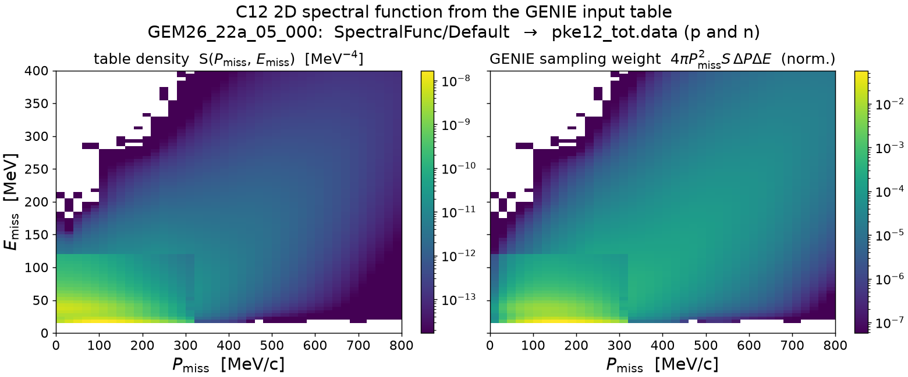
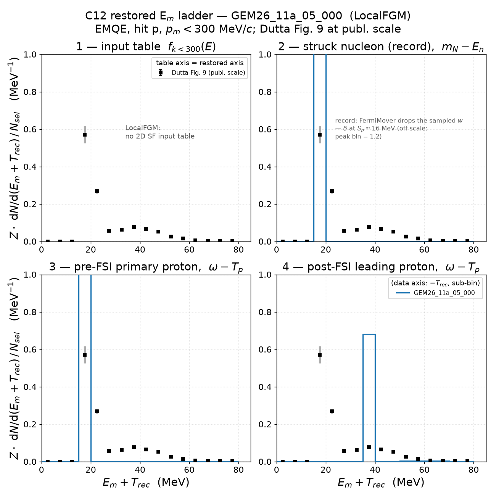
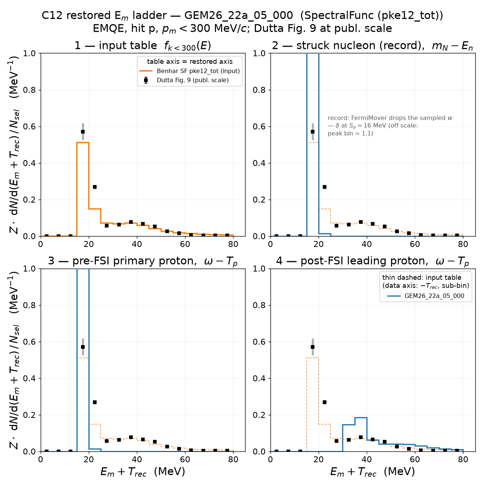
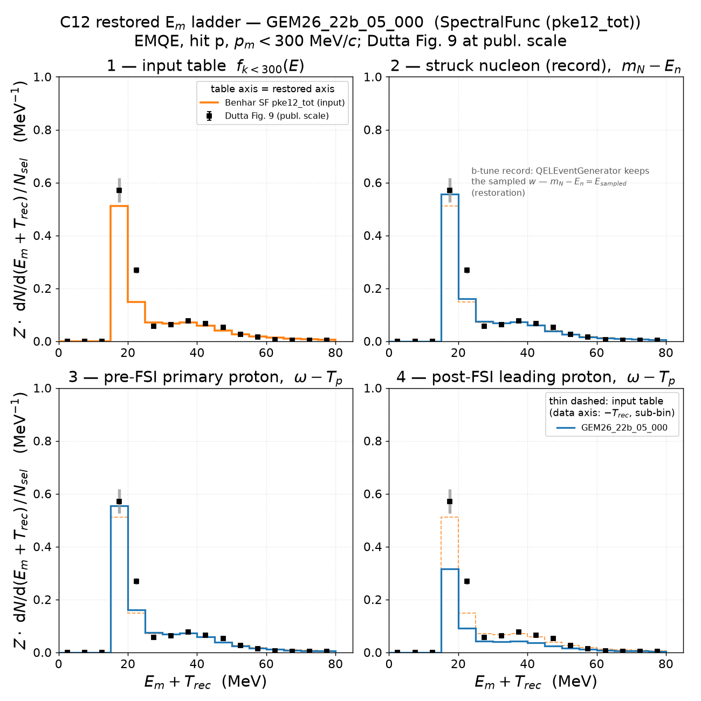
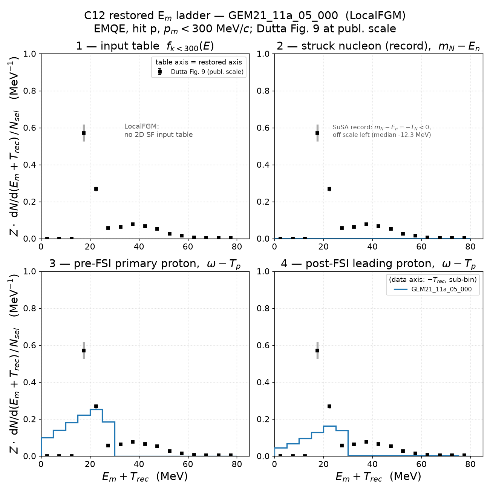
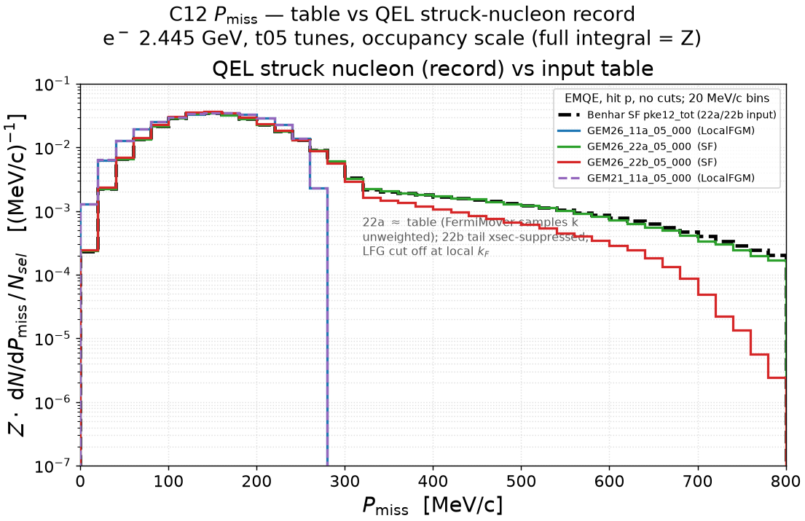
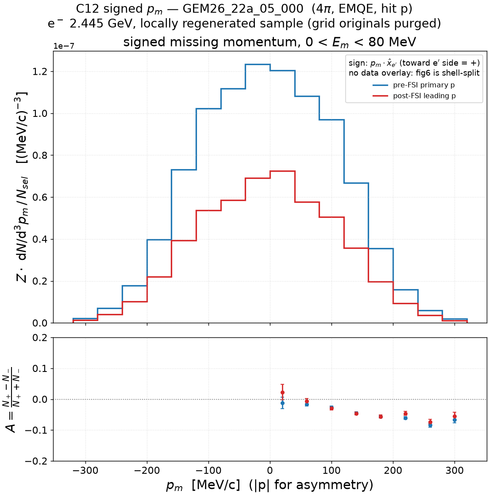

# Electron–C12 scattering

C12 sibling of [`electron_fe56_scattering.md`](electron_fe56_scattering.md), same
plot series and tune set. **Provenance difference**: the C12 grid samples
(2026-06-11, genlist **EMQE**, e⁻ 2.445 GeV, t05 generation cut) have been
purged from scratch dCache (verified 2026-07-17: all four `pnfs_output_dir`s
empty), so the event-level sections read the surviving
`cache/ladder/<model>.npz` caches built by `results/prd-analyzer-v0/`
`build_cache_ladder.py` from 2M events/model before the purge. Cache key →
tune: LFG = GEM26_11a_05_000, SF = GEM26_22a_05_000, UnifiedQEL =
GEM26_22b_05_000, SuSAv2 = GEM21_11a_05_000 (`samples.py`; the fifth key
UnifiedQEL2024 = GEM26_33b_05_000 is outside this four-tune series).

## C12 2D spectral function — the GENIE input table

`pke12_tot.data` resolved exactly as at run time (`GEM26_22a` →
`NuclearModel@Pdg=1000060120` = `genie::SpectralFunc/Default` →
`SpectFuncTable@Pdg=1000060120_{2212,2112}`; one table shared by p and n).
Raw 4πk² integral = **6.000 = Z**: proton-number normalized, same convention
as the Fe56 table. Sampled tails: **P(P_miss > 250 MeV/c) = 0.146**,
**P(E_miss > 100 MeV) = 0.077**.

Grid: 40 P_miss bins [0, 800] MeV/c × 80 E_miss bins **[0, 400] MeV** — note
the C12 E grid has edges at multiples of 5 MeV (centers 2.5, 7.5, …), i.e. it
is **aligned** with the Dutta/plot grid, unlike Fe56's half-bin-offset grid
(edges 2.5, 7.5, …). GEM26_22b resolves to the identical table; GEM26_11a and
GEM21_11a use LocalFGM (no table).

Regenerate: `pixi run python results/template/make_sf2d_table.py --all-tunes --target C12`

## Missing energy: table vs simulation vs Dutta Fig. 9

The four-stage **restored ladder** (input-table axis E_m + T_rec; record =
m_N − E_n, protons = ω − T_p, remnant **B11**; selection `hitnuc==2212` — the
EMQE genlist makes every event QEL, so no explicit `qel` cut is needed),
p_m < 300 MeV/c, occupancy normalization Z·hist/(N_sel·5 MeV) with **Z = 6**.
S_p(C12 → B11 + p) = 15.96 MeV (masses from the install `genie_pdg_table.txt`).
Data: `fig9_q1p2.dat` at its published scale — integral **6.080 ≈ Z** (unlike
Fe56's 18.2 ≠ 26, the C12 normalization identity holds), with the v0
`fig9_common` error model (2% pt-to-pt ⊕ 5% model, pixel-measured p-shell
bars). The hit-proton fraction is ~69.8% of EMQE events (EM couples more
strongly to protons than the naive Z/A = 50%).

Summary (occupancy units, E < 80 MeV, p_s < 300 MeV/c; N of 2M events):

| tune | N_hitp | I1 (table) | I2r = I3r | I4r | I4r/I3r | record median [p5, p95] MeV |
|---|---|---|---|---|---|---|
| GEM26_11a_05_000 | 1,395,232 | — | 6.000 | 3.517 | 0.586 | 17.09 [16.09, 18.80] |
| GEM26_22a_05_000 | 1,395,134 | 5.249 | 5.439 | 2.965 | 0.545 | 17.15 [16.17, 19.34] |
| GEM26_22b_05_000 | 1,373,273 | 5.249 | 5.538 | 3.218 | 0.581 | 20.37 [15.51, 61.58] |
| GEM21_11a_05_000 | 1,391,608 | — | 0.000 / 5.413 | 3.258 | 0.602 | −12.28 [−30.54, −1.48] |

Same structure as Fe56 — I2r = I3r everywhere (energy-conserving chain;
GEM21's I2r = 0 is in-window only, its record is entirely below E = 0) — with
one clean nuclear-size difference: **FSI in-window survival is 0.55–0.60 on
C12 vs 0.38–0.41 on Fe56** (transparency ordering).
Regenerate: `pixi run python results/template/make_emiss_ladder_c12.py --all-tunes`

### GEM26_11a_05_000 — LocalFGM + Rosenbluth

| piece | algorithm |
|---|---|
| C12 ground state | `genie::LocalFGM/Default` (no 2D SF table) |
| QEL-EM cross section | `genie::RosenbluthPXSec/Default` |
| QEL-EM event chain | install default: `FermiMover/Default` → `genie::QELKinematicsGenerator/EM-Default` |

Record δ at 17.1 MeV (S_p + the B11-recoil spread); all 6 protons in-window
(I2r = 6.000). The δ misses the data's two-component structure entirely; FSI
smears it into the tail but cannot create the s-shell bump.

### GEM26_22a_05_000 — 2D SpectralFunc + Rosenbluth (FermiMover chain)

| piece | algorithm |
|---|---|
| C12 ground state | `genie::SpectralFunc/Default` → `pke12_tot.data` |
| QEL-EM cross section | `genie::RosenbluthPXSec/Default` |
| QEL-EM event chain | install default: `FermiMover/Default` → `genie::QELKinematicsGenerator/EM-Default` |

The a-tune finding on C12: the 2D SF is sampled (I1 = 5.249 in-window; the
rest is the k > 300 SRC tail) but FermiMover drops the sampled w — the record
is a δ at 17.2 MeV, not the table. The sampled physics survives only in
`GHepParticle::RemovalEnergy`.

### GEM26_22b_05_000 — 2D SpectralFunc + UnifiedQEL (QELEventGenerator)

| piece | algorithm |
|---|---|
| C12 ground state | `genie::SpectralFunc/Default` → `pke12_tot.data` |
| QEL-EM cross section | `genie::UnifiedQELPXSec/Dipole` |
| QEL-EM event chain | tune override: `genie::QELEventGenerator/EM-Default` (SF-consistent) |

The b-tune restoration on C12 (record median 20.4 MeV, p5–p95 [15.5, 61.6]):
`QELEventGenerator` keeps the sampled w, and the record reproduces the
table's **shell structure** — the p₃/₂ peak at [15,20) and the s-shell bump
at 30–50 MeV — landing on the data's p-shell peak (with the grids aligned,
no half-bin correction is involved here, unlike Fe56). FSI (panel 4) scales
the strength down (I4r/I3r = 0.581) while roughly preserving the shape.

### GEM21_11a_05_000 — LocalFGM + SuSAv2

| piece | algorithm |
|---|---|
| C12 ground state | `genie::LocalFGM/Default` (no 2D SF table) |
| QEL-EM cross section | `genie::HybridXSecAlgorithm/SuSAv2-QEL` (genuine C12 EM tensor — no surrogate caveat here, unlike Fe56) |
| QEL-EM event chain | tune override: `genie::QELEventGeneratorSuSA/Default` |

The SuSA record is entirely below the axis (m_N − E_n = −T_N < 0, median
−12.3 MeV; I2r = 0 in-window). Note that on C12 the SuSAv2 EM tensor is the
genuine calculation — the scaled-C12 surrogate caveat applies only to the
Fe56 note.

## Missing momentum: table vs QEL struck-nucleon record

Same construction as the Fe56 section (table-native 20 MeV/c grid, occupancy
scale, every curve integrates to Z = 6):

| tune | median |p_n| [MeV/c] | P(p > 250 MeV/c) |
|---|---|---|
| table (sampling weight) | — | 0.146 |
| GEM26_11a_05_000 (LFG) | 152.3 | 0.027 |
| GEM26_22a_05_000 (SF) | 165.1 | 0.166 |
| GEM26_22b_05_000 (SF) | 159.8 | 0.124 |
| GEM21_11a_05_000 (LFG) | 152.3 | 0.026 |

The Fe56 pattern repeats: 22a ≈ table (FermiMover samples k unweighted; mild
Q²-window tail enhancement 0.166 vs 0.146), 22b's SRC tail is
xsec-suppressed, and the two LFG tunes coincide with the local-k_F cutoff.
Regenerate: `pixi run python results/template/make_pmiss_c12.py`

## Signed missing momentum (± asymmetry) — GEM26_22a_05_000

The ladder caches lack the per-event vectors and the grid gst files are
purged, so this section runs on a **locally regenerated** sample with the
patched genie_inclxx install: local EMQE spline
`gmkspl-eminus_C12_20260717-104034-615-fab13a` (2 QE splines, 36 s) +
`gevgen-eminus_C12_20260717-104229-e7e-894744` (500k events, seed 20260717,
671 s; 349k hit-proton). Same sign convention and construction as the Fe56
section (sign of p_m·x̂, density with 4πp² divided out, B11 recoil,
0 < E_m < 80 MeV); no data overlay — the digitized fig6 momentum
distributions are shell-split (10–25 / 30–50 MeV) and symmetrized, so no
0–80 MeV signed reference exists.

Findings — the Fe56 story repeats on carbon:

- Integrated **A = −0.0483 ± 0.0018 (pre-FSI), −0.0447 ± 0.0024 (post-FSI)**;
  sign-shuffle controls ≤ 0.003. A(|p|) grows from ~0 at 20 MeV/c to ≈ −8%
  at 260–300 MeV/c — same sign and trend as Fe56 (−5.5%), slightly smaller.
- The asymmetry is again **kinematic** (pre-FSI p_m ≡ p_n; flux/Q²-window
  weighting favors nucleons moving away from the e′ side) and **FSI-blind**
  within errors. In-window survival 176k/320k = 0.549, consistent with the
  ladder's I4r/I3r = 0.545.

Regenerate: local spline+gevgen as above, `run_gntpc -f gst`, then
`pixi run python results/template/make_pmiss_signed_c12.py --gst <file>`.
