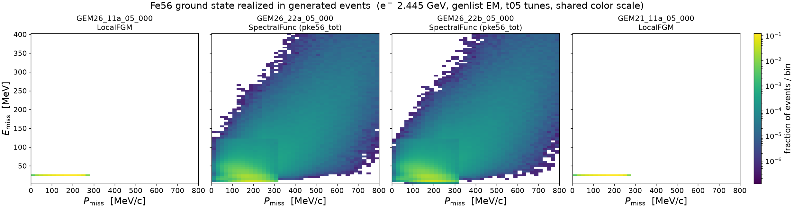
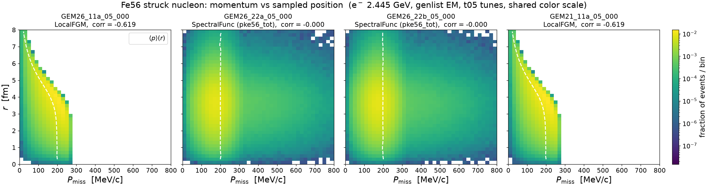
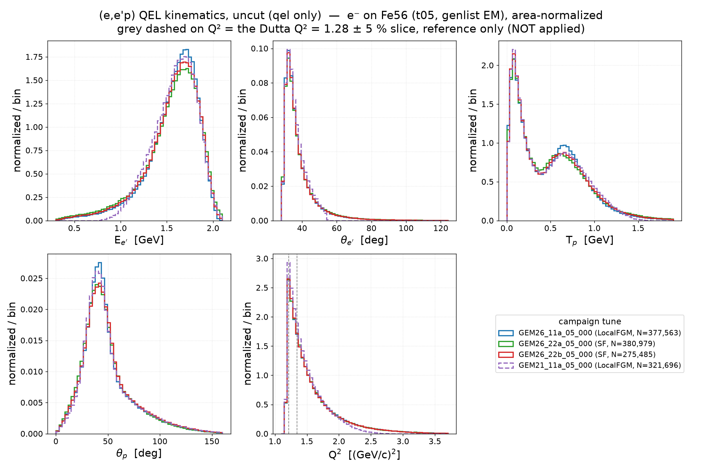
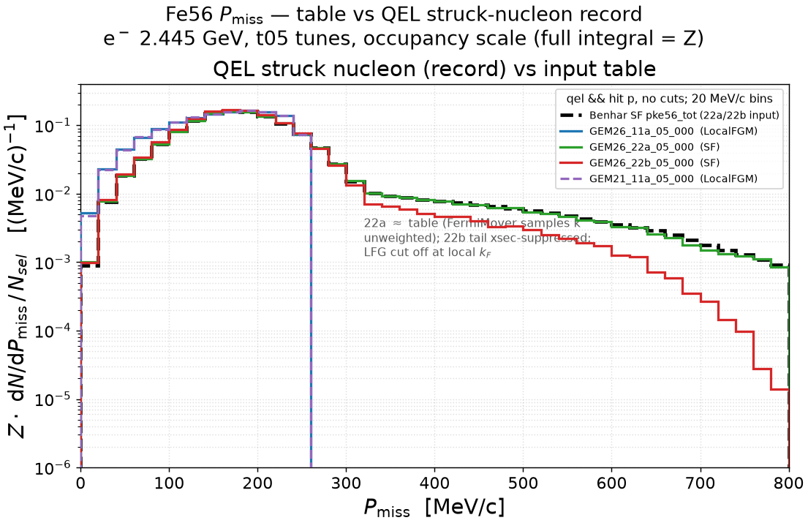
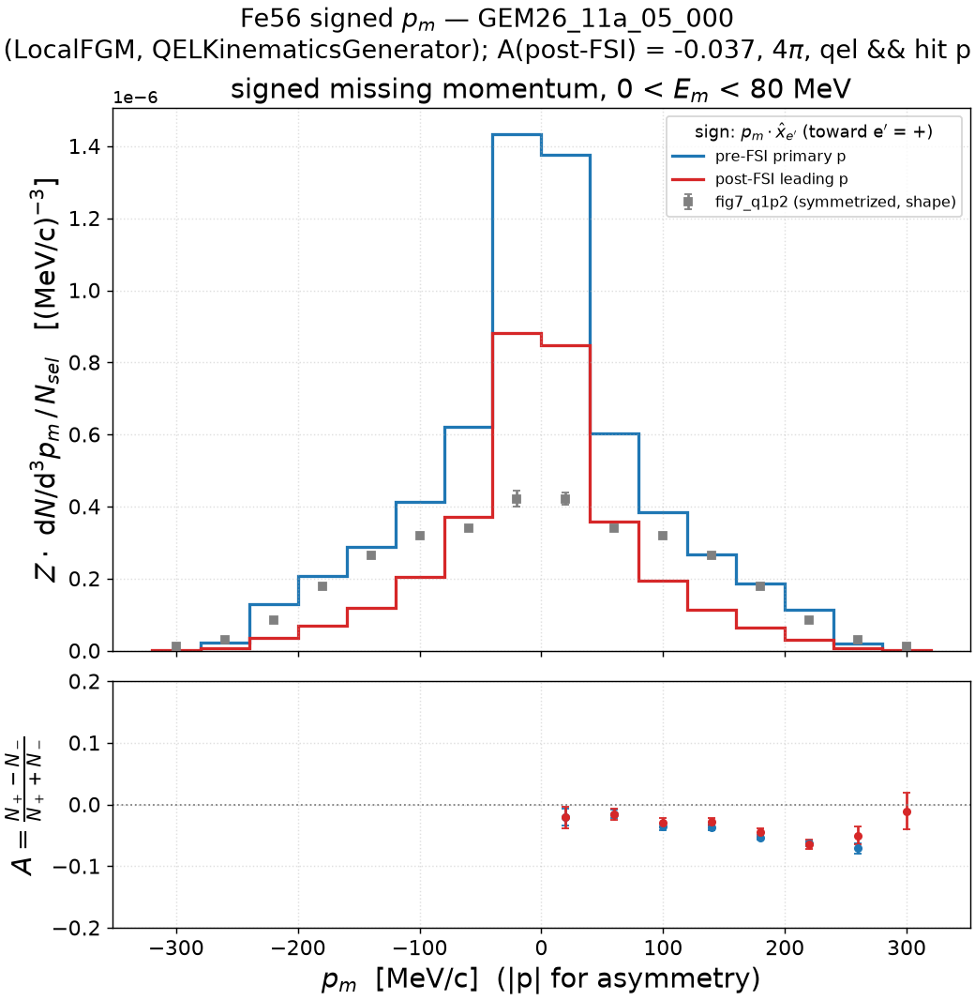
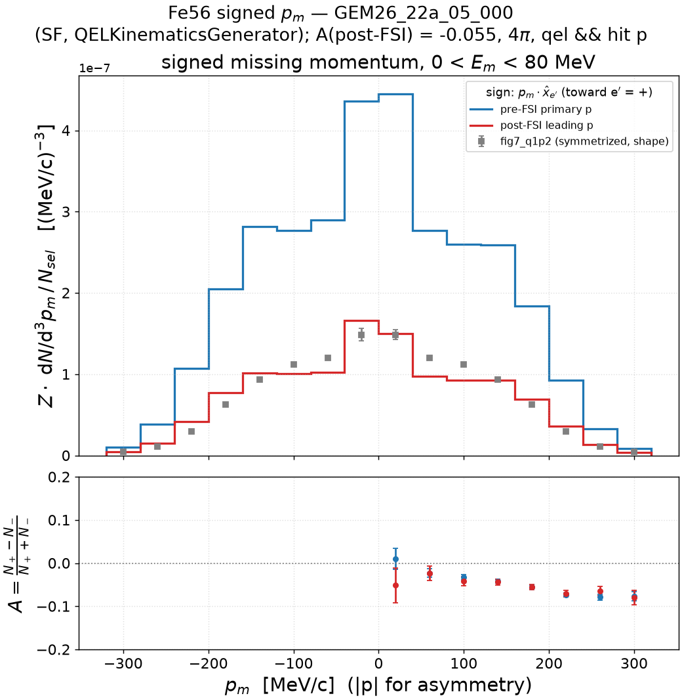
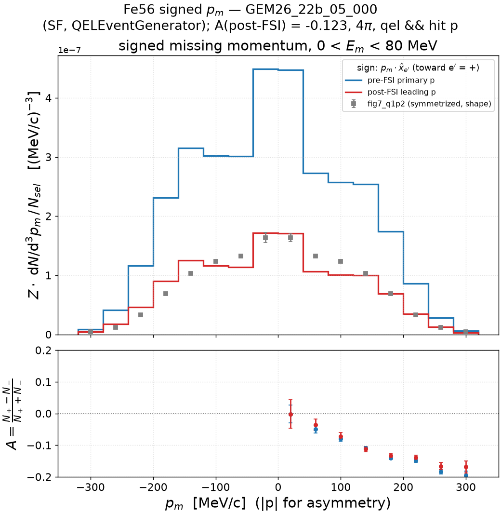
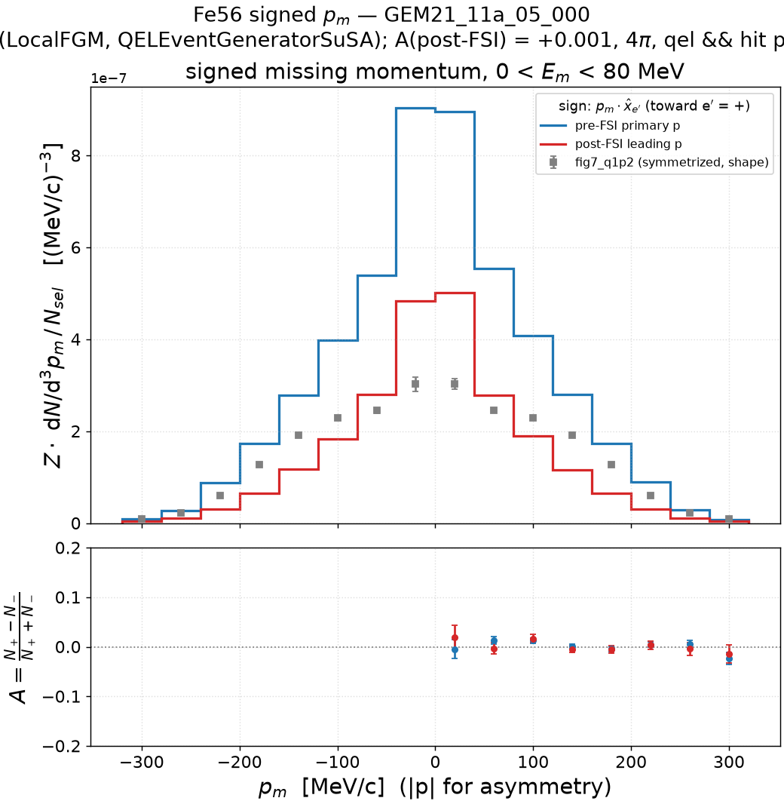

# Electron–Fe56 scattering

## 1. Fe56 2D spectral function — the GENIE input table

The Benhar 2D spectral function S(P_miss, E_miss) exactly as GENIE consumes it,
resolved the way the tune resolves it at run time: `GEM26_22a_05_000` →
`ModelConfiguration.xml` `NuclearModel@Pdg=1000260560` = `genie::SpectralFunc/Default`
→ `SpectralFunc.xml` `SpectFuncTable@Pdg=1000260560_{2212,2112}` = `pke56_tot.data`
(one table shared by protons and neutrons; GENIE divides out the tabulated
N-nucleon normalization per hit species).

- **Left** — the table density as stored (MeV⁻⁴): mean-field shell region at
  P_miss ≲ 250 MeV/c, E_miss ≲ 60 MeV, plus the correlated (SRC) continuum.
  The rectangular edge at E_miss ≈ 125 MeV / P_miss ≈ 320 MeV is the seam where
  the table stitches the mean-field and correlation pieces.
- **Right** — the distribution GENIE actually samples (`TH2::GetRandom2` over the
  per-bin mass 4π P²_miss S ΔP ΔE, area-normalized). The P² weight moves real
  probability into the tails: **P(P_miss > 250 MeV/c) = 0.158**,
  **P(E_miss > 100 MeV) = 0.080**. This tail is what collapsed the RES-EM Q²
  window under the t05 cut (`EM-MinQ2Limit = 1.18 GeV²`) before the
  `RESKinematicsGenerator` guard (see
  `../../.claude/plans/fix-res-em-q2window-assert.md`).

Grid: 40 P_miss bins [0, 800] MeV/c × 80 E_miss bins [2.5, 402.5] MeV
(bin centers tabulated; parsed exactly as `SpectralFunc::LoadSFDataFile`).
GEM26_22b_05_000 resolves to the identical table; GEM26_11a / GEM21_11a use
LocalFGM (no table). Event-level realization: section 2.

Regenerate: `pixi run python results/template/make_sf2d_table.py --all-tunes`

## 2. Struck nucleon in the record: sampled (P_miss, E_rm) and (P_miss, r)

Two event-level 2D companions to the section-1 table: what the generated
records actually carry for the struck nucleon — momentum vs **sampled removal
energy**, and momentum vs **in-nucleus position**. Sample: the ghep siblings of
the ladder's gst streams (section 4; 20 files = 2M events/tune, 2026-07-16 grid
campaigns), all single-nucleon events (~1.91M/tune — MEC's 2-nucleon cluster
carries no single hit nucleon), both species, no other cuts. gst carries
neither quantity — the sampled w lives only in `GHepParticle::RemovalEnergy`
and the position only in the hit nucleon's `X4()` — so a compiled GHEP dumper
(`results/template/dump_hitnuc.cxx`, build recipe in-file, reads the grid files
over XRootD) writes per-event CSVs `pdg,px,py,pz,E,w,scat,r` that both plots
read.

**Momentum vs removal energy** (`sf2d_events_fe56_<tune>.png` per tune, shared
color scale above): the SF tunes realize the full table — mean-field blob, SRC
continuum, and the rectangular mean-field/correlation seam of section 1 —
with realized tail weights P(p > 250 MeV/c) = 0.150/0.143 and
P(E > 100 MeV) = 0.074/0.068 (22a/22b) vs the table's sampling weights
0.158/0.080; the residual difference is per-process kinematic acceptance (the
QEL-only selection of section 5 pulls 22a the *other* way, to 0.185). The LFG
tunes collapse onto a band at the near-fixed LFG removal energy (median
w = 23.0 MeV in both) with the sharp k_F cutoff at ≈ 270 MeV/c. **GEM21
caveat**: its QEL events (17% of the single-nucleon sample, scat = 1) store
w = 0 exactly — `QELEventGeneratorSuSA` applies its binding prescription
internally and never fills `RemovalEnergy` — so on this axis the GEM21 panel
is RES/DIS-only (in-grid 1.585M of 1.907M; the 11a band, by contrast, includes
QEL via FermiMover).

**Momentum vs position** (`struck_pr_fe56_<tune>.png` per tune; white dashed =
per-radius profile ⟨p⟩(r)): r is sampled once per event by `VertexGenerator`
(Module-1 of every generator thread) from r²ρ(r) — identical ⟨r⟩ = 3.6 fm in
all four tunes — and every chain then hands r = |X4| to the nuclear model
(`FermiMover.cxx:124`, `QELEventGenerator.cxx:158`,
`QELEventGeneratorSuSA.cxx:437`). Whether the radius *does* anything is purely
a nuclear-model property:

| tune | ground state | corr(p, r) | P(p > 250 MeV/c) |
|---|---|---|---|
| GEM26_11a_05_000 | LocalFGM | −0.619 | 0.009 |
| GEM26_22a_05_000 | 2D SF | −0.000 | 0.150 |
| GEM26_22b_05_000 | 2D SF | −0.000 | 0.143 |
| GEM21_11a_05_000 | LocalFGM | −0.619 | 0.010 |

- **LFG tunes: the k_F(r) envelope survives into the record.** The wedge with
  its falling ⟨p⟩(r) (corr = −0.619, identical to 3 decimals in 11a and GEM21):
  `LocalFGM::ProbDistro(target, r)` builds the momentum distribution from the
  local density at the vertex, so high-p nucleons start preferentially central
  — the longest FSI paths for exactly the events nearest the Fermi surface.
- **SF tunes: exactly factorized** (corr = −0.000, flat profile).
  `SpectralFunc` implements only `GenerateNucleon(target)`; the radius the
  chain passes is dropped by the `NuclearModelI` base overload. The sampled
  (p, E) — SRC tail included — is statistically independent of the starting
  radius: a 600 MeV/c SRC nucleon draws the same r distribution as a
  shell-model one, worth keeping in mind when reading the FSI in-window
  survival of section 4.

Regenerate: build `dump_hitnuc` (recipe in `results/template/dump_hitnuc.cxx`),
dump the same 20-file lists to `cache/hitnuc_fe56/<tune>.csv`, then
`pixi run python results/template/make_sf2d_events.py --dump-dir results/prd-analyzer-v0.1/cache/hitnuc_fe56 --all-tunes`
and the same for `make_struck_pr.py` (both default to `--target Fe56`; the C12
note's section 2 runs the same scripts with `--target C12`).

## 3. QEL kinematics — E_e′, θ_e′, T_p, θ_p, Q²

v0 README §6 descendant on the campaign sample (same 20-file gst streams as
the ladder, section 4): the five kinematic variables **uncut** — the only
selection is `qel` (EMQE-equivalent on the full-EM sample; RES/DIS/MEC
dropped). No Q² window is applied: the grey dashed lines on the Q² panel mark
the Dutta Q² = 1.28 ± 5 % slice as **reference only**, and the hard lower edge
at 1.18 GeV² is the t05 generation cut. Leading proton = highest-momentum
final-state proton; T_p/θ_p panels implicitly drop no-proton events. Panel
ranges are pooled p0.2–p99.8. Area-normalized above; raw-counts companion
`kin_qel_fe56_counts.png` (equal ntot = 2M/tune).

| tune | N (qel, of 2M) | has_p |
|---|---|---|
| GEM26_11a_05_000 | 377,563 (18.9 %) | 80.3 % |
| GEM26_22a_05_000 | 380,979 (19.0 %) | 79.3 % |
| GEM26_22b_05_000 | 275,485 (13.8 %) | 82.4 % |
| GEM21_11a_05_000 | 321,696 (16.1 %) | 81.8 % |

Read: Q² falls steeply from the 1.18 generation edge — the Dutta slice sits
right at its peak. E_e′ peaks at ≈1.7 GeV with a long low-E_e′ (high-ω) tail
and θ_e′ at ≈32° with a fall-off to backward angles; **GEM21 is the outlier
in coverage**, with essentially no E_e′ < 0.9 GeV tail and the shortest Q²
tail (gone by ≈2.6 GeV²) — the kinematic reach of the SuSAv2 tensor tables.
**T_p is double-peaked and on iron the low-T_p (≈0.1 GeV) FSI-rescattered
population *dominates* the QE bump at ≈0.65 GeV** — the kinematic face of the
ladder's ~0.40 in-window survival (section 4); θ_p peaks at the ≈42°
conjugate angle with a long tail. 22b's lower N (275k vs ~380k) is the
smaller SF-folded UnifiedQEL cross section (QEL fraction 9.3 % in section 4).
The electron arm is otherwise nearly tune-degenerate — the discrimination
lives in the proton arm and in E_m/p_m (sections 4–6).

Figures regenerated 2026-07-26 with the **has-proton fix**: the T_p/θ_p
panels previously included the event's index-0 particle (usually the
final-state neutron) for the ~20 % no-proton events — `selection.py`'s
unguarded leading-proton argmax. Electron-arm panels and the table are
unaffected.

Regenerate: `pixi run python results/template/make_kin_qel.py --target Fe56`
(cache: `cache/kin_qel_fe56/`; delete to re-stream).

## 4. Missing energy: table vs simulation vs Dutta Fig. 11

The C12 four-stage **restored ladder** (v0 README §12) replicated on Fe56 for
each campaign tune, at the digitized data's kinematics (Q² = 1.28 (GeV/c)²,
beam 2.445 GeV): all stages on the input-table axis E_m + T_rec (record =
m_N − E_n, protons = ω − T_p, remnant Mn55 from the install's PDG table),
selection `qel && hitnuc==2212` (explicit here; implicit in the EMQE C12
samples), p_m < 300 MeV/c, occupancy normalization Z·hist/(N_sel·5 MeV) with
Z = 26. Each tune: 2M streamed events (20 gst files). Common to all four:
FSI = hA2018, `EM-MinQ2Limit = 1.18` GeV² (t05). The `pke56_tot.data` table
integrates raw to 25.998 ≈ Z — proton-number normalized, the same convention
as the C12 tables.

Data caveats (as in the C12 study): Dutta's published E_m is recoil-subtracted,
so on this axis the points sit low by an event-wise T_rec ≤ ~4.5 MeV (sub-bin);
the fig11 absolute scale is renormalized to the in-window IPSM strength
(∫ = 18.20 ± 0.08, not Z = 26 and not a raw distorted yield); file errors are
statistical only (inflated by 2% pt-to-pt ⊕ 5% model here).

Summary (occupancy units, E < 80 MeV, p_s < 300 MeV/c):

| tune | N_sel (of 2M) | I1 (table) | I2r = I3r | I4r | I4r/I3r | record median [p5, p95] MeV |
|---|---|---|---|---|---|---|
| GEM26_11a_05_000 | 251,502 (12.6%) | — | 26.000 | 10.327 | 0.397 | 10.45 [10.22, 10.75] |
| GEM26_22a_05_000 | 254,047 (12.7%) | 22.630 | 23.423 | 8.807 | 0.376 | 10.48 [10.24, 10.88] |
| GEM26_22b_05_000 | 186,694 (9.3%) | 22.630 | 23.976 | 9.621 | 0.401 | 20.47 [8.32, 59.29] |
| GEM21_11a_05_000 | 213,209 (10.7%) | — | 0.000 / 24.448 | 10.037 | 0.411 | −14.38 [−30.52, −1.78] |

I2r = I3r in every tune (energy-conserving pre-FSI chain; GEM21's I2r = 0 is
an in-window statement — its record sits entirely below E = 0). FSI keeps only
~40% of strength in-window everywhere, while a post-FSI proton exists in
**94.2–97.4 %** of events (the remainder lose the proton to absorption or
p → n charge exchange): most strength leaves the window, not the event.
(Stage-4 numbers re-derived 2026-07-26 with the **has-proton fix** — the
unguarded `argmax(where(is_p, pf, −1))` idiom had promoted a non-proton to
"leading proton" in no-proton events, ~3–6 % here, inflating I4r by ≤ 0.03;
22b/GEM21 unchanged. Chain-resolved survivor analysis: v0.2 sections 4–5.)
Data integral 18.200 on its own published scale. Regenerate:
`pixi run python results/template/make_emiss_ladder_fe56.py --all-tunes`
(cache: `cache/ladder_fe56/`; delete to re-stream).

### 4.1 GEM26_11a_05_000 — LocalFGM + Rosenbluth

| piece | algorithm |
|---|---|
| Fe56 ground state | `genie::LocalFGM/Default` (no 2D SF table) |
| QEL-EM cross section | `genie::RosenbluthPXSec/Default` |
| QEL-EM event chain | install default: `FermiMover/Default` → `genie::QELKinematicsGenerator/EM-Default` |

Panel 1 has no input-table curve (LFG). The record is a δ at S_p (median
10.45 MeV) — with LFG this loses little: the LFG removal energy is itself
essentially fixed. All 26 protons are in-window (I2r = 26.000: LFG momenta
never exceed 300 MeV/c). The pre-FSI proton reproduces the δ; FSI smears it
into a shape that tracks the data tail but, as everywhere, misses the
12.5 MeV peak from below.

### 4.2 GEM26_22a_05_000 — 2D SpectralFunc + Rosenbluth (FermiMover chain)

| piece | algorithm |
|---|---|
| Fe56 ground state | `genie::SpectralFunc/Default` → `pke56_tot.data` (`NuclearModel@Pdg=1000260560`) |
| QEL-EM cross section | `genie::RosenbluthPXSec/Default` |
| QEL-EM event chain | install default: `FermiMover/Default` → `genie::QELKinematicsGenerator/EM-Default` |

The Fe56 instance of the C12 **a-tune finding**: the tune samples the 2D SF
(panel 1, I1 = 22.630 of 26 in-window — the rest is the k > 300 MeV/c SRC
tail), but FermiMover writes `En = M_A − √(p² + M²_Mn55,gs)` into the record,
dropping the sampled w — panel 2 is a δ at S_p ([10,15) bin = 4.7, off scale;
the sampled physics survives only in `GHepParticle::RemovalEnergy`, section 1).
I2r = I3r = 23.423; FSI in-window survival 0.376 with the post-FSI shape
tracking the data above ~20 MeV.

### 4.3 GEM26_22b_05_000 — 2D SpectralFunc + UnifiedQEL (QELEventGenerator)

| piece | algorithm |
|---|---|
| Fe56 ground state | `genie::SpectralFunc/Default` → `pke56_tot.data` |
| QEL-EM cross section | `genie::UnifiedQELPXSec/Dipole` |
| QEL-EM event chain | tune override: `genie::QELEventGenerator/EM-Default` (samples the nucleon from the nuclear model — SF-consistent) |

The **b-tune contrast**: `QELEventGenerator` keeps the sampled w in the
off-shell energy, and the restoration is **exact**: per-event,
m_N − E_n = E_sampled to keV precision (verified from the GHEP dumps —
(m_N − E_n) − w_stored reproduces k²/2(M_Mn55+E) to <1.5 keV, i.e. the
`BindHitNucleon` SpectralFunc reinterpretation lowers only the *stored*
RemovalEnergy by ≤0.9 MeV and cancels identically on this axis; on the
table-native grid the record has zero strength below the table's support).
The record (median 20.5 MeV, p5–p95 [8.3, 59.3]) sits on the dashed table,
with the residual shape difference — peak 1.03 vs 0.94 — coming from the
UnifiedQEL cross-section weighting of the sampled kinematics. An earlier
version of this note attributed an apparent down-shift to `BindHitNucleon`:
that was a half-bin rebinning artifact (the table grid is centered at
5, 10, … MeV, offset by 2.5 MeV from the plot grid, and `GetRandom2` samples
uniformly within table bins), fixed by spreading each table column over its
native bin in the stage-1 rebin. Of the four tunes this record is the
closest in shape to the data. QEL fraction is 9.3% vs 22a's 12.7%,
consistent with the SF-folded UnifiedQEL cross section being smaller than
Rosenbluth (spline QE σ 1.85 vs 2.75 ×10⁻⁴).

### 4.4 GEM21_11a_05_000 — LocalFGM + SuSAv2 (scaled-C12 surrogate)

| piece | algorithm |
|---|---|
| Fe56 ground state | `genie::LocalFGM/Default` (no 2D SF table) |
| QEL-EM cross section | `genie::HybridXSecAlgorithm/SuSAv2-QEL` — **Fe56 EM tensor is scaled C12** (open_questions.md) |
| QEL-EM event chain | tune override: `genie::QELEventGeneratorSuSA/Default` |

The SuSA chain writes an on-shell-like nucleon: m_N − E_n = −T_N < 0, so the
record sits entirely **below the axis** (median −14.4 MeV; I2r = 0 in-window)
— the Fe56 instance of the C12 SuSAv2 note. The pre-FSI proton lands as a
box-like distribution up to ~35 MeV (LFG kinematics through SuSA's own
binding prescription), and FSI degrades it further. The scaled-C12 surrogate
caveat applies to any physics conclusion drawn from this tune on iron.

## 5. Missing momentum: table vs QEL struck-nucleon record

The momentum companion of the E_m ladder: unlike the removal energy, the
struck-nucleon 3-momentum survives into the record for every tune, so the
record |p_n| distribution (same caches/selection: `qel && hitnuc==2212`, no
other cuts) is meaningful for all four. Both curves on the table's **native**
20 MeV/c grid (no rebinning — the E_miss half-bin lesson), occupancy scale
(every curve integrates to Z = 26 by construction).

| tune | median |p_n| [MeV/c] | P(p > 250 MeV/c) |
|---|---|---|
| table (sampling weight) | — | 0.158 |
| GEM26_11a_05_000 (LFG) | 165.0 | 0.017 |
| GEM26_22a_05_000 (SF) | 183.6 | 0.185 |
| GEM26_22b_05_000 (SF) | 178.6 | 0.142 |
| GEM21_11a_05_000 (LFG) | 164.9 | 0.017 |

Reading:

- **22a ≈ table over four decades**: the classic FermiMover chain samples k
  *unweighted* from the SF, so the record momentum distribution is essentially
  the table itself. The residual tail enhancement (P(p>250) = 0.185 vs the
  table's 0.158) is the Q² ≥ 1.18 phase-space retry mildly favoring high-k
  configurations.
- **22b follows at low k but its SRC tail is progressively suppressed** (about
  two decades down by 800 MeV/c): `QELEventGenerator` weights the sampled
  kinematics by the UnifiedQEL cross section, which disfavors deep off-shell
  high-k configurations.
- **11a and GEM21 coincide** (both LocalFGM): the LFG shape with the sharp
  cutoff at the local Fermi momentum ≈ 260 MeV/c and no SRC tail —
  P(p > 250) = 1.7% vs 14–19% for the SF tunes.

Regenerate: `pixi run python results/template/make_pmiss_fe56.py`
(reads the `cache/ladder_fe56/` caches).

## 6. Signed missing momentum (± asymmetry)

The published Figs. 6–8 momentum distributions carry a left–right (±p_m)
asymmetry the paper attributes to W_LT interference beyond deForest σ_cc1
and/or Coulomb distortion (tex 1144–1155). The digitized `fig7_*.dat` files
are exactly symmetrized, so this is simulation-side only (4π, no spectrometer
acceptance; `qel && hitnuc==2212`, Dutta window 0 < E_m < 80 MeV, 2M streamed
events/tune), one figure per tune.

**Sign convention** (the paper never states its own): ẑ = q̂, x̂ = the
scattered electron's transverse-to-q direction (in-plane, e′ side);
signed p_m = sign(p_m·x̂)·|p_m| with p_m = p_p′ − q. Positive = p_m tilted
toward the e′ side. If the print's asymmetry turns out mirrored, flip.
**Units**: the top panel is a *density* (raw counts with the 4π p² phase-space
factor divided out, per d³p_m) — the fig7 y-axis peaks at p_m = 0, raw counts
dip there.

**Headline: the ± asymmetry is a diagnostic of the QEL kinematics generator,
not a physical response.** None of the four chains contains a W_LT term, yet
the integrated asymmetry spans −0.13 to 0 depending purely on which generator
samples the proton angle:

| tune | ground state | QEL kinematics generator | A pre-FSI | A post-FSI |
|---|---|---|---|---|
| GEM26_11a_05_000 | LFG | `QELKinematicsGenerator` | −0.0466 ± 0.0020 | −0.0367 ± 0.0031 |
| GEM26_22a_05_000 | SF | `QELKinematicsGenerator` | −0.0546 ± 0.0021 | −0.0554 ± 0.0033 |
| GEM26_22b_05_000 | SF | `QELEventGenerator` | **−0.1283 ± 0.0024** | **−0.1227 ± 0.0037** |
| GEM21_11a_05_000 | LFG | `QELEventGeneratorSuSA` | **+0.0028 ± 0.0022** | **+0.0008 ± 0.0035** |

Since the pre-FSI p_m ≡ p_n exactly, this is a **kinematic** asymmetry (the
flux/Q²-window acceptance couples to the sampled proton direction), and **FSI
barely touches it** (pre→post shifts ≤ 0.01 everywhere). The generator, not
the ground state or QE cross section, sets it: the two `QELKinematicsGenerator`
tunes agree at ≈ −0.05 across LFG and SF; `QELEventGenerator` more than doubles
it; the SuSA generator samples symmetrically and gives zero. Whatever the true
W_LT/Coulomb asymmetry of the data is, it would sit *on top of* this
generator artifact — so the signed p_m is not yet a clean model discriminator.

### 6.1 GEM26_11a_05_000 — LocalFGM, QELKinematicsGenerator

A = −0.047 (pre) → −0.037 (post): the classic FermiMover +
`QELKinematicsGenerator` chain on a Fermi-gas ground state. A(|p|) grows to
≈ −7% at 300 MeV/c; FSI slightly *reduces* the magnitude.

### 6.2 GEM26_22a_05_000 — 2D SpectralFunc, QELKinematicsGenerator

A = −0.055, essentially unchanged by FSI. Same generator as 11a on the 2D SF
ground state — the near-identical asymmetry (−0.047 vs −0.055) shows the
ground-state model is a minor lever compared to the generator. The post-FSI
density tracks the symmetrized fig7 shape closely.

### 6.3 GEM26_22b_05_000 — 2D SpectralFunc, QELEventGenerator

A = **−0.128** (pre) → −0.123 (post) — the largest, more than double the
`QELKinematicsGenerator` tunes on the *same* SF ground state, and A(|p|)
reaches ≈ −0.19 at 300 MeV/c. The modern `QELEventGenerator` samples the full
struck-nucleon kinematics from the nuclear model plus the UnifiedQEL off-shell
cross section, which imprints a much stronger direction–acceptance
correlation. This is the tune where the signed p_m most departs from the
others.

### 6.4 GEM21_11a_05_000 — LocalFGM, QELEventGeneratorSuSA

A = **+0.003 ± 0.002 (pre), +0.001 ± 0.004 (post)** — consistent with **zero**.
`QELEventGeneratorSuSA` samples the proton azimuth symmetrically about q, so
the SuSA chain produces no intrinsic ± asymmetry at all — the opposite extreme
from 22b. (Reminder: Fe56 EM SuSAv2 is a scaled-C12 surrogate.)

(2026-07-26: caches and figures regenerated with the has-proton fix; the A
values are unchanged to the quoted precision.)

Regenerate: `pixi run python results/template/make_pmiss_signed_fe56.py --all-tunes`
(cache: `cache/pmiss_signed_fe56/`).
