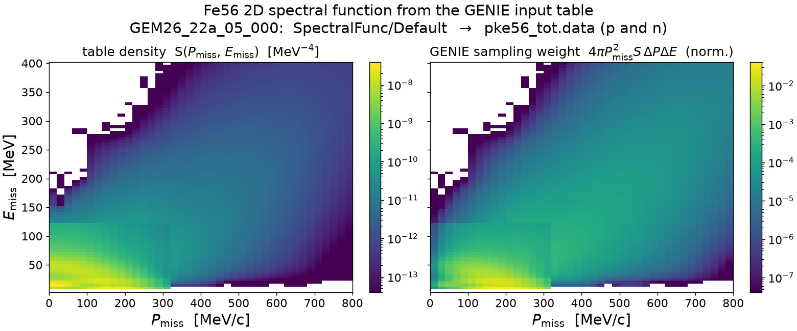
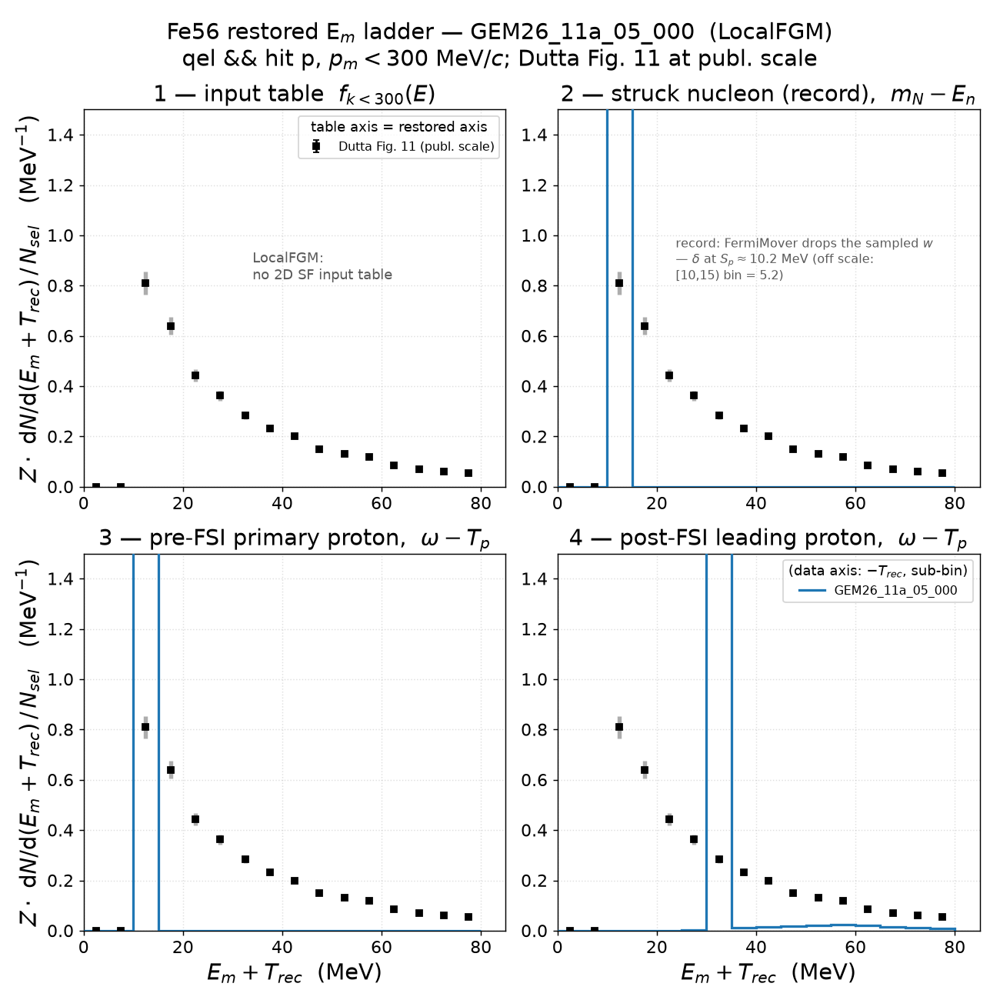
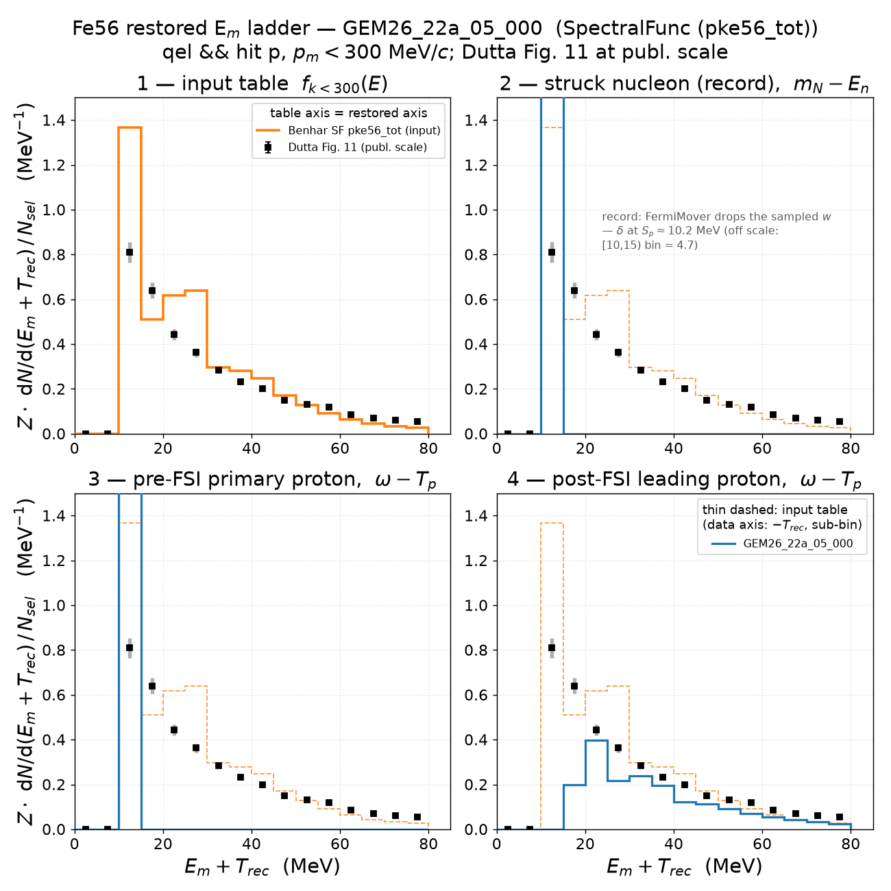
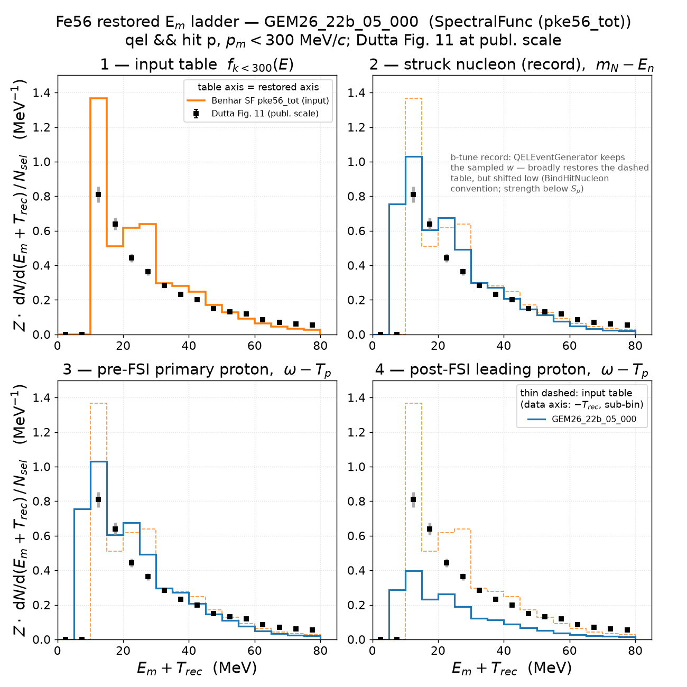
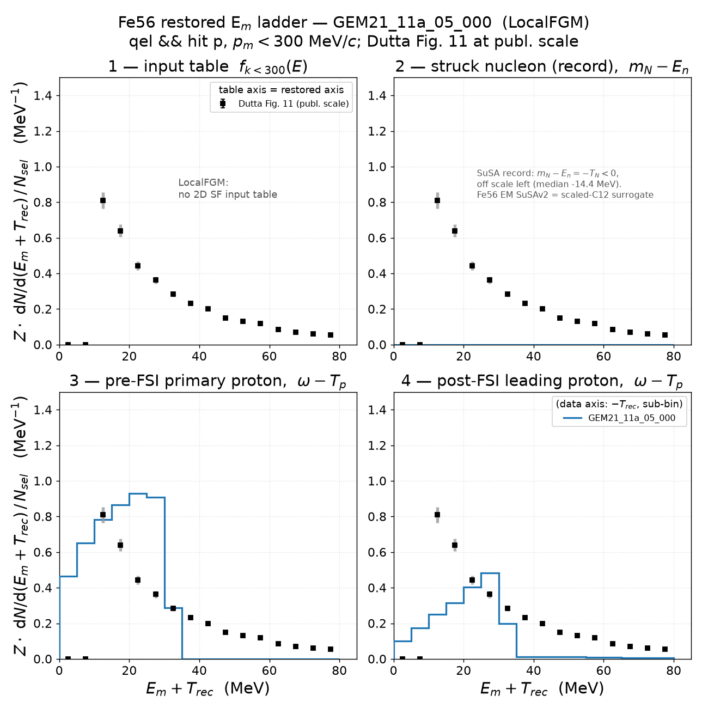

# Electron–Fe56 scattering

## Fe56 2D spectral function — the GENIE input table

The Benhar 2D spectral function S(P_miss, E_miss) exactly as GENIE consumes it,
resolved the way the tune resolves it at run time: `GEM26_22a_05_000` →
`ModelConfiguration.xml` `NuclearModel@Pdg=1000260560` = `genie::SpectralFunc/Default`
→ `SpectralFunc.xml` `SpectFuncTable@Pdg=1000260560_{2212,2112}` = `pke56_tot.data`
(one table shared by protons and neutrons; GENIE divides out the tabulated
N-nucleon normalization per hit species).

- **Left** — the table density as stored (MeV⁻⁴): mean-field shell region at
  P_miss ≲ 250 MeV/c, E_miss ≲ 60 MeV, plus the correlated (SRC) continuum.
  The rectangular edge at E_miss ≈ 125 MeV / P_miss ≈ 320 MeV is the seam where
  the table stitches the mean-field and correlation pieces.
- **Right** — the distribution GENIE actually samples (`TH2::GetRandom2` over the
  per-bin mass 4π P²_miss S ΔP ΔE, area-normalized). The P² weight moves real
  probability into the tails: **P(P_miss > 250 MeV/c) = 0.158**,
  **P(E_miss > 100 MeV) = 0.080**. This tail is what collapsed the RES-EM Q²
  window under the t05 cut (`EM-MinQ2Limit = 1.18 GeV²`) before the
  `RESKinematicsGenerator` guard (see
  `../../.claude/plans/fix-res-em-q2window-assert.md`).

Grid: 40 P_miss bins [0, 800] MeV/c × 80 E_miss bins [2.5, 402.5] MeV
(bin centers tabulated; parsed exactly as `SpectralFunc::LoadSFDataFile`).
GEM26_22b_05_000 resolves to the identical table; GEM26_11a / GEM21_11a use
LocalFGM (no table). Event-level realization: `sf2d_events_fe56_*.png`.

Regenerate: `pixi run python results/template/make_sf2d_table.py --all-tunes`

## Missing energy: table vs simulation vs Dutta Fig. 11

The C12 four-stage **restored ladder** (v0 README §12) replicated on Fe56 for
each campaign tune, at the digitized data's kinematics (Q² = 1.28 (GeV/c)²,
beam 2.445 GeV): all stages on the input-table axis E_m + T_rec (record =
m_N − E_n, protons = ω − T_p, remnant Mn55 from the install's PDG table),
selection `qel && hitnuc==2212` (explicit here; implicit in the EMQE C12
samples), p_m < 300 MeV/c, occupancy normalization Z·hist/(N_sel·5 MeV) with
Z = 26. Each tune: 2M streamed events (20 gst files). Common to all four:
FSI = hA2018, `EM-MinQ2Limit = 1.18` GeV² (t05). The `pke56_tot.data` table
integrates raw to 25.998 ≈ Z — proton-number normalized, the same convention
as the C12 tables.

Data caveats (as in the C12 study): Dutta's published E_m is recoil-subtracted,
so on this axis the points sit low by an event-wise T_rec ≤ ~4.5 MeV (sub-bin);
the fig11 absolute scale is renormalized to the in-window IPSM strength
(∫ = 18.20 ± 0.08, not Z = 26 and not a raw distorted yield); file errors are
statistical only (inflated by 2% pt-to-pt ⊕ 5% model here).

Summary (occupancy units, E < 80 MeV, p_s < 300 MeV/c):

| tune | N_sel (of 2M) | I1 (table) | I2r = I3r | I4r | I4r/I3r | record median [p5, p95] MeV |
|---|---|---|---|---|---|---|
| GEM26_11a_05_000 | 251,502 (12.6%) | — | 26.000 | 10.619 | 0.408 | 10.45 [10.22, 10.75] |
| GEM26_22a_05_000 | 254,047 (12.7%) | 22.577 | 23.423 | 8.997 | 0.384 | 10.48 [10.24, 10.88] |
| GEM26_22b_05_000 | 186,694 (9.3%) | 22.577 | 23.976 | 9.621 | 0.401 | 20.47 [8.32, 59.29] |
| GEM21_11a_05_000 | 213,209 (10.7%) | — | 0.000 / 24.448 | 10.037 | 0.411 | −14.38 [−30.52, −1.78] |

I2r = I3r in every tune (energy-conserving pre-FSI chain; GEM21's I2r = 0 is
an in-window statement — its record sits entirely below E = 0). FSI keeps only
~40% of strength in-window everywhere, while a post-FSI proton exists in
~100% of events: strength leaves the window, not the event. Data integral
18.200 on its own published scale. Regenerate:
`pixi run python results/template/make_emiss_ladder_fe56.py --all-tunes`
(cache: `cache/ladder_fe56/`; delete to re-stream).

### GEM26_11a_05_000 — LocalFGM + Rosenbluth

| piece | algorithm |
|---|---|
| Fe56 ground state | `genie::LocalFGM/Default` (no 2D SF table) |
| QEL-EM cross section | `genie::RosenbluthPXSec/Default` |
| QEL-EM event chain | install default: `FermiMover/Default` → `genie::QELKinematicsGenerator/EM-Default` |

Panel 1 has no input-table curve (LFG). The record is a δ at S_p (median
10.45 MeV) — with LFG this loses little: the LFG removal energy is itself
essentially fixed. All 26 protons are in-window (I2r = 26.000: LFG momenta
never exceed 300 MeV/c). The pre-FSI proton reproduces the δ; FSI smears it
into a shape that tracks the data tail but, as everywhere, misses the
12.5 MeV peak from below.

### GEM26_22a_05_000 — 2D SpectralFunc + Rosenbluth (FermiMover chain)

| piece | algorithm |
|---|---|
| Fe56 ground state | `genie::SpectralFunc/Default` → `pke56_tot.data` (`NuclearModel@Pdg=1000260560`) |
| QEL-EM cross section | `genie::RosenbluthPXSec/Default` |
| QEL-EM event chain | install default: `FermiMover/Default` → `genie::QELKinematicsGenerator/EM-Default` |

The Fe56 instance of the C12 **a-tune finding**: the tune samples the 2D SF
(panel 1, I1 = 22.577 of 26 in-window — the rest is the k > 300 MeV/c SRC
tail), but FermiMover writes `En = M_A − √(p² + M²_Mn55,gs)` into the record,
dropping the sampled w — panel 2 is a δ at S_p ([10,15) bin = 4.7, off scale;
the sampled physics survives only in `GHepParticle::RemovalEnergy`, section 1).
I2r = I3r = 23.423; FSI in-window survival 0.384 with the post-FSI shape
tracking the data above ~20 MeV.

### GEM26_22b_05_000 — 2D SpectralFunc + UnifiedQEL (QELEventGenerator)

| piece | algorithm |
|---|---|
| Fe56 ground state | `genie::SpectralFunc/Default` → `pke56_tot.data` |
| QEL-EM cross section | `genie::UnifiedQELPXSec/Dipole` |
| QEL-EM event chain | tune override: `genie::QELEventGenerator/EM-Default` (samples the nucleon from the nuclear model — SF-consistent) |

The **b-tune contrast**: `QELEventGenerator` keeps the sampled w in the
off-shell energy, so the record (median 20.5 MeV, p5–p95 [8.3, 59.3]) broadly
restores the dashed table instead of collapsing to a δ — but shifted low, with
strength in [5,10) below S_p where the table is empty (the `BindHitNucleon`
recoil-convention issue; the C12 study measured 23.1% of 22b strength below
S_p on the data axis — still an open question). Of the four tunes this record
is the closest in shape to the data. QEL fraction is 9.3% vs 22a's 12.7%,
consistent with the SF-folded UnifiedQEL cross section being smaller than
Rosenbluth (spline QE σ 1.85 vs 2.75 ×10⁻⁴).

### GEM21_11a_05_000 — LocalFGM + SuSAv2 (scaled-C12 surrogate)

| piece | algorithm |
|---|---|
| Fe56 ground state | `genie::LocalFGM/Default` (no 2D SF table) |
| QEL-EM cross section | `genie::HybridXSecAlgorithm/SuSAv2-QEL` — **Fe56 EM tensor is scaled C12** (open_questions.md) |
| QEL-EM event chain | tune override: `genie::QELEventGeneratorSuSA/Default` |

The SuSA chain writes an on-shell-like nucleon: m_N − E_n = −T_N < 0, so the
record sits entirely **below the axis** (median −14.4 MeV; I2r = 0 in-window)
— the Fe56 instance of the C12 SuSAv2 note. The pre-FSI proton lands as a
box-like distribution up to ~35 MeV (LFG kinematics through SuSA's own
binding prescription), and FSI degrades it further. The scaled-C12 surrogate
caveat applies to any physics conclusion drawn from this tune on iron.
