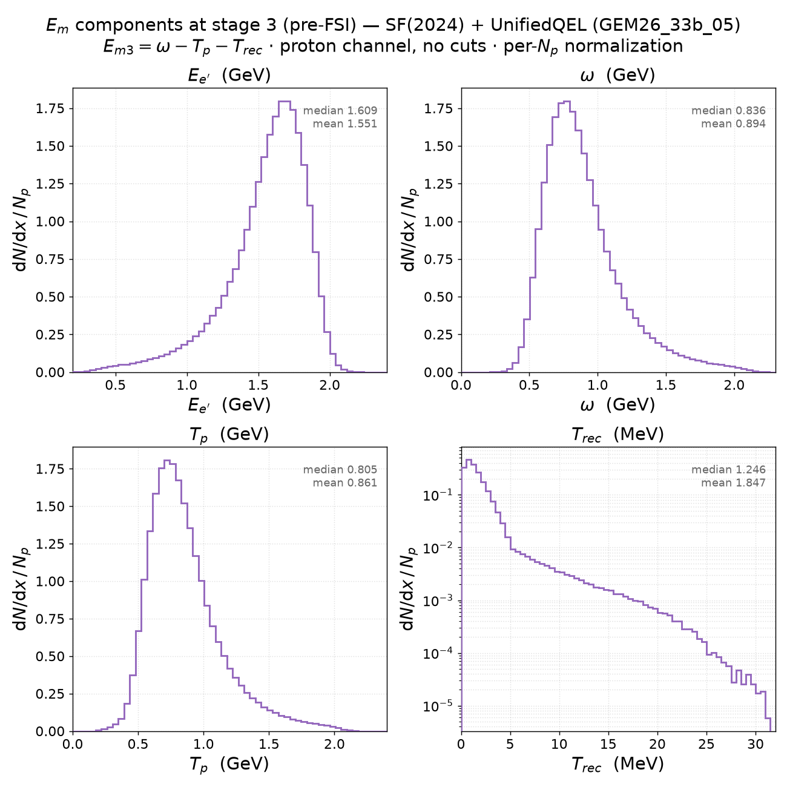
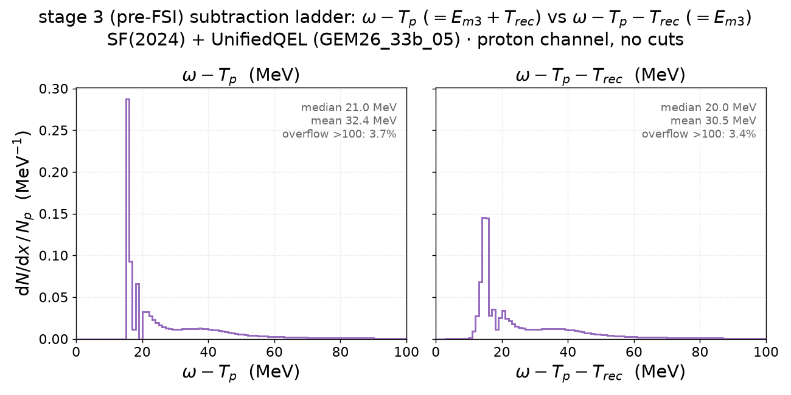

# SF(2024) + UnifiedQEL — E_m budget at stage 3 (pre-FSI)

The new-spectral-function sibling of the focus model —
**SF(2024) + UnifiedQEL** (`GEM26_33b_05_000`: 2024 Ankowski–Benhar–Sakuda
`pke12_2024.table`, NIKHEF-fit quasiparticle peaks, + SF-consistent UnifiedQEL
cross section, `genie_inclxx` install) — examined alone at **ladder stage 3**,
the pre-FSI primary proton. Same setup as the
[22b page](sf_unifiedqel_em_prefsi.md): e⁻ on C12 at 2.445 GeV, t05 cut
(Q² ≥ 1.18 GeV²), proton channel, no further cuts: **1,383,764 events**
(69.2 % of the 2M streamed), from `cache/ladder/UnifiedQEL2024.npz`.

Both figures: [`plot_em_components_prefsi.py`](plot_em_components_prefsi.py) —
`pixi run python results/prd-analyzer-v0.1/plot_em_components_prefsi.py UnifiedQEL2024`.
Runtime identity validation as on the 22b page (max deviation 8×10⁻¹⁷ GeV).

## 1. The four ingredients of E_m3 = ω − T_p − T_rec

| quantity | median | mean | p5–p95 |
|---|---|---|---|
| E_e′ (FSI-blind) | 1.609 GeV | 1.551 GeV | [0.976, 1.904] |
| ω = 2.445 − E_e′ | 0.836 GeV | 0.894 GeV | [0.541, 1.469] |
| T_p (pre-FSI primary proton) | 0.805 GeV | 0.861 GeV | [0.509, 1.431] |
| T_rec (¹¹B) = p_m²/2M | 1.246 MeV | 1.847 MeV | [0.218, 4.964] |

On the GeV scale the SF swap is invisible: E_e′, ω and T_p match the 22b
medians to the quoted precision — the two tables differ in *E structure*, not
in the gross kinematics. T_rec again shows the ≈ 5 MeV slope break
(p_m ≈ 320 MeV/c, mean-field → SRC boundary), with a slightly harder tail
(p95 4.96 vs 4.65 MeV).

## 2. The subtraction ladder: ω − T_p vs ω − T_p − T_rec

| quantity | median | mean | overflow > 100 MeV |
|---|---|---|---|
| ω − T_p (= E_m3 + T_rec) | 21.0 MeV | 32.4 MeV | 3.7 % |
| ω − T_p − T_rec (= E_m3) | 20.0 MeV | 30.5 MeV | 3.4 % |

Where the [22b table](sf_unifiedqel_em_prefsi.md) has 5-MeV blocks, the 2024
table has discrete quasiparticle lines — and the subtraction pair separates the
axis conventions even more sharply than for 22b:

- **ω − T_p reads the table back undistorted**: support starts at 15.62 MeV and
  the ground-state quasiparticle line peaks at **15.93–15.98 MeV ≈ S_p =
  15.957 MeV** (0.05-MeV bins), followed by the excited-state spikes at ~17–18
  and ~20–21 MeV and the broad s-shell hump at ~35–40. A ground-state line
  sitting exactly at the physical separation energy is the v0 §10b2 conclusion
  made visible: the 2024 table's E axis is the **mass-based (recoil-free)
  removal energy**, and ω − T_p is its faithful reconstruction.
- **E_m3 = ω − T_p − T_rec** (the recoil-subtracted convention) drags every
  line down by the event's T_rec(k): the ground-state peak lands at
  **15.13–15.18 MeV** (≈ 0.8 MeV low), the line structure smears, **39.9 % of
  the strength reconstructs below S_p** (vs 23.1 % for 22b), and **0.08 % goes
  below zero** — negative missing energy, min −15.3 MeV, from sharp low-E lines
  paired with SRC-tail recoils (T_rec up to ≈ 31 MeV). Same `BindHitNucleon`
  cause as 22b (v0 §10b1), but the sharp 2024 lines make the distortion far
  more conspicuous.

Both distributions keep the ~3.5 % tail above 100 MeV (the SRC part of the
table, outside the Dutta E_m ≤ 80 MeV window).
