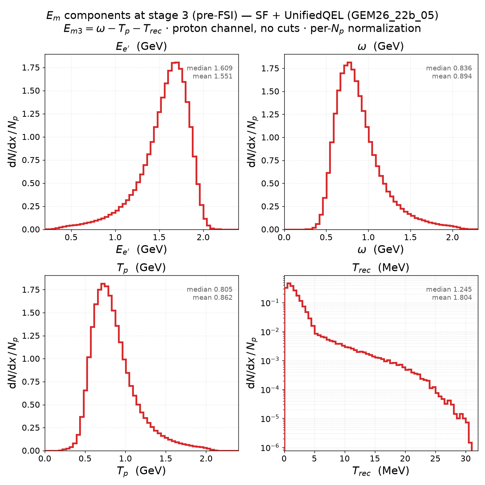
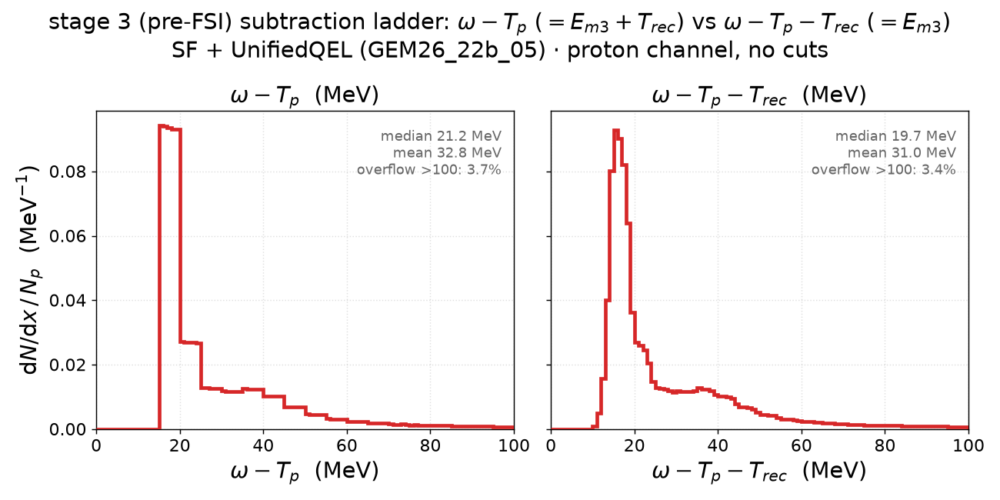

# SF + UnifiedQEL — E_m budget at stage 3 (pre-FSI)

The focus model of the (e,e′p) study — **SF + UnifiedQEL** (`GEM26_22b_05_000`:
Benhar spectral-function ground state + SF-consistent UnifiedQEL cross section,
`genie_inclxx` install) — examined alone at **ladder stage 3**, the pre-FSI
primary proton. e⁻ on C12 at 2.445 GeV, generation cut t05 (Q² ≥ 1.18 GeV²),
proton channel (`hitnuc == p`), no further cuts: **1,373,273 events** (68.7 % of
the 2M streamed), from `cache/ladder/UnifiedQEL.npz`.

Both figures: [`plot_em_components_prefsi.py`](plot_em_components_prefsi.py) —
`pixi run python results/prd-analyzer-v0.1/plot_em_components_prefsi.py UnifiedQEL`.
The script validates at runtime that the beam is monochromatic (E_v ≡ 2.445 GeV)
and that its inlined M(¹¹B) matches the cache builder, via the identity
T_rec = (2.445 − E_e′) − T_p − E3/1000 (max deviation 8×10⁻¹⁷ GeV).
Sibling page for the 2024-SF variant: [SF(2024) + UnifiedQEL](sf2024_unifiedqel_em_prefsi.md).

## 1. The four ingredients of E_m3 = ω − T_p − T_rec

| quantity | median | mean | p5–p95 |
|---|---|---|---|
| E_e′ (FSI-blind) | 1.609 GeV | 1.551 GeV | [0.978, 1.902] |
| ω = 2.445 − E_e′ | 0.836 GeV | 0.894 GeV | [0.543, 1.467] |
| T_p (pre-FSI primary proton) | 0.805 GeV | 0.862 GeV | [0.511, 1.429] |
| T_rec (¹¹B) = p_m²/2M | 1.245 MeV | 1.804 MeV | [0.223, 4.648] |

T_p tracks ω shifted down by the removal-energy scale (≈ 30 MeV on average).
The T_rec spectrum (log-y) shows a slope break at ≈ 5 MeV — that is
p_m ≈ 320 MeV/c, the boundary between the Benhar SF's mean-field bulk and its
short-range-correlation tail, visible directly in the recoil energy.

## 2. The subtraction ladder: ω − T_p vs ω − T_p − T_rec

| quantity | median | mean | overflow > 100 MeV |
|---|---|---|---|
| ω − T_p (= E_m3 + T_rec) | 21.2 MeV | 32.8 MeV | 3.7 % |
| ω − T_p − T_rec (= E_m3) | 19.7 MeV | 31.0 MeV | 3.4 % |

The pair displays the v0 §10b1/§12 vertex finding from the E_m-budget angle:

- **ω − T_p floors razor-sharp at exactly 15.000 MeV** (measured minimum
  15.000009) — the first E-block edge of the `pke12_tot` table, not the physical
  S_p = 15.957 MeV. Nothing leaks below it: ω − T_p **is** the mass-based
  removal-energy axis the input table is natively defined on
  ([v0 §12](../prd-analyzer-v0/README.md), the "restored axis" ladder) — for
  this model the event-wise vertex balance is ω = T_p + E_table, with **no**
  ¹¹B recoil term in it.
- **E_m3 = ω − T_p − T_rec** (Dutta's recoil-subtracted convention) therefore
  *over*-subtracts by exactly T_rec(k): the spectrum lands 0.5–4.4 MeV low over
  the mean-field range (p-shell peak at 14.75 MeV instead of the table's
  [15, 20) block) and **spills down to 3 MeV — below S_p, kinematically
  impossible in PWIA** (23.1 % of the strength reconstructs below S_p).
  This is the `BindHitNucleon` SpectralFunc special case
  documented in v0 §10b1 (`QELUtils.cxx:271`): GENIE assumes the table's E
  already contains the recoil kinetic energy, which mis-reads these tables.

Both distributions keep a ~3.5 % tail above 100 MeV — the deep (SRC) part of
the spectral function, outside the Dutta E_m ≤ 80 MeV window.
