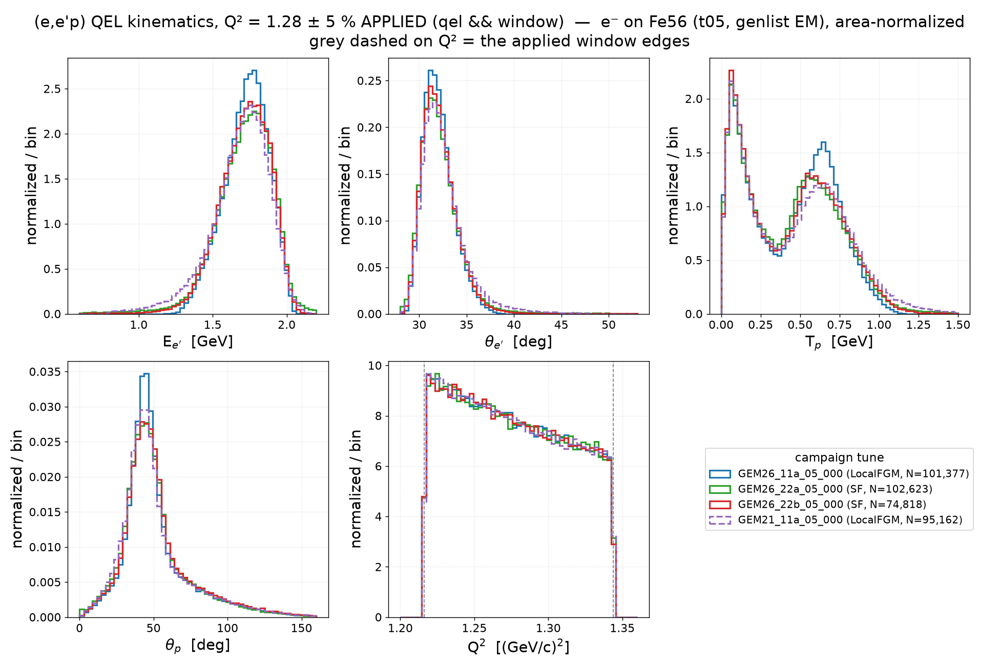

# prd-analyzer v0.2 — the Dutta Q² slice, cuts applied

Cut-applied companion of [`../prd-analyzer-v0.1/`](../prd-analyzer-v0.1/):
the same campaign samples and constructions as the v0.1 notes
([`electron_fe56_scattering.md`](../prd-analyzer-v0.1/electron_fe56_scattering.md),
[`electron_c12_scattering.md`](../prd-analyzer-v0.1/electron_c12_scattering.md)),
with the Dutta **Q² = 1.28 ± 5 % window applied** (Q² ∈ [1.216, 1.344] GeV²,
fully inside the t05 generation cut Q² ≥ 1.18) instead of drawn as reference.
Samples: full-EM t05 grid campaigns, e⁻ 2.445 GeV, 20 gst files = 2M
events/tune (Fe56 2026-07-16, C12 2026-07-26); selection everywhere below is
`qel && window` (EMQE-equivalent; RES/DIS/MEC dropped). Event input is the
v0.1 `cache/kin_qel_<target>/` caches — no independent streaming in this
version, so v0.1/v0.2 are mask-consistent by construction.

## 1. QEL kinematics in the slice — E_e′, θ_e′, T_p, θ_p, Q²

Grey dashed on the Q² panel = the applied window edges. Leading proton =
highest-momentum final-state proton; T_p/θ_p panels implicitly drop no-proton
events. Panel ranges pooled p0.2–p99.8 within the slice. Raw-counts
companions: `kin_qel_q2cut_<target>_counts.png` (equal ntot = 2M/tune).

| target | tune | N (qel ∧ window) | of qel | has_p |
|---|---|---|---|---|
| Fe56 | GEM26_11a_05_000 | 101,377 | 377,563 | 80.8 % |
| Fe56 | GEM26_22a_05_000 | 102,623 | 380,979 | 79.4 % |
| Fe56 | GEM26_22b_05_000 | 74,818 | 275,485 | 82.8 % |
| Fe56 | GEM21_11a_05_000 | 95,162 | 321,696 | 82.2 % |
| C12 | GEM26_11a_05_000 | 103,350 | 385,486 | 78.5 % |
| C12 | GEM26_22a_05_000 | 103,992 | 385,229 | 77.4 % |
| C12 | GEM26_22b_05_000 | 75,664 | 277,035 | 79.9 % |
| C12 | GEM21_11a_05_000 | 102,306 | 345,033 | 79.5 % |

Read: the slice removes the low-E_e′ (high-ω) tails and pins the electron arm
onto the QE peak (E_e′ ≈ 1.75 GeV, θ_e′ ≈ 31.5°, 11a sharpest) — inside the
window GEM21's kinematic-coverage deficit (v0.1 section 3) is invisible, its
N deficit on iron (95k) being the only trace. The T_p double-peak structure
and its target mirror survive the cut unchanged: **the low-T_p FSI-rescattered
population dominates the ≈0.65 GeV QE bump on Fe56 and is subordinate on C12**
(in-window ladder survival 0.38–0.41 vs 0.55–0.60, v0.1 section 4). 22b's
~27 % rate deficit is the smaller SF-folded UnifiedQEL σ, flat across the
slice.

Regenerate (needs the v0.1 caches; `make_kin_qel.py --target <T>` first if
missing):
`pixi run python results/template/make_kin_qel_q2cut.py --target Fe56` and
`--target C12`.
