# Electron–C12 scattering — Q² slice applied (v0.2)

v0.2 instance of
[`../prd-analyzer-v0.1/electron_c12_scattering.md`](../prd-analyzer-v0.1/electron_c12_scattering.md):
the same section series with the analysis selection

**`qel && |Q²/1.28 − 1| ≤ 5 %`** (Q² ∈ [1.216, 1.344] GeV², inside the t05
generation cut)

applied to every event-level figure. Sample: the C12 full-EM t05 grid
campaign of 2026-07-26 (e⁻ 2.445 GeV, genlist EM, all four tunes on
`genie_inclxx_q2guard` with the `gem26/gem21_emq2lim` overlays, splines from
the persistent mirror), first 20 files = 2M events/tune, streamed/dumped over
XRootD. **Provenance upgrade over v0.1**: every section here — including the
ladder (v0.1: purged-June EMQE caches) and the signed p_m (v0.1: local
2026-07-17 samples) — runs on this one grid campaign, constructed identically
to Fe56; the explicit `qel` replaces v0.1's EMQE-implicit selection. The
uncut baselines live in the v0.1 note.

## 1. C12 2D spectral function — the GENIE input table

Theory input — cut-independent. See
[v0.1 section 1](../prd-analyzer-v0.1/electron_c12_scattering.md#1-c12-2d-spectral-function--the-genie-input-table)
(`sf2d_table_c12_GEM26_22a_05_000.png` there): `pke12_tot.data`, raw 4πk²
integral 6.000 = Z, E grid **[0, 400] MeV (aligned edges)**, sampling-weight
tails P(P_miss > 250 MeV/c) = 0.146, P(E_miss > 100 MeV) = 0.077.

## 2. Struck nucleon in the record: sampled (P_miss, E_rm) and (P_miss, r)

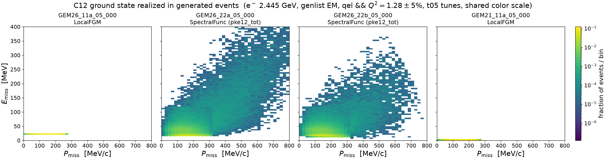

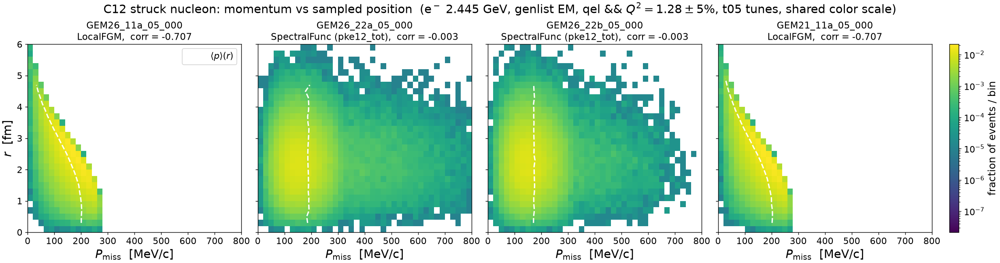

GHEP dumps with the `q2` column, masked to `scat = 1 && window` (the QEL
slice of the realized ground state; v0.1 section 2 used all single-nucleon
events uncut):

| tune | N (qel ∧ window) | P(p > 250) | P(E > 100) | corr(p, r) |
|---|---|---|---|---|
| GEM26_11a_05_000 | 103,338 | — | — | −0.707 |
| GEM26_22a_05_000 | 103,982 | 0.147 | 0.077 | −0.003 |
| GEM26_22b_05_000 | 75,661 | 0.103 | 0.035 | −0.003 |
| GEM21_11a_05_000 | 102,302 | — | — | −0.707 |

Reads: as on iron, **the window lifts 22a onto (and past) the table's
tails** — realized 0.147/0.077 vs table 0.146/0.077 (uncut all-process:
0.137/0.070) — while 22b's UnifiedQEL weighting suppresses the deep tail
(0.103/0.035). **GEM21's w = 0 QEL band is now the entire panel content**
(all its selected events sit in the bottom [0, 5) MeV bin — visible in-grid
on C12 because the grid starts at 0, unlike the empty Fe56 panel). The
(p, r) correlations are selection-stable: LFG wedge corr = −0.707, SF
factorized, ⟨r⟩ = 2.30 fm.

Regenerate: re-dump into `cache/hitnuc_c12/<tune>.csv`, then
`make_sf2d_events.py` / `make_struck_pr.py` with
`--target C12 --all-tunes --sel-qel-q2 --dump-dir results/prd-analyzer-v0.2/cache/hitnuc_c12 --out-dir results/prd-analyzer-v0.2`.

## 3. QEL kinematics in the slice — E_e′, θ_e′, T_p, θ_p, Q²

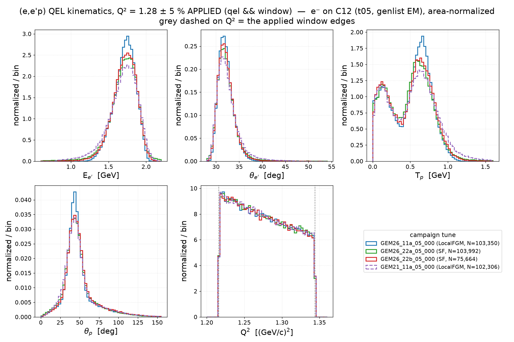

The window applied to the five-variable kinematics (v0.1 section 3 is the
uncut baseline; raw-counts companion `kin_qel_q2cut_c12_counts.png`; grey
dashed = the applied window edges):

| tune | N (qel ∧ window) | of qel | has_p |
|---|---|---|---|
| GEM26_11a_05_000 | 103,350 | 385,486 | 78.5 % |
| GEM26_22a_05_000 | 103,992 | 385,229 | 77.4 % |
| GEM26_22b_05_000 | 75,664 | 277,035 | 79.9 % |
| GEM21_11a_05_000 | 102,306 | 345,033 | 79.5 % |

Electron arm on the QE peak (E_e′ ≈ 1.75 GeV, θ_e′ ≈ 31.5°); **the T_p
double peak keeps the carbon ordering — the ≈0.7 GeV QE bump dominates the
low-T_p FSI population** (mirror of Fe56; transparency, section 4). 22b's
rate deficit is the smaller UnifiedQEL σ; GEM21 sits at full strength (its
C12 SuSAv2 tensor is genuine).

Regenerate: `pixi run python results/template/make_kin_qel_q2cut.py --target C12`.

## 4. Missing energy: table vs simulation vs Dutta Fig. 9

Windowed restored ladder — now streamed from the fresh campaign (axis
E_m + T_rec, remnant B11, occupancy Z·hist/(N_sel·5 MeV), Z = 6; Dutta
fig9_q1p2 at its published scale with the fig9_common error model; the C12
table grid is aligned with the plot grid, no half-bin correction):

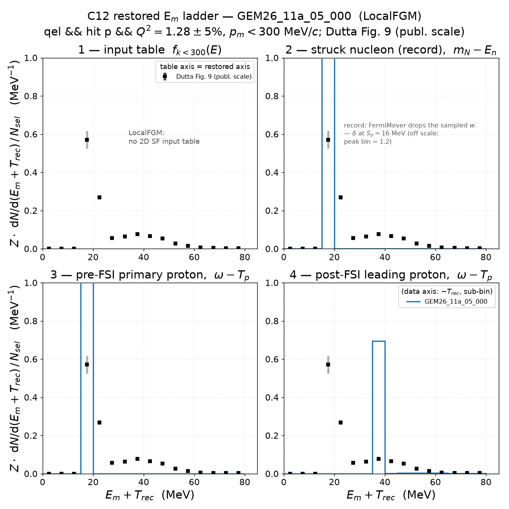
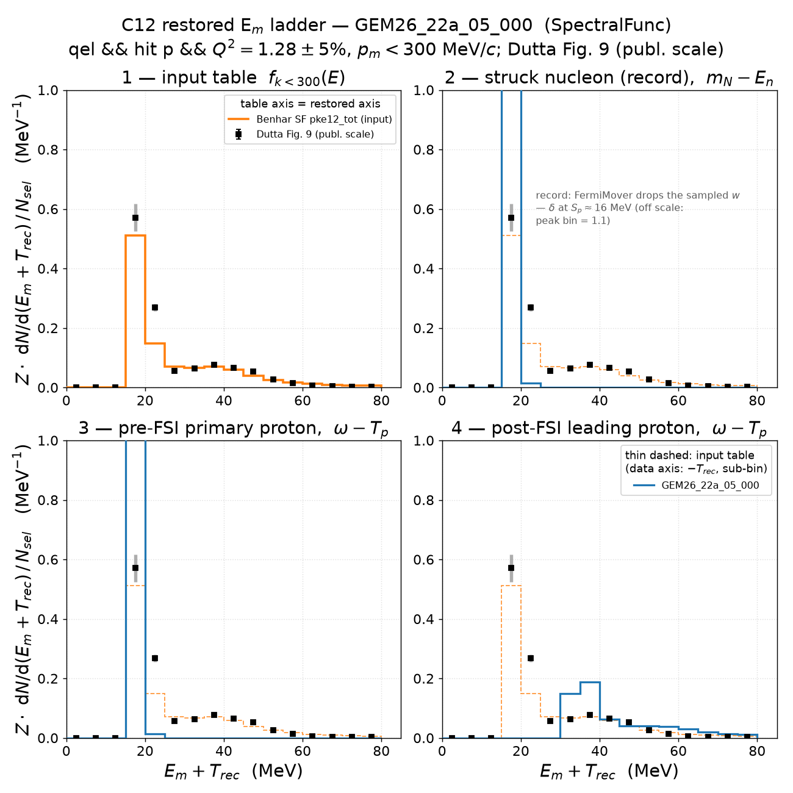
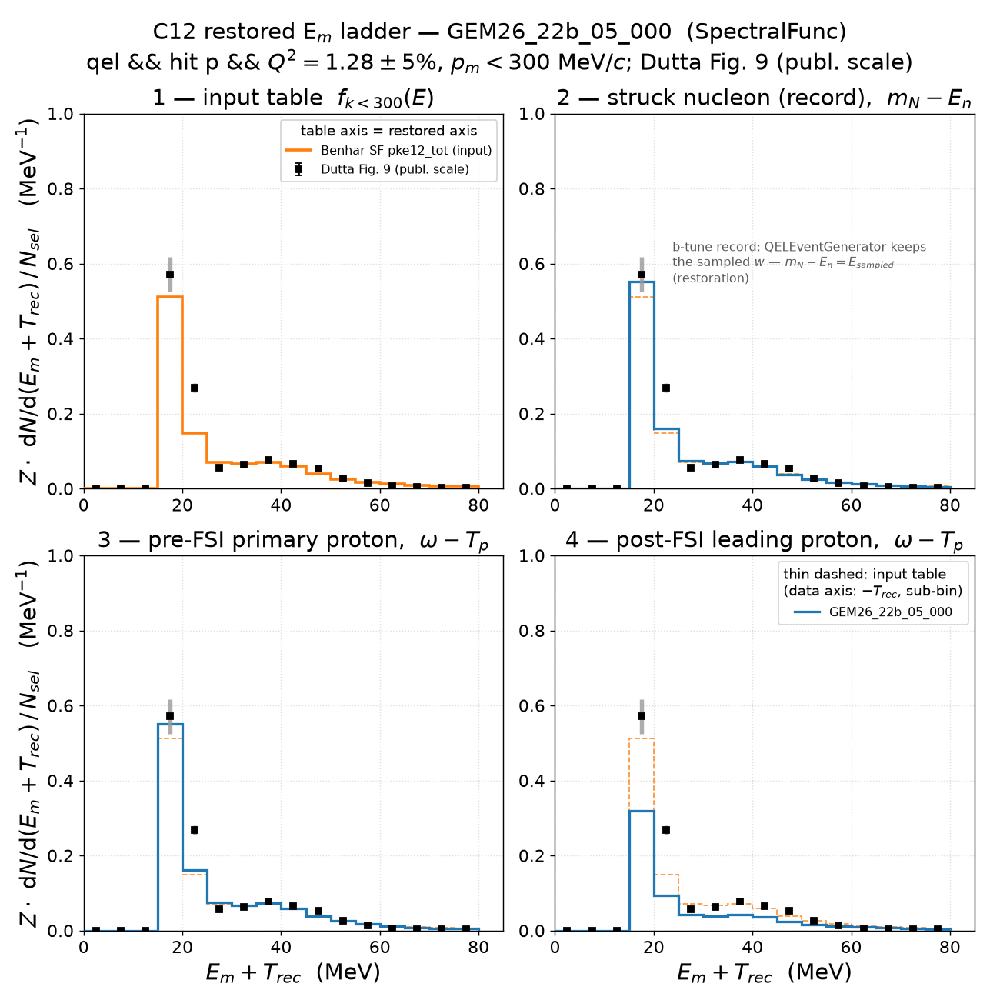
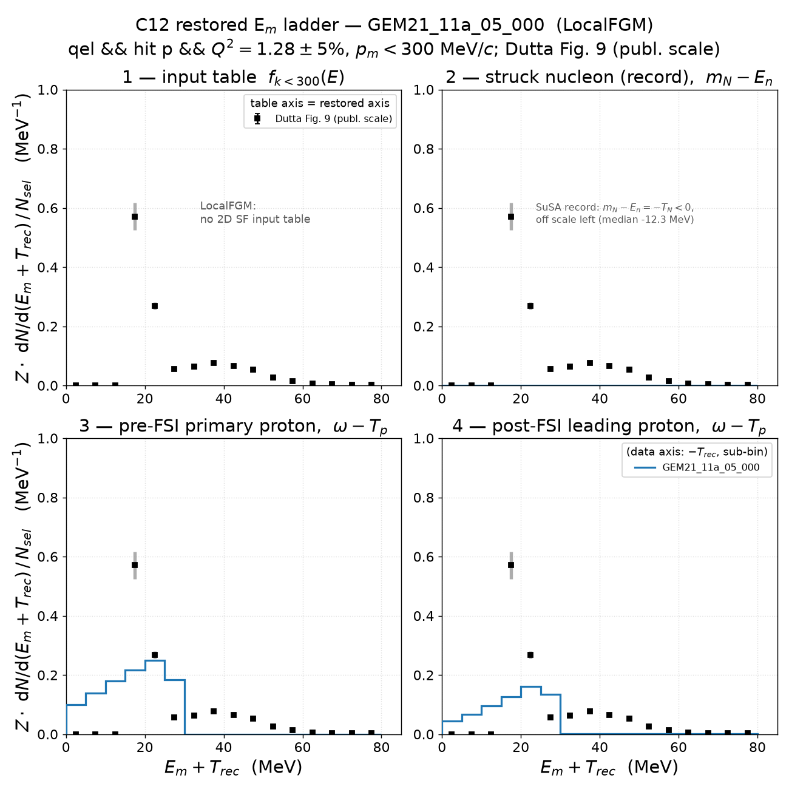

| tune | N_sel (of 2M) | I1 (table) | I2r = I3r | I4r | I4r/I3r | record median [p5, p95] MeV |
|---|---|---|---|---|---|---|
| GEM26_11a_05_000 | 72,490 (3.62 %) | — | 6.000 | 3.599 | 0.600 | 17.09 [16.09, 18.79] |
| GEM26_22a_05_000 | 72,953 (3.65 %) | 5.249 | 5.425 | 3.013 | 0.555 | 17.16 [16.18, 19.34] |
| GEM26_22b_05_000 | 53,517 (2.68 %) | 5.249 | 5.530 | 3.274 | 0.592 | 20.48 [15.50, 62.05] |
| GEM21_11a_05_000 | 71,630 (3.58 %) | — | 0.000 / 5.363 | 3.250 | 0.606 | −12.31 [−30.49, −1.49] |

**The fresh-sample, windowed ladder reproduces the v0.1 numbers to the last
digit that matters**: I2r = I3r exact, record medians identical
(17.09/17.16/20.48/−12.31 vs v0.1's 17.09/17.15/20.37/−12.28), survivals
0.555–0.606 vs v0.1's 0.545–0.602 — validating both the June-EMQE ≡
fresh-EM-qel equivalence and the Q²-slice stability; the C12 > Fe56
transparency ordering (0.56–0.61 vs 0.39–0.42) is untouched.

**Event counts, before and after FSI.** A pre-FSI primary proton exists in
100 % of selected events and a post-FSI leading proton in ~100 % (22a loses
174 events, 0.2 %): FSI relocates events out of the window, and the
in-window ratios reproduce I4r/I3r exactly:

| tune | N_sel | pre-FSI p (in-window) | post-FSI p (in-window) | in-window survival |
|---|---|---|---|---|
| GEM26_11a_05_000 | 72,490 | 72,490 (72,490) | 72,490 (43,478) | 0.600 |
| GEM26_22a_05_000 | 72,953 | 72,953 (65,960) | 72,779 (36,629) | 0.555 |
| GEM26_22b_05_000 | 53,517 | 53,517 (49,321) | 53,517 (29,201) | 0.592 |
| GEM21_11a_05_000 | 71,630 | 71,630 (64,031) | 71,630 (38,804) | 0.606 |

**Post-FSI shape, self-normalized** — each curve divided by its own
in-window event count (unit integral over [0, 80) MeV), data
unit-normalized too:

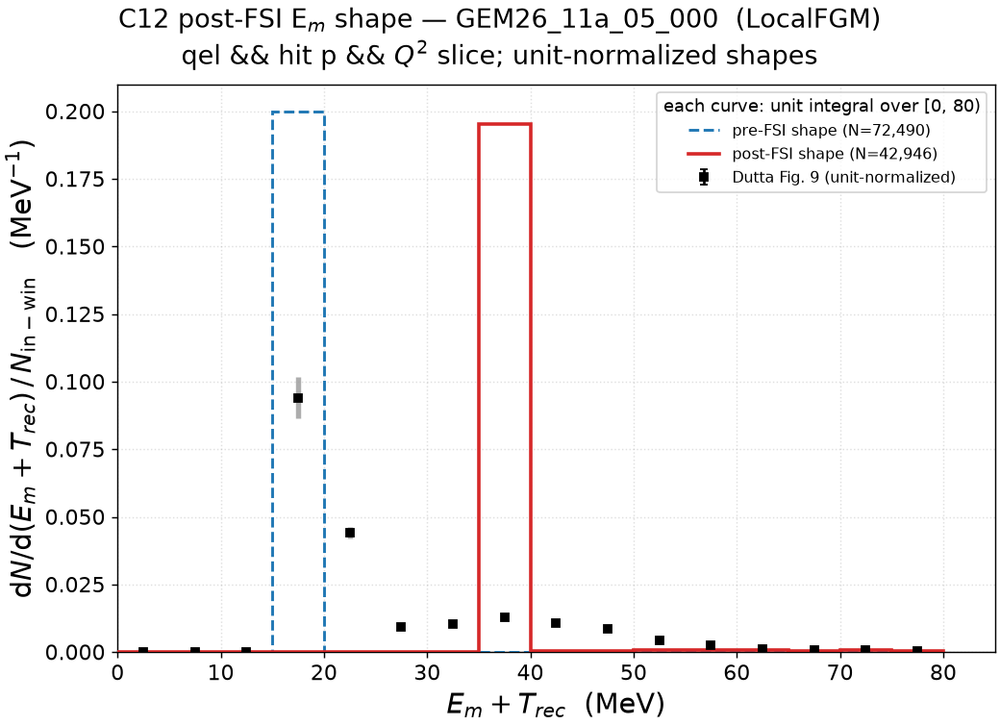
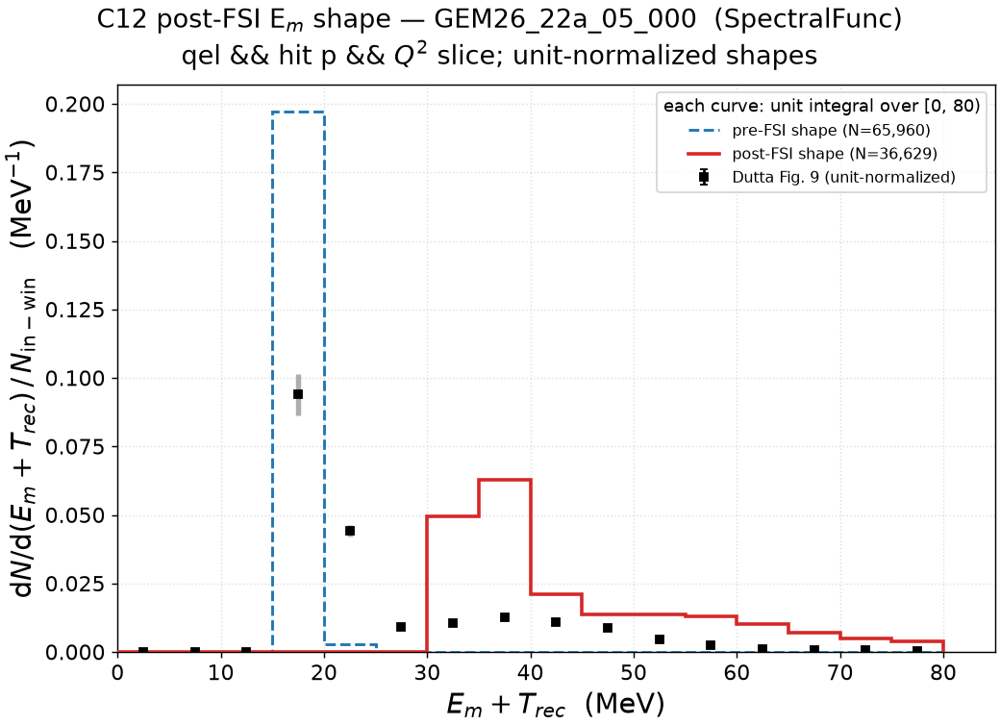
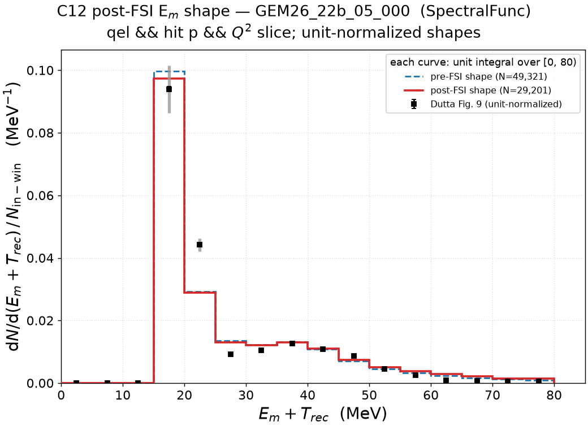
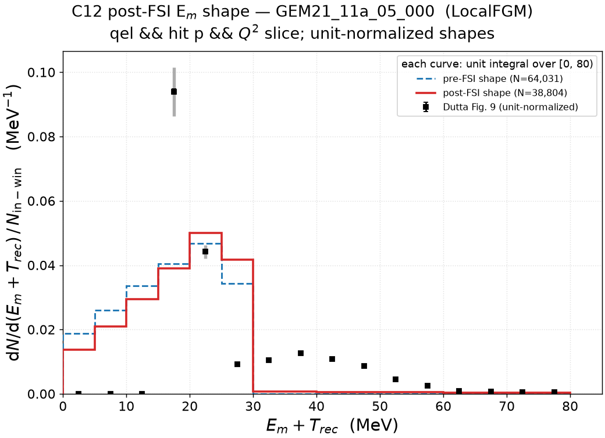

The carbon instance of the Fe56 finding: **hA2018 shifts every surviving
proton by a constant ΔT_p = +20.3 MeV** (1-MeV-sharp per-event E4r − E3r
line holding 58 % of events = the in-window survival; zero events pass
unshifted), so the δ-record tunes' survivors are a **rigidly displaced δ**
at ≈ 37.4 MeV (record 17.09 + 20.3) sitting past the data's s-shell bump,
with the rescattered remainder as the tail. 22b's broad restored shape
absorbs the shift: post-FSI ≈ pre-FSI ≈ data (its shape figure is the
cleanest data match of the four). Constant's code origin untraced
(`INUKE-NucRemovalE` = 0.00) — open question, shared with Fe56
(+23.4 MeV there).

Regenerate: `pixi run python results/template/make_emiss_ladder_q2cut.py --target C12 --all-tunes`
(cache: `cache/ladder_c12/`; also writes the `em_postfsi_shape_c12_*`
figures).

## 5. Missing momentum: table vs QEL struck-nucleon record

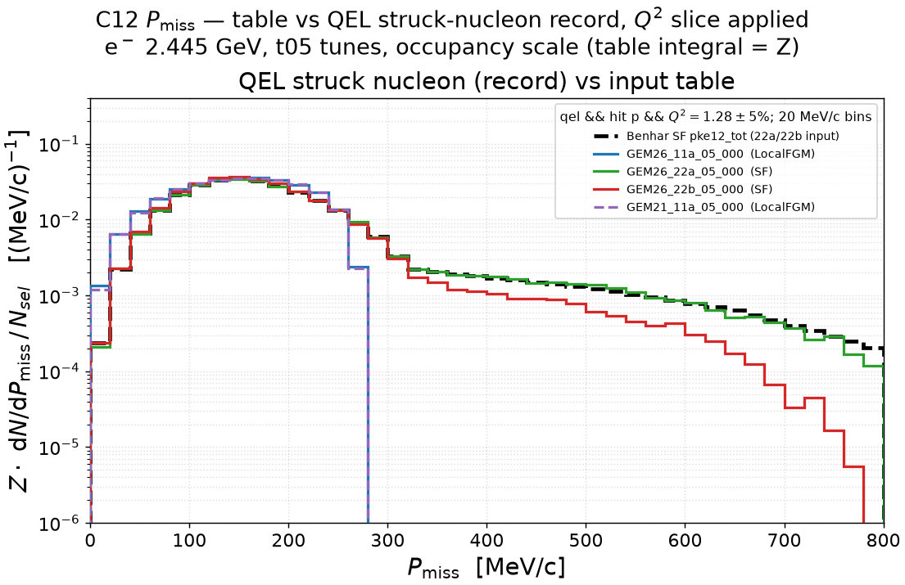

Table-native 20 MeV/c grid, occupancy scale (curves integrate to Z = 6),
record from the windowed ladder caches:

| tune | median |p_n| [MeV/c] | P(p > 250 MeV/c) |
|---|---|---|
| table (sampling weight) | — | 0.146 |
| GEM26_11a_05_000 (LFG) | 152.3 | 0.027 |
| GEM26_22a_05_000 (SF) | 165.8 | 0.169 |
| GEM26_22b_05_000 (SF) | 160.1 | 0.126 |
| GEM21_11a_05_000 (LFG) | 152.5 | 0.027 |

Same pattern as v0.1 (22a ≈ table with the window enhancement 0.169 vs
0.146; 22b tail xsec-suppressed; LFG cutoff) — the slice moves the numbers
by ≲ 0.003.

Regenerate: `pixi run python results/template/make_pmiss_q2cut.py --target C12`.

## 6. Signed missing momentum (± asymmetry)

Same construction as v0.1 section 6 (sign of p_m·x̂, 4πp² divided out,
0 < E_m < 80 MeV, fig6 top+bottom combined overlay shape-scaled), now
**streamed from the grid campaign** (v0.1 used 500k-event local samples) and
with the Q² window applied:

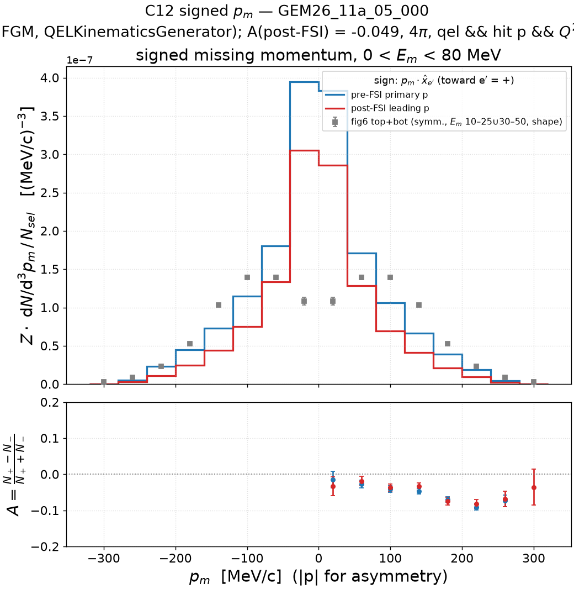
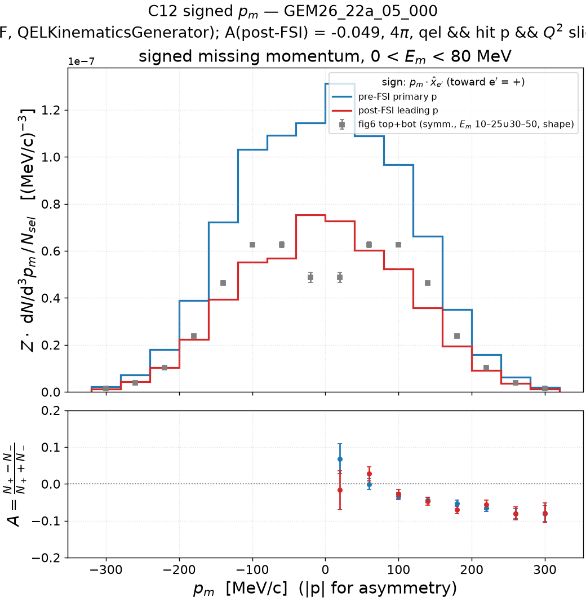
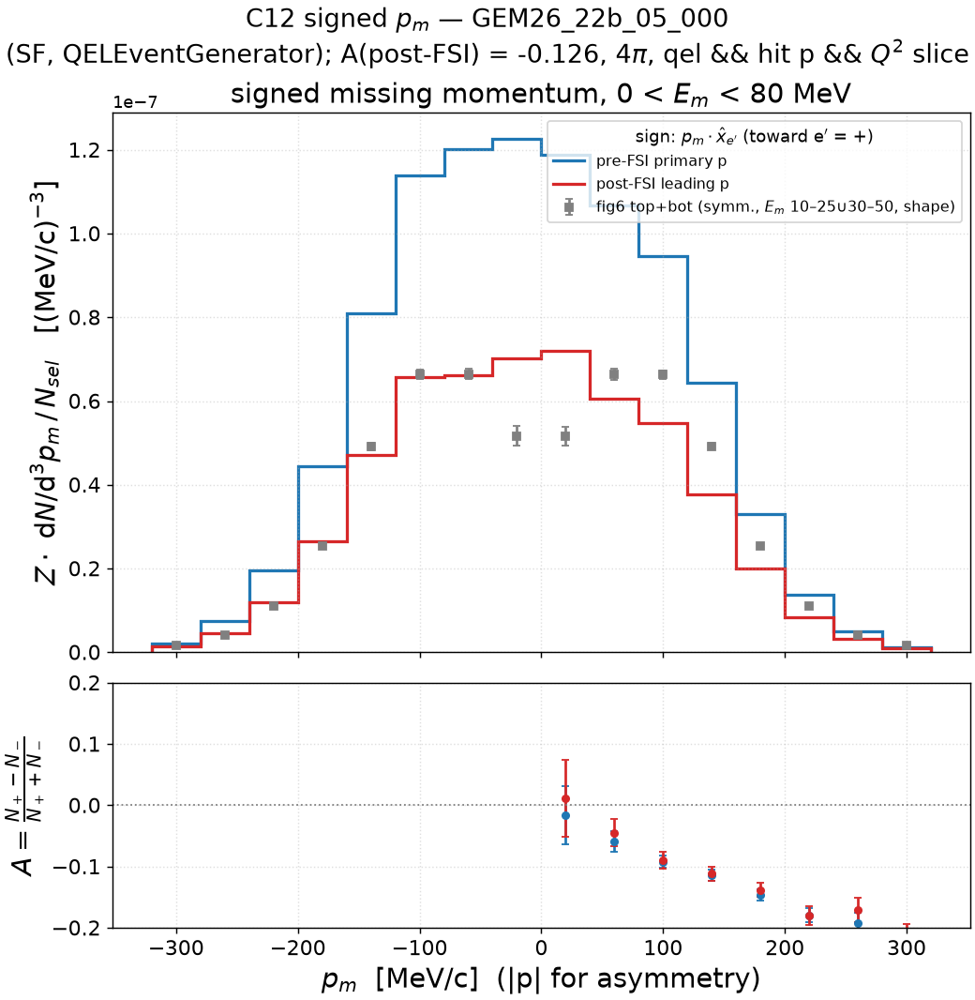
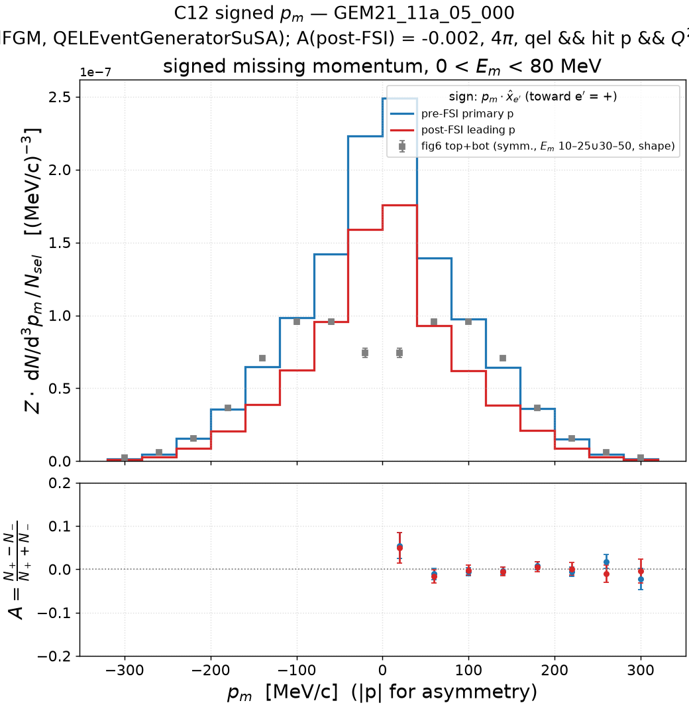

| tune | generator | A pre-FSI | A post-FSI | v0.1 A pre-FSI (uncut, local) |
|---|---|---|---|---|
| GEM26_11a_05_000 | `QELKinematicsGenerator` | −0.0568 ± 0.0037 | −0.0490 ± 0.0048 | −0.0467 |
| GEM26_22a_05_000 | `QELKinematicsGenerator` | −0.0469 ± 0.0039 | −0.0490 ± 0.0052 | −0.0483 |
| GEM26_22b_05_000 | `QELEventGenerator` | **−0.1318 ± 0.0044** | **−0.1264 ± 0.0058** | −0.1111 |
| GEM21_11a_05_000 | `QELEventGeneratorSuSA` | **−0.0004 ± 0.0040** | **−0.0016 ± 0.0051** | +0.0030 |

The taxonomy replicates on carbon in the slice — QKG ≈ −0.05, QEG −0.13,
SuSA ≡ 0 — with 22b again amplified relative to uncut (−0.132 vs −0.111),
matching the Fe56 pattern: the Q² window concentrates the kinematic
generator asymmetry rather than removing it.

Regenerate: `pixi run python results/template/make_pmiss_signed_q2cut.py --target C12 --all-tunes`
(cache: `cache/pmiss_signed_c12/`).
