# Electron–Fe56 scattering — Q² slice applied (v0.2)

v0.2 instance of
[`../prd-analyzer-v0.1/electron_fe56_scattering.md`](../prd-analyzer-v0.1/electron_fe56_scattering.md):
the same section series with the analysis selection

**`qel && |Q²/1.28 − 1| ≤ 5 %`** (Q² ∈ [1.216, 1.344] GeV², fully inside the
t05 generation cut `EM-MinQ2Limit = 1.18`)

applied to every event-level figure. Sample: the Fe56 full-EM t05 grid
campaign of 2026-07-16 (e⁻ 2.445 GeV, genlist EM, `genie_inclxx[_q2guard]`
installs, `gem26/gem21_emq2lim` overlays), first 20 files = 2M events/tune,
streamed/dumped over XRootD. The uncut baselines for every section live in
the v0.1 note; all constructions are identical up to the window.

## 1. Fe56 2D spectral function — the GENIE input table

Theory input — cut-independent. See
[v0.1 section 1](../prd-analyzer-v0.1/electron_fe56_scattering.md#1-fe56-2d-spectral-function--the-genie-input-table)
(`sf2d_table_fe56_GEM26_22a_05_000.png` there): `pke56_tot.data`, 40 × 80
grid, E edges [2.5, 402.5] MeV, sampling-weight tails
P(P_miss > 250 MeV/c) = 0.158, P(E_miss > 100 MeV) = 0.080.

## 2. Struck nucleon in the record: sampled (P_miss, E_rm) and (P_miss, r)

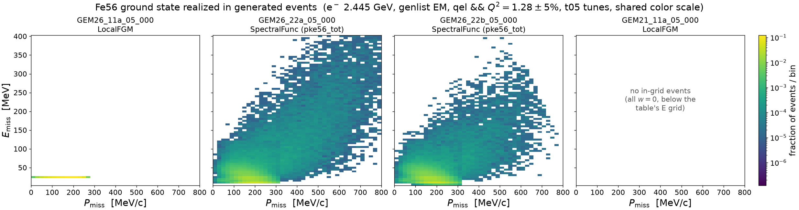

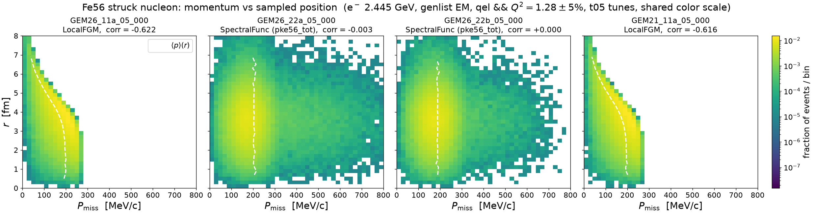

The v0.1 section-2 GHEP dumps re-made with a `q2` column
(`dump_hitnuc.cxx`, experimental-like Q² from the event lepton, verified
against the gst `Q2` branch to 5e-6) and masked to `scat = 1 && window` —
the QEL slice of the realized ground state instead of v0.1's all
single-nucleon events:

| tune | N (qel ∧ window) | P(p > 250) | P(E > 100) | corr(p, r) |
|---|---|---|---|---|
| GEM26_11a_05_000 | 101,370 | — | — | −0.622 |
| GEM26_22a_05_000 | 102,610 | 0.160 | 0.081 | −0.003 |
| GEM26_22b_05_000 | 74,815 | 0.115 | 0.038 | +0.000 |
| GEM21_11a_05_000 | 95,156 | (empty) | (empty) | −0.616 |

Reads: **the Q² window inverts 22a's tail relation to the table** — realized
P(p > 250) = 0.160 and P(E > 100) = 0.081 now *exceed* the table's
0.158/0.080 (v0.1, all processes uncut: 0.150/0.074) — the
`QELKinematicsGenerator` Q² acceptance favors high-(p, E) configurations;
22b's UnifiedQEL weighting still suppresses the deep tail (0.115/0.038).
**GEM21's (p, E) panel is empty by construction**: the selection is exactly
its w = 0 QEL population, which sits below the Fe56 grid's 2.5 MeV edge
(v0.1 section 2 caveat, now total). The (p, r) plane is selection-stable:
LFG wedge with corr ≈ −0.62, SF exactly factorized, ⟨r⟩ = 3.6 fm — the
window does not touch the position sampling.

Regenerate: re-dump with the extended dumper into
`cache/hitnuc_fe56/<tune>.csv`, then `make_sf2d_events.py` /
`make_struck_pr.py` with
`--target Fe56 --all-tunes --sel-qel-q2 --dump-dir results/prd-analyzer-v0.2/cache/hitnuc_fe56 --out-dir results/prd-analyzer-v0.2`.

## 3. QEL kinematics in the slice — E_e′, θ_e′, T_p, θ_p, Q²

The window applied to the five-variable kinematics (v0.1 section 3 is the
uncut baseline; raw-counts companion `kin_qel_q2cut_fe56_counts.png`,
equal ntot = 2M/tune; grey dashed = the applied window edges; leading proton
= highest-momentum final-state proton, T_p/θ_p panels drop no-proton events):

| tune | N (qel ∧ window) | of qel | has_p |
|---|---|---|---|
| GEM26_11a_05_000 | 101,377 | 377,563 | 80.8 % |
| GEM26_22a_05_000 | 102,623 | 380,979 | 79.4 % |
| GEM26_22b_05_000 | 74,818 | 275,485 | 82.8 % |
| GEM21_11a_05_000 | 95,162 | 321,696 | 82.2 % |

The slice pins the electron arm onto the QE peak (E_e′ ≈ 1.75 GeV,
θ_e′ ≈ 31.5°) and hides GEM21's kinematic-coverage deficit (only its rate,
95k, remembers it). **The T_p double peak keeps its iron signature — the
low-T_p FSI-rescattered population dominates the ≈0.65 GeV QE bump** —
unchanged by the cut (transparency, section 4). 22b's ~27 % rate deficit is
the smaller SF-folded UnifiedQEL σ. (N here differs from section 2 by a few
events: float32 gst `Q2` vs the dumper's double precision at the window
edges.)

Regenerate: `pixi run python results/template/make_kin_qel_q2cut.py --target Fe56`
(masks the v0.1 `kin_qel_fe56` caches; run `make_kin_qel.py` first if absent).

## 4. Missing energy: table vs simulation vs Dutta Fig. 11

Windowed restored ladder (construction identical to v0.1 section 4: axis
E_m + T_rec, remnant Mn55, occupancy Z·hist/(N_sel·5 MeV), Z = 26, data at
its published scale with 2 % pt-to-pt ⊕ 5 % model inflation; the data IS the
Q² = 1.28 setting, so the window brings the MC phase space closer to it):

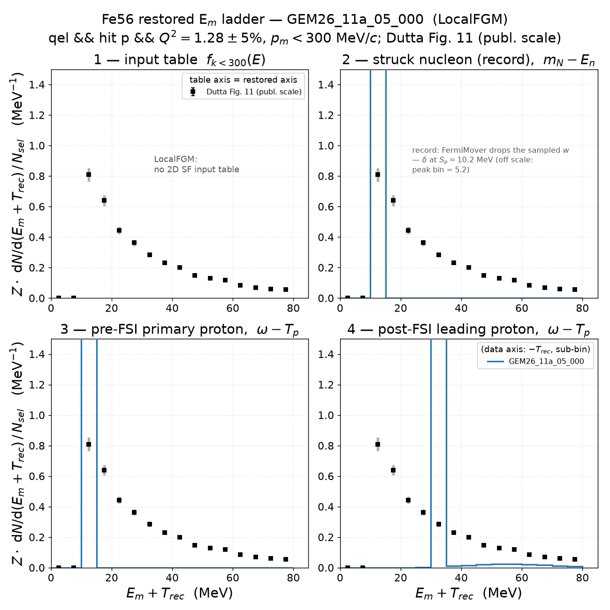
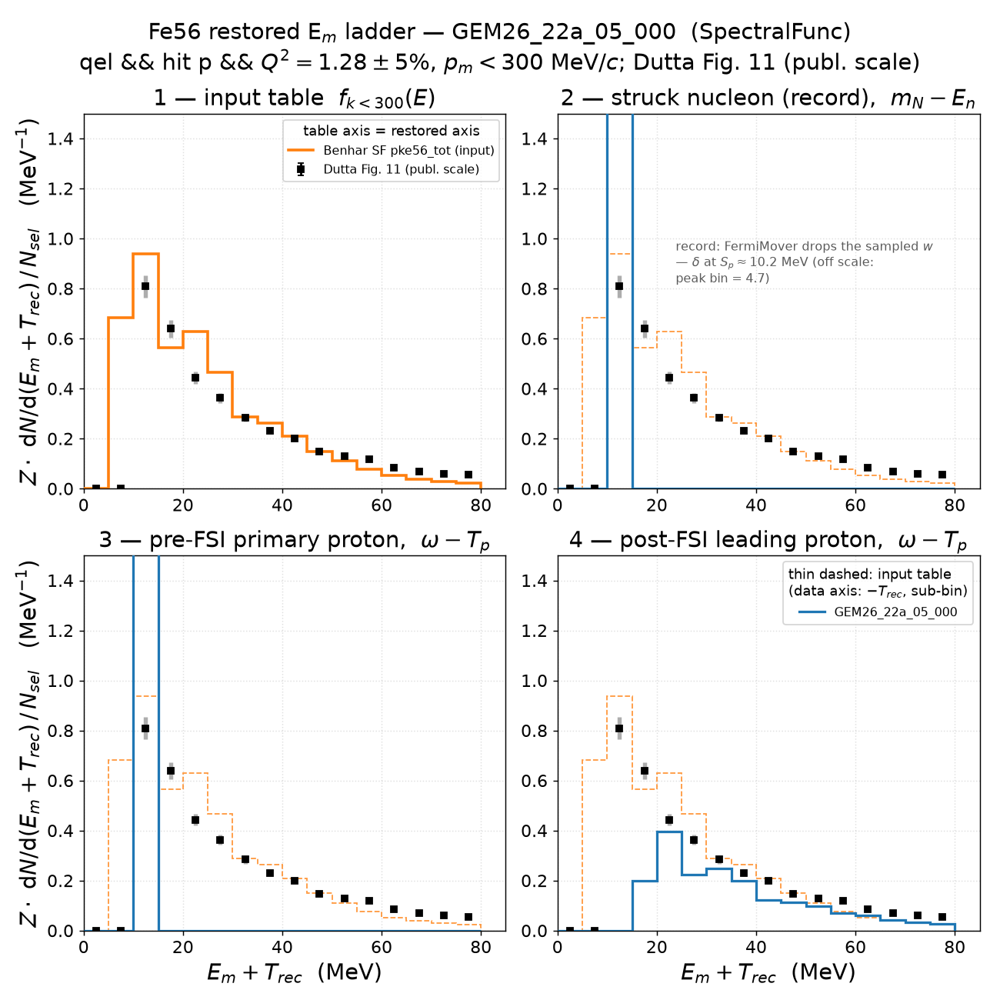
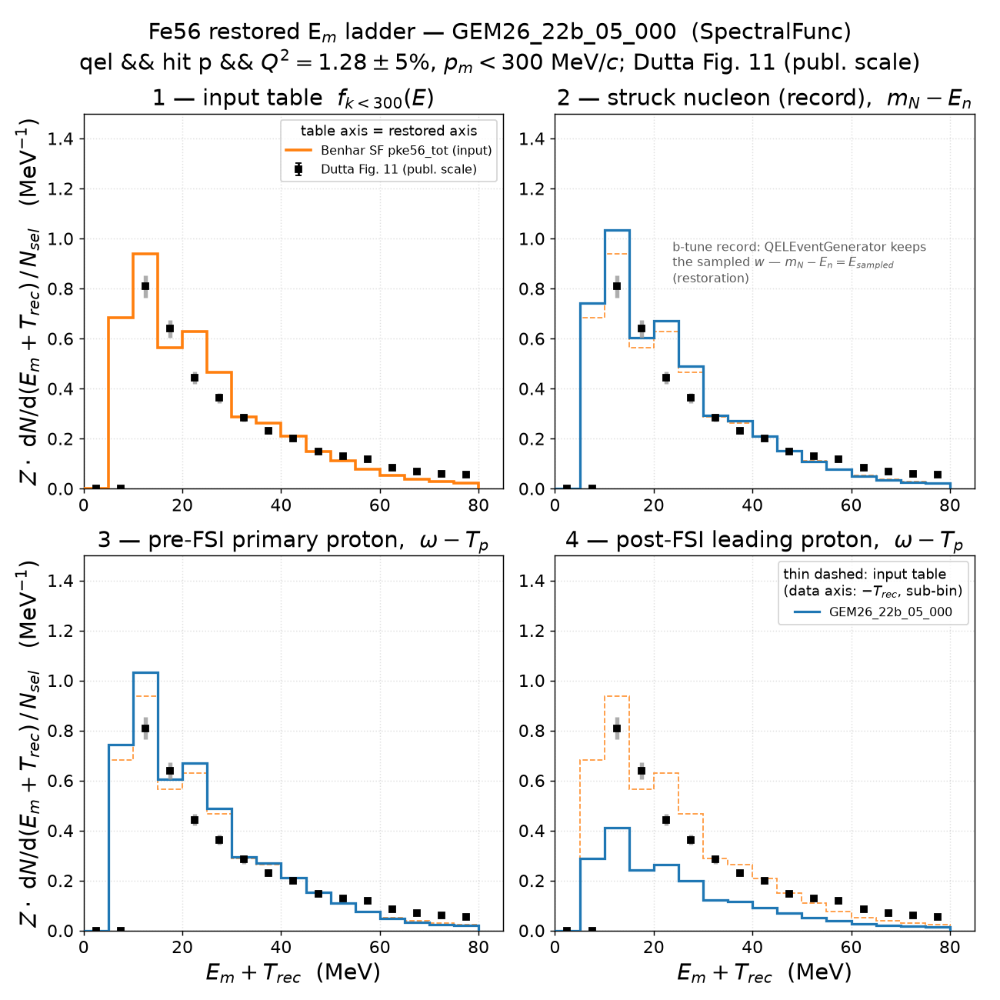
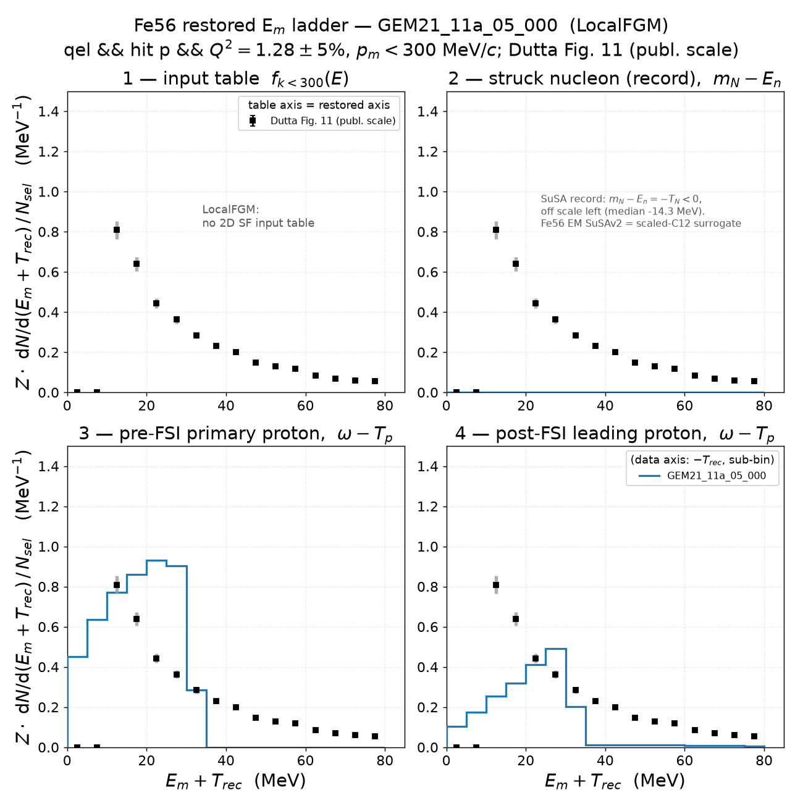

| tune | N_sel (of 2M) | I1 (table) | I2r = I3r | I4r | I4r/I3r | record median [p5, p95] MeV |
|---|---|---|---|---|---|---|
| GEM26_11a_05_000 | 68,047 (3.40 %) | — | 26.000 | 10.923 | 0.420 | 10.45 [10.22, 10.75] |
| GEM26_22a_05_000 | 68,724 (3.44 %) | 22.630 | 23.340 | 9.207 | 0.394 | 10.49 [10.25, 10.88] |
| GEM26_22b_05_000 | 50,727 (2.54 %) | 22.630 | 23.952 | 9.939 | 0.415 | 20.52 [8.34, 59.81] |
| GEM21_11a_05_000 | 63,245 (3.16 %) | — | 0.000 / 24.203 | 10.236 | 0.423 | −14.32 [−30.48, −1.78] |

I2r = I3r holds exactly in the window (energy conservation is
selection-blind), the record medians are identical to v0.1 (the window
reshapes acceptance, not the sampled removal energy), and the FSI in-window
survival 0.39–0.42 is statistically unchanged from the uncut 0.38–0.41 —
**the E_m ladder physics is Q²-slice-stable on iron**.

Regenerate: `pixi run python results/template/make_emiss_ladder_q2cut.py --target Fe56 --all-tunes`
(cache: `cache/ladder_fe56/`; delete to re-stream).

## 5. Missing momentum: table vs QEL struck-nucleon record

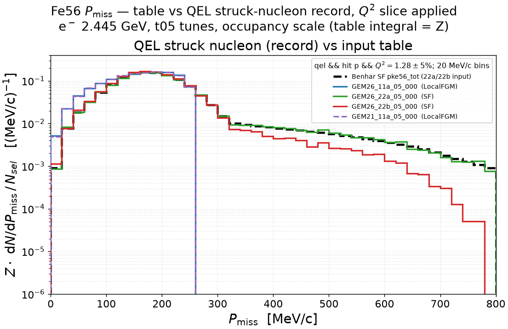

Same construction as v0.1 section 5 (table-native 20 MeV/c grid, occupancy
scale, every curve integrates to Z = 26), record from the windowed ladder
caches:

| tune | median |p_n| [MeV/c] | P(p > 250 MeV/c) |
|---|---|---|
| table (sampling weight) | — | 0.158 |
| GEM26_11a_05_000 (LFG) | 165.1 | 0.018 |
| GEM26_22a_05_000 (SF) | 184.2 | 0.190 |
| GEM26_22b_05_000 (SF) | 178.6 | 0.143 |
| GEM21_11a_05_000 (LFG) | 164.5 | 0.017 |

The window sharpens the v0.1 pattern slightly: 22a's tail enhancement over
the table grows to 0.190 (uncut 0.185), 22b stays xsec-suppressed at 0.143,
and the LFG tunes keep the local-k_F cutoff with P(p > 250) ≈ 2 %.

Regenerate: `pixi run python results/template/make_pmiss_q2cut.py --target Fe56`.

## 6. Signed missing momentum (± asymmetry)

Same sign convention and construction as v0.1 section 6 (sign of p_m·x̂,
density with 4πp² divided out, estimator window 0 < E_m < 80 MeV,
fig7_q1p2 symmetrized overlay shape-scaled), with the Q² window added to the
selection:

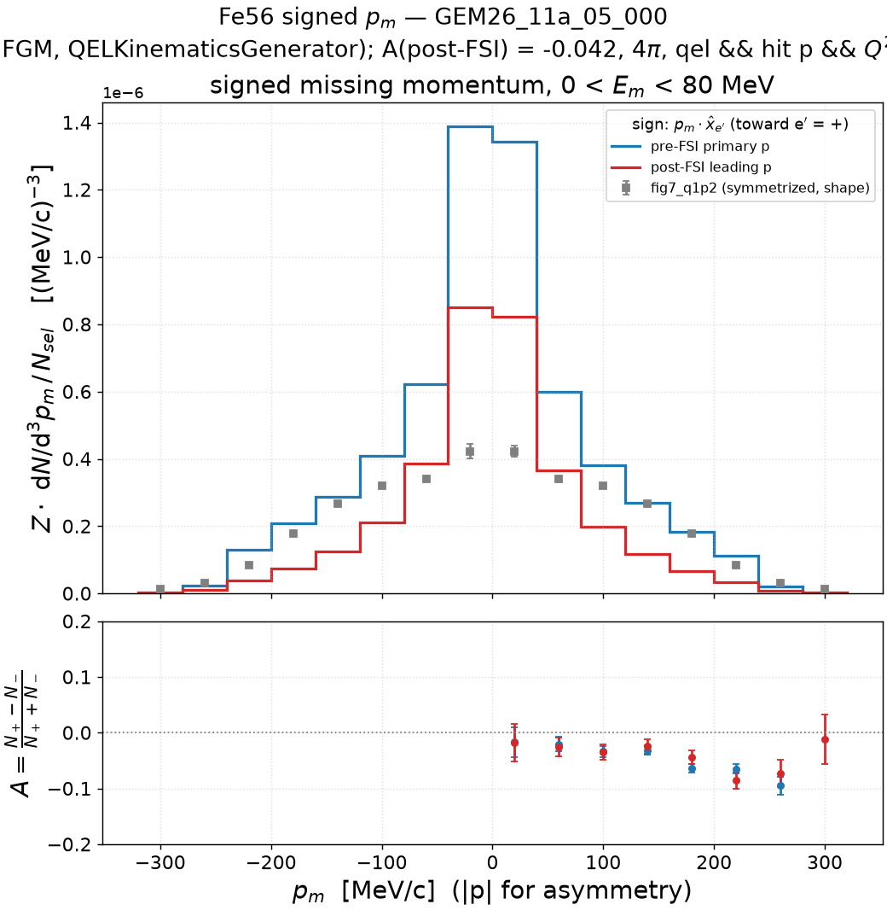
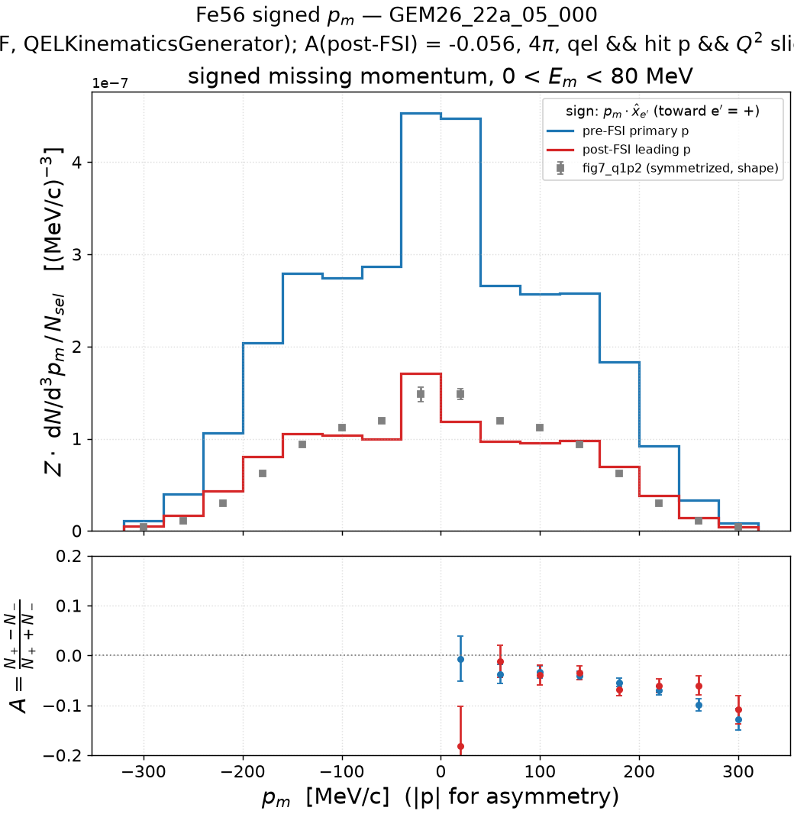
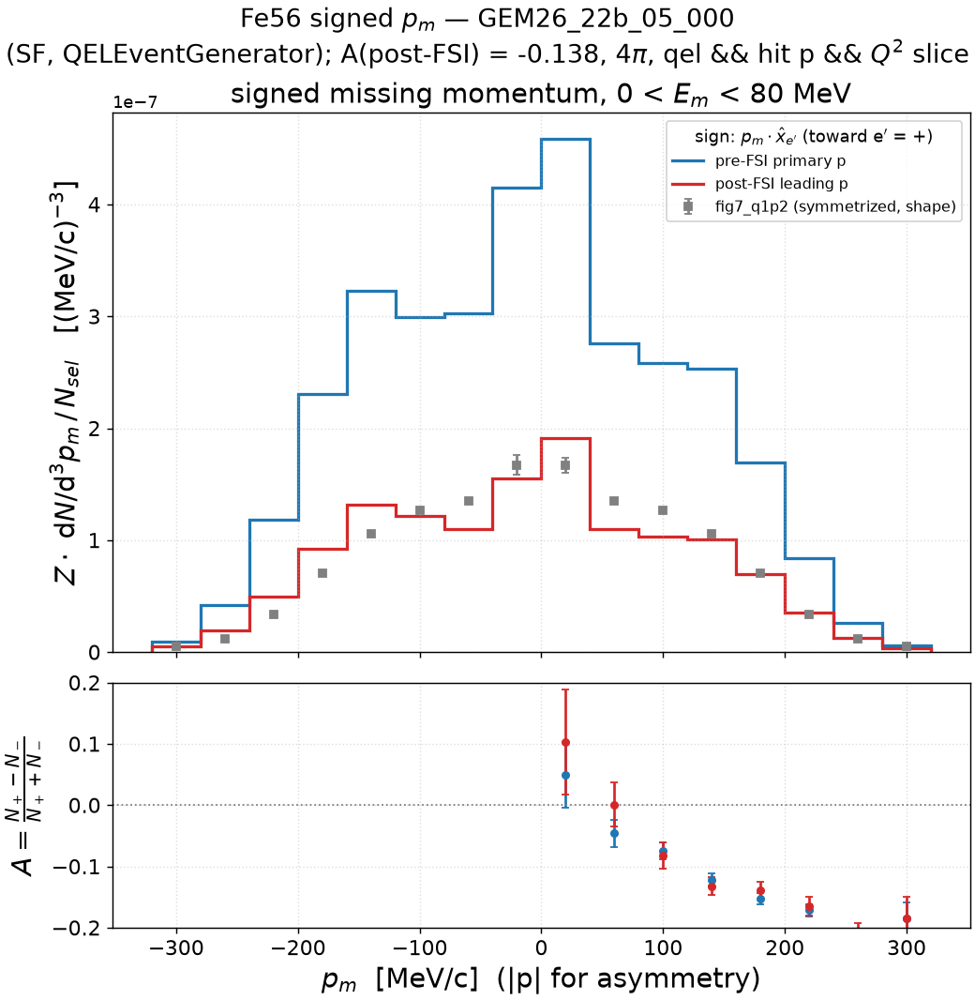
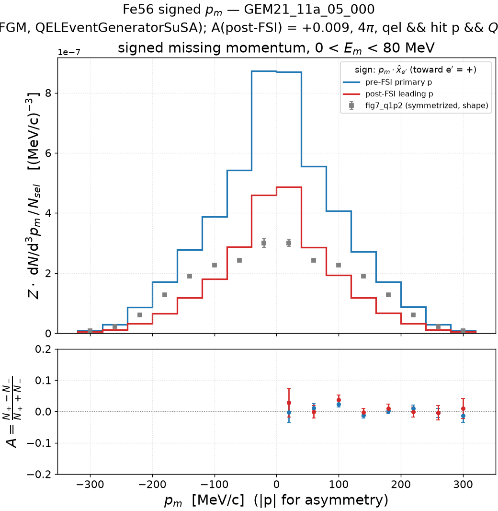

| tune | generator | A pre-FSI | A post-FSI | v0.1 A pre-FSI (uncut) |
|---|---|---|---|---|
| GEM26_11a_05_000 | `QELKinematicsGenerator` | −0.0495 ± 0.0038 | −0.0424 ± 0.0059 | −0.0466 |
| GEM26_22a_05_000 | `QELKinematicsGenerator` | −0.0581 ± 0.0040 | −0.0561 ± 0.0063 | −0.0546 |
| GEM26_22b_05_000 | `QELEventGenerator` | **−0.1416 ± 0.0046** | **−0.1385 ± 0.0071** | −0.1283 |
| GEM21_11a_05_000 | `QELEventGeneratorSuSA` | **+0.0036 ± 0.0041** | **+0.0085 ± 0.0063** | +0.0028 |

The generator taxonomy survives the slice intact — QKG ≈ −0.05, QEG more
than doubles it, SuSA ≈ 0 — with each |A| slightly *larger* than uncut
(22b −0.142 vs −0.128): restricting to the slice does not remove the
kinematic asymmetry, it concentrates it. The signed p_m therefore remains a
generator diagnostic, not a physical W_LT response, in exactly the phase
space where the data lives.

Regenerate: `pixi run python results/template/make_pmiss_signed_q2cut.py --target Fe56 --all-tunes`
(cache: `cache/pmiss_signed_fe56/`).
