# Electron–C12 scattering — Q² slice, exactly-one-proton selection (v0.3)

v0.3 instance of
[`../prd-analyzer-v0.2/electron_c12_scattering.md`](../prd-analyzer-v0.2/electron_c12_scattering.md):
identical samples (C12 full-EM t05 grid campaign 2026-07-26, 2M events/tune)
and constructions, with the post-FSI proton selection changed from *leading
proton* to **exactly one final-state proton** (N_p = 1); neutrons and all
other final-state particles unconstrained. N_p = 1 applies in sections
3/3.1, 4, 5, 7; the record-based sections link below.

**Headline, as on iron: within the window the two selections nearly
coincide** — the ≥2p population (≈ 16–17 % of qel ∧ hit-p ∧ window events,
smaller than Fe56's ≈ 26 %, the transparency ordering) almost never passes
the E_m/p_m window, so in-window counts drop only ~0.3–0.9 % vs v0.2 and
all in-window observables are statistically unchanged.

## 1. C12 2D spectral function — the GENIE input table

Cut- and selection-independent — see
[v0.1 section 1](../prd-analyzer-v0.1/electron_c12_scattering.md#1-c12-2d-spectral-function--the-genie-input-table).

## 2. Struck nucleon in the record

Record-level — independent of the FS-proton choice; see
[v0.2 section 2](../prd-analyzer-v0.2/electron_c12_scattering.md#2-struck-nucleon-in-the-record-sampled-p_miss-e_rm-and-p_miss-r).

## 3. QEL kinematics in the slice — E_e′, θ_e′, T_p, θ_p, Q²

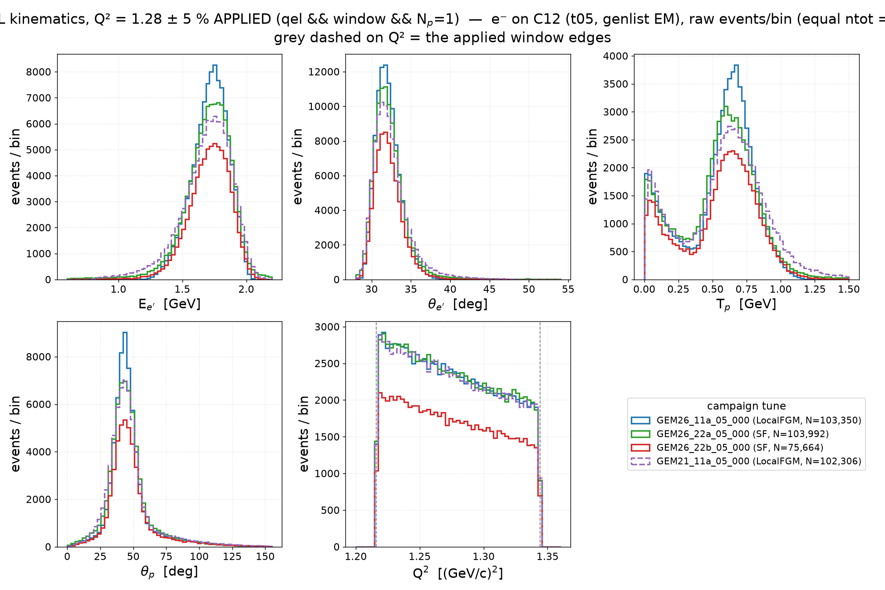

As v0.2 section 3 with the T_p/θ_p panels restricted to N_p = 1
(**events/bin above**, equal ntot = 2M/tune; area-normalized shape
companion `kin_qel_q2cut_c12.png`). Multiplicity split of the
qel ∧ window sample (both hit-nucleon species):

| tune | 0p | 1p | ≥2p |
|---|---|---|---|
| GEM26_11a_05_000 | 21.5 % | 63.1 % | 15.4 % |
| GEM26_22a_05_000 | 22.6 % | 62.1 % | 15.3 % |
| GEM26_22b_05_000 | 20.1 % | 63.9 % | 16.0 % |
| GEM21_11a_05_000 | 20.5 % | 63.7 % | 15.8 % |

The 1p requirement trims the low-T_p multi-proton population, further
strengthening the carbon ordering (QE bump over FSI hump) that v0.2 already
showed.

### 3.1 E_m and p_m in the slice — no E_m/p_m cuts

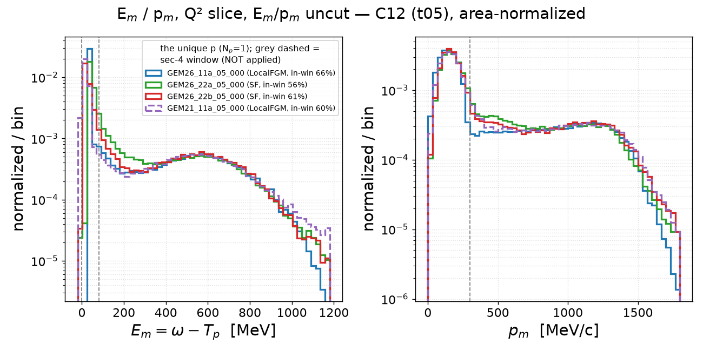

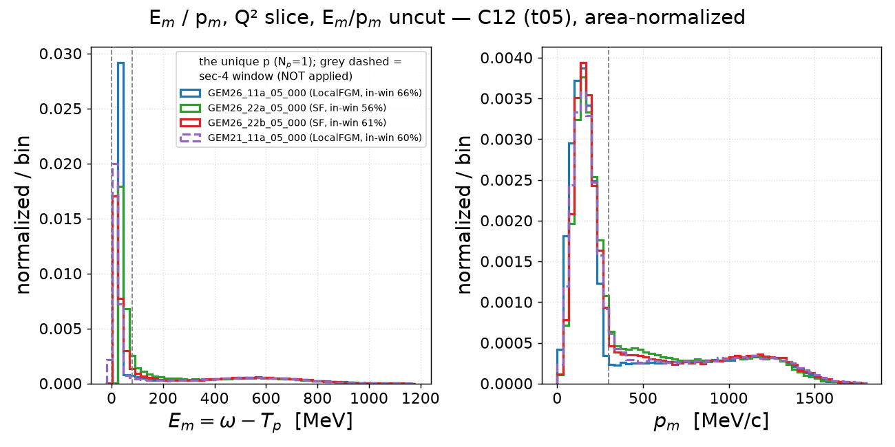

As v0.2 subsection 3.1 with N_p = 1 (log-y above for the tails, linear-y
below for the true proportions; raw-counts companion
`empm_q2cut_c12_counts.png`). In-window fractions rise to
66 / 56 / 61 / 60 % (11a/22a/22b/GEM21) from v0.2's 53 / 45 / 49 / 48 % —
the removed ≥2p events were dominantly out-of-window (the uncorrelated
p_m ≈ |q| bump).

Regenerate (this and 3.1):
`pixi run python results/template/make_kin_qel_q2cut.py --target C12 --proton-sel 1p`.

## 4. Missing energy: table vs simulation vs Dutta Fig. 9

Stage 4 = the unique proton of N_p = 1 events (stages 1–3 unchanged):

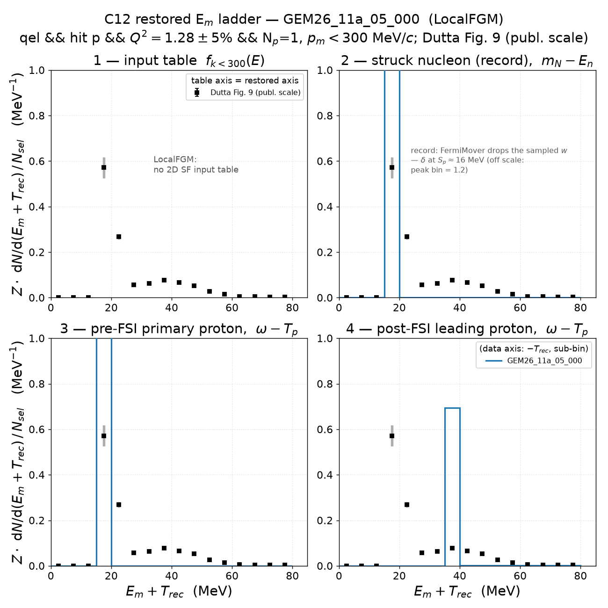
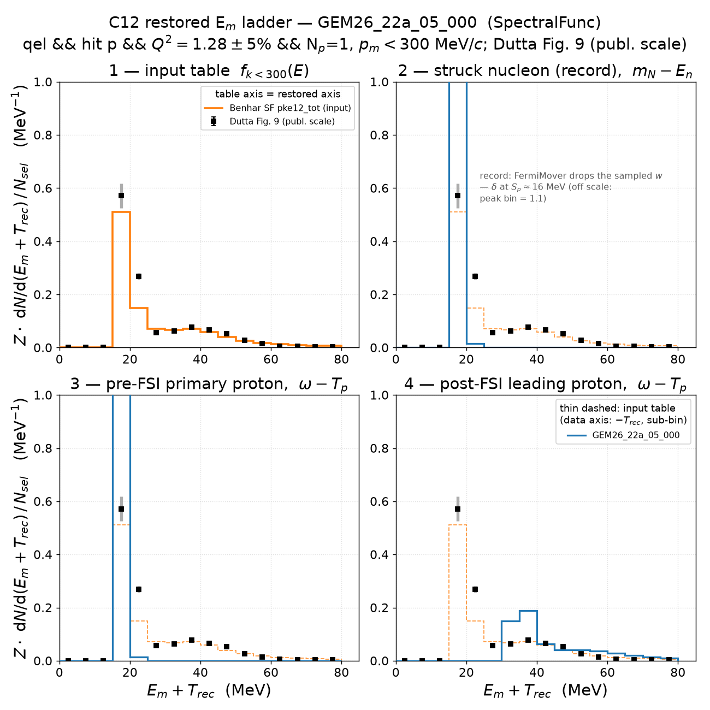
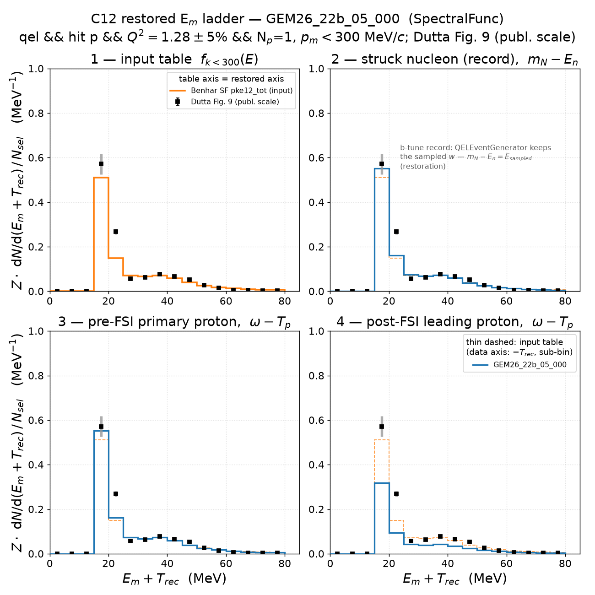
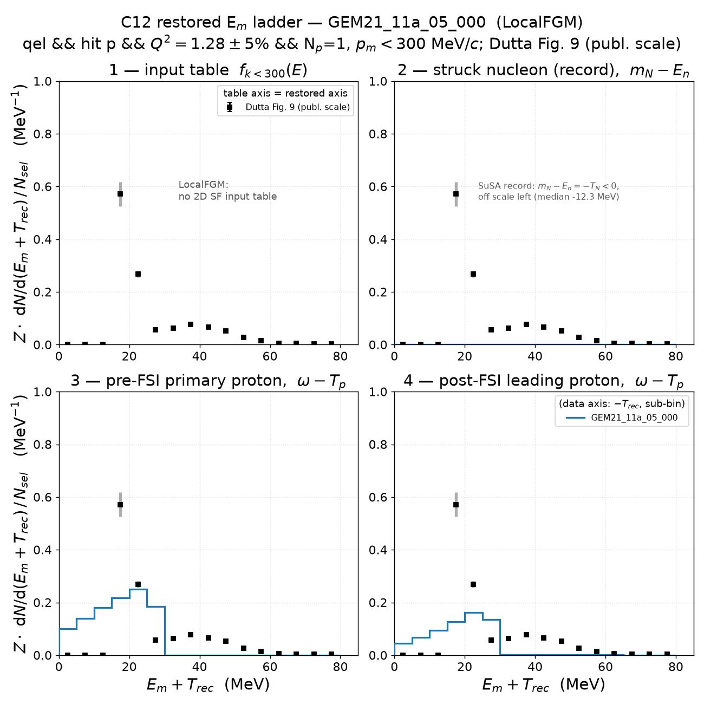

| tune | N_sel | 1p fraction | I2r = I3r | I4r | I4r/I3r (v0.2) | 1p in-window (v0.2) |
|---|---|---|---|---|---|---|
| GEM26_11a_05_000 | 72,490 | 80.7 % | 6.000 | 3.545 | 0.591 (0.592) | 42,825 (42,946) |
| GEM26_22a_05_000 | 72,953 | 79.4 % | 5.425 | 2.965 | 0.546 (0.548) | 36,047 (36,154) |
| GEM26_22b_05_000 | 53,517 | 81.0 % | 5.530 | 3.247 | 0.587 (0.592) | 28,961 (29,198) |
| GEM21_11a_05_000 | 71,630 | 81.2 % | 5.363 | 3.220 | 0.600 (0.606) | 38,447 (38,804) |

I2r = I3r exact, record medians identical to v0.2; the C12 > Fe56
transparency ordering (0.55–0.60 vs 0.38–0.42) is untouched. Post-FSI shape
figures (`em_postfsi_shape_c12_*.png`) statistically identical to v0.2.

Regenerate: `pixi run python results/template/make_emiss_ladder_q2cut.py --target C12 --all-tunes --proton-sel 1p`.

### 4.1 Missing momentum: table vs record vs pre/post-FSI proton

The |p_m| projection of the same four-stage ladder
([`make_pmiss_ladder_q2cut.py`](../template/make_pmiss_ladder_q2cut.py),
reading the section-4 caches): each stage histogrammed in |p_m| (native
20 MeV/c bins, occupancy scale) with the E_m window applied instead — here
the fig 6 **shell windows** `E_m + T_rec` 10–25 ∪ 30–50 MeV, matching the
overlaid data (fig 6 top+bottom summed, L+R folded = the full |p_m| density
on the published scale; weighted 4πp_m² onto the occupancy axis).

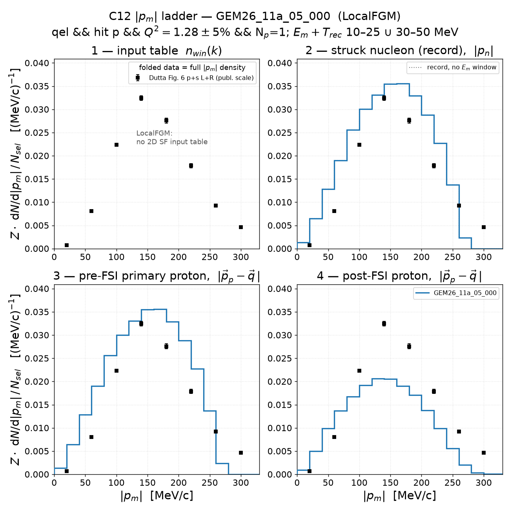
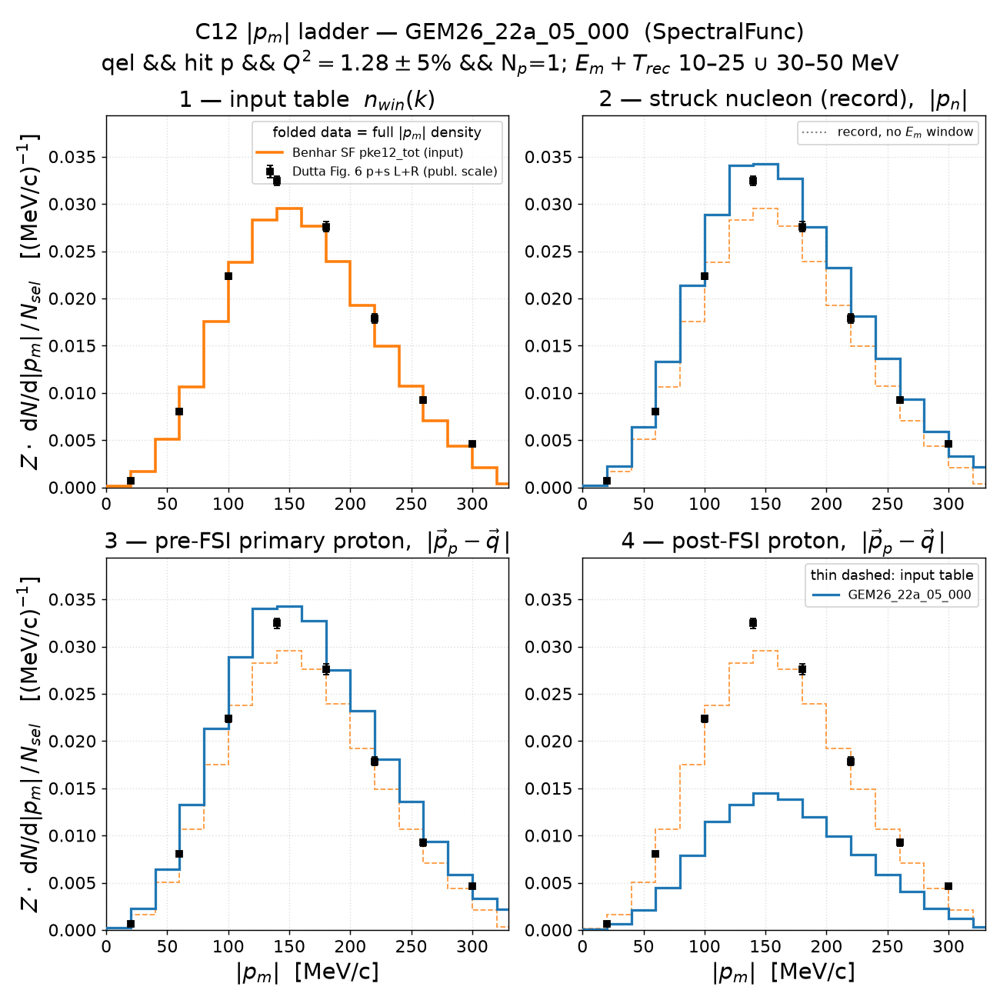
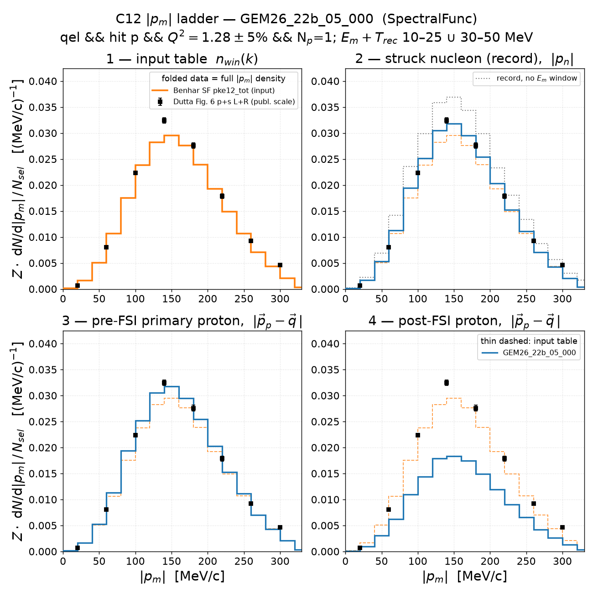
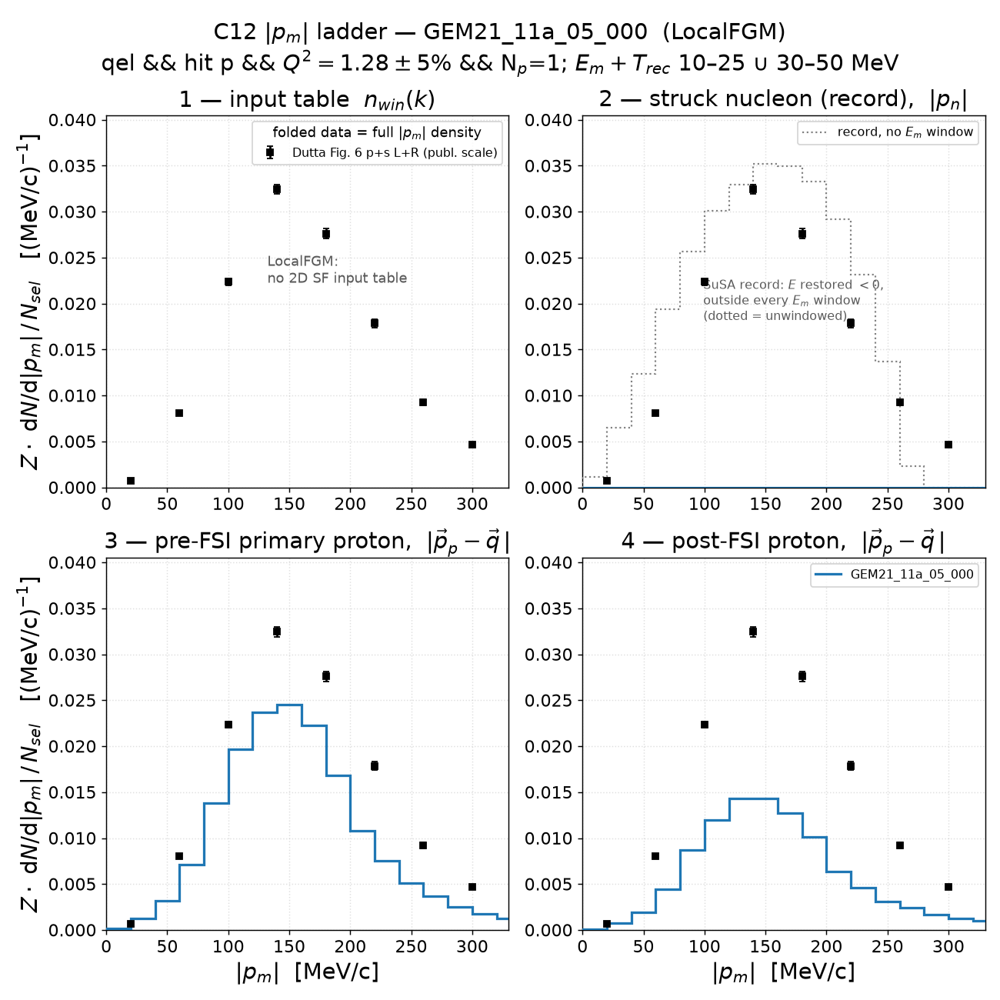

Windowed strengths, |p_m| < 320 MeV/c: I1(table) = 4.533,
I(data) = 4.917, **data/table = 1.08** — between the folded p-shell (1.06)
and s-shell (1.16) ratios of the
[normalization page](../../results/normalization/README.md).

| tune | I2 (record) | I3 (pre-FSI) | I4 (post-FSI) | I4/I3 | §4 I4r/I3r (0–80 window) |
|---|---|---|---|---|---|
| GEM26_11a_05_000 | 6.000 | 6.000 | 3.489 | 0.581 | 0.591 |
| GEM26_22a_05_000 | 5.492 | 5.492 | 2.234 | **0.407** | 0.546 |
| GEM26_22b_05_000 | 4.810 | 4.810 | 2.802 | 0.583 | 0.587 |
| GEM21_11a_05_000 | 0 (record E < 0) | 3.279 | 1.976 | 0.603 | 0.600 |

- **The narrow shell windows expose the ΔT_p taxonomy of section 5.** 22a's
  survival collapses to 0.407 (vs 0.546 in the full 0–80 window): its
  *broad* FSI energy loss (median ≈ 20 MeV) smears survivors into the
  25–30 MeV gap and past 50 MeV. 11a loses almost nothing (0.581 vs 0.591)
  despite its sharp +20.0 MeV shift — that line moves p-shell events
  coherently *into* the 30–50 window. 22b/GEM21 (ΔT_p = 0) are unchanged.
- Stage-2 windowing is meaningful only for 22b (record keeps the sampled E:
  I2 = 4.81, close to the windowed table); 11a/22a record a δ at
  S_p ≈ 16 MeV inside the p-shell window (I2 = full k-marginal), GEM21's
  negative record E empties the stage.
- GEM21 stage 3: I3 = 3.279 of 6 — the SuSA E distribution only partly
  overlaps the shell windows, unlike iron's wide 0–80 window (24.5 of 26).
- Shape: the pre-FSI stages track the table including the ℓ = 1 dip at
  |p_m| → 0; the folded data sit slightly above at the peak (the 1.08) and
  the post-FSI stage suppresses without strong reshaping.

Regenerate: `pixi run python results/template/make_pmiss_ladder_q2cut.py --target C12 --all-tunes --proton-sel 1p`.

## 5. Pre- vs post-FSI proton

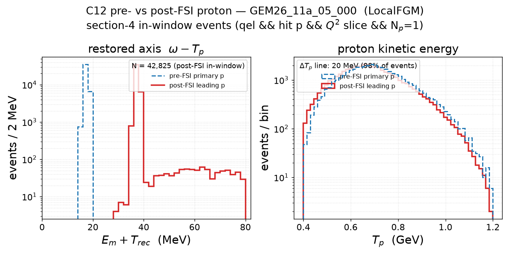
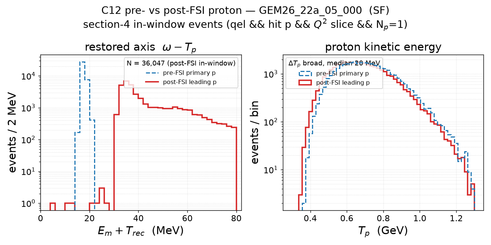

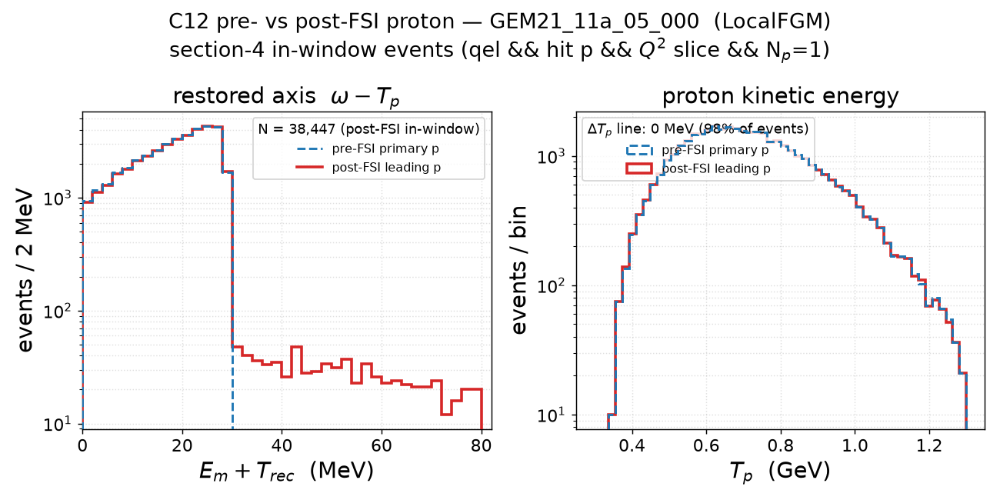

Multiplicity on the qel ∧ hit-p ∧ window sample: 0p = 2.9/4.3/1.8/1.8 %
(≡ v0.2's proton-loss column), 1p = 80.7/79.4/81.0/81.2 %,
≥2p = 16.3/16.3/17.2/17.0 %. ΔT_p unchanged from v0.2 — 11a: +20.0 MeV
sharp (98 %); 22a: broad, median 20.1 MeV; 22b/GEM21: 0.00 MeV — and the
unique proton is the primary's descendant in 100.0 % of in-window events.

Regenerate: `pixi run python results/template/make_fsi_proton_choice.py --target C12 --all-tunes --proton-sel 1p`.

## 6. Missing momentum: table vs QEL struck-nucleon record

Record-level — see
[v0.2 section 6](../prd-analyzer-v0.2/electron_c12_scattering.md#6-missing-momentum-table-vs-qel-struck-nucleon-record).

## 7. Signed missing momentum (± asymmetry)

| tune | generator | A pre-FSI | A post-FSI | v0.2 A post-FSI |
|---|---|---|---|---|
| GEM26_11a_05_000 | `QELKinematicsGenerator` | −0.0568 ± 0.0037 | −0.0499 ± 0.0048 | −0.0499 |
| GEM26_22a_05_000 | `QELKinematicsGenerator` | −0.0469 ± 0.0039 | −0.0495 ± 0.0052 | −0.0493 |
| GEM26_22b_05_000 | `QELEventGenerator` | −0.1318 ± 0.0044 | −0.1268 ± 0.0058 | −0.1264 |
| GEM21_11a_05_000 | `QELEventGeneratorSuSA` | −0.0004 ± 0.0040 | −0.0011 ± 0.0051 | −0.0016 |

Statistically identical to v0.2 (`pmiss_signed_c12_*.png` here): the signed
asymmetry taxonomy is multiplicity-blind inside the estimator window.

Regenerate: `pixi run python results/template/make_pmiss_signed_q2cut.py --target C12 --all-tunes --proton-sel 1p`.
