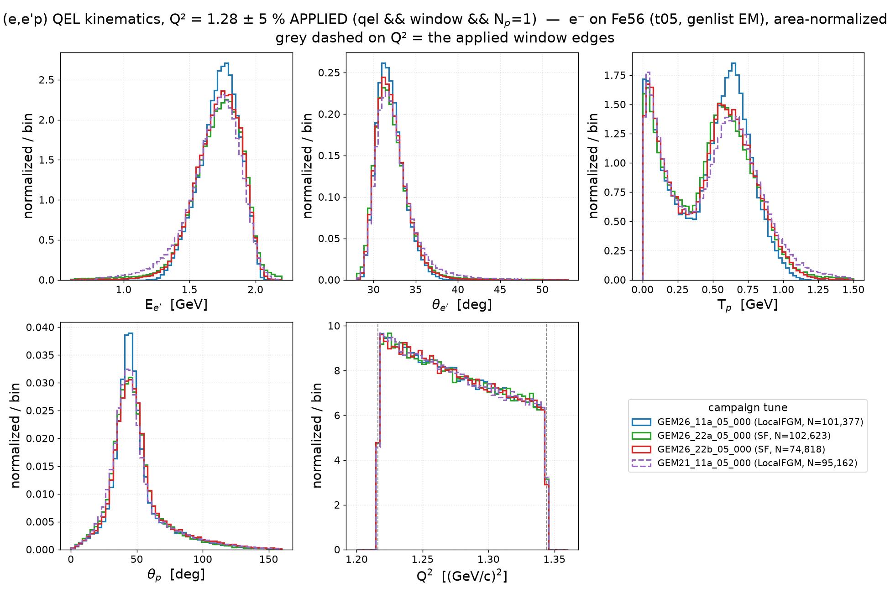
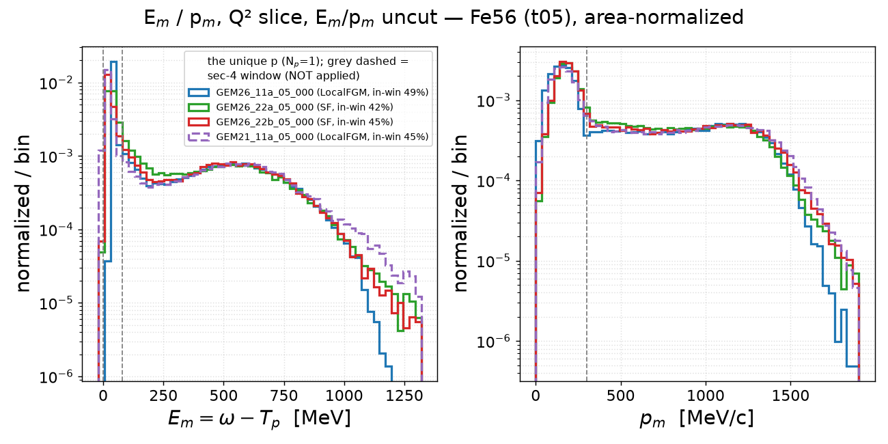
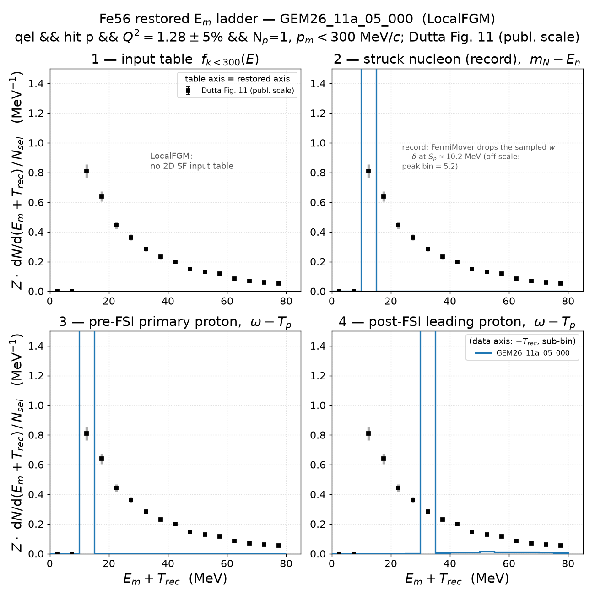
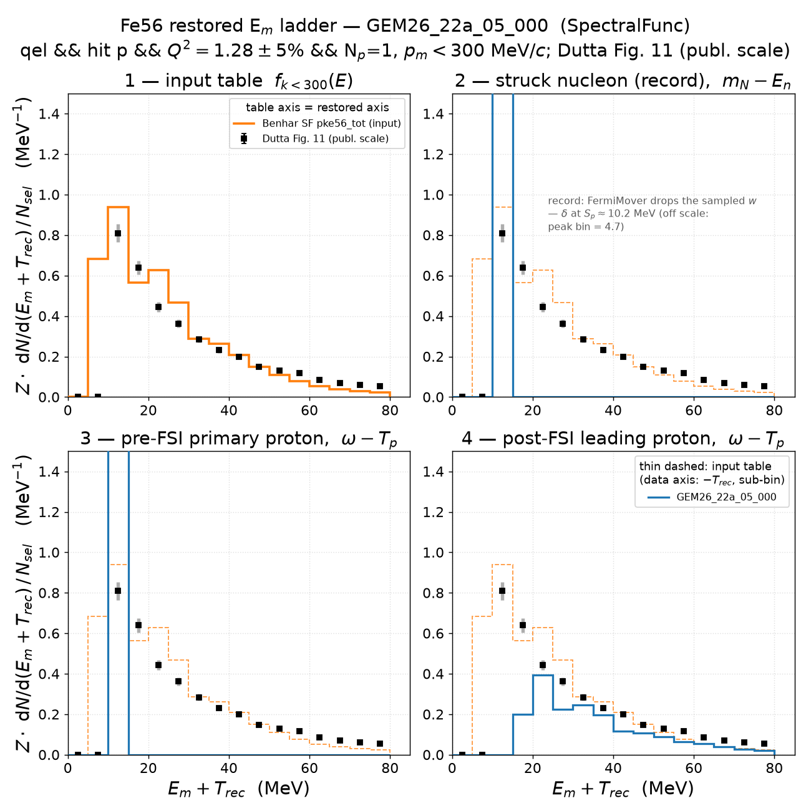
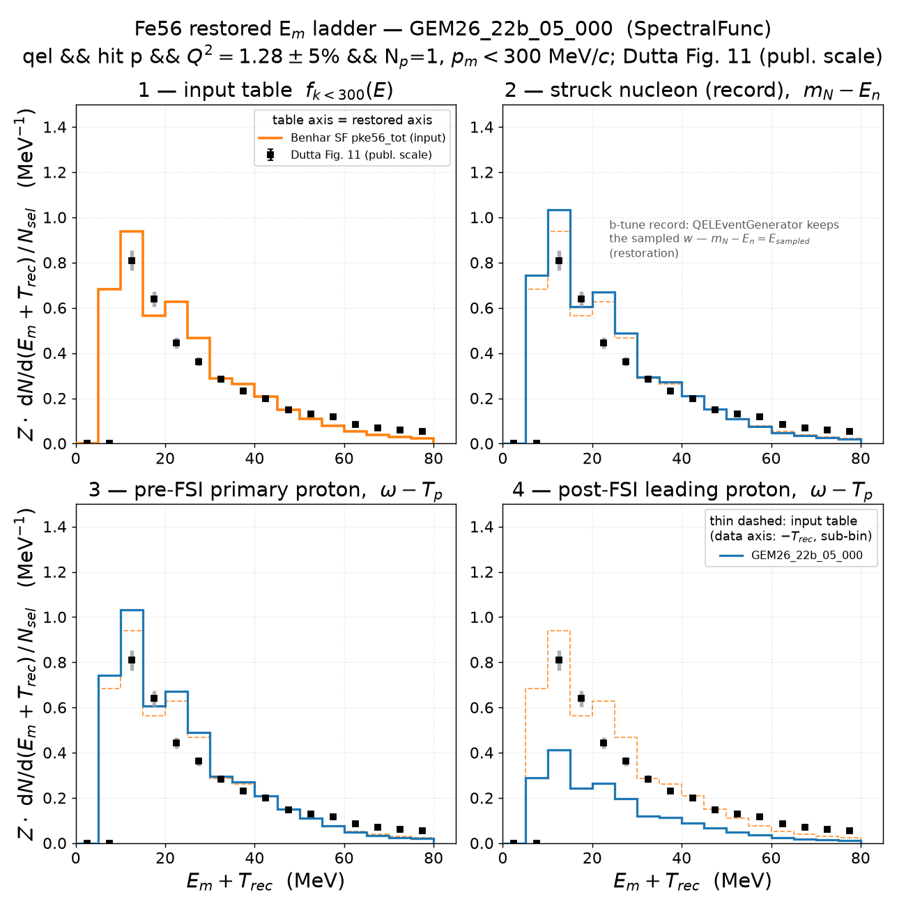
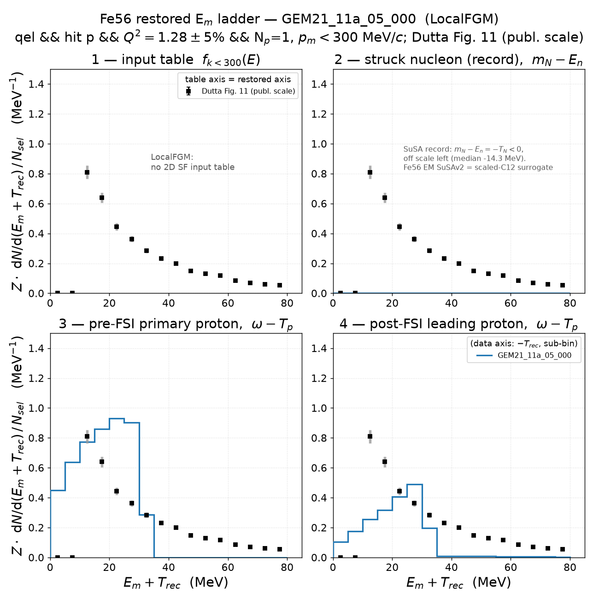
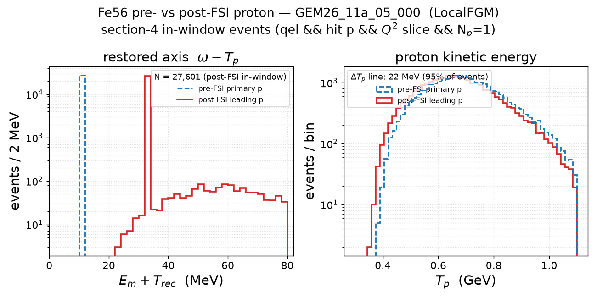
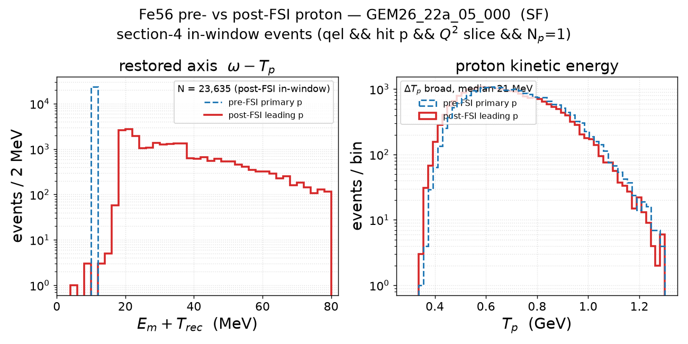
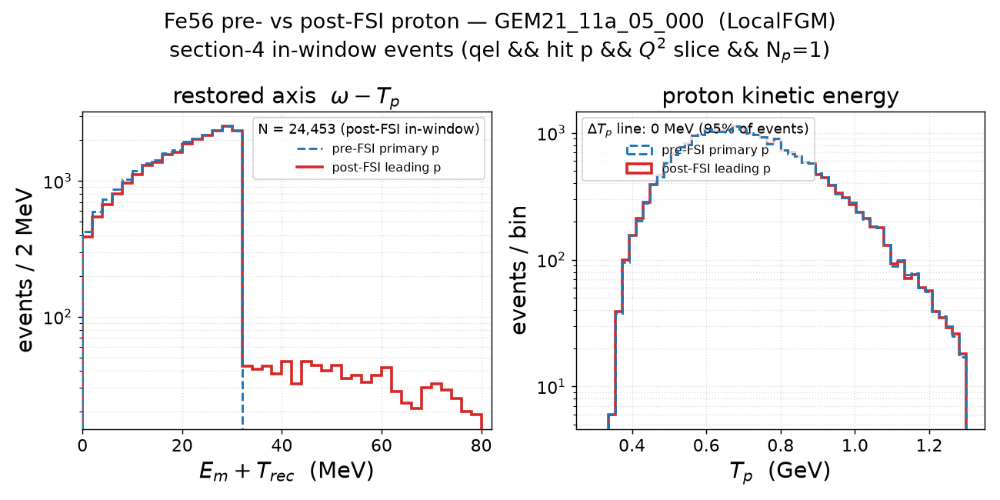

# Electron–Fe56 scattering — Q² slice, exactly-one-proton selection (v0.3)

v0.3 instance of
[`../prd-analyzer-v0.2/electron_fe56_scattering.md`](../prd-analyzer-v0.2/electron_fe56_scattering.md):
identical samples and constructions, with the post-FSI proton selection
changed from *leading proton* to **exactly one final-state proton**
(N_p = 1; "the" proton is then unambiguous and coincides with the leading
one). Neutrons and all other final-state particles are unconstrained. The
N_p = 1 requirement applies where a post-FSI proton is reconstructed
(sections 3/3.1, 4, 5, 7); the record-based sections are untouched by the
proton choice and link below. Sample: Fe56 full-EM t05 grid campaign
2026-07-16, 2M events/tune.

**Headline: within the Dutta window, N_p = 1 and leading-proton are nearly
the same analysis.** The window sample carries a large ≥2p population
(≈ 26 % of qel ∧ hit-p ∧ window events), but those events almost never pass
the E_m/p_m window — the in-window counts drop only ~0.7–1.8 % vs v0.2, and
every in-window observable shifts by ≲ 2 %. The selections differ materially
only in the inclusive (unwindowed) views of section 3.

## 1. Fe56 2D spectral function — the GENIE input table

Cut- and selection-independent — see
[v0.1 section 1](../prd-analyzer-v0.1/electron_fe56_scattering.md#1-fe56-2d-spectral-function--the-genie-input-table).

## 2. Struck nucleon in the record

Record-level (pre-FSI) — independent of the FS-proton choice; see
[v0.2 section 2](../prd-analyzer-v0.2/electron_fe56_scattering.md#2-struck-nucleon-in-the-record-sampled-p_miss-e_rm-and-p_miss-r).

## 3. QEL kinematics in the slice — E_e′, θ_e′, T_p, θ_p, Q²

As v0.2 section 3 with the T_p/θ_p panels restricted to N_p = 1 events
(electron-arm panels unchanged; raw-counts companion
`kin_qel_q2cut_fe56_counts.png`). Multiplicity split of the qel ∧ window
sample (both hit-nucleon species):

| tune | 0p | 1p | ≥2p |
|---|---|---|---|
| GEM26_11a_05_000 | 19.2 % | 57.1 % | 23.7 % |
| GEM26_22a_05_000 | 20.6 % | 56.0 % | 23.3 % |
| GEM26_22b_05_000 | 17.2 % | 58.9 % | 23.9 % |
| GEM21_11a_05_000 | 17.8 % | 58.6 % | 23.6 % |

The visible v0.3 effect lives here: the ≥2p events populate the low-T_p
region, so requiring N_p = 1 removes much of the FSI-rescattered hump — the
two T_p peaks are now comparable on iron (the QE bump wins for 11a), where
the leading-proton selection of v0.2 had the low-T_p population clearly
dominant.

### 3.1 E_m and p_m in the slice — no E_m/p_m cuts

As v0.2 subsection 3.1 with N_p = 1 (`empm_q2cut_fe56_counts.png`,
`empm_q2cut_fe56_lin.png` companions). The uncorrelated-proton p_m bump at
≈ |q| shrinks relative to v0.2 (much of it was multi-proton), raising the
in-window fractions to 49 / 42 / 45 / 45 % (11a/22a/22b/GEM21) from v0.2's
35 / 30 / 32 / 33 %.

Regenerate (this and 3.1):
`pixi run python results/template/make_kin_qel_q2cut.py --target Fe56 --proton-sel 1p`.

## 4. Missing energy: table vs simulation vs Dutta Fig. 11

Same windowed restored ladder as v0.2 section 4, stage 4 = the unique
proton of N_p = 1 events (stages 1–3 unchanged by construction):

| tune | N_sel | 1p fraction | I2r = I3r | I4r | I4r/I3r (v0.2) | 1p in-window (v0.2) |
|---|---|---|---|---|---|---|
| GEM26_11a_05_000 | 68,047 | 69.8 % | 26.000 | 10.546 | 0.406 (0.408) | 27,601 (27,785) |
| GEM26_22a_05_000 | 68,724 | 68.8 % | 23.340 | 8.942 | 0.383 (0.386) | 23,635 (23,816) |
| GEM26_22b_05_000 | 50,727 | 71.6 % | 23.952 | 9.799 | 0.409 (0.415) | 19,118 (19,390) |
| GEM21_11a_05_000 | 63,245 | 71.6 % | 24.203 | 10.053 | 0.415 (0.423) | 24,453 (24,899) |

I2r = I3r exact and record medians identical to v0.2 (stages 2–3
untouched); the in-window survival drops by only 0.003–0.008 despite the 1p
fraction being ~70 % — **the ≥2p events the new selection removes were
already almost entirely outside the window**. Post-FSI shape figures
(`em_postfsi_shape_fe56_*.png`, produced by the same run) are statistically
identical to v0.2's: the ΔT_p structure is a per-chain property, not a
multiplicity one.

Regenerate: `pixi run python results/template/make_emiss_ladder_q2cut.py --target Fe56 --all-tunes --proton-sel 1p`
(cache: `cache/ladder_fe56/` here).

## 5. Pre- vs post-FSI proton

As v0.2 section 5 on the N_p = 1 in-window set (the dumper's `np` column;
`fsi_prepost_fe56_*.png` here):

Multiplicity on the qel ∧ hit-p ∧ window sample: 0p = 3.9/5.4/2.0/2.3 %
(≡ v0.2's proton-loss column), 1p = 69.8/68.8/71.6/71.6 %,
≥2p = 26.2/25.8/26.4/26.1 % (11a/22a/22b/GEM21). The ΔT_p physics is
unchanged from v0.2 — 11a: sharp +23.0 MeV line (96 % of survivors);
22a: broad, median 21.1 MeV; 22b/GEM21: 0.00 MeV — and the unique proton is
the primary's descendant in 100.0 % of in-window events.

Regenerate: `pixi run python results/template/make_fsi_proton_choice.py --target Fe56 --all-tunes --proton-sel 1p`.

## 6. Missing momentum: table vs QEL struck-nucleon record

Record-level — independent of the FS-proton choice; see
[v0.2 section 6](../prd-analyzer-v0.2/electron_fe56_scattering.md#6-missing-momentum-table-vs-qel-struck-nucleon-record).

## 7. Signed missing momentum (± asymmetry)

As v0.2 section 7 with N_p = 1 (`pmiss_signed_fe56_*.png` here):

| tune | generator | A pre-FSI | A post-FSI | v0.2 A post-FSI |
|---|---|---|---|---|
| GEM26_11a_05_000 | `QELKinematicsGenerator` | −0.0495 ± 0.0038 | −0.0436 ± 0.0060 | −0.0432 |
| GEM26_22a_05_000 | `QELKinematicsGenerator` | −0.0581 ± 0.0040 | −0.0565 ± 0.0064 | −0.0566 |
| GEM26_22b_05_000 | `QELEventGenerator` | −0.1416 ± 0.0046 | −0.1392 ± 0.0071 | −0.1385 |
| GEM21_11a_05_000 | `QELEventGeneratorSuSA` | +0.0036 ± 0.0041 | +0.0079 ± 0.0064 | +0.0085 |

Statistically identical to v0.2 (all shifts ≪ 1σ): the generator taxonomy
of the asymmetry is insensitive to the proton-multiplicity requirement
inside the estimator window.

Regenerate: `pixi run python results/template/make_pmiss_signed_q2cut.py --target Fe56 --all-tunes --proton-sel 1p`
(cache: `cache/pmiss_signed_fe56/` here).
