# Electron–C12 scattering — full generated phase space, exactly-one-proton selection (v1.0)

v1.0 opens the [v0.3](../prd-analyzer-v0.3/electron_c12_scattering.md) analysis
back up to the **full generated phase space**: the Dutta Q² = 1.28 ± 5 % slice
is dropped, keeping only

    qel                            (electron panels)
    qel && N_p(final state) = 1    (proton panels)

with the same samples (C12 full-EM t05 grid campaign 2026-07-26, 2M
events/tune) and the v0.3 exactly-one-proton convention. "Uncut" means the
full *generated* phase space: the t05 campaigns carry the generation cut
**EM-MinQ2Limit = 1.18 GeV²**, which remains the hard lower edge of every Q²
distribution — nothing below 1.18 exists in the samples.

## 1. QEL kinematics — E_e′, θ_e′, T_p, θ_p, Q², no Q² cut

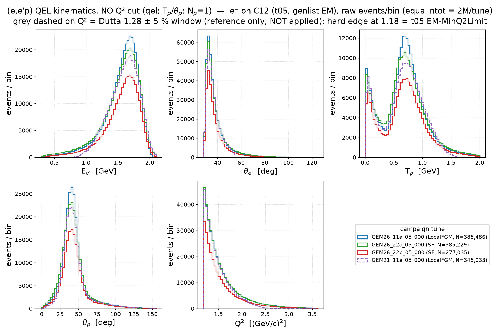

Raw events/bin (equal ntot = 2M/tune; area-normalized shape companion
`kin_qel_c12.png`), script
[`make_kin_qel_v1.py`](../template/make_kin_qel_v1.py) — the uncut
counterpart of v0.3 section 3, reading the v0.1 caches with no Q² mask. The
grey dashed lines on the Q² panel are the Dutta window as **reference only**
(nothing applied).

Selection counts (the legend N = qel events):

| tune | qel N (of 2M) | has_p | 0p | 1p | ≥2p |
|---|---|---|---|---|---|
| GEM26_11a_05_000 | 385,486 | 78.1 % | 21.9 % | 63.1 % | 15.0 % |
| GEM26_22a_05_000 | 385,229 | 76.9 % | 23.1 % | 62.2 % | 14.8 % |
| GEM26_22b_05_000 | 277,035 | 79.5 % | 20.5 % | 64.1 % | 15.4 % |
| GEM21_11a_05_000 | 345,033 | 79.0 % | 21.0 % | 63.6 % | 15.4 % |

(multiplicity split of the full qel sample, both hit-nucleon species;
panel ranges pooled p0.2–p99.8: E_e′ [0.3, 2.1] GeV, θ_e′ [28, 125]°,
T_p [0, 2] GeV, θ_p [0, 155]°, Q² [1.18, 3.62] GeV².)

- **The multiplicity split is nearly identical to v0.3's in-window one**
  (there: 0p 20.1–22.6 %, 1p 62.1–63.9 %, ≥2p 15.3–16.0 %): within the
  generated Q² ≥ 1.18 range the FS-proton multiplicity is essentially
  Q²-independent, so the Dutta slice never biased it.
- **22b's overall qel deficit is the dominant inter-tune difference**
  (277k vs 345–385k qel events of the same 2M): an overall scale visible in
  every panel, not a shape effect — the `QELEventGenerator`+SF combination
  yields fewer accepted QEL events across the whole phase space.
- Q² falls steeply from the 1.18 edge (~2 decades to 3.6 GeV²); the Dutta
  window sits directly on the most-populated edge region, which is what made
  the v0.2/v0.3 slice statistics comfortable.
- T_p keeps its two-component structure in the full phase space: the QE bump
  (peak ≈ 0.7 GeV, the Q²-broadened image of the v0.3 slice's peak) over the
  low-T_p FSI-rescatter hump, with the N_p = 1 selection keeping the QE bump
  dominant for every tune. GEM21 (dashed) cuts off earliest in both E_e′
  (shoulder deficit below ≈ 0.9 GeV) and T_p (≈ 1.6 GeV endpoint).

**Q²-cut companion** (`--q2cut`): the same figure with the Dutta window
**applied** — the v0.3 section-3 construction reproduced here for the
side-by-side (shape companion `kin_qel_q2cut_c12.png`):

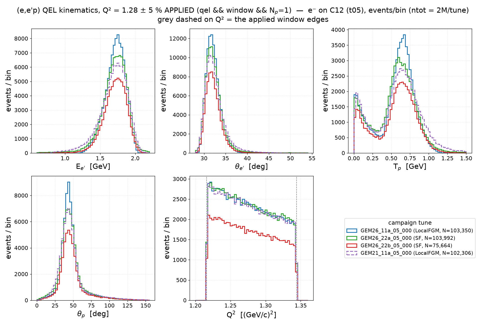

The slice keeps 103,350 / 103,992 / 75,664 / 102,306 events
(11a/22a/22b/GEM21 — 26–27 % of the uncut qel N) and reproduces the v0.3
numbers exactly (window multiplicity 1p = 62.1–63.9 %). Against the uncut
figure above: the electron arm collapses to the elastic-like corner
(E_e′ peak 1.75 GeV, θ_e′ ≈ 32°), T_p concentrates at the ≈ 0.68 GeV QE
bump — while θ_p and the proton-panel shapes barely change.

Regenerate (this, the companion, and 1.1):
`pixi run python results/template/make_kin_qel_v1.py --target C12`
(`--q2cut` for the applied-window pair).

### 1.1 E_m and p_m — no cuts at all

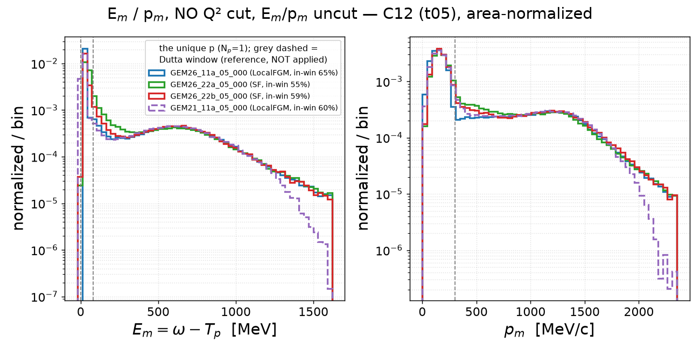

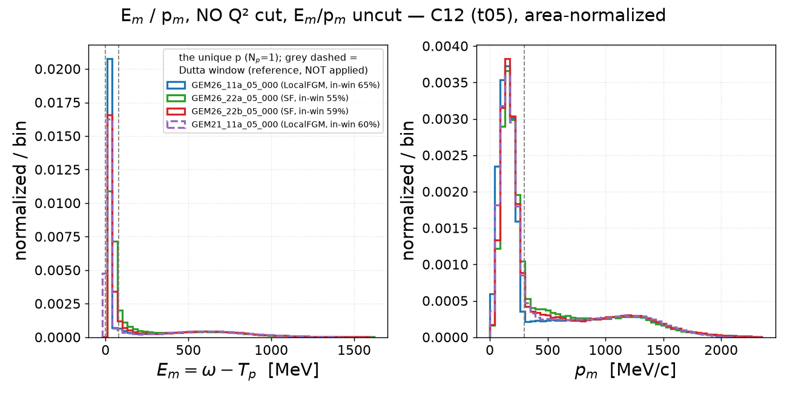

The v0.3 subsection-3.1 construction on the full generated phase space
(log-y above for the tails, linear-y below for the true proportions;
raw-counts companion `empm_c12_counts.png`): E_m = ω − T_p and p_m of the
unique proton, no E_m/p_m cuts, the Dutta window grey-dashed as reference.
In-window fractions (of qel ∧ N_p = 1): **65 / 55 / 59 / 60 %**
(11a/22a/22b/GEM21) — within ~1 % of v0.3's in-slice values (66/56/61/60 %).

- The axes now span the full phase space (E_m to ≈ 1.6 GeV, p_m to
  ≈ 2.4 GeV/c): the QE peak keeps its shape, and the FSI-rescatter
  population becomes a broad E_m hump at ≈ 600 MeV with the uncorrelated
  p_m ≈ |q| bump spread over ≈ 0.8–1.8 GeV/c (in the slice it was pinned
  near 1.2 GeV/c).
- GEM21 (dashed) is the outlier in the deep tails: its E_m distribution
  dies ≈ 2 decades below the others past ≈ 1.3 GeV and its p_m tail cuts
  off by ≈ 2 GeV/c.

## 2. Missing energy: table vs simulation vs Dutta Fig. 9, no Q² cut

The four-stage restored E_m ladder (v0.3 section 4 construction — stage 1
input table, 2 struck-nucleon record, 3 pre-FSI primary proton, 4 = the
unique proton of N_p = 1 events; occupancy scale `Z·dN/dx/N_sel`,
E_m + T_rec < 80 MeV, p_s < 300 MeV/c) with the Q² window **dropped**:
N_sel = all qel ∧ hit-p events of the 2M-event samples:

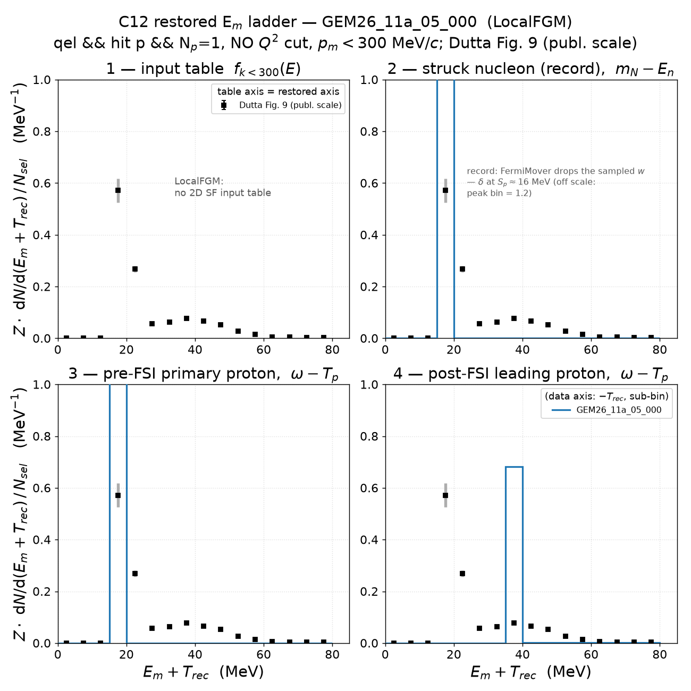
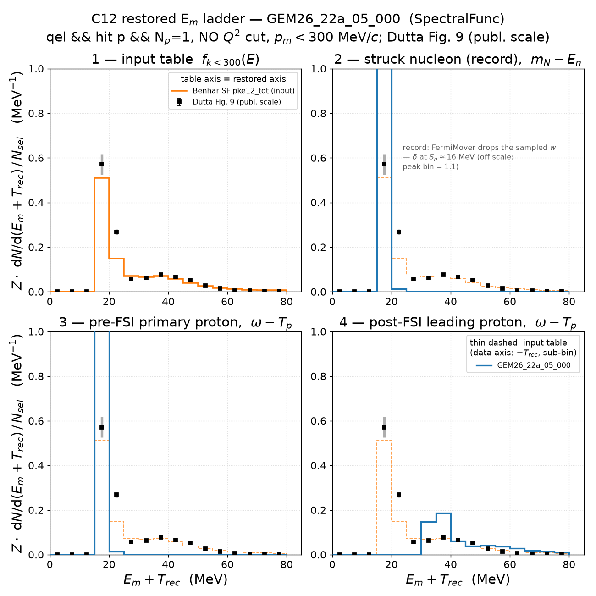
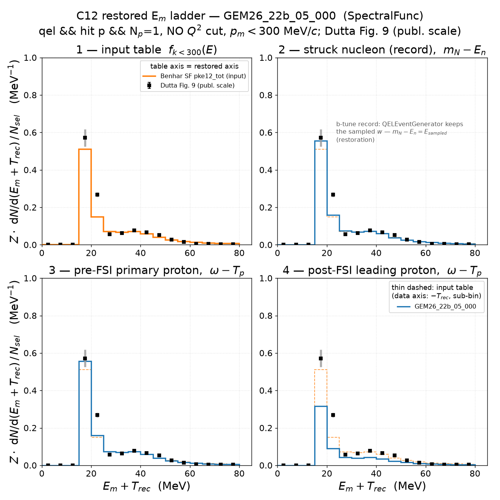
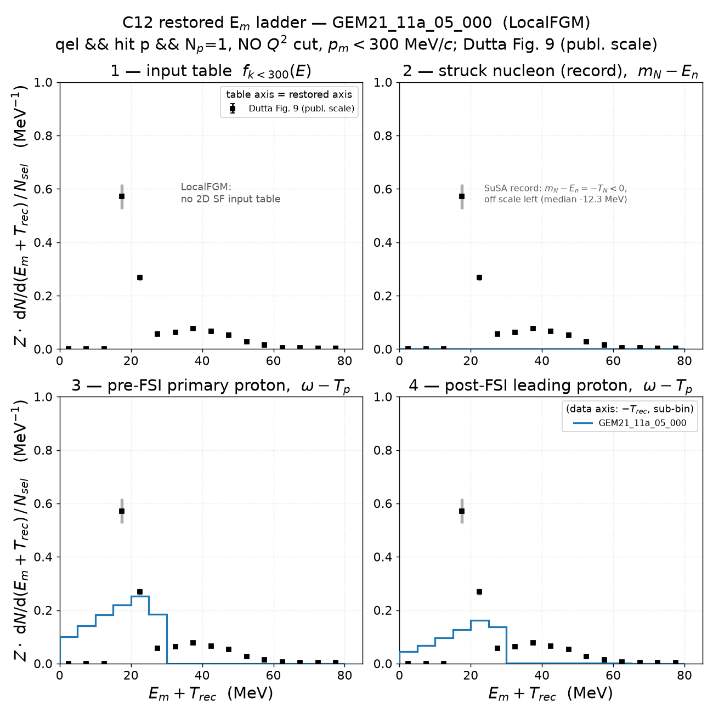

I1(table, k < 300) = 5.249 — the
[normalization-page](../normalization/README.md) Dutta-window integral.

| tune | qel ∧ hit p (of 2M) | 1p fraction | I2r = I3r | I4r | I4r/I3r (v0.3 slice) | record median [MeV] |
|---|---|---|---|---|---|---|
| GEM26_11a_05_000 | 268,918 (13.4 %) | 80.6 % | 6.000 | 3.472 | 0.579 (0.591) | 17.09 |
| GEM26_22a_05_000 | 268,653 (13.4 %) | 79.5 % | 5.439 | 2.926 | 0.538 (0.546) | 17.16 |
| GEM26_22b_05_000 | 195,170 (9.8 %) | 81.2 % | 5.542 | 3.196 | 0.577 (0.587) | 20.34 |
| GEM21_11a_05_000 | 239,886 (12.0 %) | 81.2 % | 5.422 (I3r) | 3.229 | 0.596 (0.600) | −12.30 |

- **The ladder is Q²-blind on the ground-state side.** I2r = I3r uncut
  reproduces the in-slice values to ≤ 0.06 (6.000 / 5.439 / 5.542 / 5.422
  vs 6.000 / 5.425 / 5.530 / 5.363): the SF/LFG sampling factorizes from
  the lepton kinematics, so a 26–39× larger selection (the slice kept
  ~2.6–3.6 % of it) lands on the same occupancy curves.
- **The in-window survivals barely move either** (−0.004 to −0.012 vs
  v0.3): the E<80/p<300 window survival is dominated by the FSI model, not
  by which Q² produced the event. The tune ordering is unchanged
  (22a lowest at 0.538, GEM21 highest at 0.596).
- Post-FSI shape companions (`em_postfsi_shape_c12_*.png`, same run) show
  the same per-tune ΔT_p signatures as v0.3 section 4.3 on 5× the
  statistics.

Regenerate:
`pixi run python results/template/make_emiss_ladder_q2cut.py --target C12 --all-tunes --proton-sel 1p --no-q2cut`
(streams the campaign over XRootD with no Q² mask; cache
`cache/ladder_c12/` here).

### 2.1 Missing momentum: the |p_m| ladder on the normalization-page scale

The |p_m| projection (v0.3 section 4.1/4.2 construction,
[`make_pmiss_ladder_q2cut.py`](../template/make_pmiss_ladder_q2cut.py)
`--no-q2cut`): each stage histogrammed in |p_m| with the fig 6 shell
windows `E_m + T_rec` 10–25 ∪ 30–50 MeV applied, occupancy scale, and the
folded Dutta fig 6 p+s data (L+R summed = the full |p_m| density on the
published scale, weighted 4πp_m² onto the occupancy axis — the
[normalization-page](../normalization/README.md) folded-data convention)
overlaid on every panel:

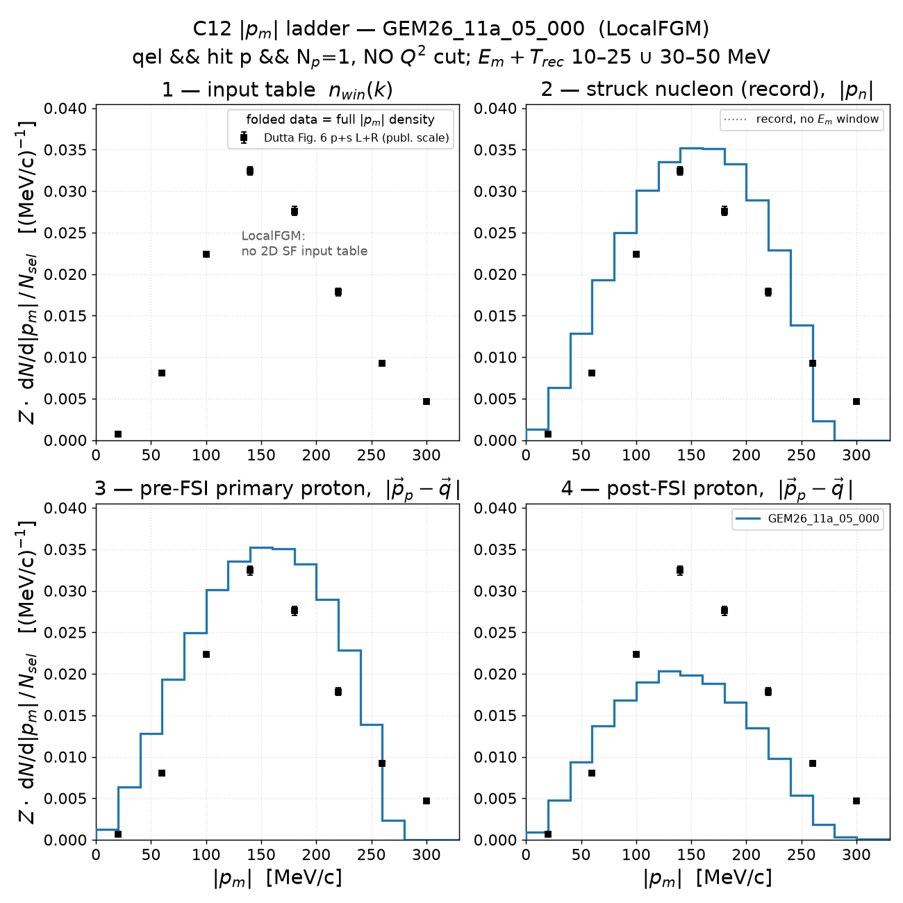
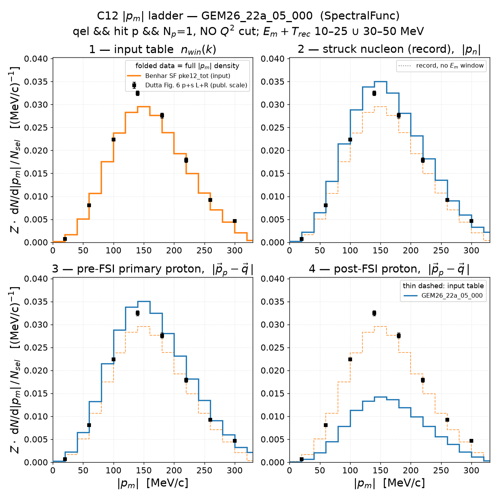
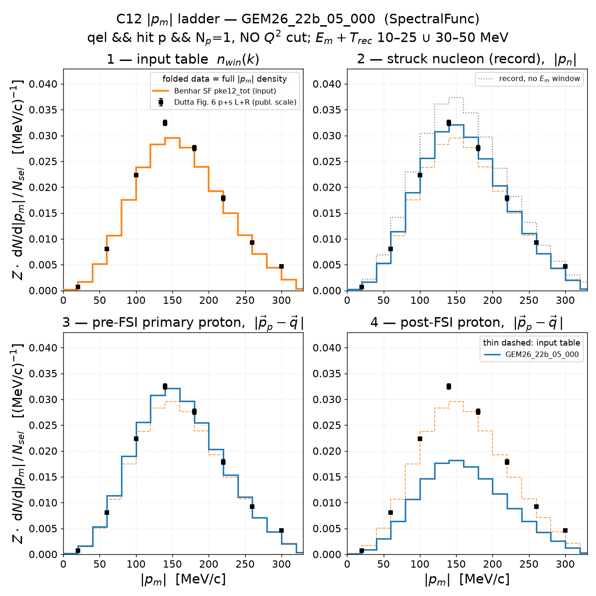
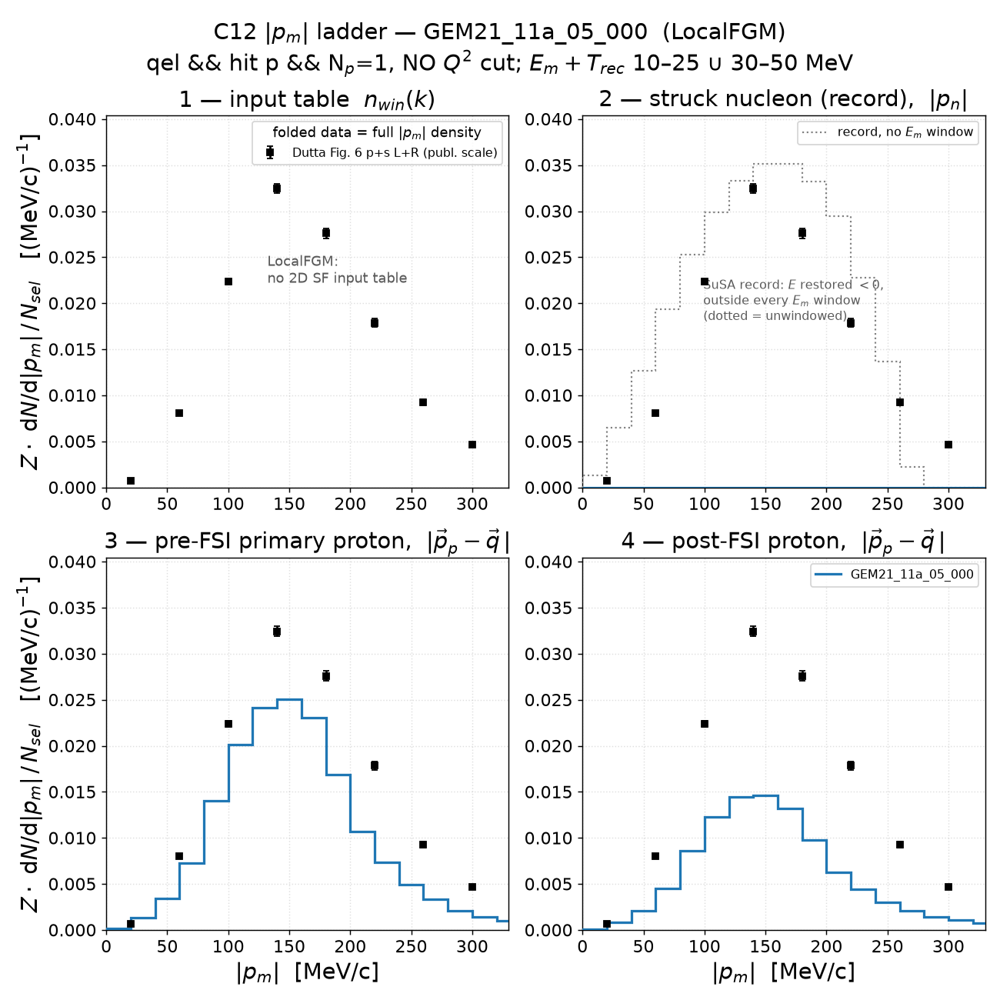

Windowed strengths, |p_m| < 320 MeV/c: I1(table) = 4.533,
I(data) = 4.917, **data/table = 1.08** — identical to v0.3 (the data and
table stages carry no Q² dependence at all).

| tune | I2 (record) | I3 (pre-FSI) | I4 (post-FSI) | I4/I3 (v0.3 slice) |
|---|---|---|---|---|
| GEM26_11a_05_000 | 6.000 | 6.000 | 3.423 | 0.570 (0.581) |
| GEM26_22a_05_000 | 5.505 | 5.505 | 2.206 | **0.401** (0.407) |
| GEM26_22b_05_000 | 4.828 | 4.828 | 2.765 | 0.573 (0.583) |
| GEM21_11a_05_000 | 0 (record E < 0) | 3.306 | 1.977 | 0.598 (0.603) |

- **22a's shell-window collapse survives the full phase space** (0.401 vs
  the 0.57–0.60 of the others): its broad ΔT_p smearing pushes survivors
  out of the narrow 10–25 ∪ 30–50 windows regardless of Q² — a property of
  the FSI model, not of the slice.
- The pre-FSI stages track the input table bin by bin (including the
  ℓ = 1 dip at |p_m| → 0) exactly as in the slice; the folded data sit
  slightly above at the peak (the 1.08).
- Density-units companions (`pm_ladder_dens_c12_*.png`, same run): the
  stages as `∫_win P dE_m` [MeV⁻³], log y, data exactly as tabulated.

Regenerate:
`pixi run python results/template/make_pmiss_ladder_q2cut.py --target C12 --all-tunes --proton-sel 1p --no-q2cut`.

### 2.2 Combined view: simulated SF + UnifiedQEL in the dutta_em_folded_pm style

The [normalization-page combined
figure](../normalization/dutta_em_folded_pm.png) (E_m spectrum + folded
per-shell |p_m|, data at published scale) with the curves = the
**simulation** instead of the input tables
([`make_em_folded_pm_sim.py`](../template/make_em_folded_pm_sim.py)):
GEM26_22b_05_000 (SF + UnifiedQEL) pre-FSI (stage 3, blue dashed) and
post-FSI (stage 4, red) from the v1.0 uncut caches, the table kept thin
dashed. E_m panel on the occupancy scale in the data's 5-MeV bins
(p_s < 300); |p_m| panels as the 3D density `∫_win P dE_m` [MeV⁻³] on the
native 20-MeV/c grid, fig 6 shell windows applied per panel, folded data
with 2× stat errors:

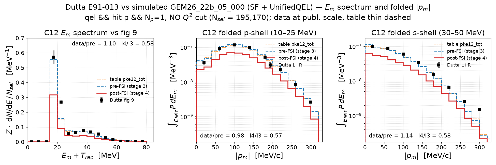

- **Pre-FSI reproduces the input table in all three projections**
  (data/pre = 1.10 in E_m, 0.98 p-shell, 1.14 s-shell — vs the
  normalization page's data/table 1.16 / 1.06 / 1.16): the UnifiedQEL
  cross-section reshaping moves little strength across these windows, and
  what it does move shows as the small p-shell/E_m differences from the
  pure-table ratios.
- **Post-FSI suppresses nearly shape-preservingly in |p_m|** (I4/I3 = 0.57
  / 0.58 per shell, the section-2.1 pattern) while the E_m panel keeps the
  22b signature: survivors sit on the pre-FSI peak (ΔT_p = 0) with the
  suppression strongest right at the 15–20 MeV peak bin.
- The distorted, renormalized data sit between the two MC stages
  everywhere — consistent with the published renormalization pulling the
  raw distorted yield (≈ stage 4) back toward the undistorted scale
  (≈ stage 3).

**Post-FSI-normalized variant** (`--nsel postfsi`): the same figure with
the MC denominator changed from N_sel to the **events after FSI** — the
158,453 events (81.2 % of the 195,170 selected) with a surviving N_p = 1
proton — the simulation-side analogue of the data's renormalization
(which scales the distorted yield back up). Table and data untouched:

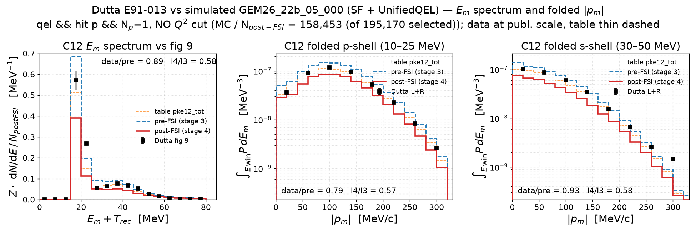

- The ×1.23 lift closes part but not all of the gap: the post-FSI curve
  rises to 0.39 MeV⁻¹ at the E_m peak vs the data's 0.57, and in the
  shells the data now sit **between** the stages (data/pre = 0.89 / 0.79 /
  0.93, data/post ≈ 1.5 / 1.4 / 1.6 per panel).
- The residual gap is expected: dividing by the *event-count* survival
  (0.812, mostly proton loss) does not undo the *in-window strength*
  survival (I4/I3 ≈ 0.58 — FSI moving surviving protons out of the E_m
  window and below the p thresholds), whereas Dutta's renormalization was
  fitted to restore full occupancy.

**Leading-proton variant** (`--proton-sel leading`): stage 4 = the
**leading** FS proton of any ≥1p event (the v0.2 convention) instead of
the unique proton of N_p = 1 events, from a separate uncut cache
(`cache/ladder_c12_leading/`, same 195,170-event selection — only the
stage-4 definition differs). Proton loss drops from ≈ 19 % (N_p ≠ 1) to
2.2 % (0p only):

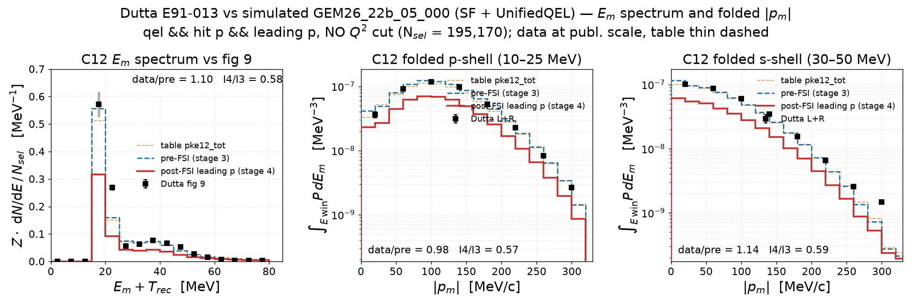

- **In-window the two stage-4 definitions coincide**: data/pre = 1.10 /
  0.98 / 1.14 and I4/I3 = 0.58 / 0.57 / 0.59, vs the N_p = 1 figure's
  0.58 / 0.57 / 0.58 — the v0.3 headline (≥2p events almost never enter
  the E_m windows) extended to the full phase space: the extra ~16 % of
  events whose leading proton now counts land almost entirely outside
  0–80 MeV.
- The post-FSI-normalized companion
  (`em_folded_pm_sim_nselpost_leadp_c12_GEM26_22b_05_000.png`,
  `--nsel postfsi --proton-sel leading`) lifts the MC by only ×1.02
  (N_post = 190,858, 97.8 %), so it is nearly indistinguishable from this
  base variant — with leading-p there is no multiplicity veto left to
  divide out, only the true proton loss.

**In-window-normalized variant** (`--nsel postwin`, leading p): the
denominator is the number of post-FSI events **inside the measurement
window** — E_m + T_rec ∈ [0, 80) MeV and p_m < 300 MeV/c, N = 104,758
(53.7 % of the selection) — the closest simulation analogue of Dutta's
full-occupancy renormalization: the stage-4 E_m curve then integrates to
exactly Z = 6 over the window, directly against fig 9's 6.08:

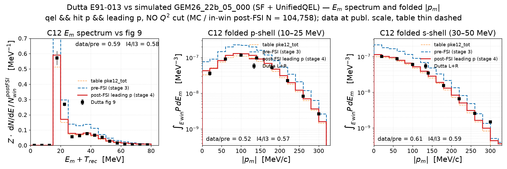

- **The renormalized post-FSI simulation reproduces the data in all three
  projections** (data/post = 1.02 E_m, 0.92 p-shell, 1.04 s-shell): the
  red curve sits on the fig 9 spectrum bin by bin — peak 0.59 vs 0.57
  MeV⁻¹ — and on the folded shell data across two decades of density.
  Renormalized this way, 22b's distorted-then-rescaled prediction is the
  published data, closing the loop on the convention chain: the ×1.9
  in-window renormalization is exactly what the experiment's
  full-occupancy rescale did to its own distorted yield.
- The pre-FSI stage (÷ the same denominator) now overshoots everything by
  ≈ 1/0.54 — it is drawn as the undistorted reference only.
- The residual shape differences are the known ones: the data hold more
  strength in the 20–25 MeV s–p dip bin and less at the p-shell's
  140 MeV/c point than the simulation.

The same renormalization with the **N_p = 1** stage 4 (`--nsel postwin`,
default proton selection; in-window N = 103,972, 53.3 %):

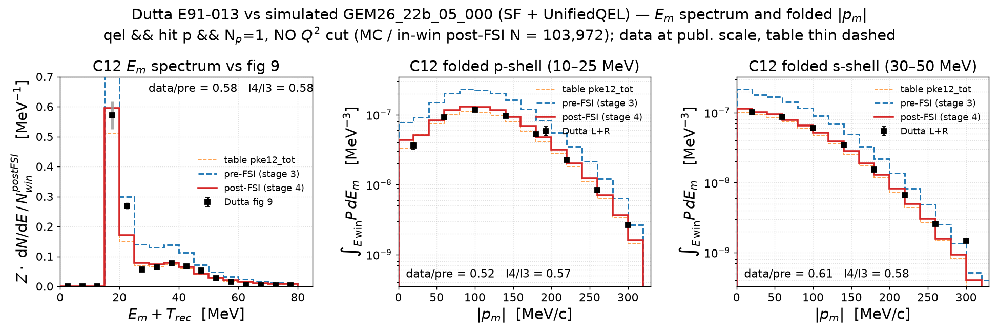

- Indistinguishable from the leading-p version in-window (data/post =
  1.00 / 0.91 / 1.05 vs 1.02 / 0.92 / 1.04): once the in-window
  renormalization divides out the occupancy scale, the multiplicity
  convention is irrelevant — the two stage-4 definitions select the same
  in-window events to 0.8 %.

**The conventions side by side** (`--combo`): table (thin dashed),
pre-FSI / N_sel = 195,170 (true occupancy), and both post-FSI stage-4
definitions each renormalized by **its own in-window count** — leading p
/ N_win = 104,758, N_p = 1 / N_win = 103,972. One |p_m| panel on the
**full E_m window [0, 80)**: the fig 6 p+s folded data are summed and
**gap-filled by ×1.105**, the fig 9 E_m-shape ratio of [0, 80) strength
to the shell windows' (10–25 ∪ 30–50 hold 90.5 %; [0, 10) is empty) —
so data and curves finally share one E window with no coverage mismatch:

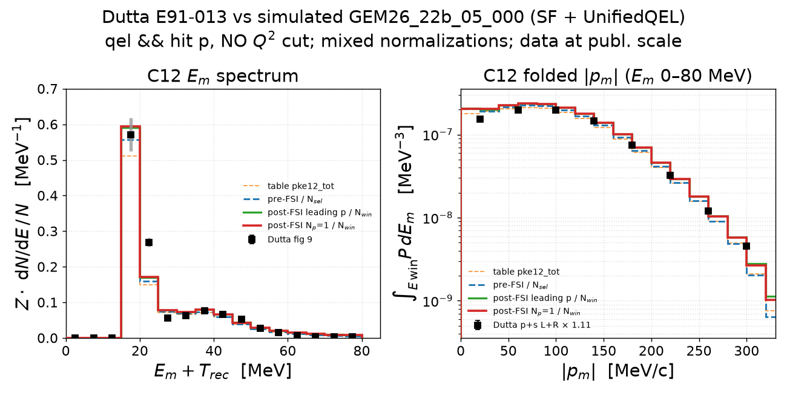

- The two renormalized post-FSI curves are **indistinguishable** (E-panel
  strengths 6.000 both by construction; |p_m| panel 6.07 vs 6.06 — green
  hides under red): in-window renormalized, the stage-4 multiplicity
  convention is irrelevant, and both sit on the data in shape.
- |p_m|-panel strengths (|p_m| < 320): gap-filled data 5.44, pre-FSI
  5.59, renormalized post 6.06–6.07 — the data land between the
  undistorted and the fully renormalized scales, ≈ 10 % below the post
  curves, mirroring the E-panel's data/post ≈ 1.01 within the fig 6 ↔
  fig 9 cross-normalization residuals (+19 %/−6 % per shell on the
  normalization page).
- Against the undistorted references (blue ≈ thin-dashed table), what
  survives the full distort-then-renormalize chain is small: the slight
  E_m peak sharpening (0.60 vs 0.55) and a mild |p_m| tilt — everything
  else about FSI is absorbed into the divided-out scale.

**Shell-resolved variant** (`--combo --shells`): the |p_m| comparison per
fig 6 shell with the **original folded data, no gap-fill scale** — MC and
table windowed to 10–25 (p-shell) and 30–50 MeV (s-shell), data exactly
as tabulated (L+R summed only); same mixed normalizations:

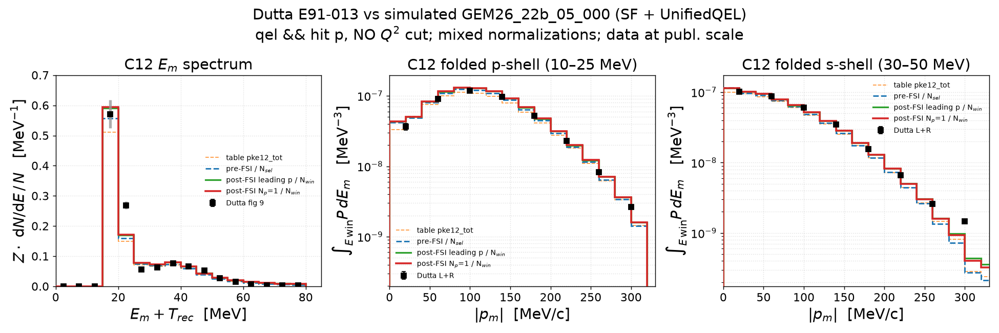

- Per-shell strengths: p-shell data 3.53 vs renormalized post 3.85–3.87
  (data/post = 0.92); s-shell 1.39 vs 1.32–1.33 (1.05) — the ±8 %
  opposite-sign residuals are the fig 6 ↔ fig 9 cross-normalization
  spread per shell; shape-wise the data sit on the renormalized post
  curves in both windows.

The same combo for the **other three tunes** (`--combo --tune …`; the
table curve is drawn only for the SF tunes — LFG/SuSA have no 2D SF
input; δ-like E_m curves run off the capped y-scale, their peak being
1.2 MeV⁻¹ = all of Z in one 5-MeV bin):

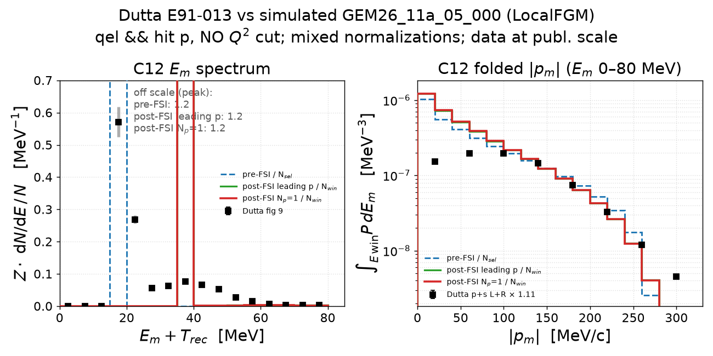
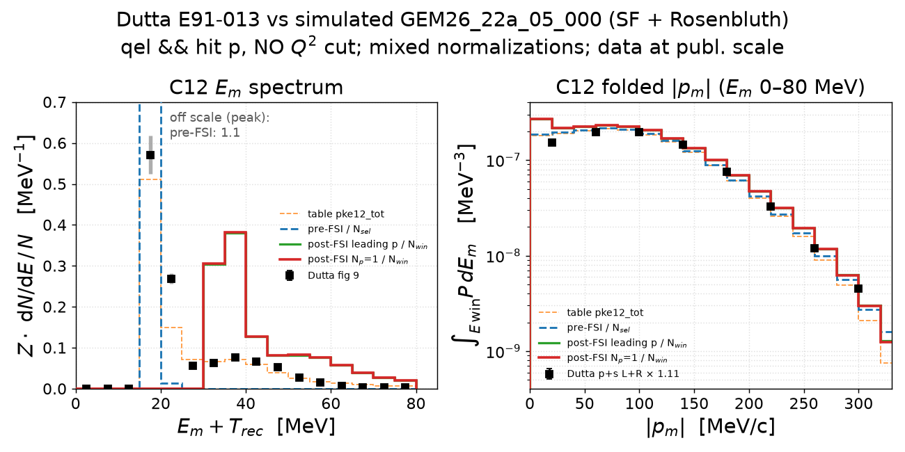
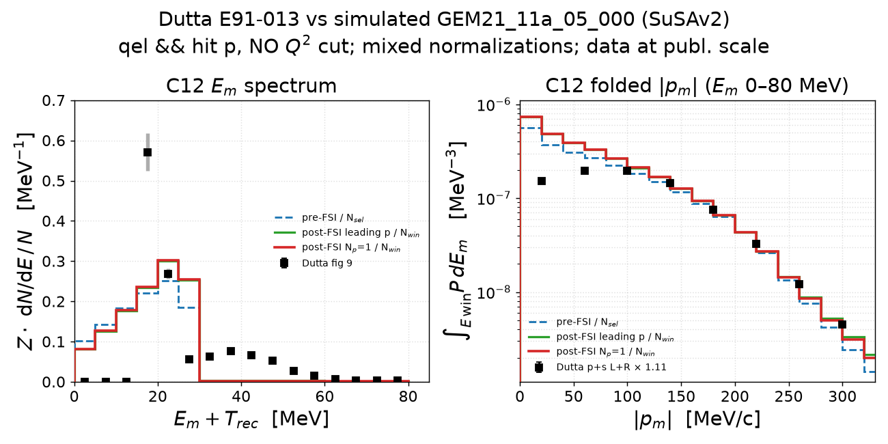

| tune | N_win/N_sel (1p) | pre-FSI (E) | post (E) | pre (p_m) | post (p_m) | data (p_m) |
|---|---|---|---|---|---|---|
| GEM26_11a | 0.579 | 6.000 | 6.000 | 6.000 | 6.01 | 5.44 |
| GEM26_22a | 0.488 | 5.439 | 6.000 | 5.505 | 6.07 | 5.44 |
| GEM26_22b | 0.533 | 5.542 | 6.000 | 5.591 | 6.06 | 5.44 |
| GEM21_11a | 0.538 | 5.422 | 6.000 | 5.481 | 6.08 | 5.44 |

- **With every post curve renormalized to 6.000, the E_m panel is a pure
  shape comparison — and it is the v0.3 §4.3 taxonomy on the full phase
  space**: 11a's renormalized survivors are a δ line moved bodily to
  35–40 MeV (nothing like the data); 22a is bimodal (untouched line at
  15–20 + a 30–40 rescatter hump the data don't show); GEM21 is a
  triangle cutting off at 30 MeV, missing the data's 30–80 MeV s-shell
  strength entirely; **22b is the only tune whose renormalized post-FSI
  E_m tracks the data**.
- The |p_m| panel separates the ground states: the SF tunes reproduce
  the data's low-|p_m| plateau (shell structure), while 11a/GEM21 rise
  monotonically toward |p_m| → 0, overshooting the first gap-filled data
  bins by up to ×7 (LFG) — and 11a's LFG cuts off sharply at ≈ 280 MeV/c
  below the data's outermost points.

**All four tunes in one figure** (`--combo --grid`): the four combo
figures above merged into a single title-less 8-panel grid (2 columns ×
4 rows, 3:4 h:w panels, the rows touching) — one tune per row in the
table's order, E_m in the left column,
folded |p_m| (E_m 0–80 MeV, gap-filled data) in the right; per row
exactly the combo curves, normalizations and data, with the tune tag
inside each E_m panel instead of a title. The |p_m| column shares one
log scale, so the LFG/SuSA low-|p_m| pile-up and the SF shell plateau
read straight down the column:

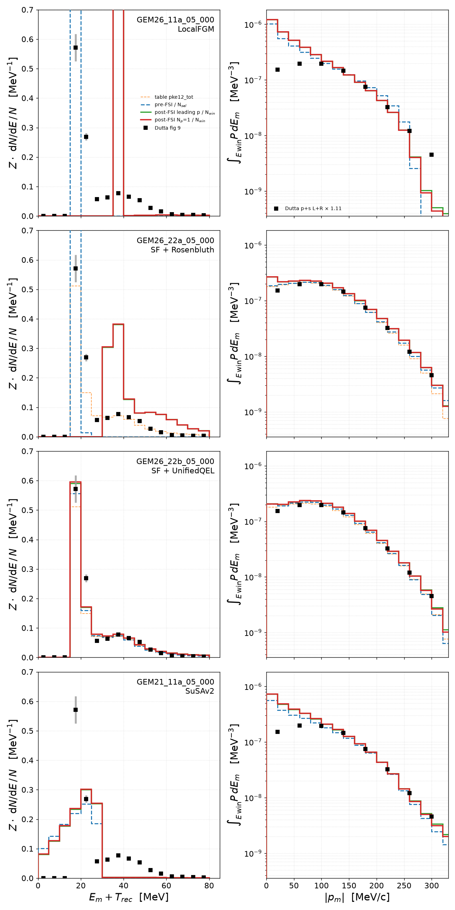

Regenerate:
`GENIE_AGENT_INSTALLATION=genie_inclxx pixi run python
results/template/make_em_folded_pm_sim.py` (the pin resolves the
SF-table lookup against the campaign install now that
`active_installation` is `genie_v3_6_2`; default
`--tune GEM26_22b_05_000`; any campaign tune via `--tune`;
`--nsel postfsi` / `--nsel postwin` for the post-FSI- /
in-window-normalized variants; `--proton-sel leading` for the
leading-proton stage 4 — build its cache once with
`make_emiss_ladder_q2cut.py --target C12 --tune <tune> --proton-sel
leading --no-q2cut --build-only`; `--combo` for the mixed-normalization
summary; `--combo --grid` for the 8-panel all-tunes grid).
