# Electron–C12 scattering with the GENIE INCL++ model — full generated phase space, exactly-one-proton selection (v1.0)

The [C12 v1.0 note](electron_c12_scattering.md) repeated for the **INCL++
tune `GEM26_44b_05_000`** — INCL++ ground state *and* INCL++ cascade FSI
(`NucleusGenINCL → QELEventGeneratorINCL → UnifiedQELPXSec/EM_Dipole_incl`,
`HadronTransp-Model = INCLCascadeIntranuke`; tune README:
[`genie-agent/tunes/GEM26_44b/README.md`](../../genie-agent/tunes/GEM26_44b/README.md)).
Same construction as the sibling note: the Dutta Q² = 1.28 ± 5 % slice is
dropped, keeping only

    qel                            (electron panels)
    qel && N_p(final state) = 1    (proton panels)

with the v0.3 exactly-one-proton convention. The tune carries the same
generation cut as the t05 campaigns, **EM-MinQ2Limit = 1.18 GeV²**, so
"uncut" again means the full *generated* phase space with the hard lower Q²
edge at 1.18.

**The sample is not a grid campaign.** `GEM26_44b` has no full-EM grid
campaign (EMQE-only tune, INCL-throttled splines): the events are the local
4 × 125 000 = **500 000-event EMQE-only sample of 2026-09-01**
(`genie-agent/genie-runs/GEM26_44b_05_000-2026-09-01/`, jobids
`gevgen-eminus_C12_20260901-203131-2c9`, `…-203133-055`, `…-203133-a73`,
`…-203133-6f7`; e⁻ at 2.445 GeV; spline
`GEM26_44b_05_000-2026-07-31/eminus_C12_20260731-200519-bd5.xml`;
install `genie_inclxx` at `cc9c9b417` = `feature/for_Anna` with the
2026-08-24/26 INCL remnant-snapshot fixes). Two consequences for reading the
figures against the campaign tunes:

- **`qel` is the whole sample** (500 000 of 500 000): no full-EM denominator,
  so every "of ntot" fraction below is quoted against the EMQE-only total and
  is not comparable to the campaigns' "of 2M".
- **Counts panels are not comparable** (500k EMQE-only vs 2M full-EM): the
  note uses the area-normalized figures; the `_counts` companions exist and
  carry the actual per-tune ntot in their titles.

Throughout, the INCL tune is overlaid on **`GEM26_22b_05_000`** (SF ground
state + hA2018 FSI), its designated comparison partner: the two share the
`UnifiedQELPXSec` cross section and differ *only* in ground state and FSI
(the "full INCL" configuration, tune README "Comparison set"). The
four-tune campaign numbers are quoted from the sibling note where useful.

**Energy convention, read before the ladders** (verified 2026-09-02 in
[`docs/incl-ground-state-review.md`](../../docs/incl-ground-state-review.md);
it supersedes the Phase-0 wording): the GHEP hit nucleon is **on-shell**,
`E = √(p² + m_INCL²)` — it is rewritten from the INCL side after the cascade
— so the struck-nucleon record E_m is simply `−T_n` and sits below the
Dutta axis (no removal energy anywhere; `RemovalEnergy` is garbage and not
consumed). The momentum is resampled uniformly in a global-p_F ball at the
INCL radius, accepted above the local energy `T_loc(r)`. The QE lepton
kinematics use a *local-energy-reduced* on-shell nucleon, and the binding
enters only when INCL re-imposes its energy balance on the outgoing proton:
the pre-FSI proton carries `E_m = V₀ − T_ball` with `V₀ = T_F + S = 45.0 MeV`,
i.e. a floor at `S = 6.83 MeV`. Both are visible below as the empty stage-2
panels and the record's p_F cut-off.

## 1. QEL kinematics — E_e′, θ_e′, T_p, θ_p, Q², no Q² cut

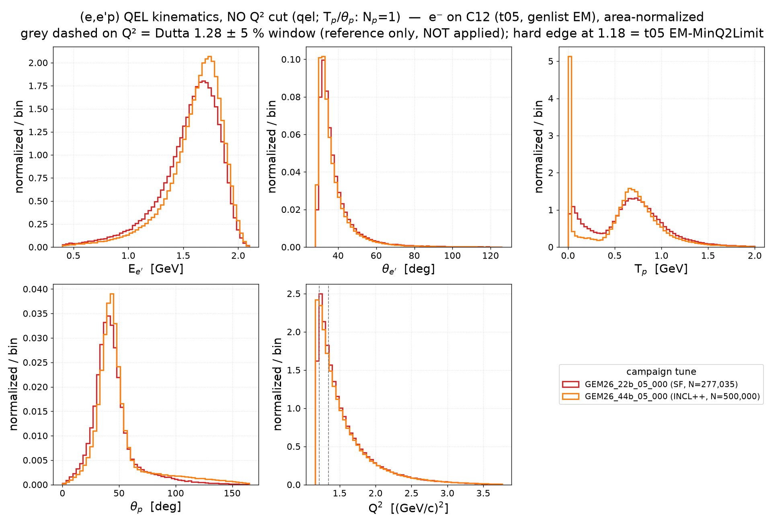

Area-normalized (counts companion `kin_qel_c12_incl_counts.png`, ntot
2M/0.5M), script [`make_kin_qel_v1.py`](../template/make_kin_qel_v1.py)
`--tunes GEM26_22b_05_000 GEM26_44b_05_000 --tag _incl` — the sibling
note's section 1 with the INCL tune in place of the four-tune overlay,
reading the INCL `kin_qel` cache built from the local gst chunks by
[`make_kin_qel_cache_local.py`](../template/make_kin_qel_cache_local.py).
The grey dashed lines on the Q² panel are the Dutta window as **reference
only** (nothing applied).

Selection counts (the legend N = qel events):

| tune | qel N (of ntot) | has_p | 0p | 1p | ≥2p |
|---|---|---|---|---|---|
| GEM26_22b_05_000 | 277,035 (of 2M) | 79.5 % | 20.5 % | 64.1 % | 15.4 % |
| **GEM26_44b_05_000** | **500,000 (of 500k, EMQE-only)** | **86.8 %** | **13.2 %** | **54.4 %** | **32.4 %** |

(multiplicity split of the full qel sample, both hit-nucleon species; panel
ranges pooled p0.2–p99.8 over the two tunes.)

- **The FS-proton multiplicity is the dominant INCL signature.** INCL
  leaves fewer proton-less events (13 % vs 21 %) but more than doubles the
  ≥2p fraction (32 % vs 15 %): the cascade knocks out and evaporates extra
  nucleons where hA2018 mostly transports one. The N_p = 1 selection
  therefore keeps only 54 % of INCL's qel events (64 % for 22b) — the
  proton-side panels are drawn from a smaller, differently composed
  subsample.
- **The electron arm is untouched by FSI and shows the ground state only.**
  Q² is identical (same `UnifiedQELPXSec`, same 1.18 edge); E_e′ and θ_e′
  are marginally sharper for INCL (E_e′ peak 2.05 vs 1.80 per-unit, less
  low-E_e′ shoulder below ≈ 1.4 GeV): the p_F-ball momentum sampling gives a
  narrower Fermi smearing than the SF's high-momentum tail.
- **T_p carries the cascade's fingerprint at both ends.** The QE bump
  (peak ≈ 0.7 GeV) is a little taller for INCL and the 0.1–0.4 GeV
  rescatter hump is largely gone (≈ 0.3 vs 1.0 per-unit at 0.1 GeV) — but
  the very first bin holds a spike ≈ 5× the 22b value: N_p = 1 events
  whose *only* proton is a slow (T_p ≲ 30 MeV) evaporation proton, the QE
  proton having been absorbed or converted in the cascade. Roughly 17 % of
  INCL's N_p = 1 events sit there (22b ≈ 3 %).
- θ_p peaks sharper at ≈ 42° and, unlike 22b, keeps a flat tail out to
  160° — the same slow evaporation protons, emitted isotropically.

**Q²-cut companion** (`--q2cut`): the Dutta window **applied**
(`kin_qel_q2cut_c12_incl.png`, counts companion `_counts`):

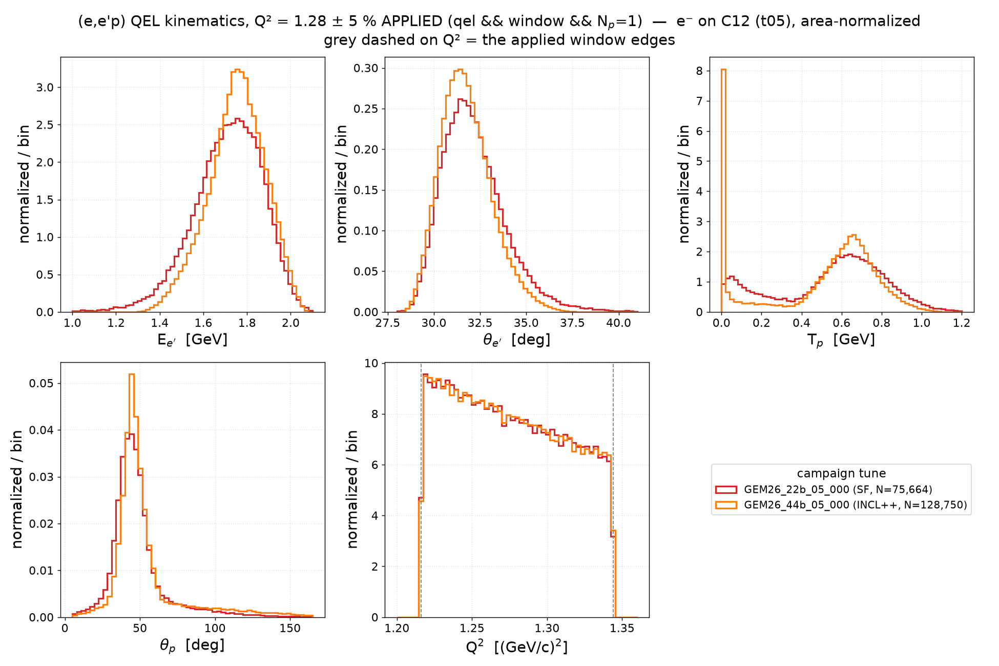

The slice keeps 128,750 INCL events (25.8 % of the uncut qel N; 22b:
75,664 = 27.3 %) and leaves the multiplicity split where it was (INCL
in-window 0p/1p/≥2p = 13.4 / 55.3 / 31.3 %, has_p 86.6 %) — as for the
campaign tunes, the FS-proton multiplicity is Q²-independent within the
generated range. Inside the window every difference above survives
unchanged: sharper INCL E_e′/θ_e′ (3.2 vs 2.6 per-unit at the 1.75 GeV
peak), the T_p ≈ 0 spike (now 8 vs 1 per-unit), the missing rescatter hump,
the taller QE bump (2.5 vs 1.9) and the backward θ_p tail.

Regenerate (this, the companion, and 1.1):
`pixi run python results/template/make_kin_qel_v1.py --target C12 --tunes GEM26_22b_05_000 GEM26_44b_05_000 --tag _incl`
(`--q2cut` for the applied-window pair; the INCL cache once via
`make_kin_qel_cache_local.py --target C12 --tune GEM26_44b_05_000 <the 4 gst chunks>`).

### 1.1 E_m and p_m — no cuts at all

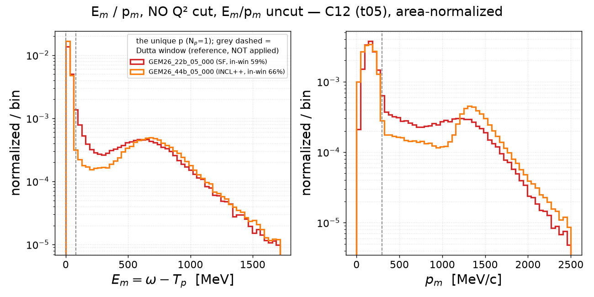

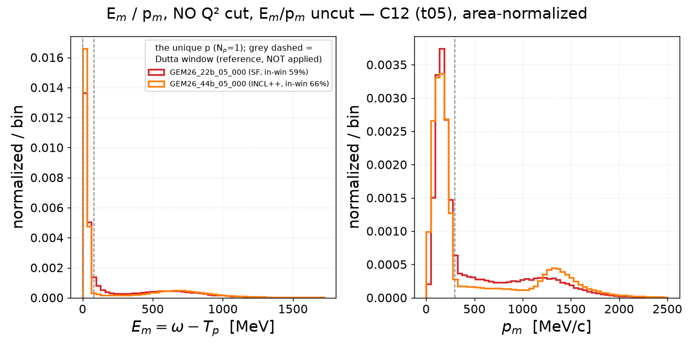

The sibling note's subsection 1.1 (log y above, linear below; raw-counts
companion `empm_c12_incl_counts.png`): E_m = ω − T_p and p_m of the unique
proton, no E_m/p_m cuts, the Dutta window grey-dashed as reference.
In-window fractions (of qel ∧ N_p = 1): **66 %** INCL vs 59 % for 22b.

- The INCL QE peak is *cleaner* (66 % in-window despite the multiplicity
  loss above): the E_m valley between the peak and the rescatter hump is
  ≈ 2× deeper (1.5 vs 3 × 10⁻⁴ per bin at 200–300 MeV), and the p_m valley
  between the ground-state peak and the p_m ≈ |q| bump likewise. Whatever
  INCL rescatters, it does not leave in the intermediate E_m/p_m region the
  way hA2018 does.
- The rescatter populations themselves are *larger*: the broad E_m hump at
  ≈ 650 MeV matches 22b's, but the p_m ≈ |q| bump at ≈ 1.35 GeV/c is
  ≈ 1.5× higher and the p_m tail beyond 1.5 GeV/c sits above 22b by a
  factor 1.5–2 — the slow-evaporation-proton events of section 1 (T_p ≈ 0
  ⇒ E_m ≈ ω, p_m ≈ |q|).

## 2. Missing energy: table vs simulation vs Dutta Fig. 9, no Q² cut

The four-stage restored E_m ladder (v0.3 section 4 construction — stage 1
input table, 2 struck-nucleon record, 3 pre-FSI primary proton, 4 = the
unique proton of N_p = 1 events; occupancy scale `Z·dN/dx/N_sel`,
E_m + T_rec < 80 MeV, p_s < 300 MeV/c) with the Q² window **dropped**;
N_sel = all qel ∧ hit-p events of the sample. Stage 1 is empty by
construction (no 2D SF input table — the INCL ground state is not a
tabulated P(k,E)); stage 2 is empty by the energy convention above:

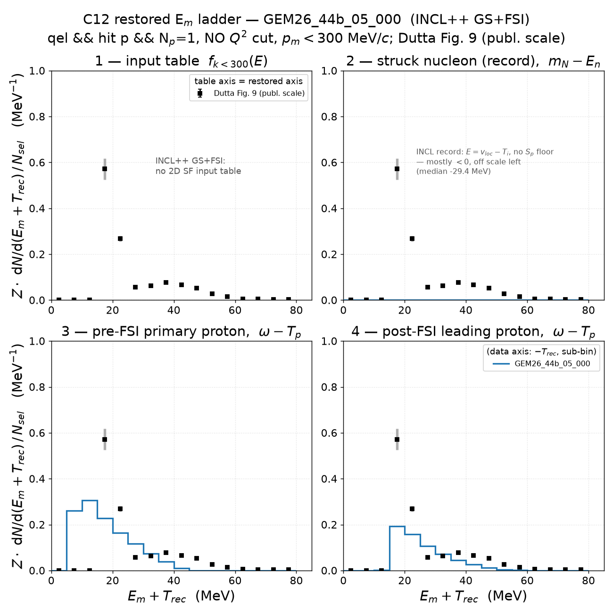

| tune | qel ∧ hit p (of ntot) | 1p fraction | I2r | I3r | I4r | I4r/I3r (v0.3 slice) | record median [MeV] |
|---|---|---|---|---|---|---|---|
| GEM26_22b_05_000 | 195,170 (9.8 % of 2M) | 81.2 % | 5.542 | 5.542 | 3.196 | 0.577 (0.587) | 20.34 |
| **GEM26_44b_05_000** | **346,164 (69.2 % of 500k)** | **65.0 %** | **0 (record E < 0)** | **6.000** | **3.119** | **0.520 (0.531)** | **−29.39** |

(the "v0.3 slice" column for INCL is the Q² = 1.28 ± 5 % construction run on
the same sample in [`analysis/dutta-qe/`](../../analysis/dutta-qe/README.md),
89,465 in-slice events; 22b from the sibling note.)

- **The record sits entirely below the Dutta axis**: median −29.4 MeV,
  p5–p95 [−37.5, −11.0] MeV — it is `m_N − E_n = −T_n` of an on-shell
  nucleon (the record is rewritten on-shell from INCL after the cascade;
  review §3). A bookkeeping convention, not a physics prediction; the
  physical stages are 3 and 4.
- **I3r = 6.000: every selected event's pre-FSI proton lands inside the
  window.** The pre-FSI E_m is exactly `V₀ − T_ball` (review §3): it occupies
  6.83–45 MeV with a hard lower edge at `S = 6.83 MeV` (the well depth
  minus the Fermi energy) and a plateau at 7–15 MeV (0.26–0.31 MeV⁻¹) — a
  Fermi-gas binding with the INCL well depth, no shell structure, no
  S_p-anchored peak. Nothing resembles the input-table shape of the SF tunes.
- **The cascade puts a floor at 15 MeV.** Post-FSI the spectrum has a hard
  edge at 15 MeV, a 0.19 MeV⁻¹ peak in the 15–20 bin and a tail to ≈ 60 MeV.
  No such floor exists at the vertex (stage 3 starts at 6.83 MeV), so it is
  produced inside the cascade; a 0.7 GeV proton pays no potential at exit
  (`V(T) = 0` above ≈ 195 MeV, review §3), so the extra ≈ 8 MeV is not the
  well — its origin is not traced here.
- The in-window survival, 0.520, is the lowest of the five tunes (campaign
  range 0.538–0.596), and it moves by only −0.011 from the slice value — as
  for the campaign tunes, the survival is an FSI-model property, not a
  Q²-slice one.
- Post-FSI shape companion (`em_postfsi_shape_c12_GEM26_44b_05_000.png`,
  same run; unit-normalized over [0, 80)): the post-FSI peak lands in the
  data's 15–20 MeV bin but at 2/3 of the data's height (0.062 vs 0.094
  MeV⁻¹), with the excess spread over 20–35 MeV where the data have their
  s–p dip, and a tail that dies faster than the data's s-shell beyond
  40 MeV (0.005 vs 0.009 at 47.5 MeV). The pre→post move is a uniform
  ≈ +10 MeV shift of the whole spectrum, not the per-tune ΔT_p signatures of
  v0.3 section 4.3.

Regenerate:
`GENIE_AGENT_INSTALLATION=genie_inclxx pixi run python results/template/make_emiss_ladder_q2cut.py --target C12 --tune GEM26_44b_05_000 --proton-sel 1p --no-q2cut`
(reads the local gst chunks declared in the script's
`TGT["C12"]["local_gst"]` instead of streaming; cache `cache/ladder_c12/`
here; the leading-p cache for 2.2 via `--proton-sel leading --no-q2cut
--build-only`).

### 2.1 Missing momentum: the |p_m| ladder on the normalization-page scale

The |p_m| projection ([`make_pmiss_ladder_q2cut.py`](../template/make_pmiss_ladder_q2cut.py)
`--no-q2cut`): each stage histogrammed in |p_m| with the fig 6 shell
windows `E_m + T_rec` 10–25 ∪ 30–50 MeV applied, occupancy scale, and the
folded Dutta fig 6 p+s data overlaid on every panel (the
[normalization-page](../normalization/README.md) folded-data convention):

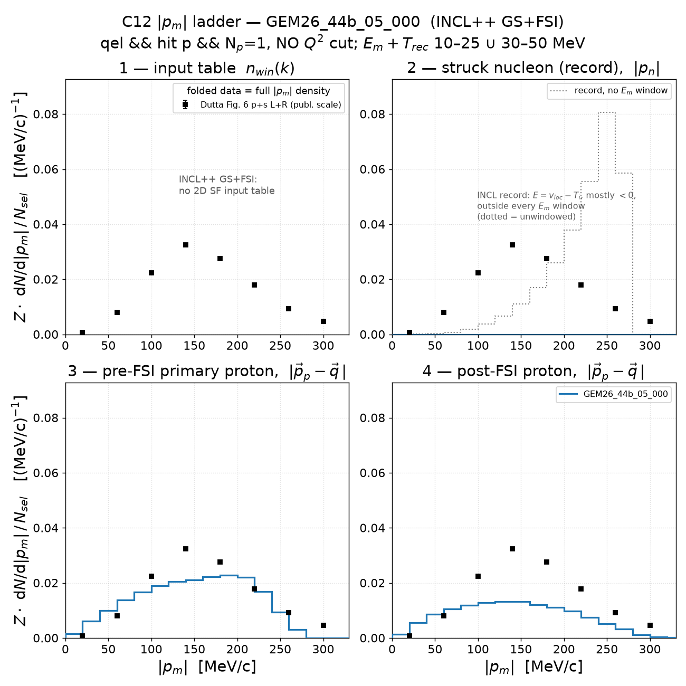

Windowed strengths, |p_m| < 320 MeV/c: I(data) = 4.917 (data/table = 1.08
against the Benhar table, as in the sibling note; the INCL tune has no
table stage).

| tune | I2 (record) | I3 (pre-FSI) | I4 (post-FSI) | I4/I3 (v0.3 slice) |
|---|---|---|---|---|
| GEM26_22b_05_000 | 4.828 | 4.828 | 2.765 | 0.573 (0.583) |
| **GEM26_44b_05_000** | **0 (record E < 0)** | **4.112** | **2.551** | **0.620 (0.634)** |

- **The unwindowed record (dotted, stage 2) is the p_F ball itself**: a
  p²-shaped rise to a peak at 240–280 MeV/c and a cliff at 280 MeV/c —
  uniform sampling in a global-p_F sphere, with nothing at low |p_m|. It is
  the documented resampling (`INCLNucleus::ResamplingHitNucleon`), not the
  INCL correlated ground state.
- **Pre-FSI, the shell windows see a flat plateau** (≈ 0.02 (MeV/c)⁻¹ from
  100 to 220 MeV/c, cut off by 280) against the data's ℓ = 1 peak at
  140 MeV/c (0.033): 84 % of the data's windowed strength (4.112 vs 4.917),
  with no p-shell node at |p_m| → 0 and no s-shell fall-off. This stage-3
  `|p_m| = |p_p′ − q|` is **not** the record's ball momentum: it is the
  local-energy-reduced momentum the kinematics used (⟨p⟩ 152 vs 225 MeV/c,
  falling with r; review §2), which is why stages 2 and 3 differ so much.
- **Post-FSI the cliff is gone**: the cascade smears the distribution past
  300 MeV/c and halves it in the windows (0.620 survival — the *highest*
  of the five tunes, campaign range 0.401–0.598), leaving a broad hump
  peaking at ≈ 0.013 near 130 MeV/c, ≈ 40 % of the data peak.
- Density-units companion (`pm_ladder_dens_c12_GEM26_44b_05_000.png`, same
  run): the stages as `∫_win P dE_m` [MeV⁻³], log y, data as tabulated.

Regenerate:
`GENIE_AGENT_INSTALLATION=genie_inclxx pixi run python results/template/make_pmiss_ladder_q2cut.py --target C12 --tune GEM26_44b_05_000 --proton-sel 1p --no-q2cut`.

### 2.2 Combined view: simulated INCL++ in the dutta_em_folded_pm style

The [normalization-page combined
figure](../normalization/dutta_em_folded_pm.png) with the curves = the
INCL **simulation** ([`make_em_folded_pm_sim.py`](../template/make_em_folded_pm_sim.py)
`--tune GEM26_44b_05_000`): pre-FSI (stage 3, blue dashed) and post-FSI
(stage 4, red) from the v1.0 uncut caches. No table curve — the INCL
ground state is not the Benhar table. E_m panel on the occupancy scale in
the data's 5-MeV bins (p_s < 300); |p_m| panels as the 3D density
`∫_win P dE_m` [MeV⁻³] on the native 20-MeV/c grid, fig 6 shell windows
applied per panel, folded data with 2× stat errors:

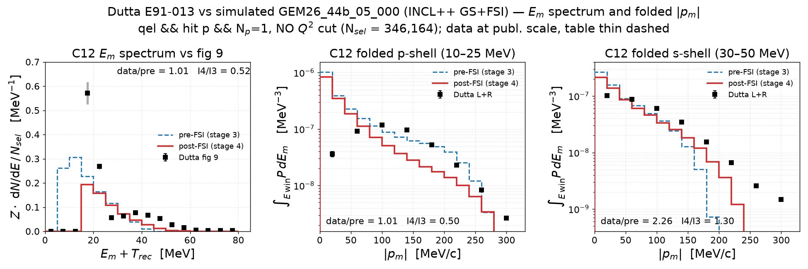

- **Pre-FSI carries the data's total strength but none of its shape.**
  data/pre = 1.01 in E_m and 1.01 in the p-shell window are coincidences of
  crossing curves: the pre-FSI p-shell density is monotonically falling
  from |p_m| → 0, overshooting the two lowest data points by ×25 (20 MeV/c)
  and ×4 (60 MeV/c), crossing the data at 100–140 and undershooting beyond
  180. The s-shell window holds only 44 % of the data's strength
  (data/pre = 2.26): the pre-FSI E_m has little content at 30–50 MeV.
- **FSI *adds* s-shell strength** (I4/I3 = 1.30 in the 30–50 window,
  0.50 in the p-shell): the +10 MeV post-FSI shift of section 2 moves
  strength from the p-shell window into the s-shell one. Neither
  suppression is shape-preserving in |p_m| — the post-FSI s-shell curve is
  cut off at ≈ 240 MeV/c where the data continue to 300.

**Post-FSI-normalized variant** (`--nsel postfsi`): the MC denominator
changed from N_sel to the **events after FSI** — 224,936 (65.0 % of the
346,164 selected) with a surviving N_p = 1 proton:

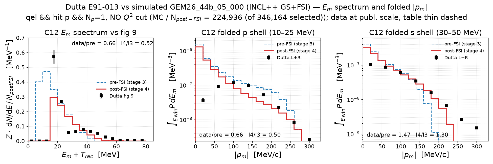

- The lift is ×1.54 (22b: ×1.23) — INCL's multiplicity loss is the largest
  of the five tunes (section 1). The gap closes accordingly: data/pre falls
  to 0.66 in the p-shell and 1.47 in the s-shell — the data now sit between
  the stages in the p-shell and still above both in the s-shell.

**Leading-proton variant** (`--proton-sel leading`): stage 4 = the
**leading** FS proton of any ≥1p event (the v0.2 convention) from the
uncut `cache/ladder_c12_leading/` cache (same 346,164-event selection).
Proton loss drops from 35 % (N_p ≠ 1) to 2.3 % (0p only):

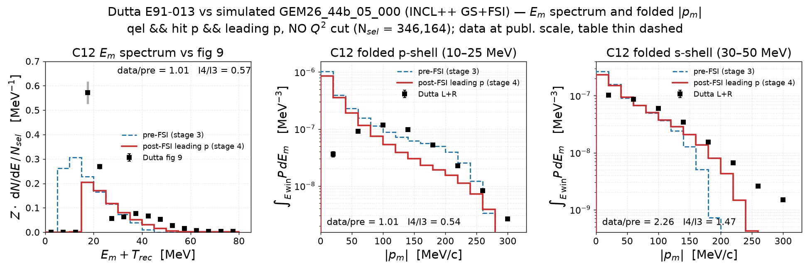

- **In-window the two stage-4 definitions differ, unlike for 22b.** The
  shell survivals move from 0.50 / 1.30 (N_p = 1) to 0.54 / 1.47
  (leading): INCL's ≥2p events *do* enter the E_m windows — their leading
  proton is often the intact QE proton accompanied by evaporation nucleons
  — so the 32 % of events vetoed by N_p = 1 carry ≈ 10 % of the in-window
  strength (22b: the vetoed 16 % carried 0.8 %).
- The post-FSI-normalized companion
  (`em_folded_pm_sim_nselpost_leadp_c12_GEM26_44b_05_000.png`,
  `--nsel postfsi --proton-sel leading`) lifts the MC by only ×1.02
  (N_post = 338,047, 97.7 %), as for 22b.

**In-window-normalized variant** (`--nsel postwin`, leading p): the
denominator is the number of post-FSI events **inside the measurement
window** — E_m + T_rec ∈ [0, 80) MeV and p_m < 300 MeV/c, N = 197,756
(57.1 % of the selection) — the closest simulation analogue of Dutta's
full-occupancy renormalization: the stage-4 E_m curve then integrates to
exactly Z = 6 over the window, directly against fig 9's 6.08:

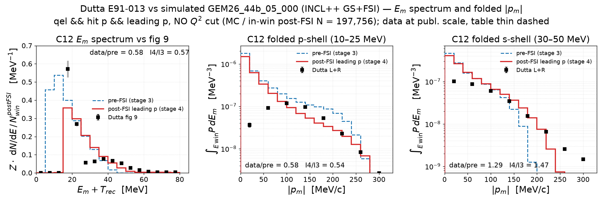

- **Renormalized, INCL reproduces the data's strengths but not its shapes.**
  data/post = 1.01 (E_m, by construction), 1.07 (p-shell, 3.53 vs 3.29) and
  0.88 (s-shell, 1.39 vs 1.57): the shell integrals are within ±12 % —
  yet the E_m peak reaches 0.36 MeV⁻¹ against the data's 0.57, the
  15–20 → 20–25 MeV drop is 0.36 → 0.30 where the data drop 0.57 → 0.27,
  the 25–40 MeV region is over-populated by ×2–3, and the p-shell density
  is ×40 above the 20 MeV/c point and ×7 above the 60 MeV/c point while on
  the data from 100 MeV/c out. The renormalization fixes the scale (as it
  did for 22b) but cannot supply the shell structure the ground state
  never had.
- The pre-FSI stage (÷ the same denominator) overshoots by ≈ 1/0.57 and is
  drawn as the undistorted reference only.

The same renormalization with the **N_p = 1** stage 4 (`--nsel postwin`,
default proton selection; in-window N = 179,974, 52.0 %):

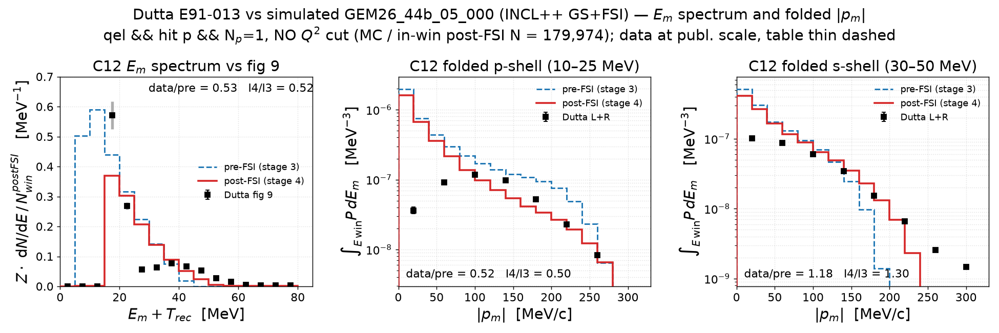

- Indistinguishable from the leading-p version in-window (data/post = 1.04 /
  0.91 in the shells vs 1.07 / 0.88): once the in-window renormalization
  divides out the occupancy scale, the multiplicity convention is
  irrelevant here too — the two stage-4 definitions select in-window events
  of the same shape, differing by the 10 % of strength noted above that
  the renormalization then absorbs.

**The conventions side by side** (`--combo`): pre-FSI / N_sel = 346,164
(true occupancy), and both post-FSI stage-4 definitions each renormalized
by **its own in-window count** — leading p / N_win = 197,756, N_p = 1 /
N_win = 179,974. One |p_m| panel on the **full E_m window [0, 80)**: the
fig 6 p+s folded data summed and **gap-filled by ×1.105** (the fig 9 ratio
of [0, 80) strength to the shell windows'), so data and curves share one E
window:

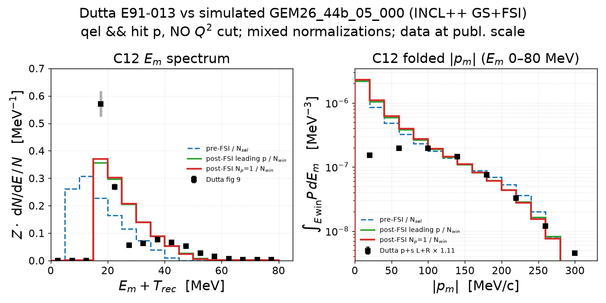

- The two renormalized post-FSI curves are **indistinguishable** (E-panel
  strengths 6.000 both by construction; |p_m| panel 6.03 vs 6.02 — green
  under red), as for every campaign tune.
- |p_m|-panel strengths (|p_m| < 320): gap-filled data 5.44, pre-FSI 6.00,
  renormalized post 6.02–6.03 — the same ≈ 10 % data-below-post as for the
  campaign tunes (the fig 6 ↔ fig 9 cross-normalization residual), so in
  *integral* the INCL tune is as consistent with the data as any of them.
- In *shape* it is not: the post-FSI |p_m| density rises monotonically to
  |p_m| → 0 — ×15 above the gap-filled data at 20 MeV/c, ×5 at 60 — sits on
  the data from 100 to 260 MeV/c, and falls below at 300 (the N_p = 1 curve
  ends at ≈ 280 MeV/c, the p_F edge smeared by the cascade).

**Shell-resolved variant** (`--combo --shells`): the |p_m| comparison per
fig 6 shell with the **original folded data, no gap-fill scale**; same
mixed normalizations:

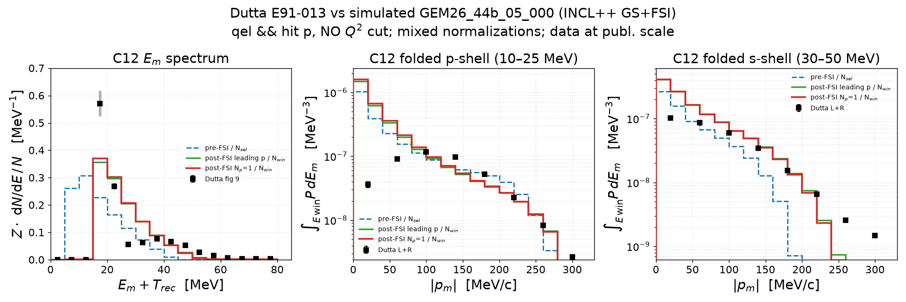

- Per-shell strengths: p-shell data 3.53 vs renormalized post 3.29–3.38
  (data/post = 1.04–1.07); s-shell 1.39 vs 1.53–1.57 (0.88–0.91) — the
  same-sign, same-size ±8–12 % residuals the 22b combo showed, i.e. the
  fig 6 ↔ fig 9 cross-normalization spread, not a model statement.
- Shape-wise the p-shell curve has no node (×40 over the 20 MeV/c point)
  and the s-shell curve is ×4 too high at 20–60 MeV/c and cut off at
  240 MeV/c where the data run to 300.

**All five tunes in one figure** (`--combo --grid --grid-tunes … --tag _incl`):
the sibling note's title-less 8-panel grid extended by a fifth row for
the INCL tune (2 columns × 5 rows, 3:4 h:w panels, rows touching); per row
exactly the combo curves, normalizations and data, tune tag inside each
E_m panel; the |p_m| column shares one log scale:

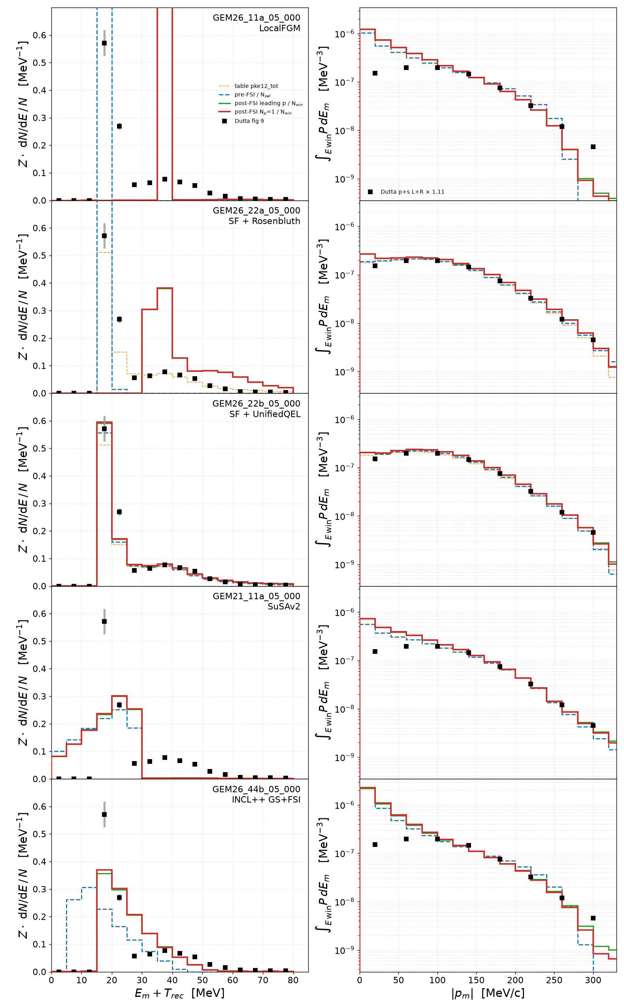

| tune | N_win/N_sel (1p) | pre-FSI (E) | post (E) | pre (p_m) | post (p_m) | data (p_m) |
|---|---|---|---|---|---|---|
| GEM26_11a | 0.579 | 6.000 | 6.000 | 6.000 | 6.01 | 5.44 |
| GEM26_22a | 0.488 | 5.439 | 6.000 | 5.505 | 6.07 | 5.44 |
| GEM26_22b | 0.533 | 5.542 | 6.000 | 5.591 | 6.06 | 5.44 |
| GEM21_11a | 0.538 | 5.422 | 6.000 | 5.481 | 6.08 | 5.44 |
| **GEM26_44b** | **0.520** | **6.000** | **6.000** | **6.000** | **6.02** | **5.44** |

- **In the E_m column the INCL row is a new entry in the v0.3 §4.3
  taxonomy**: not a δ line (11a), not bimodal (22a), not a truncated
  triangle (GEM21), and not on the data (22b) — a single broad peak at the
  right place (15–20 MeV) with 2/3 of the data's height, too much strength
  at 20–35 MeV and a tail that fades by 55 MeV. Of the five, it is the
  closest to the data after 22b, and the only one whose post-FSI spectrum
  has *no* trace of its pre-FSI structure (a uniform +10 MeV shift).
- **In the |p_m| column the INCL row reads like the LFG/SuSA rows, not the
  SF rows**: a monotonic rise toward |p_m| → 0 (steeper even than LFG's —
  2.5 vs 1.2 × 10⁻⁶ MeV⁻³ in the first bin) and a cut-off near 280 MeV/c
  below the data's outermost point, against the SF tunes' low-|p_m| shell
  plateau. The p_F-ball resampling is a Fermi gas in all but name; the
  INCL correlated ground state would have to reach the event record before
  this column could change.

Regenerate:
`GENIE_AGENT_INSTALLATION=genie_inclxx pixi run python results/template/make_em_folded_pm_sim.py --tune GEM26_44b_05_000`
(the pin resolves the SF-table lookup against the campaign install;
`--nsel postfsi` / `--nsel postwin`, `--proton-sel leading`, `--combo`,
`--combo --shells` for the variants; the five-row grid via
`--combo --grid --grid-tunes GEM26_11a_05_000 GEM26_22a_05_000 GEM26_22b_05_000 GEM21_11a_05_000 GEM26_44b_05_000 --tag _incl`).

## 3. The INCL ground state in the record: momentum vs sampled position

The v0.1 "plot 3" ([`make_struck_pr.py`](../template/make_struck_pr.py)):
the struck nucleon's momentum against the radial position `r = |X4|` the
record carries, for the four campaign tunes **and** the INCL tune, all
restricted to **QEL** single-nucleon events (`--sel-qel`; the campaign
dumps are full-EM, the INCL sample is EMQE-only, so `scat = 1` is the
like-for-like selection; no Q² window). Fraction of events per bin on one
shared log color scale (r on x, momentum on y), white dashed = the per-column
profile ⟨p⟩(r). The
INCL sample was dumped from its four local GHEP chunks with
`dump_hitnuc` (500,000 of 500,000 events single-nucleon):

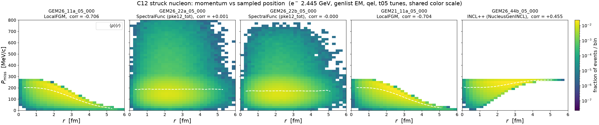

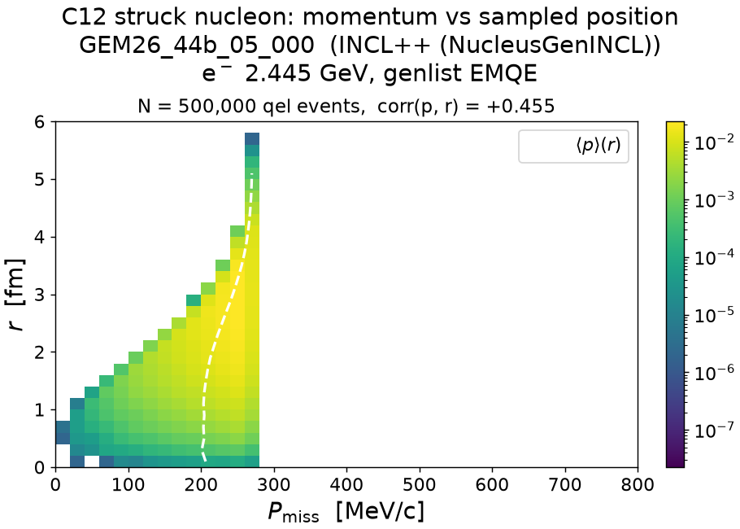

| tune | ground state | N (qel) | ⟨r⟩ [fm] | corr(p, r) |
|---|---|---|---|---|
| GEM26_11a_05_000 | LocalFGM | 385,486 | 2.30 | −0.706 |
| GEM26_22a_05_000 | 2D SF | 385,378 | 2.30 | +0.001 |
| GEM26_22b_05_000 | 2D SF | 277,035 | 2.30 | −0.000 |
| GEM21_11a_05_000 | LocalFGM | 345,033 | 2.30 | −0.704 |
| **GEM26_44b_05_000** | **INCL++ (NucleusGenINCL)** | **500,000** | **2.27** | **+0.455** |

- **The INCL record is a global p_F ball with a radius-dependent floor.**
  The momentum never exceeds 270 MeV/c (|p|_max = 270.3, the hard cut of
  the uniform-in-ball resampling, seen in section 2.1 as the record's
  cliff) at *every* radius, while the *lower* edge rises with r: the full
  0–270 range at the centre, p ≳ 180 MeV/c at 3 fm, p ≳ 240 at 4 fm, and
  only p ≈ 270 beyond 5 fm. ⟨p⟩(r) climbs from ≈ 200 MeV/c inside 1 fm to
  the cut at the surface; ⟨|p|⟩ = 225 MeV/c, median 237.
- **That floor is the local-energy acceptance imprinting a *positive*
  r–p correlation, +0.455** — a third species in the v0.1 taxonomy: LFG's
  k_F(r) envelope falls with r (corr −0.70, the *upper* edge moves), the
  SF tunes are exactly factorized (0), and INCL's *lower* edge moves the
  other way. Mechanically: the momentum is thrown in the global ball at the
  already-sampled ground-state radius and accepted only if its kinetic
  energy exceeds INCL's local energy `T_loc(r)` — the momentum a nucleon
  needs to reach that radius in the correlated ground state. The floor
  matches `p_min(r) = p_F F(r)^{1/3}` to a few MeV/c
  ([review §2](../../docs/incl-ground-state-review.md)). **But this is the
  record only**: the momentum the QE kinematics actually used is the
  local-energy-*reduced* one (⟨p⟩ 152 MeV/c, `corr(p, r) = −0.65`, LFG-like
  falling profile), so the two 2D pictures — record and kinematics — have
  opposite correlations; the review figure shows both.
- The radius itself is INCL's own density: ⟨r⟩ = 2.27 fm (max 5.5) against
  the 2.30 fm that VertexGenerator's r²ρ(r) gives every campaign tune.
- The dump also shows Phase-0 bug 4 directly: `RemovalEnergy` is the same
  denormal garbage (7.5 × 10⁻⁹⁰) in every INCL event — never assigned —
  which is why no INCL analysis here consumes it.

Regenerate: build `dump_hitnuc` in the `genie_inclxx` env (recipe in-file),
dump the four chunks to `results/prd-analyzer-v0.1/cache/hitnuc_c12/GEM26_44b_05_000.csv`,
then
`GENIE_AGENT_INSTALLATION=genie_inclxx pixi run python results/template/make_struck_pr.py --dump-dir results/prd-analyzer-v0.1/cache/hitnuc_c12 --target C12 --tunes GEM26_11a_05_000 GEM26_22a_05_000 GEM26_22b_05_000 GEM21_11a_05_000 GEM26_44b_05_000 --sel-qel --tag _qel --r-on-x --out-dir results/prd-analyzer-v1.0`
(`--tunes GEM26_44b_05_000` alone for the single figure; `--r-on-x` puts the
radius on x and the momentum on y, the orientation used here).

## 4. The new vertex: E_m and |p_m| with local energy on / never

The fork branch `feature/incl-vertex-local-energy` (`LiangLiu212/Generator`
@ `4fc6f094e`; plans in [`docs/incl-vertex-local-energy-option-plan.md`](../../docs/incl-vertex-local-energy-option-plan.md)
and [`docs/incl-local-frame-binding-plan.md`](../../docs/incl-local-frame-binding-plan.md))
hands **one** struck nucleon to the cross section, the lepton kinematics, INCL's
energy balance and the record: momentum in the local-energy frame (when
`local-energy-BB` applies it) or the INCL ball nucleon (`never`), with the well
depth as binding, `E_i = √(p_i² + m²) − V₀`, V₀ = T_F + S = 45.0 MeV. The
resampling keeps INCL's floor `p > p_min(r)` in both modes. Samples: 200k events
per setting (4 × 50k, 2026-09-04), each with its own regenerated spline
(σ 14–18 % below the 07-31 one, `spline_gem26_44b_locE.png`); registered here as
the pseudo-tunes `GEM26_44b_05_000_locEon` / `_locEnever` with explicit chunk
lists in the ladder scripts. Section 2's construction, unchanged:

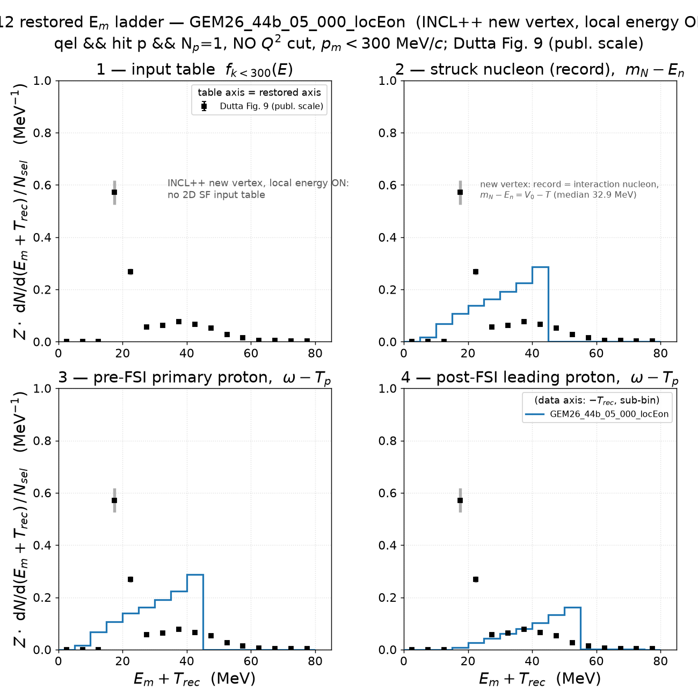
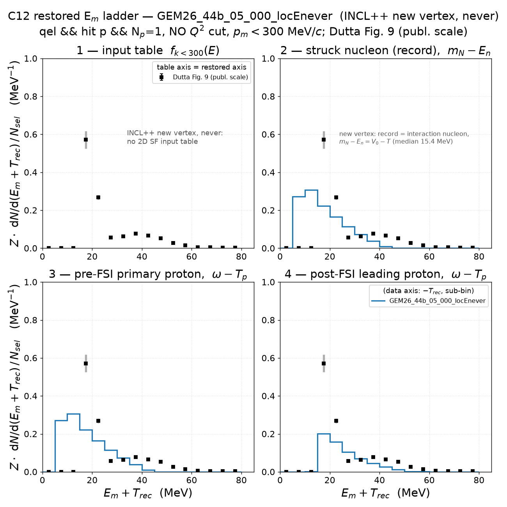

| sample | qel ∧ hit p | 1p fraction | I2r | I3r | I4r | I4r/I3r | record median [MeV] |
|---|---|---|---|---|---|---|---|
| old chain (section 2, 500k) | 346,164 (69.2 %) | 65.0 % | 0 (record E < 0) | 6.000 | 3.119 | 0.520 | −29.39 |
| **new, local energy on** | 139,869 (69.9 %) | 65.0 % | **6.000** | 6.000 | 3.114 | 0.519 | **+32.86** (p5–p95 13.4–44.2) |
| **new, never** | 139,972 (70.0 %) | 65.2 % | **6.000** | 6.000 | 3.130 | 0.522 | **+15.45** (7.4–34.0) |

- **Stage 2 is no longer empty and equals stage 3 bin by bin**: the recorded
  struck nucleon is the one the kinematics conserved (`m_N − E_n = V₀ − T`,
  positive, on the Dutta axis), the pre-FSI proton carries the same E_m, and
  `|p_p′ − q| = p_rec` to 0.004 MeV/c — the old chain's stage-2/stage-3 split
  (raw ball vs reduced nucleon, with the lepton and proton rescaled by INCL) is
  gone. Every stage integrates to Z = 6 before FSI.
- **`never` reproduces the old chain's physical stages**: the pre-FSI spectrum
  is `V₀ − T_ball` (floor S = 6.83 MeV, 10–15 MeV peak, tail to 45) and the
  post-FSI spectrum is the section-2 one (15–20 MeV peak, tail to ≈ 55); only
  the bookkeeping changed. Survival 0.522.
- **Local energy on moves the strength up**: `V₀ − T_red` with the reduced
  kinetic energy is a triangle rising to a hard edge at 45 MeV (median 33 MeV),
  and after FSI a peak at 50–55 MeV — the data's 17.5 MeV p-shell peak is
  missed by ≈ 30 MeV. Survival 0.519. This is the E_m cost of the LFG-like
  momentum predicted in the plan (E_m mean 17.5 → 31).
- The FSI transformation is the same +10 MeV shift and 0.52 survival in both —
  the cascade does not care which vertex convention produced the proton.

**|p_m| ladders** (section 2.1 construction; shell windows applied):

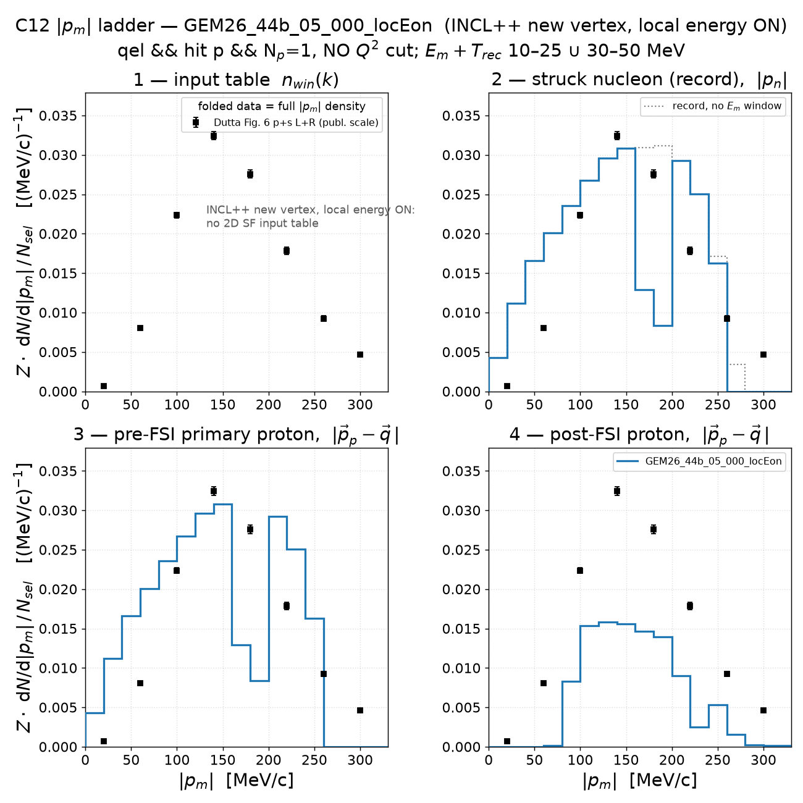
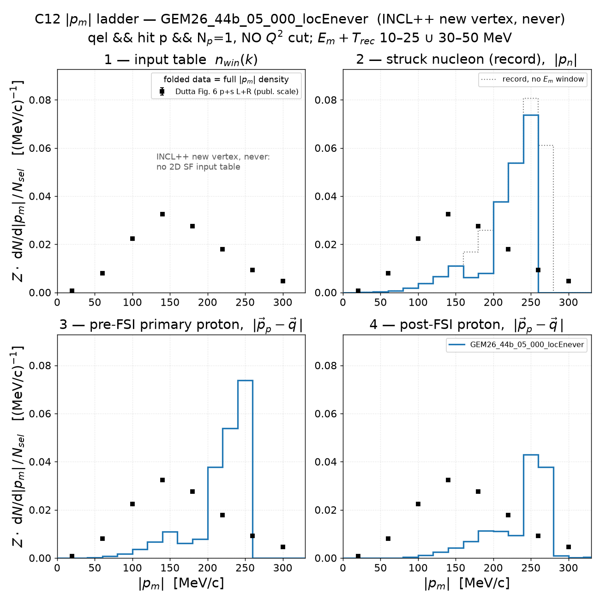

| sample | I2 (record) | I3 (pre-FSI) | I4 (post-FSI) | I4/I3 | I(data) |
|---|---|---|---|---|---|
| old chain | 0 (record E < 0) | 4.112 | 2.551 | 0.620 | 4.917 |
| **new, local energy on** | 5.099 | 5.099 | 2.057 | **0.404** | 4.917 |
| **new, never** | 4.071 | 4.071 | 2.583 | 0.634 | 4.917 |

- **The shell windows have become momentum bands.** With `E_m = V₀ − T(|p|)`
  exactly, the fig 6 windows select `|p_m|` slices: 10–25 MeV ⇔ 195–258 MeV/c
  and 30–50 MeV ⇔ |p_m| < 168 MeV/c, and the 25–30 MeV gap between them cuts
  a hole at 168–195 MeV/c — visible as the two-lump pre-FSI shapes in both
  ladders (the old chain's stage 3 showed the same thing on the reduced
  momentum, blurred by the rescaling). The p-shell window therefore holds the
  fast nucleons and the s-shell window the slow ones — the physical sign of the
  E_m–p_m correlation, but as a step function rather than as shells.
- **Local energy on**: the record is the LFG-like reduced momentum (⟨p⟩ 147
  MeV/c, corr(p, r) −0.67), so the pre-FSI ladder has the data's low-|p_m|
  plateau region populated (0–150 MeV/c) instead of the ball's cliff; but the
  shell-window survival collapses to 0.404 (22a-like): the reduced nucleon's
  E_m sits high, and FSI pushes most survivors out of the 30–50 window.
- **`never`**: the ball with the rising floor (⟨p⟩ 226, corr +0.47), pre-FSI
  concentrated at 200–260 MeV/c, survival 0.634 — the section-2.1 picture
  with stage 2 now filled.
- Companions from the same runs: `em_postfsi_shape_c12_GEM26_44b_05_000_locE*.png`,
  `pm_ladder_dens_c12_GEM26_44b_05_000_locE*.png`.

Regenerate (caches `cache/ladder_c12/GEM26_44b_05_000_locE{on,never}.npz`):
`GENIE_AGENT_INSTALLATION=genie_inclxx pixi run python results/template/make_emiss_ladder_q2cut.py --target C12 --tune GEM26_44b_05_000_locEon --proton-sel 1p --no-q2cut`
(and `…_locEnever`; the same for `make_pmiss_ladder_q2cut.py`).
