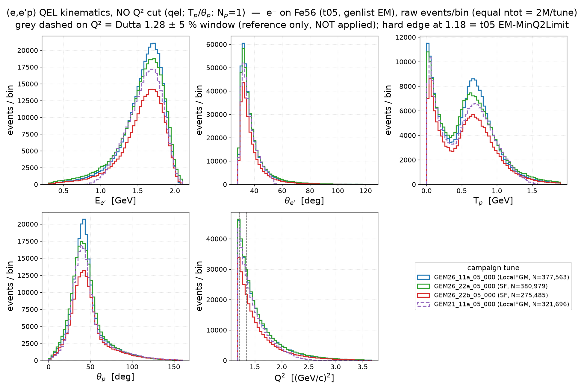
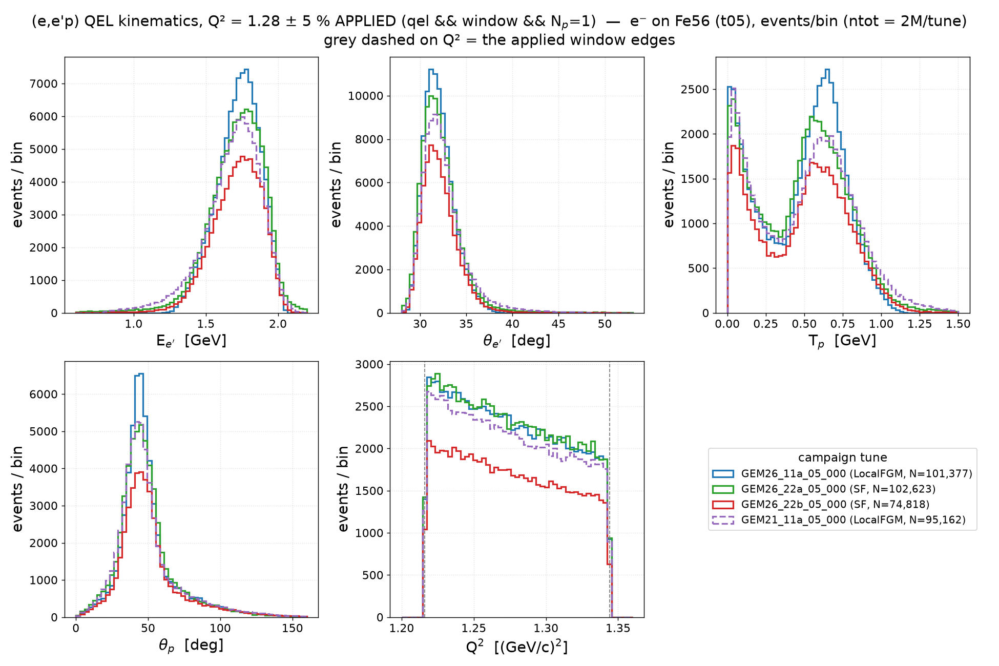
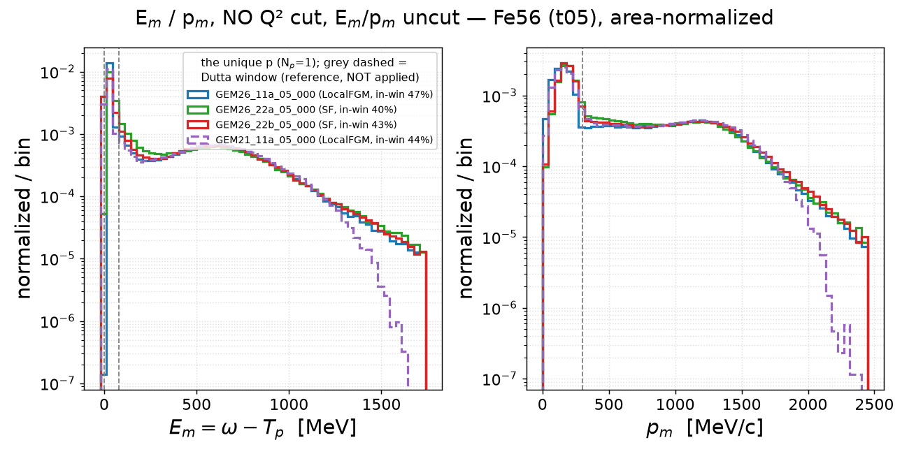
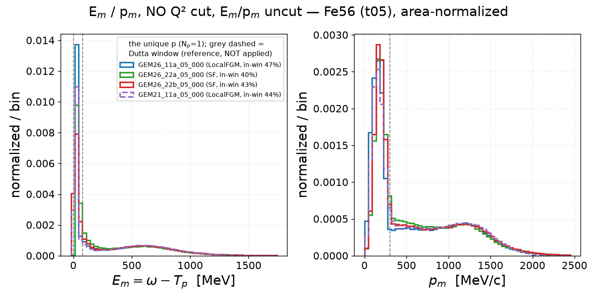
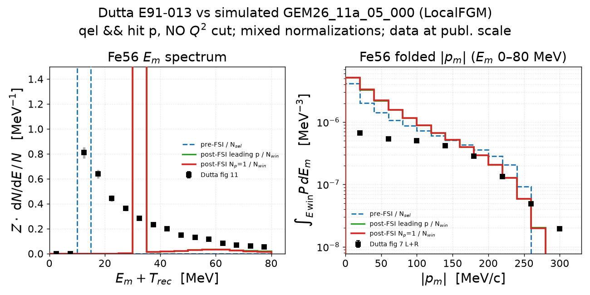
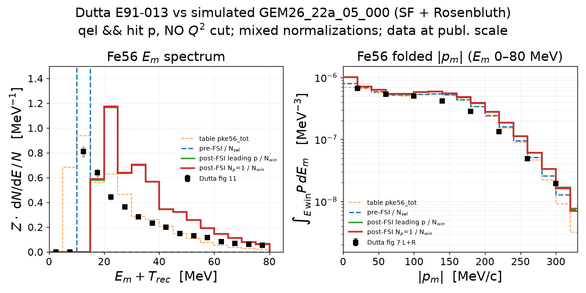
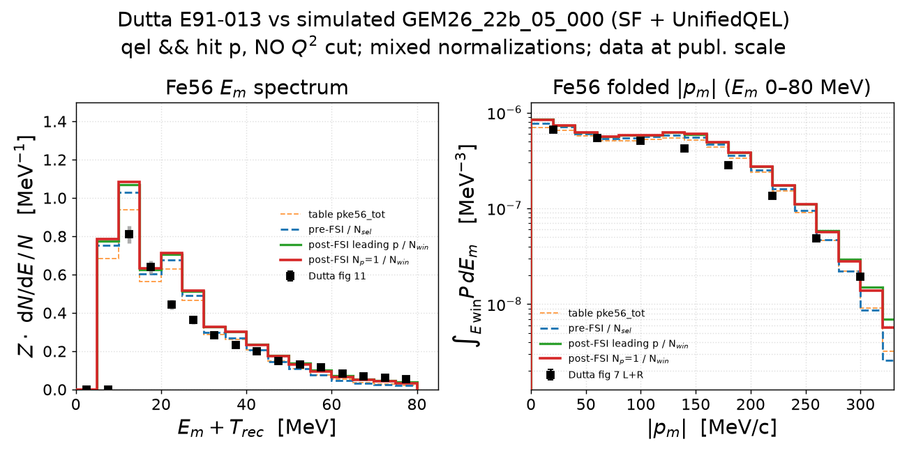
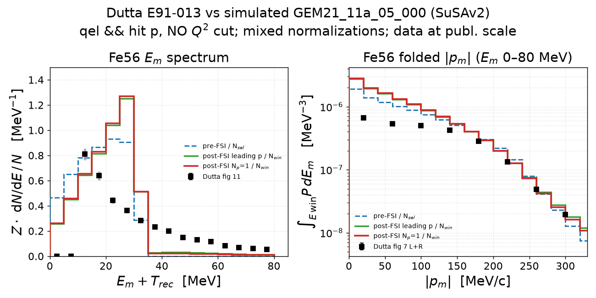

# Electron–Fe56 scattering — full generated phase space (v1.0)

The Fe56 instance of the v1.0 analysis
([C12 note](electron_c12_scattering.md)): the Dutta Q² slice dropped,

    qel                            (electron panels)
    qel && N_p(final state) = 1    (proton panels)

on the Fe56 full-EM t05 grid campaign 2026-07-16, 2M events/tune; the
generation cut EM-MinQ2Limit = 1.18 GeV² remains the hard lower Q² edge.

## 1. QEL kinematics — E_e′, θ_e′, T_p, θ_p, Q², no Q² cut

Raw events/bin (equal ntot = 2M/tune; shape companion `kin_qel_fe56.png`),
script [`make_kin_qel_v1.py`](../template/make_kin_qel_v1.py)
`--target Fe56`.

| tune | qel N (of 2M) | has_p | 0p | 1p | ≥2p |
|---|---|---|---|---|---|
| GEM26_11a_05_000 | 377,563 | 80.3 % | 19.7 % | 57.6 % | 22.7 % |
| GEM26_22a_05_000 | 380,979 | 79.3 % | 20.7 % | 56.8 % | 22.5 % |
| GEM26_22b_05_000 | 275,485 | 82.4 % | 17.6 % | 59.2 % | 23.2 % |
| GEM21_11a_05_000 | 321,696 | 81.8 % | 18.2 % | 58.9 % | 23.0 % |

(panel ranges pooled p0.2–p99.8: E_e′ [0.3, 2.1] GeV, θ_e′ [28, 124]°,
T_p [0, 1.9] GeV, θ_p [0, 160]°, Q² [1.18, 3.66] GeV².)

- The C12 ↔ Fe56 orderings carry over uncut: 22b's overall qel deficit
  (275k vs 322–381k), and the **larger ≥2p population on iron**
  (≈ 23 % vs C12's ≈ 15 % of qel — the transparency ordering).
- T_p keeps the two-component structure; with N_p = 1 the low-T_p
  FSI-rescatter peak and the QE bump (≈ 0.65 GeV) are comparable on iron
  (on C12 the QE bump dominates) — the uncut image of the v0.3 §3
  observation.

**Q²-cut companion** (`--q2cut`): the Dutta window applied — the v0.3
section-3 construction (shape companion `kin_qel_q2cut_fe56.png`):

The slice keeps 101,377 / 102,623 / 74,818 / 95,162 events
(11a/22a/22b/GEM21) and reproduces the v0.3 window multiplicities exactly
(1p = 56.0–58.9 %, ≥2p = 23.3–23.9 %).

Regenerate (this, the companion, and 1.1):
`pixi run python results/template/make_kin_qel_v1.py --target Fe56`
(`--q2cut` for the applied-window pair).

### 1.1 E_m and p_m — no cuts at all

Log-y above, linear-y below (raw-counts companion `empm_fe56_counts.png`):
E_m = ω − T_p and p_m of the unique proton, no E_m/p_m cuts, the Dutta
window grey-dashed as reference. In-window fractions (of qel ∧ N_p = 1):
**47 / 40 / 43 / 44 %** (11a/22a/22b/GEM21) — heavier FSI than C12's
55–65 %, and within ~2 % of v0.3's in-slice values (49/42/45/45 %).

## 2. E_m spectrum and folded |p_m| — mixed normalizations, four tunes

The [C12 combo construction](electron_c12_scattering.md) on iron
([`make_em_folded_pm_sim.py`](../template/make_em_folded_pm_sim.py)
`--combo --target Fe56`): table (thin dashed, SF tunes only), pre-FSI /
N_sel, and both post-FSI stage-4 definitions each / **its own in-window
count** (E_m + T_rec ∈ [0, 80), p_m < 300). One simplification vs C12:
**fig 7 needs no gap-fill** — it *is* the E_m < 80 MeV windowed density
(2×fig 7 ≡ fig 11 to 0.03 %), so the folded data go in as tabulated:

| tune | N_sel | N_win/N_sel (1p) | pre-FSI (E) | post (E) | pre (p_m) | post (p_m) | data |
|---|---|---|---|---|---|---|---|
| GEM26_11a | 251,502 | 0.395 | 26.000 | 26.000 | 26.000 | 26.12 | 18.2 |
| GEM26_22a | 254,047 | 0.336 | 23.423 | 26.000 | 23.735 | 26.39 | 18.2 |
| GEM26_22b | 186,694 | 0.365 | 23.976 | 26.000 | 24.186 | 26.33 | 18.2 |
| GEM21_11a | 213,209 | 0.379 | 24.448 | 26.000 | 24.755 | 26.39 | 18.2 |

- **On iron the Z-renormalized post curves overshoot the data by
  construction**: fig 11/7's published scale is the *in-window IPSM*
  renormalization (strength 18.2), **not** full occupancy — so forcing
  the post-FSI window integral to Z = 26 puts it ×26/18.2 = 1.43 above
  the data everywhere (the C12 combo lands on its data only because
  fig 9 *was* renormalized to Z). The renormalized curves are the
  occupancy-scale reference; the data comparison on iron is **shape**.
- In-window survivals 0.34–0.40 vs C12's 0.49–0.58 — the transparency
  ordering again; the two stage-4 definitions coincide in-window
  (post p_m strengths within 0.2 %), as on carbon.
- Shape: all four tunes' renormalized E_m survivors are broader than or
  displaced from the data peak in their §v0.3 signature ways, and every
  p_m panel shows the data *flatter* than the curves — the mid-|p_m|
  deficit of the normalization-page comparison, now visible against
  pre- and post-FSI alike (FSI barely reshapes |p_m|).

Regenerate:
`pixi run python results/template/make_em_folded_pm_sim.py --combo --target Fe56 --tune <tune>`
(caches: `cache/ladder_fe56{,_leading}/`, built with
`make_emiss_ladder_q2cut.py --target Fe56 … --no-q2cut --build-only`).
