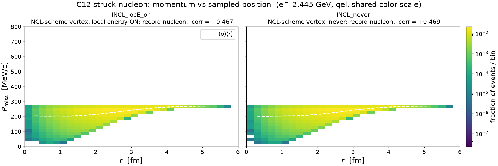
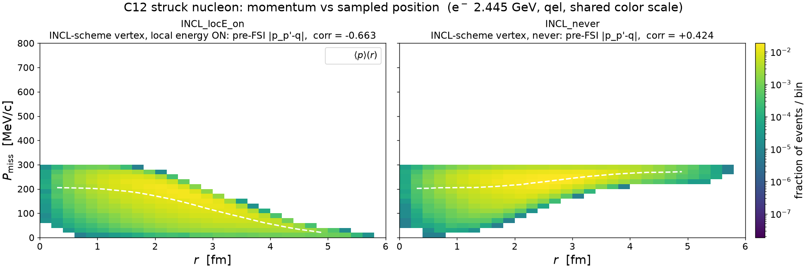
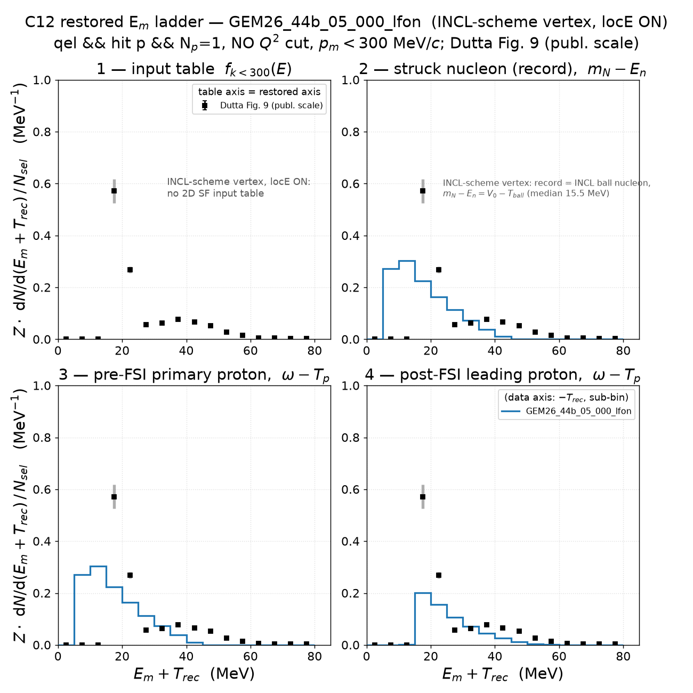
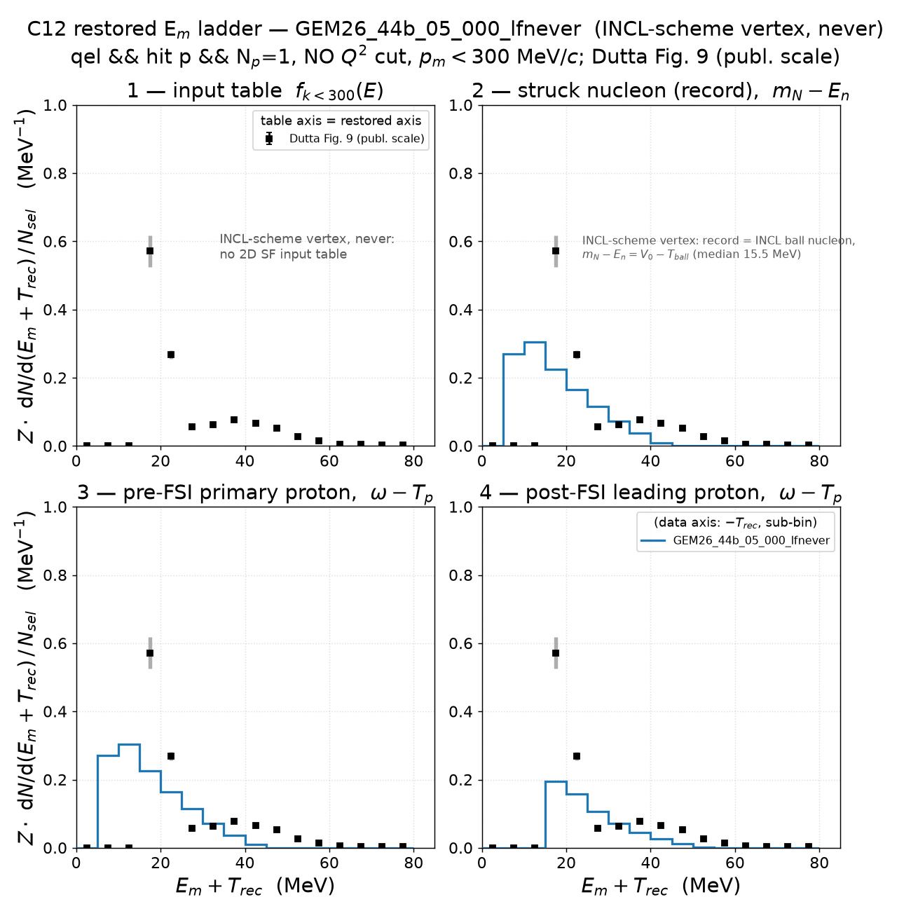
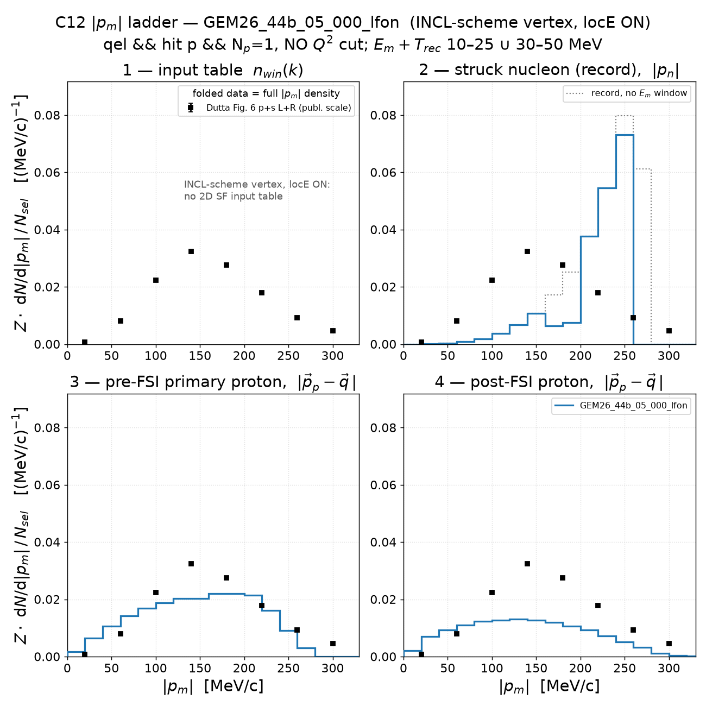
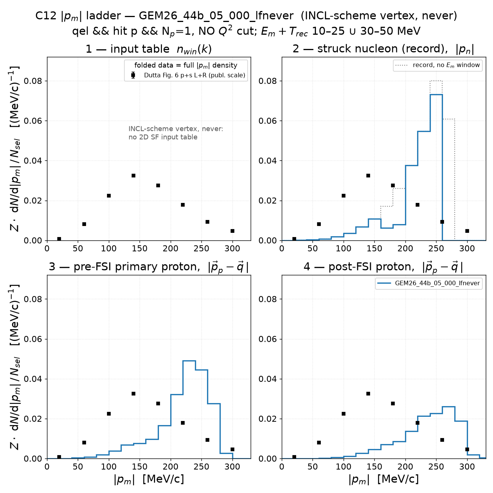
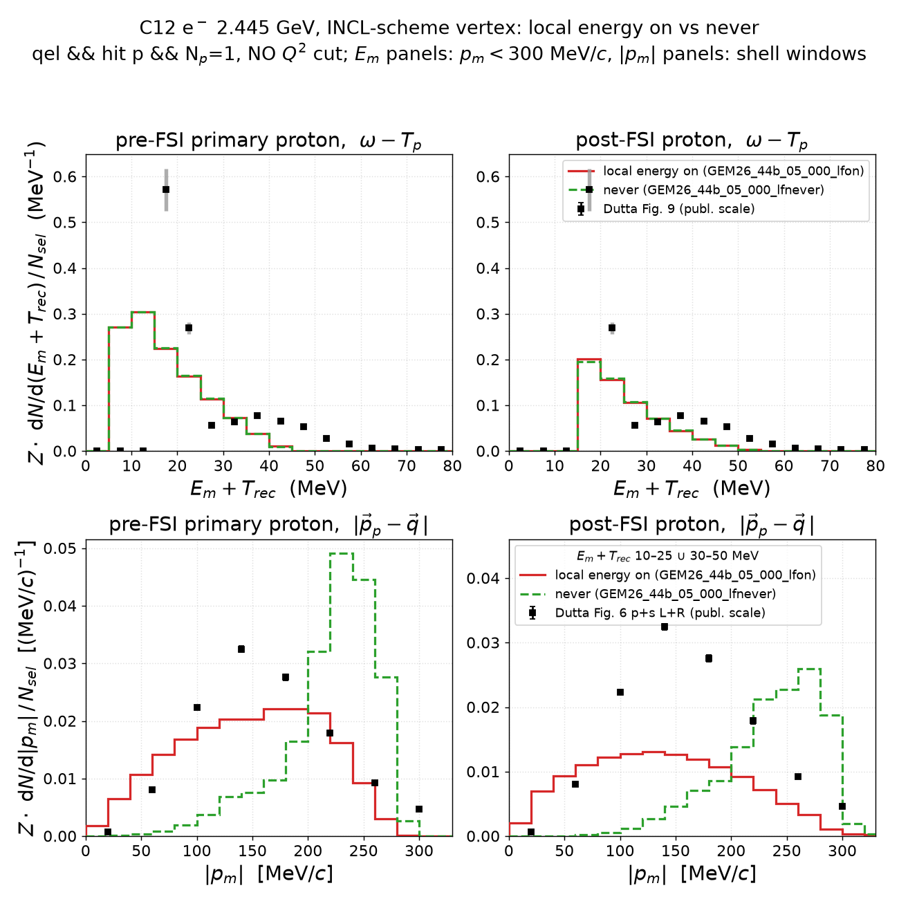

# Electron–C12 scattering with the GENIE INCL++ model — the INCL-scheme vertex: (r, p) correlation, E_m and |p_m| (v1.1)

The INCL++ tune **`GEM26_44b_05_000`** (INCL++ ground state *and* INCL++
cascade FSI, tune README
[`genie-agent/tunes/GEM26_44b/README.md`](../../genie-agent/tunes/GEM26_44b/README.md))
with the QE vertex of the fork branch `feature/incl-vertex-local-energy` at
**`6bd7803d6`** (`LiangLiu212/Generator`, 2026-09-04) — the *INCL-scheme*
vertex, in which INCL's `local-energy-BB` option is the single switch for
"with / without local energy". This note carries the three things that
characterize it, both settings side by side: the struck-nucleon **(r, |p|)
correlation**, the **missing-energy** ladder and the **missing-momentum**
ladder, on the Dutta E91-013 C12 data. The construction is the v1.0 one
([`../prd-analyzer-v1.0/electron_c12_scattering_genie_incl.md`](../prd-analyzer-v1.0/electron_c12_scattering_genie_incl.md),
which keeps the old chain's 500k analysis and the superseded first
implementation): no Q² window, the full generated EMQE phase space
(`EM-MinQ2Limit = 1.18 GeV²`),

    qel && hitnuc == p                 (struck-nucleon and pre-FSI panels)
    qel && hitnuc == p && N_p = 1      (post-FSI panels; v0.3 exactly-one-proton)

restored axis `E_m + T_rec` with the B11 recoil, |p_m| shell windows
10–25 ∪ 30–50 MeV, occupancy scale `Z·dN/dx/N_sel`.

**Samples** (`genie-agent/genie-runs/GEM26_44b_05_000-2026-09-04/`, e⁻ at
2.445 GeV, EMQE only, install `genie_inclxx`; registered as the pseudo-tunes
`GEM26_44b_05_000_lfon` / `_lfnever` in the ladder scripts):

| setting | `local-energy-BB` | spline (`gmkspl -n 30 -e 3.0`) | 200k events = 4 × 50k chunks (seeds) |
|---|---|---|---|
| local energy on | `first-collision` (`Default`) | `eminus_C12_20260904-153639-9f4.xml` | `eminus_C12_20260904-170929-740`, `-170930-58d`, `-170930-0b5`, `-170931-b2b` (20260911–14) |
| never | `never` (override `genie-agent/tunes-locE-never/` first in `GXMLPATH`) | `…-153640-9bc.xml` | `-171310-ad8`, `-171310-15a`, `-171310-6f2`, `-171310-ff5` (20260921–24) |

Against the old chain's 07-31 spline at 2.445 GeV the on-spline is e-p ×1.019,
e-n ×0.964 (same integrand convention, strict floor, gmkspl's few-% wobble)
and the never-spline ×0.972 / ×0.963 (`spline_gem26_44b_incl_scheme.png`).

## 1. The vertex in one paragraph

Plan, validation table and history:
[`docs/incl-vertex-local-energy-option-plan.md`](../../docs/incl-vertex-local-energy-option-plan.md)
(*Convention revised*). Per event INCL supplies a struck nucleon at radius r
with the ball momentum `p_ball` (resampled in the p_F ball above INCL's floor
`p_min(r)`), and three rules follow INCL's own `InteractionAvatar`:

1. **The scattering is computed in the local frame.** The cross section and the
   lepton/proton kinematics see the on-shell local-frame nucleon
   `(p_red, E_ball − T_loc(r))`, `p_red² = p_ball² − p_min(r)²`, when local
   energy is on, and the ball nucleon `(p_ball, E_ball)` under `never`.
2. **Energy conservation uses `E − V`, with no local-energy term.** INCL's
   balance at cascade insertion is `E_lep + E_ball − V₀`, `V₀ = T_F + S =
   45.0 MeV`; its energy-conservation functor rescales lepton and proton to it
   (−1.3 % in Q² on average with local energy on, −1.8 % under `never`).
3. **The record holds the global nucleon** `(p_ball, E_ball − V₀)`:
   `RemovalEnergy = V₀ − T_ball ∈ [6.83, 45.0]` MeV in every mode, and the
   post-cascade rewrite leaves the initial-state nucleon alone.

So `E_m = V₀ − T_ball` for the record and the pre-FSI proton alike, in both
settings; the record's (r, |p|) is INCL's ball in both; the local-energy choice
lives in the scattering only — in the pre-FSI `|p_p′ − q|` and in the cross
section. Verified on 20k events per setting before production (record =
`(p_ball, E_ball − V₀)` to 0.01 MeV, stage-2 = stage-3 E_m to 10⁻⁴ MeV).

## 2. The (r, |p|) correlation

Section-3 construction of the v1.0 note (`make_struck_pr.py --csv … --r-on-x
--sel-qel`, 2D histogram of the sampled radius against the momentum, `⟨p⟩(r)`
profile, Pearson corr(p, r)); 200k events per setting.

**The record** — INCL's ball with the rising floor in both settings; the
plot that used to separate the settings cannot any more:



**The pre-FSI `|p_p′ − q|` of the same events** (`make_stage3_csv.py`
writes it in the dump format): with local energy on it is the local-frame
momentum — LFG-like, the ceiling `√(p_F² − p_min(r)²)` falling with r; the
edge slightly above p_F is INCL's rescaling — while under `never` it is the ball
itself:



| quantity (qel ∧ hit p) | local energy on | never |
|---|---|---|
| record: corr(p, r), ⟨r⟩ | +0.467, 2.30 fm | +0.469, 2.30 fm |
| pre-FSI \|p_p′ − q\|: corr(·, r), ⟨r⟩ | **−0.663**, 2.31 fm | **+0.424**, 2.31 fm |

For scale: LFG −0.70, SF 0 (v1.0 section 3); the old chain's record +0.46 and
its stage-3 −0.65 are the same two objects.

## 3. Missing energy

Section-2 construction of the v1.0 note (`make_emiss_ladder_q2cut.py`):
stage 2 = struck nucleon in the record (`m_N − E_n`), stage 3 = pre-FSI primary
proton (`ω − T_p`), stage 4 = post-FSI proton (`N_p = 1`), all on
`E_m + T_rec`, `p_m < 300 MeV/c`, against Dutta Fig. 9.




| sample | qel ∧ hit p | 1p fraction | I2r | I3r | I4r | I4r/I3r | record median [MeV] (p5–p95) |
|---|---|---|---|---|---|---|---|
| old chain (v1.0, 500k) | 346,164 (69.2 %) | 65.0 % | 0 (record E < 0) | 6.000 | 3.119 | 0.520 | −29.39 |
| **local energy on** | 141,074 (70.5 %) | 65.2 % | **6.000** | 6.000 | 3.138 | 0.523 | **15.46** (7.40–34.11) |
| **never** | 138,368 (69.2 %) | 65.5 % | **6.000** | 6.000 | 3.119 | 0.520 | **15.50** (7.42–33.96) |

- **The two settings give the same E_m ladder, and it is the old chain's.**
  Stage 2 is filled (`m_N − E_n = V₀ − T_ball`: floor S = 6.83 MeV, peak
  10–15 MeV, tail to 45) and equals stage 3 bin by bin; stage 4 is the
  v1.0 section-2 spectrum, peak at 15–20 MeV on the data's p-shell point.
- **The cascade adds a constant.** For every unscattered proton
  `E_m(post) − E_m(pre) = +9.13 MeV` exactly — INCL's emission Q-value
  correction, the real `S_p(C12) = 15.96 MeV` minus the 6.83 MeV already in
  V₀ — so the post-FSI floor is the real separation energy. The other 35 % of
  events leave the `N_p = 1` sample (rescattering / absorption).
- Local energy on/off does not touch E_m, by construction (rule 2); the
  0.6 % difference in I4r is statistics.
- Survivor-normalized shapes: `em_postfsi_shape_c12_GEM26_44b_05_000_lf{on,never}.png`.

## 4. Missing momentum

Section-2.1 construction (`make_pmiss_ladder_q2cut.py`): the same three
stages projected on `|p_m|` inside the fig-6 shell windows, against Dutta
Fig. 6 p+s folded L+R; stage 2 also without the window (dotted).




| sample | I2 (record) | I3 (pre-FSI) | I4 (post-FSI) | I4/I3 | I(data) |
|---|---|---|---|---|---|
| old chain (v1.0, 500k) | 0 (record E < 0) | 4.112 | 2.551 | 0.620 | 4.917 |
| **local energy on** | 4.072 | 4.072 | 2.577 | 0.633 | 4.917 |
| **never** | 4.070 | 4.070 | 2.589 | 0.636 | 4.917 |

- **Stage 2 is the ball in both** (peak 240–260 MeV/c, cliff at p_F = 270).
  Because `E_m = V₀ − T_ball` exactly, the shell windows are momentum bands of
  the ball: 10–25 MeV ⇔ 195–258 MeV/c, 30–50 MeV ⇔ |p| < 168 MeV/c, with a
  hole at 168–195 — the two-lump stage-2 shape.
- **Stage 3 is where the settings differ.** With local energy on the pre-FSI
  proton carries the local-frame momentum, a broad plateau over 50–250 MeV/c
  that populates the data's low-|p_m| region (the old chain's stage 3: its
  kinematics were the same); under `never` it is the ball, concentrated at
  200–280 MeV/c. The integrals agree (both count the same nucleons), the
  shapes do not.
- **After FSI** the shell-window survival is 0.63 in both (old chain 0.62).
  The on-sample sits below the data's 140 MeV/c peak by ~2.5× and above it
  beyond 220; `never` peaks at 260–280 MeV/c, past the data.
- Dutta-units densities: `pm_ladder_dens_c12_GEM26_44b_05_000_lf{on,never}.png`.

## 5. On vs never at a glance

The pre- and post-FSI projections of sections 3 and 4 overlaid
(`make_incl_onoff_overlay.py`, same caches, same windows): identical E_m
(top), the local-energy choice entirely in |p_m| (bottom).



## Reproduce

Caches: `results/prd-analyzer-v1.0/cache/ladder_c12/GEM26_44b_05_000_lf{on,never}.npz`
(built by the E_m script; gitignored) and the per-chunk `dump_hitnuc` CSVs
plus stage-3 CSVs under `cache/hitnuc_c12/` here (gitignored).

```bash
# E_m and |p_m| ladders (the E_m run builds the cache)
for t in GEM26_44b_05_000_lfon GEM26_44b_05_000_lfnever; do
  GENIE_AGENT_INSTALLATION=genie_inclxx pixi run python results/template/make_emiss_ladder_q2cut.py \
      --target C12 --tune $t --proton-sel 1p --no-q2cut --out-dir results/prd-analyzer-v1.1
  GENIE_AGENT_INSTALLATION=genie_inclxx pixi run python results/template/make_pmiss_ladder_q2cut.py \
      --target C12 --tune $t --proton-sel 1p --no-q2cut --out-dir results/prd-analyzer-v1.1
done
GENIE_AGENT_INSTALLATION=genie_inclxx pixi run python results/template/make_incl_onoff_overlay.py

# (r, p): dump_hitnuc <csv> <ghep> per chunk (spack env), concatenate per setting;
#         make_stage3_csv.py <out.csv> --gst <chunks.gst.root> --dump <chunk csvs>
C=results/prd-analyzer-v1.1/cache/hitnuc_c12
pixi run python results/template/make_struck_pr.py --target C12 --dump-dir $C --r-on-x --sel-qel \
    --tag _record --out-dir results/prd-analyzer-v1.1 \
    --csv "INCL_locE_on=$C/record_GEM26_44b_05_000_lfon.csv:INCL-scheme vertex, local energy ON: record nucleon" \
    --csv "INCL_never=$C/record_GEM26_44b_05_000_lfnever.csv:INCL-scheme vertex, never: record nucleon"
pixi run python results/template/make_struck_pr.py --target C12 --dump-dir $C --r-on-x --sel-qel \
    --tag _stage3 --out-dir results/prd-analyzer-v1.1 \
    --csv "INCL_locE_on=$C/stage3_GEM26_44b_05_000_lfon.csv:INCL-scheme vertex, local energy ON: pre-FSI |p_p'-q|" \
    --csv "INCL_never=$C/stage3_GEM26_44b_05_000_lfnever.csv:INCL-scheme vertex, never: pre-FSI |p_p'-q|"

# splines
pixi run python results/template/make_spline_44b_locE.py --old <07-31 spline> --on <…-153639-9f4.xml> \
    --never <…-153640-9bc.xml> --out results/prd-analyzer-v1.1/spline_gem26_44b_incl_scheme.png \
    --variant "INCL-scheme vertex" --on-label "INCL-scheme vertex, local energy on" --never-label "INCL-scheme vertex, never"
```

## Figures

| file | content |
|---|---|
| `struck_pr_c12_all_t05_record.png` (+ `struck_pr_c12_INCL_{locE_on,never}_record.png`) | record (r, \|p\|), on / never |
| `struck_pr_c12_all_t05_stage3.png` (+ `…_stage3.png` singles) | pre-FSI \|p_p′ − q\| vs r, on / never |
| `em_ladder_restored_c12_GEM26_44b_05_000_lf{on,never}.png`, `em_postfsi_shape_…` | E_m ladders and post-FSI shapes |
| `pm_ladder_c12_GEM26_44b_05_000_lf{on,never}.png`, `pm_ladder_dens_…` | \|p_m\| ladders and Dutta-units densities |
| `incl_onoff_overlay_c12.png` | on vs never, E_m and \|p_m\|, pre/post-FSI |
| `spline_gem26_44b_incl_scheme.png` | EMQE splines vs the old chain's |
