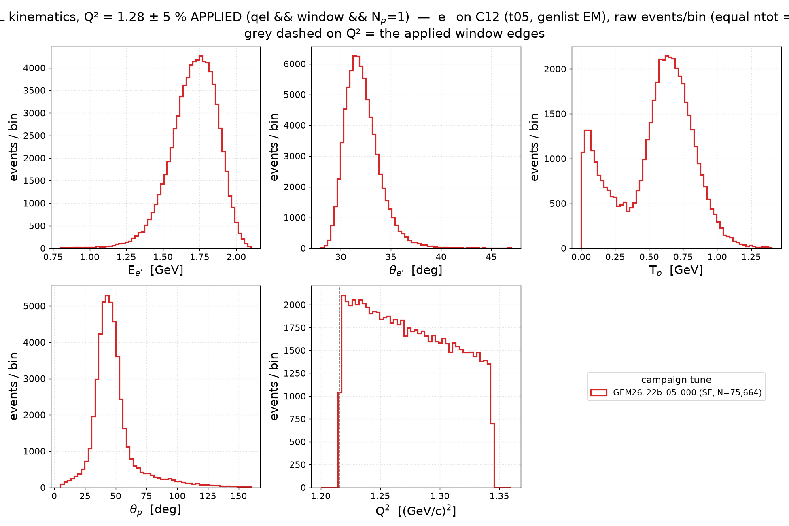
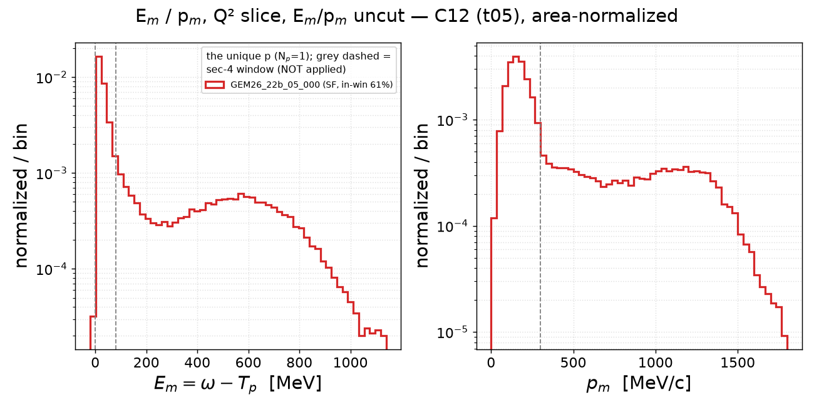
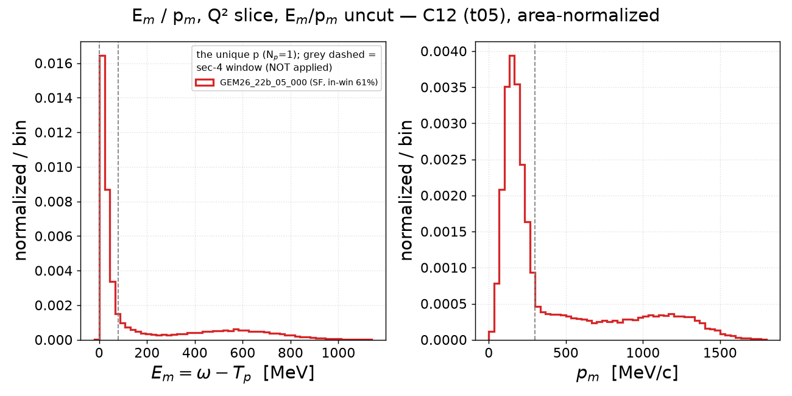
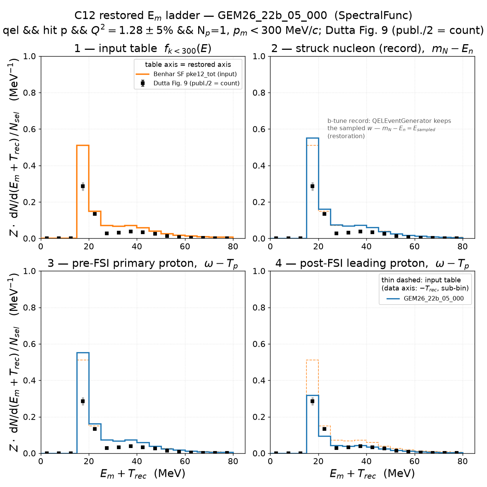
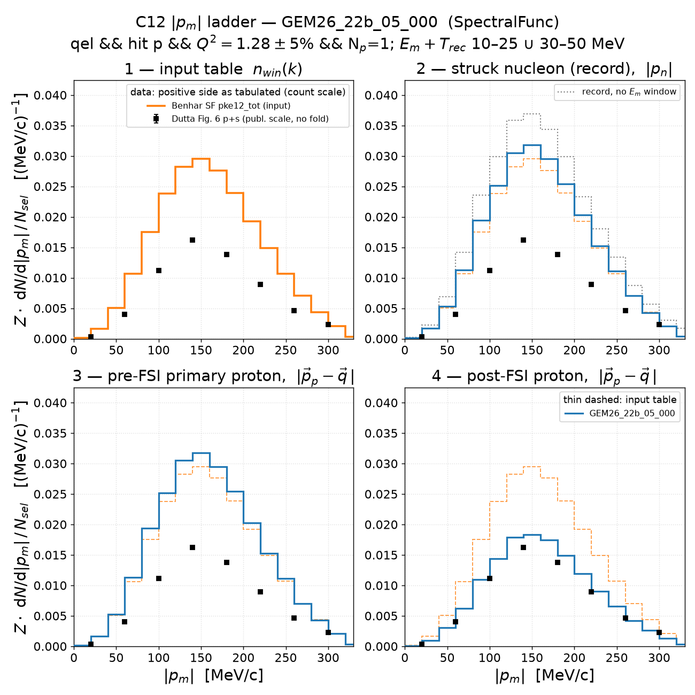
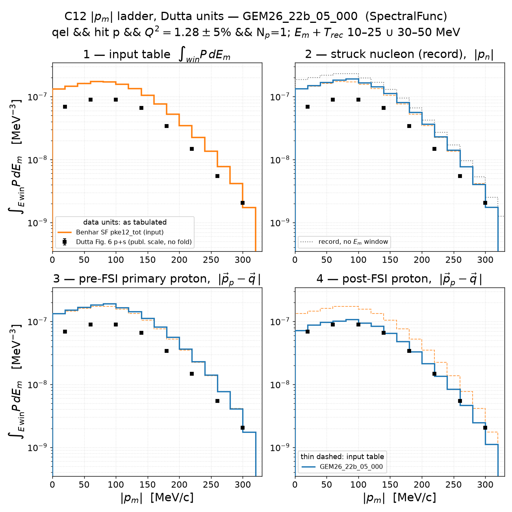
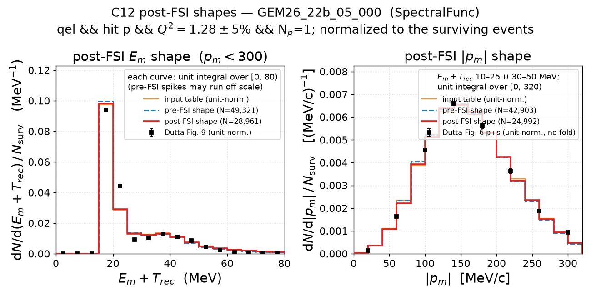
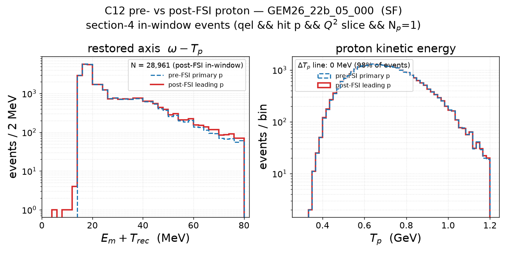
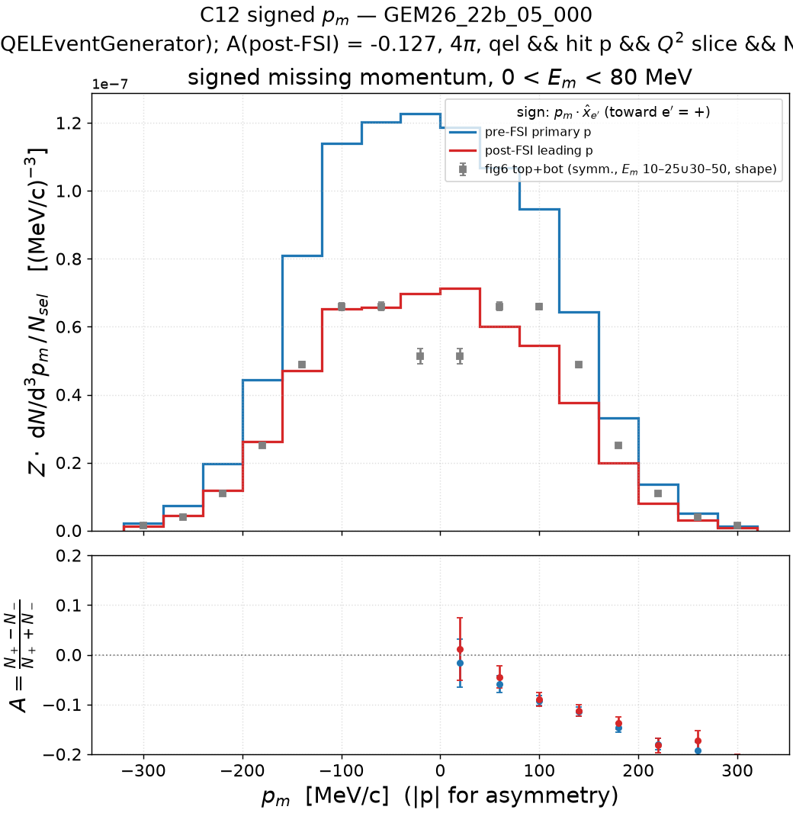

# Electron–C12 scattering — Q² slice, exactly-one-proton selection, Dutta data on the count scale (v1.2, `GEM26_22b_05_000`)

v1.2 instance of
[`../prd-analyzer-v0.3/electron_c12_scattering.md`](../prd-analyzer-v0.3/electron_c12_scattering.md)
for the single tune **`GEM26_22b_05_000`** (Benhar spectral function,
`QELEventGenerator`, hA2018): identical sample (C12 full-EM t05 grid campaign
2026-07-26, 2M events), identical selection

    qel  &&  hitnuc == p  &&  |Q²/1.28 − 1| ≤ 5 %  &&  N_p(final state) = 1

and identical constructions, with **one convention changed**: every Dutta
data point is drawn at **half its published value**. The author confirmed on
2026-09-06 that the plotted `S(E_m)` of fig 9 integrates `4π p_m² S^D` over
the *signed* `p_m` axis (−300 … +300 MeV/c) and so counts each `|p_m|`
twice — `Σ S dE / 2 = 3.04` is the proton count in the window, a raw
distorted strength ≈ T·Z/f_corr, not ≈ Z — and that the fig 6 `p_m` files
carry the full density on *each* side, so the positive half is drawn as
tabulated (no L+R fold; [`report/dutta-integral/integrate_dutta.py`](../../report/dutta-integral/integrate_dutta.py)).
The old reading (fig 9 ≈ Z, fold L+R) is what
[`results/normalization/README.md`](../normalization/README.md) and v0.2/v0.3
still carry.

The occupancy normalization is **unchanged from v0.3**: `Z · dN/dx / N_sel`
with `N_sel` = the true-QE proton count in the Q² slice before any E_m/p_m
window or proton requirement,

| count | 22b, C12 | definition |
|---|---|---|
| ntot | 2,000,000 | generated events, genlist EM |
| N_QE | 277,035 | `qel`, both hit-nucleon species, no cut (v0.1 kinematics cache) |
| qel ∧ hit p | 195,170 | hit-nucleon dump |
| **N_sel** | **53,517** | `qel ∧ hit p ∧ Q² slice` — the ladder cache's `n_sel` |
| 1p in-window | 28,961 | post-FSI survivors, sections 4 / 4.3 / 5 |

so the pre-FSI stages still integrate to ≈ Z in the 0–80 MeV window and only
the *data* moved, by exactly ½. (The scripts also accept `--norm total-qe`,
N_QE = 277,035, which divides every MC curve by a further 5.18; not used
here.) Every histogram figure has a text readout `<stem>.txt` next to it
([`histdiag`](../template/histdiag.py), written by
[`make_eep_readouts.py`](../template/make_eep_readouts.py)); the numbers
below are quoted from those files.

**Headline.** With the data on the count scale the comparison inverts: it
is the **post-FSI** stage, not the pre-FSI one, that sits at the data's
absolute strength — E_m: stage 4 / data = 1.068 ± 0.008 (stage 3 / data =
1.82); |p_m| shells: 1.140 ± 0.012 (1.96). The shapes are the v0.3 ones:
|p_m| agrees with the data to within the 40 MeV/c binning (χ²/ndf 37/7,
mean 161.6 vs 162.5 MeV/c), E_m peaks on the data's p-shell bin but is
broader (std ratio 1.16) with +17 % in the tail above 39 MeV.

## 1. C12 2D spectral function — the GENIE input table

Cut- and selection-independent — see
[v0.1 section 1](../prd-analyzer-v0.1/electron_c12_scattering.md#1-c12-2d-spectral-function--the-genie-input-table).

## 2. Struck nucleon in the record

Record-level — independent of the FS-proton choice; see
[v0.2 section 2](../prd-analyzer-v0.2/electron_c12_scattering.md#2-struck-nucleon-in-the-record-sampled-p_miss-e_rm-and-p_miss-r).

## 3. QEL kinematics in the slice — E_e′, θ_e′, T_p, θ_p, Q²



As v0.3 section 3 for 22b alone (**events/bin above**; area-normalized
companion `kin_qel_q2cut_c12.png`; readout `kin_qel_q2cut_c12.txt`). The
slice keeps 75,664 `qel` events of both species (27.3 % of the 277,035 QE
events); the proton panels use the 48,324 with N_p = 1. Multiplicity of the
qel ∧ Q²-window sample: 0p 20.1 %, 1p 63.9 %, ≥2p 16.0 % (the v0.3 row).
Electron side: E_e′ mean 1.71 GeV (peak 1.76), θ_e′ mean 32.2° (peak 31.4°),
Q² mean 1.275 GeV² flat across the window; proton side: T_p mean 0.55 GeV
(peak 0.63, FWHM 0.38), θ_p mean 48° (peak 43°, FWHM 20°).

### 3.1 E_m and p_m in the slice — no E_m/p_m cuts





As v0.3 subsection 3.1 (log-y above, linear-y below, raw-counts companion
`empm_q2cut_c12_counts.png`; readout `empm_q2cut_c12.txt`). In-window
fraction (E_m in [0, 80), p_m < 300) of the N_p = 1 events: **0.606**
(v0.3: 61 %). E_m peaks in the 0–25 MeV bin (median 39.8 MeV, 75 % quantile
315 MeV — the RES/DIS-like tail of the uncut estimator), p_m peaks at
150 MeV/c (median 214 MeV/c).

Regenerate (this and 3.1):
`pixi run python results/template/make_kin_qel_q2cut.py --target C12 --proton-sel 1p --tunes GEM26_22b_05_000 --out-dir results/prd-analyzer-v1.2`.

## 4. Missing energy: table vs simulation vs Dutta Fig. 9 at half scale

Stage 4 = the unique proton of N_p = 1 events; stages 1–3 as v0.3. The data
are fig 9 × ½ (label "publ. scale / 2 = count"), integral **3.040** over
0–80 MeV; the table and the MC stages are unchanged from v0.3.



| quantity | value | v0.3 (published-scale data) |
|---|---|---|
| N_sel | 53,517 | 53,517 |
| 1p fraction of the in-window sample | 81.0 % | 81.0 % |
| I1 (table, k < 300) | 5.249 | 5.249 |
| I2r = I3r | 5.530 | 5.530 |
| I4r | 3.247 | 3.247 |
| I4r / I3r | 0.587 | 0.587 |
| **I(data)** | **3.040** | 6.080 |
| stage 4 / data | **1.068 ± 0.008** | 0.534 |
| stage 3 / data | 1.819 ± 0.012 | 0.909 |
| record median (p5–p95) | 20.48 MeV (15.50–62.05) | same |

Readout `em_ladder_restored_c12_GEM26_22b_05_000.txt`:

- **Normalization.** The post-FSI stage carries 6.8 % more strength than the
  data's raw distorted count (+8.4σ, statistical errors only — the data's
  2 % + 5 % systematic band is not in the pull); the pre-FSI stage is ×1.82
  above. The MC survival 0.587 compares with the data's N/Z = 3.04/6 = 0.507,
  or 0.56 after the paper's f_corr = 1.11 correlation correction.
- **Shape (data scaled to the MC integral, χ²/ndf 1282/14).** Both peak in
  the 15–20 MeV bin; the MC is below the data at 20–25 MeV (−34 %) and above
  at 25–35 (+28 %) and 50–80 MeV (+64 %): mean 27.05 vs 25.79 MeV, std ratio
  1.16, core (16.7–39 MeV) shape ratio 0.971, tail above 39 MeV 1.167
  (+9.2σ). The 5 MeV data bins cannot resolve the record's δ-like p-shell
  line (FWHM 6.06 vs 7.22 MeV).
- Stage 3 = stage 2 bin by bin (χ² = 0), as in every b-tune ladder.
- Post-FSI vs pre-FSI (`em_postfsi_shape_c12_GEM26_22b_05_000.txt`): ratio
  0.587, shapes alike up to a localized excess at 65–80 MeV (+26 %, +4.5σ)
  and a +0.46 MeV mean shift — hA2018's ΔT_p = 0 with a small rescattered
  tail.

Regenerate: `GENIE_AGENT_INSTALLATION=genie_inclxx pixi run python results/template/make_emiss_ladder_q2cut.py --target C12 --tune GEM26_22b_05_000 --proton-sel 1p --data-conv raw --norm windowed --out-dir results/prd-analyzer-v1.2`.

### 4.1 Missing momentum: table vs record vs pre/post-FSI proton

The |p_m| projection of the same ladder
([`make_pmiss_ladder_q2cut.py`](../template/make_pmiss_ladder_q2cut.py)),
fig 6 shell windows `E_m + T_rec` 10–25 ∪ 30–50 MeV, native 20 MeV/c bins,
occupancy scale. Data: fig 6 top + bottom, **positive side as tabulated**
(no fold), weighted 4πp_m² onto the occupancy axis.



Windowed strengths, |p_m| < 320 MeV/c: I1(table) = 4.533,
**I(data) = 2.459** (v0.3 folded: 4.917), data/table = **0.54** (v0.3:
1.08).

| stage | I | I / data | v0.3 I / data (folded) |
|---|---|---|---|
| 2 record | 4.810 | 1.956 | 0.978 |
| 3 pre-FSI | 4.810 | 1.956 | 0.978 |
| 4 post-FSI | 2.802 | **1.140 ± 0.012** | 0.570 |
| I4 / I3 | 0.583 | | |

Readout `pm_ladder_c12_GEM26_22b_05_000.txt`:

- **Post-FSI sits 14 % above the unfolded data** (+11.6σ stat), pre-FSI
  ×1.96; the shell-window survival 0.583 is the v0.3 number.
- **Shape (40 MeV/c data grid, χ²/ndf 37/7).** Mean 161.6 vs 162.5 MeV/c
  (−1.5σ), both peak at 140 MeV/c, FWHM 149 vs 145; core (100–227 MeV/c)
  shape ratio 1.006, left tail 1.037, right tail 0.934. The only bins
  beyond 3σ are the first (0–40 MeV/c, MC +37 % of a small value) and the
  last (280–320, −25 %).
- **FSI does not reshape |p_m|**: stage 4 vs stage 3 after equal-integral
  scaling χ²/ndf 8.1/15 (p = 0.92), mean shift +1.1 ± 0.5 MeV/c — a
  normalization-only difference, the v0.3 finding.
- Stage 2 without the E window: 53,517 events, mean 173 MeV/c with the
  high-|p_m| tail (skew 1.9); the shell windows keep 43,114 of them.

Regenerate: `GENIE_AGENT_INSTALLATION=genie_inclxx pixi run python results/template/make_pmiss_ladder_q2cut.py --target C12 --tune GEM26_22b_05_000 --proton-sel 1p --data-conv raw --norm windowed --out-dir results/prd-analyzer-v1.2`.

### 4.2 The same ladder in Dutta's units — ∫_win P dE_m [MeV⁻³]

Section 4.1 in the files' native units (MC ÷ 4πp_c², table as `Z·Σ P·ΔE`,
data exactly as tabulated — here the unfolded positive side), log y.



Same counts as 4.1 (`pm_ladder_dens_c12_GEM26_22b_05_000.txt` points there):
the p+s plateau at 40–110 MeV/c and the two-decade agreement of the
record with the windowed table are as in v0.3; the data now lie a factor
≈ 1.14 below stage 4 across the range instead of a factor ≈ 1.75 above.

### 4.3 Post-FSI E_m and |p_m| shapes, normalized to the survivors



Unit-normalized in each window
([`make_postfsi_empm_shape.py`](../template/make_postfsi_empm_shape.py)),
so the ½ on the data cancels and this figure is v0.3's: E panel 49,321 →
28,961, p panel 42,903 → 24,992. Readouts
`postfsi_shape_empm_c12_GEM26_22b_05_000.txt` /
`em_postfsi_shape_c12_GEM26_22b_05_000.txt`:

- |p_m| shape vs data: χ²/ndf 37/7, mean −0.9 ± 0.6 MeV/c, no run pattern
  beyond the first and last bins — the |p_m| distribution measures the
  ground state and hA2018 leaves it alone.
- E_m shape vs data: χ²/ndf 1282/14, MC broader (std 13.5 vs 11.7 MeV,
  68 % interval ratio 1.10) with +17 % above 39 MeV; the survivors sit on
  the pre-FSI shape and the data peak (ΔT_p = 0), the tail excess is the
  rescattered remainder.

Regenerate: `GENIE_AGENT_INSTALLATION=genie_inclxx pixi run python results/template/make_postfsi_empm_shape.py --target C12 --tune GEM26_22b_05_000 --proton-sel 1p --data-conv raw --out-dir results/prd-analyzer-v1.2`.

## 5. Pre- vs post-FSI proton



No data on this figure, so it is v0.3's (readout
`fsi_prepost_c12_GEM26_22b_05_000.txt`): 28,961 in-window events,
multiplicity 0p 1.8 % / 1p 81.0 % / ≥2p 17.2 %, the unique proton is the
primary's descendant in 100.0 % of them, ΔT_p = T_p(pre) − T_p(post) median
0.00 MeV with 98.1 % within ±1 MeV. Post vs pre on the restored axis:
χ²/ndf 37.6/37 (p = 0.44), mean +0.55 ± 0.11 MeV; T_p: χ²/ndf 1.0/52.

Regenerate: `pixi run python results/template/make_fsi_proton_choice.py --target C12 --tune GEM26_22b_05_000 --proton-sel 1p --out-dir results/prd-analyzer-v1.2`.

## 6. Missing momentum: table vs QEL struck-nucleon record

Record-level — see
[v0.2 section 6](../prd-analyzer-v0.2/electron_c12_scattering.md#6-missing-momentum-table-vs-qel-struck-nucleon-record).

## 7. Signed missing momentum (± asymmetry)



| generator | A pre-FSI | A post-FSI | v0.3 A post-FSI |
|---|---|---|---|
| `QELEventGenerator` | −0.1318 ± 0.0044 | −0.1268 ± 0.0058 | −0.1268 |

The data overlay is shape-scaled to stage 4, so the ½ has no effect; the
density axis is on N_sel as in v0.3. Readout
`pmiss_signed_c12_GEM26_22b_05_000.txt`: the + side (toward e′) holds
0.767 (pre) / 0.775 (post) of the − side and is displaced to lower |p_m| by
a rigid ≈ 5.5 MeV/c (every quantile), + then − pull pattern across the peak
(shape χ²/ndf 100/7 pre, 58/7 post) — the b-tune's `QELEventGenerator`
asymmetry, multiplicity-blind and FSI-blind as in v0.3.

Regenerate: `pixi run python results/template/make_pmiss_signed_q2cut.py --target C12 --tune GEM26_22b_05_000 --proton-sel 1p --norm windowed --out-dir results/prd-analyzer-v1.2`.

## Reproduce

Caches: the v0.3 ladder / signed caches
(`results/prd-analyzer-v0.3/cache/{ladder,pmiss_signed}_c12/GEM26_22b_05_000.npz`),
the v0.1 kinematics cache (`results/prd-analyzer-v0.1/cache/kin_qel_c12/`,
also the source of N_QE) and the v0.2 `fsiproton_c12` dump — all
gitignored, regenerable by the respective scripts. No streaming was needed.

```bash
export GENIE_AGENT_INSTALLATION=genie_inclxx   # SF table lookup
V=results/prd-analyzer-v1.2; T=GEM26_22b_05_000
pixi run python results/template/make_kin_qel_q2cut.py      --target C12 --proton-sel 1p --tunes $T --out-dir $V
pixi run python results/template/make_emiss_ladder_q2cut.py --target C12 --tune $T --proton-sel 1p --data-conv raw --norm windowed --out-dir $V
pixi run python results/template/make_pmiss_ladder_q2cut.py --target C12 --tune $T --proton-sel 1p --data-conv raw --norm windowed --out-dir $V
pixi run python results/template/make_postfsi_empm_shape.py --target C12 --tune $T --proton-sel 1p --data-conv raw --out-dir $V
pixi run python results/template/make_fsi_proton_choice.py  --target C12 --tune $T --proton-sel 1p --out-dir $V
pixi run python results/template/make_pmiss_signed_q2cut.py --target C12 --tune $T --proton-sel 1p --norm windowed --out-dir $V
pixi run python results/template/make_eep_readouts.py       --target C12 --tune $T --proton-sel 1p --data-conv raw --norm windowed --out-dir $V
```

`--data-conv folded` / `--norm total-qe` (N_QE = 277,035: I3r = 1.068,
I4r = 0.627, I3 = 0.929, I4 = 0.541) reproduce the other conventions.

## Figures

| file | content | readout |
|---|---|---|
| `kin_qel_q2cut_c12[_counts].png` | E_e′, θ_e′, T_p, θ_p, Q² in the slice | `kin_qel_q2cut_c12.txt` |
| `empm_q2cut_c12[_counts|_lin].png` | E_m, p_m in the slice, uncut | `empm_q2cut_c12.txt` |
| `em_ladder_restored_c12_GEM26_22b_05_000.png` | E_m ladder vs fig 9 / 2 | same stem `.txt` |
| `em_postfsi_shape_c12_GEM26_22b_05_000.png` | post-FSI E_m shape | same stem `.txt` |
| `pm_ladder_c12_GEM26_22b_05_000.png`, `pm_ladder_dens_…` | \|p_m\| ladder vs unfolded fig 6, occupancy / density units | same stems `.txt` |
| `postfsi_shape_empm_c12_GEM26_22b_05_000.png` | survivor-normalized E_m and \|p_m\| shapes | same stem `.txt` |
| `fsi_prepost_c12_GEM26_22b_05_000.png` | pre- vs post-FSI proton | same stem `.txt` |
| `pmiss_signed_c12_GEM26_22b_05_000.png` | signed p_m and asymmetry | same stem `.txt` |
