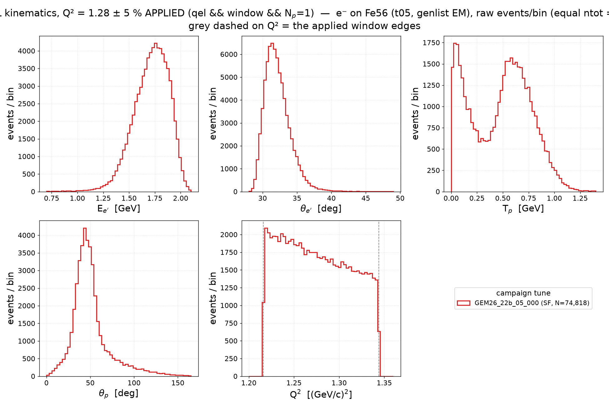
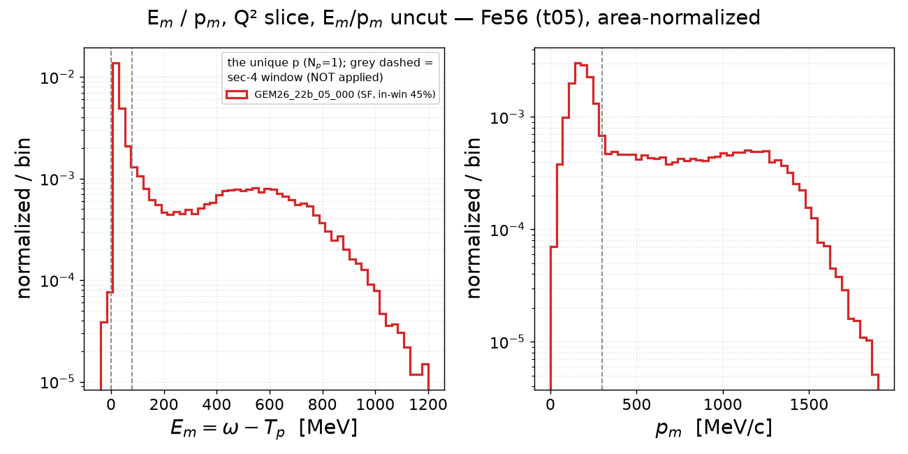
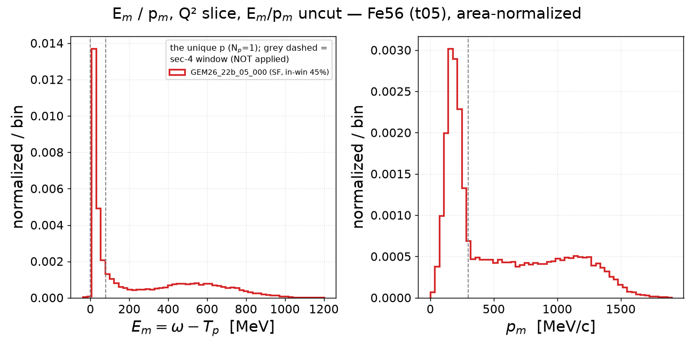
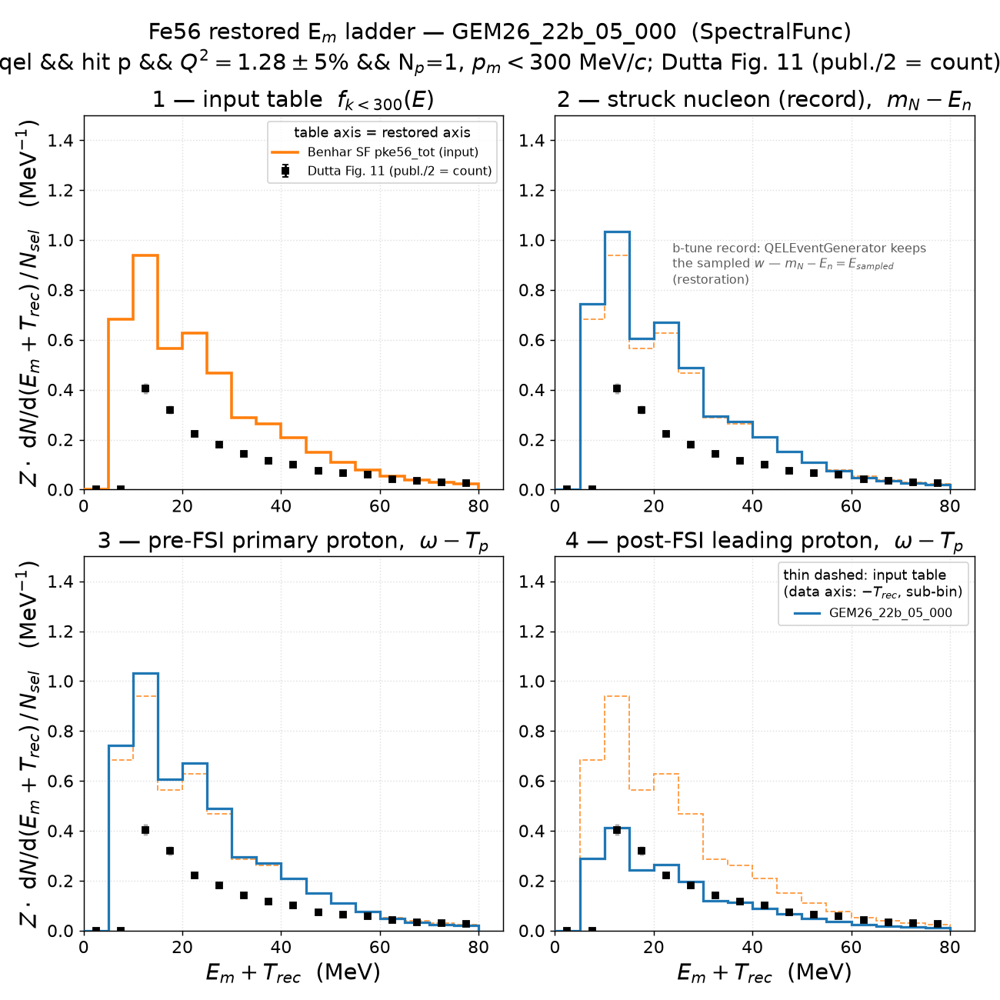
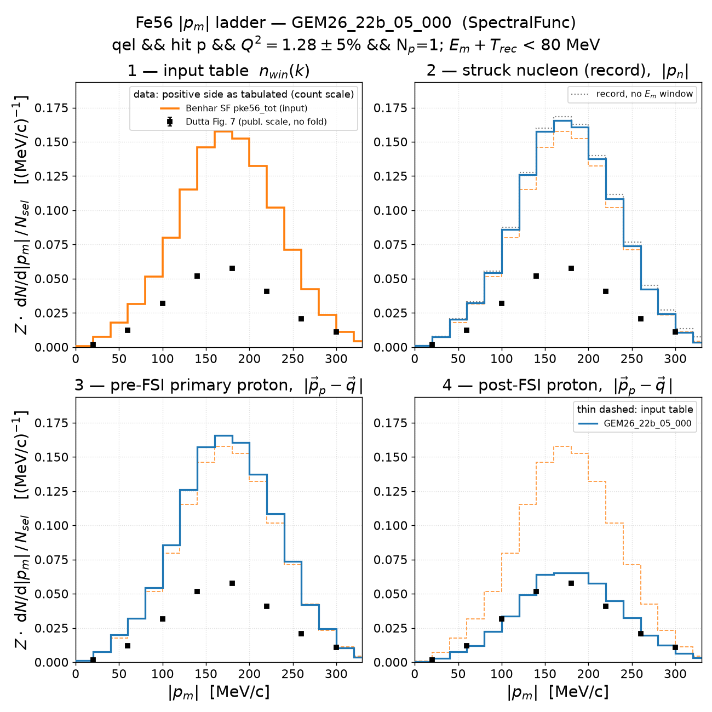
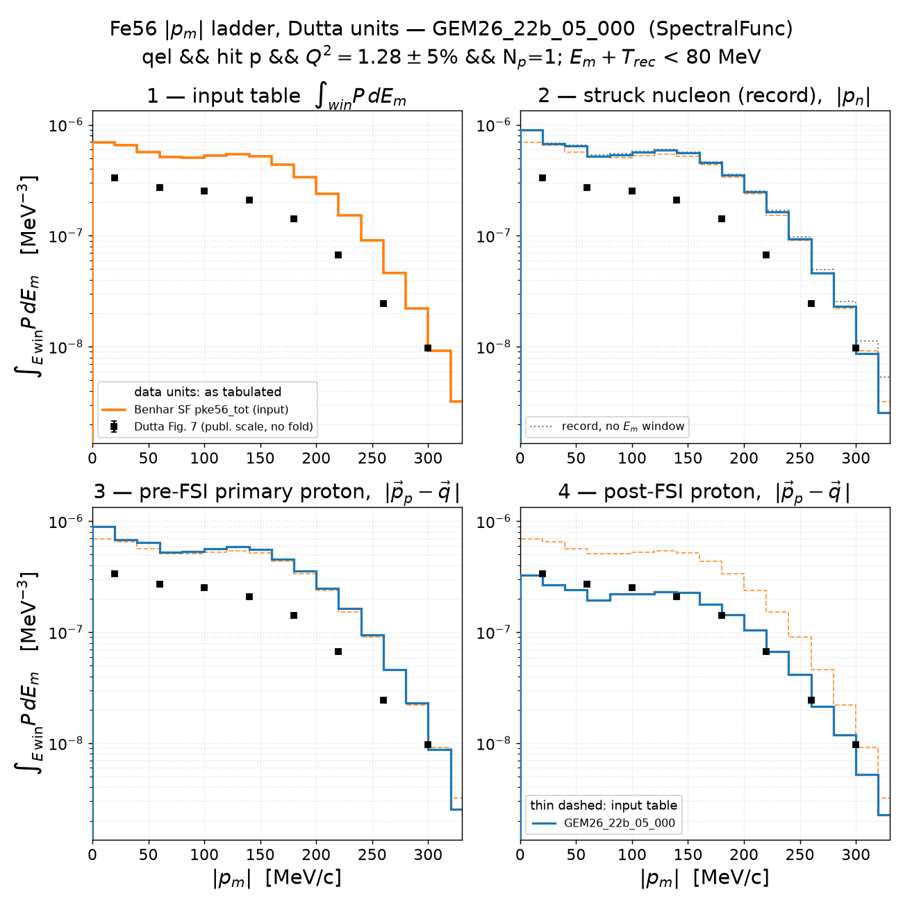
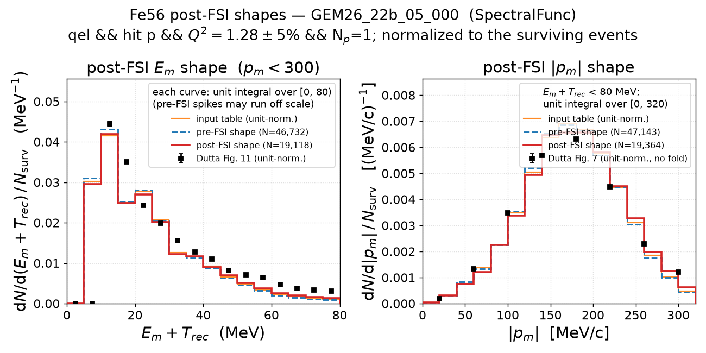
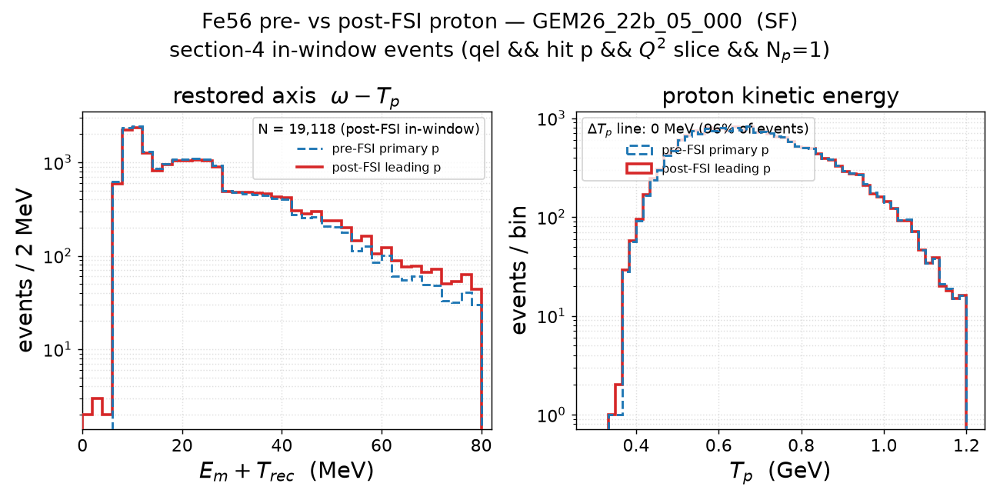
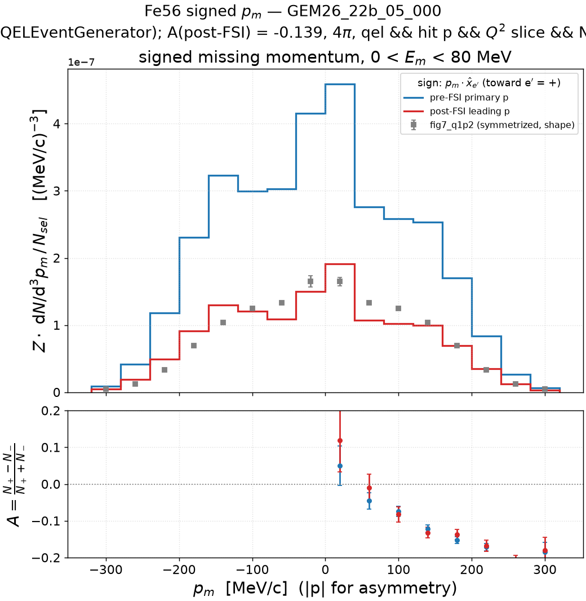

# Electron–Fe56 scattering — Q² slice, exactly-one-proton selection, Dutta data on the count scale (v1.2, `GEM26_22b_05_000`)

v1.2 instance of
[`../prd-analyzer-v0.3/electron_fe56_scattering.md`](../prd-analyzer-v0.3/electron_fe56_scattering.md)
for the single tune **`GEM26_22b_05_000`** (Benhar spectral function,
`QELEventGenerator`, hA2018): identical sample (Fe56 full-EM t05 grid
campaign 2026-07-16, 2M events), identical selection

    qel  &&  hitnuc == p  &&  |Q²/1.28 − 1| ≤ 5 %  &&  N_p(final state) = 1

and identical constructions, with the Dutta data drawn at **half their
published value** — the convention of the
[C12 note](electron_c12_scattering.md): fig 11's `S(E_m)` integrates over
the signed p_m axis and counts each |p_m| twice (Σ S dE / 2 = **9.10**
protons, a raw distorted strength ≈ T·Z/f_corr = 0.44·26/1.26 = 9.08), and
the fig 7 |p_m| file carries the full density on each side, so the positive
half is drawn as tabulated (no L+R fold; 4π Σ S p² dp = **9.103**, equal to
the fig 11 count to 0.03 %;
[`integrate_dutta.py`](../../report/dutta-integral/integrate_dutta.py)).
The old reading (fig 11 ≈ 18.2 ≈ 0.7 Z, fold L+R) is what
[`results/normalization/README.md`](../normalization/README.md) and
v0.2/v0.3 still carry.

The occupancy normalization is **unchanged from v0.3**: `Z · dN/dx / N_sel`,

| count | 22b, Fe56 | definition |
|---|---|---|
| ntot | 2,000,000 | generated events, genlist EM |
| N_QE | 275,485 | `qel`, both hit-nucleon species, no cut (v0.1 kinematics cache) |
| qel ∧ hit p | 186,694 | hit-nucleon dump |
| **N_sel** | **50,727** | `qel ∧ hit p ∧ Q² slice` — the ladder cache's `n_sel` |
| 1p in-window | 19,118 | post-FSI survivors, sections 4 / 4.3 / 5 |

(`--norm total-qe`, N_QE = 275,485, would divide every MC curve by a
further 5.43; not used.) Every histogram figure has a histdiag readout
`<stem>.txt` next to it ([`make_eep_readouts.py`](../template/make_eep_readouts.py));
the numbers below are quoted from those files.

**Headline.** As on carbon, the count-scale data are matched by the
**post-FSI** stage, not the pre-FSI one: E_m stage 4 / data = 1.077 ± 0.009
(stage 3 / data = 2.63), |p_m| 1.090 ± 0.010 (2.65) — hA2018's 0.41 survival
is the data's raw distorted fraction 9.10/26 = 0.35 within 8–9 %. The shapes
are v0.3's and, unlike carbon, disagree with the data in both variables:
the MC E_m is narrower and sits 4.9 MeV lower in the mean, with strength at
5–10 MeV where the data have none and 26 % too little above 30 MeV; the MC
|p_m| is 21 % low below 120 MeV/c and 10 % high at 160–280 MeV/c.

## 1. Fe56 2D spectral function — the GENIE input table

Cut- and selection-independent — see
[v0.1 section 1](../prd-analyzer-v0.1/electron_fe56_scattering.md#1-fe56-2d-spectral-function--the-genie-input-table).

## 2. Struck nucleon in the record

Record-level — independent of the FS-proton choice; see
[v0.2 section 2](../prd-analyzer-v0.2/electron_fe56_scattering.md#2-struck-nucleon-in-the-record-sampled-p_miss-e_rm-and-p_miss-r).

## 3. QEL kinematics in the slice — E_e′, θ_e′, T_p, θ_p, Q²

As v0.3 section 3 for 22b alone (**events/bin above**; area-normalized
companion `kin_qel_q2cut_fe56.png`; readout `kin_qel_q2cut_fe56.txt`). The
slice keeps 74,818 `qel` events of both species (27.2 % of the 275,485 QE
events); the proton panels use the 44,045 with N_p = 1. Multiplicity of the
qel ∧ Q²-window sample: 0p 17.2 %, 1p 58.9 %, ≥2p 23.9 % (the v0.3 row).
Electron side: E_e′ mean 1.71 GeV (peak 1.76), θ_e′ mean 32.2° (peak 31.4°),
Q² mean 1.276 GeV² flat across the window. Proton side: T_p is **bimodal**
even with N_p = 1 — the most populated bin is the lowest (0–0.04 GeV, the
rescattered hump) while the QE bump holds the bulk (median 0.52 GeV, 75 %
quantile 0.69); θ_p mean 51° (peak 43.5°, FWHM 24°, 95 % quantile 98°).

### 3.1 E_m and p_m in the slice — no E_m/p_m cuts

As v0.3 subsection 3.1 (log-y above, linear-y below, raw-counts companion
`empm_q2cut_fe56_counts.png`; readout `empm_q2cut_fe56.txt`). In-window
fraction (E_m in [0, 80), p_m < 300) of the N_p = 1 events: **0.446** (v0.3:
45 %; C12: 0.61). E_m peaks in the 10–30 MeV bin with median 92 MeV (the
uncut estimator's RES/DIS-like tail reaches 490 MeV at the 75 % quantile);
p_m peaks at 158 MeV/c with median 358 MeV/c — the uncorrelated-proton bump
at ≈ |q| is larger than on carbon.

Regenerate (this and 3.1):
`pixi run python results/template/make_kin_qel_q2cut.py --target Fe56 --proton-sel 1p --tunes GEM26_22b_05_000 --out-dir results/prd-analyzer-v1.2`.

## 4. Missing energy: table vs simulation vs Dutta Fig. 11 at half scale

Stage 4 = the unique proton of N_p = 1 events; stages 1–3 as v0.3. The data
are fig 11 × ½ (label "publ. scale / 2 = count"), integral **9.100** over
0–80 MeV; table and MC stages unchanged from v0.3.

| quantity | value | v0.3 (published-scale data) |
|---|---|---|
| N_sel | 50,727 | 50,727 |
| 1p fraction of the in-window sample | 71.6 % | 71.6 % |
| I1 (table, k < 300) | 22.630 | 22.630 |
| I2r = I3r | 23.952 | 23.952 |
| I4r | 9.799 | 9.799 |
| I4r / I3r | 0.409 | 0.409 |
| **I(data)** | **9.100** | 18.200 |
| stage 4 / data | **1.077 ± 0.009** | 0.538 |
| stage 3 / data | 2.632 ± 0.017 | 1.316 |
| record median (p5–p95) | 20.52 MeV (8.34–59.81) | same |

Readout `em_ladder_restored_fe56_GEM26_22b_05_000.txt`:

- **Normalization.** The post-FSI stage carries 7.7 % more strength than the
  data's raw distorted count (+8.5σ, statistical errors only; the 2 % + 5 %
  systematic band is not in the pull); pre-FSI is ×2.63 above. MC survival
  0.409 vs the data's N/Z = 9.10/26 = 0.350, or 0.44 after the paper's
  f_corr = 1.26 correlation correction.
- **Shape (data scaled to the MC integral, χ²/ndf 3891/15, KS 0.148 at
  10 MeV).** Both peak in the 10–15 MeV bin, but the MC mean is 24.5 vs
  29.4 MeV and the MC is narrower (std ratio 0.92; the quantile shifts grow
  from −3.3 MeV at 16 % to −7.6 at 84 %, not a rigid shift). The MC has
  strength at 0–10 MeV where the data have none (S_p(Fe56) ≈ 10.2 MeV; the
  Benhar table's low-E edge), is 16 % low at 10–20 MeV and 26 % low over
  30–80 MeV: tail above 48 MeV shape ratio 0.573 (−24σ).
- Stage 3 = stage 2 bin by bin (χ² = 0).
- Post-FSI vs pre-FSI (`em_postfsi_shape_fe56_GEM26_22b_05_000.txt`): ratio
  0.409, mean +0.95 MeV, std ratio 1.06, a localized +19 % excess at
  45–80 MeV (+6.5σ) — the rescattered remainder, larger than carbon's.

Regenerate: `GENIE_AGENT_INSTALLATION=genie_inclxx pixi run python results/template/make_emiss_ladder_q2cut.py --target Fe56 --tune GEM26_22b_05_000 --proton-sel 1p --data-conv raw --norm windowed --out-dir results/prd-analyzer-v1.2`.

### 4.1 Missing momentum: table vs record vs pre/post-FSI proton

The |p_m| projection of the same ladder
([`make_pmiss_ladder_q2cut.py`](../template/make_pmiss_ladder_q2cut.py)),
E window `E_m + T_rec < 80 MeV`, native 20 MeV/c bins, occupancy scale.
Data: fig 7 (Q² = 1.28), **positive side as tabulated** (no fold), weighted
4πp_m² onto the occupancy axis.

Windowed strengths, |p_m| < 320 MeV/c: I1(table) = 22.852,
**I(data) = 9.103** (v0.3 folded: 18.206), data/table = **0.40** (v0.3:
0.80).

| stage | I | I / data | v0.3 I / data (folded) |
|---|---|---|---|
| 2 record | 24.163 | 2.654 | 1.327 |
| 3 pre-FSI | 24.163 | 2.654 | 1.327 |
| 4 post-FSI | 9.925 | **1.090 ± 0.010** | 0.545 |
| I4 / I3 | 0.411 | | |

Readout `pm_ladder_fe56_GEM26_22b_05_000.txt`:

- **Post-FSI sits 9 % above the unfolded data** (+9.2σ stat); pre-FSI
  ×2.65. The survival 0.411 reproduces section 4's 0.409 (the 0–80 MeV
  window is wide enough that FSI energy loss does not carry survivors out).
- **Shape (40 MeV/c data grid, χ²/ndf 254/7).** Both peak at 180 MeV/c,
  but the MC mean is 177.3 vs 172.4 MeV/c (+9σ) and the MC is narrower
  (std ratio 0.95): −21 % at 40–120 MeV/c, +10 % at 160–280, −21 % in the
  last bin. The data are *flatter* than the MC (the v0.3 observation)
  and now also a factor 0.40 below the table.
- **FSI reshapes |p_m| mildly on iron**: stage 4 vs stage 3 after
  equal-integral scaling χ²/ndf 63/15, mean +3.0 ± 0.5 MeV/c, peak bin
  170 → 190 MeV/c, +15 % above 240 MeV/c (+5.8σ), left tail (<118) shape
  ratio 0.954 — the depletion is strongest at low |p_m|, in the direction
  of the data-vs-table difference but not enough to reach it (the −21 % at
  40–120 remains).
- Stage 2 without the E window: 50,727 events, mean 188 MeV/c; the window
  keeps 47,782 (the record holds the sampled removal energy, so the
  window bites, as in v0.3).

Regenerate: `GENIE_AGENT_INSTALLATION=genie_inclxx pixi run python results/template/make_pmiss_ladder_q2cut.py --target Fe56 --tune GEM26_22b_05_000 --proton-sel 1p --data-conv raw --norm windowed --out-dir results/prd-analyzer-v1.2`.

### 4.2 The same ladder in Dutta's units — ∫_win P dE_m [MeV⁻³]

Section 4.1 in the files' native units (MC ÷ 4πp_c², table as `Z·Σ P·ΔE`,
data exactly as tabulated — here the unfolded positive side), log y.

Same counts as 4.1 (`pm_ladder_dens_fe56_GEM26_22b_05_000.txt` points
there). The v0.3 reading of this view — data on the table at low |p_m|,
deficit concentrated in the 150–260 MeV/c falloff — was the folded data's;
unfolded, the data lie a factor ≈ 2.5 below the table everywhere with the
deficit *least* pronounced at low |p_m| (stage 3 / data 2.21 below
108 MeV/c, 2.85 in the core), and stage 4 straddles them (0.87 below
108 MeV/c, 1.15 in the core).

### 4.3 Post-FSI E_m and |p_m| shapes, normalized to the survivors

Unit-normalized in each window
([`make_postfsi_empm_shape.py`](../template/make_postfsi_empm_shape.py)),
so the ½ cancels and this figure is v0.3's: E panel 46,732 → 19,118,
p panel 47,143 → 19,364. Readouts
`postfsi_shape_empm_fe56_GEM26_22b_05_000.txt` /
`em_postfsi_shape_fe56_GEM26_22b_05_000.txt`:

- |p_m| shape vs data: χ²/ndf 254/7, mean +4.9 ± 0.5 MeV/c, −21 % below
  108 MeV/c (−12σ), +6 % in the core — post-FSI ≈ pre-FSI ≈ table (χ²/ndf
  56/7 between the two MC stages), the data flatter than all three.
- E_m shape vs data: χ²/ndf 3891/15, MC narrower (std 15.6 vs 16.9 MeV),
  +61 % below 13.6 MeV and −43 % above 48 MeV; the survivors sit on the
  pre-FSI shape (ΔT_p = 0) with a +19 % tail at 45–80 MeV.

Regenerate: `GENIE_AGENT_INSTALLATION=genie_inclxx pixi run python results/template/make_postfsi_empm_shape.py --target Fe56 --tune GEM26_22b_05_000 --proton-sel 1p --data-conv raw --out-dir results/prd-analyzer-v1.2`.

## 5. Pre- vs post-FSI proton

No data on this figure, so it is v0.3's (readout
`fsi_prepost_fe56_GEM26_22b_05_000.txt`): 19,118 in-window events,
multiplicity 0p 2.0 % / 1p 71.6 % / ≥2p 26.4 %, the unique proton is the
primary's descendant in 100.0 % of them, ΔT_p = T_p(pre) − T_p(post) median
0.00 MeV with 96.0 % within ±1 MeV (C12: 98.1 %). Post vs pre on the
restored axis: χ²/ndf 76.5/40 (p = 3 × 10⁻⁴), mean +1.13 ± 0.15 MeV, +16 %
in the tail above 38 MeV; T_p: χ²/ndf 2.2/52.

Regenerate: `pixi run python results/template/make_fsi_proton_choice.py --target Fe56 --tune GEM26_22b_05_000 --proton-sel 1p --out-dir results/prd-analyzer-v1.2`.

## 6. Missing momentum: table vs QEL struck-nucleon record

Record-level — see
[v0.2 section 6](../prd-analyzer-v0.2/electron_fe56_scattering.md#6-missing-momentum-table-vs-qel-struck-nucleon-record).

## 7. Signed missing momentum (± asymmetry)

| generator | A pre-FSI | A post-FSI | v0.3 A post-FSI |
|---|---|---|---|
| `QELEventGenerator` | −0.1416 ± 0.0046 | −0.1392 ± 0.0071 | −0.1392 |

The data overlay is shape-scaled to stage 4, so the ½ has no effect; the
density axis is on N_sel as in v0.3. Readout
`pmiss_signed_fe56_GEM26_22b_05_000.txt`: the + side (toward e′) holds
0.752 (pre) / 0.756 (post) of the − side and is displaced to lower |p_m| by
≈ 5.2 MeV/c (+ then − pull pattern across the peak, shape χ²/ndf 105/7 pre,
46/7 post) — the b-tune asymmetry, FSI-blind, 7 % larger than on carbon.

Regenerate: `pixi run python results/template/make_pmiss_signed_q2cut.py --target Fe56 --tune GEM26_22b_05_000 --proton-sel 1p --norm windowed --out-dir results/prd-analyzer-v1.2`.

## Reproduce

Caches: `results/prd-analyzer-v0.3/cache/{ladder,pmiss_signed}_fe56/GEM26_22b_05_000.npz`,
`results/prd-analyzer-v0.1/cache/kin_qel_fe56/` (also the source of N_QE)
and the v0.2 `fsiproton_fe56` dump — gitignored, regenerable; nothing was
streamed. The C12 note's command block with `--target Fe56` and
`make_eep_readouts.py --target Fe56` reproduces everything here.

## Figures

| file | content | readout |
|---|---|---|
| `kin_qel_q2cut_fe56[_counts].png` | E_e′, θ_e′, T_p, θ_p, Q² in the slice | `kin_qel_q2cut_fe56.txt` |
| `empm_q2cut_fe56[_counts|_lin].png` | E_m, p_m in the slice, uncut | `empm_q2cut_fe56.txt` |
| `em_ladder_restored_fe56_GEM26_22b_05_000.png` | E_m ladder vs fig 11 / 2 | same stem `.txt` |
| `em_postfsi_shape_fe56_GEM26_22b_05_000.png` | post-FSI E_m shape | same stem `.txt` |
| `pm_ladder_fe56_GEM26_22b_05_000.png`, `pm_ladder_dens_…` | \|p_m\| ladder vs unfolded fig 7, occupancy / density units | same stems `.txt` |
| `postfsi_shape_empm_fe56_GEM26_22b_05_000.png` | survivor-normalized E_m and \|p_m\| shapes | same stem `.txt` |
| `fsi_prepost_fe56_GEM26_22b_05_000.png` | pre- vs post-FSI proton | same stem `.txt` |
| `pmiss_signed_fe56_GEM26_22b_05_000.png` | signed p_m and asymmetry | same stem `.txt` |
