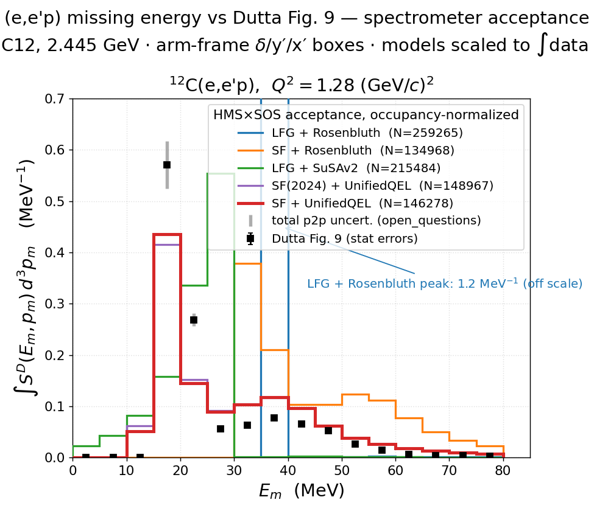
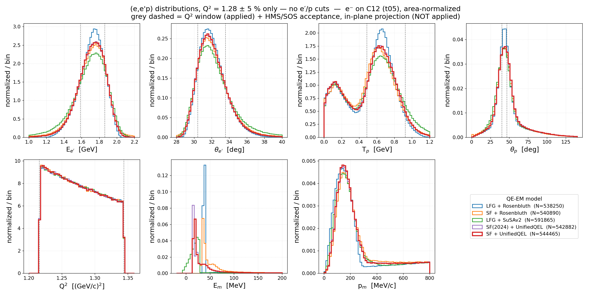
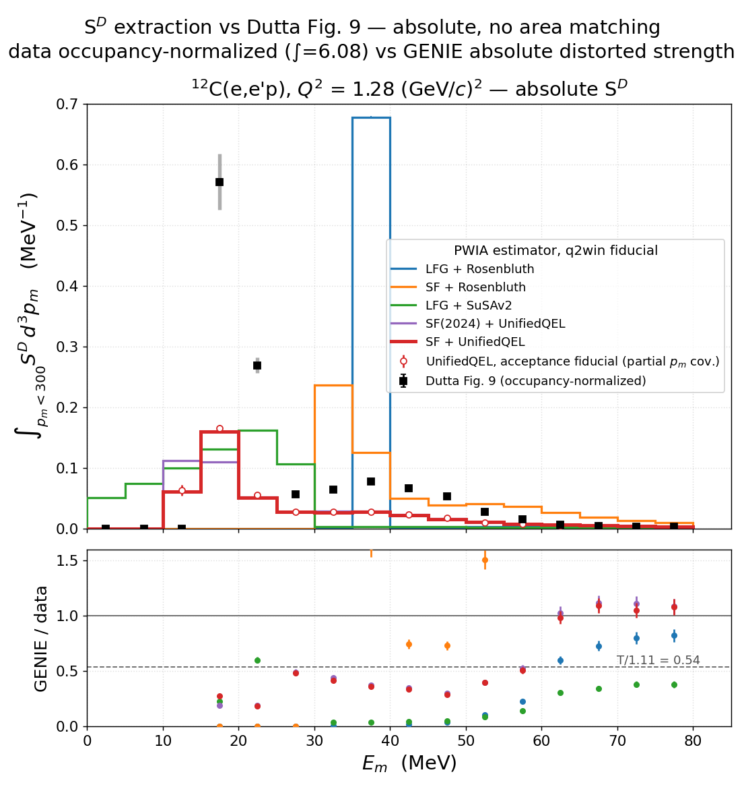

# prd-analyzer — (e,e′p) replication of Dutta et al. (JLab E91-013)

Analysis of the GENIE C12 EMQE grid samples against the Hall C **E91-013** quasi-elastic
(e,e′p) measurement ([nucl-ex/0303011](../../papers/nucl-ex_0303011/paper_nucl-ex_0303011.md)).
Targets **Table I row 5** — the **Q² = 1.28 GeV²** spectrometer setting at E_beam = 2.445 GeV —
applying the HMS/SOS acceptance cuts and comparing missing energy / missing momentum to the
paper's Figs 9/10 across **five QE-EM models**:

| model | tune | QE-EM cross section + ground state | install |
|-------|------|------------------------------------|---------|
| **LFG + Rosenbluth** | `GEM26_11a_05_000` | Rosenbluth + Local Fermi Gas          | genie_inclxx |
| **SF + Rosenbluth**  | `GEM26_22a_05_000` | Rosenbluth + Benhar Spectral Function | genie_inclxx |
| **LFG + SuSAv2**     | `GEM21_11a_05_000` | SuSAv2-QEL + Local Fermi Gas (`HybridXSecAlgorithm`) | genie_dev |
| **SF(2024) + UnifiedQEL** | `GEM26_33b_05_000` | UnifiedQEL (SF-consistent) + 2024 Ankowski-Benhar-Sakuda SF | genie_inclxx |
| **SF + UnifiedQEL** *(Variant 05, focus model)* | `GEM26_22b_05_000` | UnifiedQEL (SF-consistent) + Benhar Spectral Function | genie_inclxx |

Four clean axes: **LFG vs SF** isolates the **ground state** at fixed Rosenbluth cross section;
**LFG+Rosenbluth vs LFG+SuSAv2** isolates the **QE-EM cross section** at fixed Local Fermi Gas;
**SF+Rosenbluth vs SF+UnifiedQEL** isolates the **QE-EM cross-section model** at fixed Benhar
spectral-function ground state; **SF vs SF(2024), both UnifiedQEL,** isolates the **spectral
function itself** — the old broad-p-shell `pke12_tot` vs the 2024 quasiparticle-peak
`pke12_2024` ([page](spectral_function_c12_2024.md)) — at fixed SF-consistent cross section.
**SF + UnifiedQEL (Variant 05)** is the focus model — drawn on top and emphasized (thick C3
line) in every figure, with its new-SF sibling (`33b`, C4) beside it.

Each is ~10M `e⁻`-on-C12 events at generation cut **t05** (EM-MinQ2Limit = 1.18 GeV², so Q² ≥ 1.18
brackets the Q² = 1.28 setting). The samples are **streamed straight off dCache over XRootD** — no
local copy — see *Workflow*. Note SuSAv2 was generated with the `genie_dev` build, the other
four samples with `genie_inclxx` (a build difference to bear in mind).

## Workflow (XRootD stream → cache → plot)

The grid gst lives on `/pnfs` (~6–9 GB/model). Instead of pulling it, the analysis streams it over
XRootD and caches only the tiny selected subset:

1. **`samples.py`** — the 5-model registry. Maps `/pnfs/dune/…` →
   `root://fndca1.fnal.gov:1094//pnfs/fnal.gov/usr/dune/…` (dCache namespace) and lists each
   model's gst URLs (`gst_urls(model)`).
2. **`build_cache.py`** — streams every gst over XRootD (parallel worker processes, `WORKERS`
   env, default 8), applies the stage-1 (electron-arm) selection, and writes
   `cache/<model>.npz` (the stage-1 survivors + the stage-2 mask + total event count). Needs a
   dCache token:
   ```bash
   export BEARER_TOKEN_FILE=<token>          # refresh with: htgettoken -i dune
   pixi run python results/prd-analyzer/build_cache.py              # all models, branch CUTS
   pixi run python results/prd-analyzer/build_cache.py --superset   # loosest theta_e (+-6)
   pixi run python results/prd-analyzer/build_cache.py UnifiedQEL2024   # just one model
   ```
   Re-run only when the sample list or selection changes (new models: pass their keys).
   **Superset workflow** (preferred with the 1B samples): `--superset` streams each sample once
   with the loosest electron window into `cache/superset/<model>.npz`; each angle-cut branch
   then derives its own `cache/<model>.npz` locally with **`recut_cache.py`** (re-applies that
   branch's `selection.CUTS`, recomputes the stage-2 mask from the cached columns — verified
   bit-identical to a direct build) — no re-streaming per branch.
3. **`plot_*.py`** — read the cache (instant) and draw the figures.

Streaming needs `xrootd` + `fsspec-xrootd` in the pixi env (uproot opens `root://` directly).
Because the five models have **different total QE cross sections**, the 1D overlays are
**area-normalized** (shape comparison); the selected count `N` — a rate proxy — is in each legend.

## Selection & cuts

Replicates the E91-013 **Q² = 1.28 GeV²** spectrometer setting (Dutta et al., Table I row 5): the
narrow HMS/SOS acceptance windows on the scattered electron and the leading proton, reconstructed
from the GENIE gst. All of this lives in `selection.py`.

**Leading (knocked-out) proton.** The reconstructed proton is the **highest-momentum final-state
proton** in the event — post-FSI, `pdgf == 2212`, maximal `pf`
(`lead = ak.argmax(ak.where(isp, pf, -1))`). Its 4-momentum gives the proton kinematic energy
`T_p = E_p − m_p` (with `m_p` from the PDG module) and angle `θ_p = arccos(p_z/|p⃗|)`. An event with
**no** final-state proton (`has_p = false`) cannot form the coincidence and is dropped at stage 2.

**Reconstructed per-event kinematics:**
- `ω = E_beam − E_e′` — energy transfer
- `q⃗ = p⃗_beam − p⃗_e′` — 3-momentum transfer (`Q²` is read from the gst `Q2` branch)
- `θ_e′ = arccos(cos θ_l)` — scattered-electron angle
- `E_m = ω − T_p` — **missing energy** (heavy-recoil approx, `T_{A−1} ≈ 0`)  [MeV]
- `p_m = |q⃗ − p⃗_p|` — **missing momentum** (unsigned magnitude)  [MeV/c]

**The cuts** — acceptance window = centre ± half-width (`selection.CUTS`):

| cut | variable | window | paper (E91-013) | arm |
|-----|----------|--------|-----------------|-----|
| `El`      | scattered e′ energy `E_e′` | 1.725 ± 0.005 GeV | E_e′ = 1.725 GeV         | electron |
| `theta_e` | scattered e′ angle `θ_e′`  | 32.0 ± 0.5°       | θ_e′ = 32°               | electron |
| `Tp`      | leading-proton KE `T_p`    | 0.700 ± 0.025 GeV | T_p = 700 MeV            | proton   |
| `theta_p` | leading-proton angle `θ_p` | 43.0 ± 1.0°       | θ_p ≈ 43.5° (conjugate)  | proton   |

`Q²` is **not** cut directly — it is **pinned** by the electron arm:
`El ∧ θ_e′ ⇒ Q² = 4 E_beam E_e′ sin²(θ_e′/2) ≈ 1.28 GeV²`.

**Three stages** (`select_electron` → `select_proton_e` → `select`):
- **Stage 1 — electron arm**: `El ∧ θ_e′`. Tags the scattered electron and fixes Q²; the proton
  side is still unconstrained. This is what `build_cache.py` caches.
- **Stage 2.1 — + proton energy, θ_p free**: `has_p ∧ El ∧ θ_e′ ∧ T_p`. Adds only the
  leading-proton KE window, leaving the proton angle unconstrained — isolates what the `T_p`
  window does before the conjugate-angle window carves the momentum acceptance. Computed from
  the stage-1 cache (`selection.cache_stage_masks`), no re-streaming.
- **Stage 2 — full (e,e′p) coincidence**: `has_p ∧ El ∧ θ_e′ ∧ T_p ∧ θ_p`. Adds the leading-proton
  angle window — the coincidence the HMS/SOS spectrometer pair actually measures.

Acceptance is tight: ~0.4 % of events survive stage 1, ~0.1–0.2 % stage 2.1, ~0.01–0.05 % stage 2
(why the full 10M/model is needed). `cut_summary(ev)` prints the N−1 cut flow per variable.

## Figures

### 0. Input ground state — Benhar spectral function (see [page](spectral_function_c12.md))


The **input** both SF models sample from, read straight from `pke12_tot.data`: `P(k,E)` in the
(missing energy, missing momentum) plane plus its `f(E)`/`n(k)` marginals (`∫4πk²P dk dE = 1.0000`,
`f(E)` peak 17.5 MeV, `n(k)` peak 150 MeV/c). SF+Rosenbluth (`22a`) carries this `f(E)` through to
`E_m` unchanged; SF+UnifiedQEL (`22b`) reshapes it lower via its De Forest off-shell weighting. Full
write-up on the [dedicated page](spectral_function_c12.md).

### 0b. Updated ground state — Ankowski-Benhar-Sakuda 2024 (see [page](spectral_function_c12_2024.md))


The 2024 Ankowski-Benhar-Sakuda ¹²C proton SF (`data/pke12_2024.table`), fit to high-resolution
NIKHEF (e,e′p) data. It **resolves the p-shell into discrete quasiparticle peaks** (15.9 / ~18.5 /
~21 MeV) where the old `pke12_tot` had one broad 5-MeV bump, while leaving `n(k)` essentially
unchanged. Full write-up on the [dedicated page](spectral_function_c12_2024.md).

### 1. Missing energy & momentum (full coincidence)


Reconstructed `E_m = ω − T_p` and `p_m = |q⃗ − p⃗_p|` after the full (e,e′p) selection
(N = 5120 LFG / 1332 SF / 3462 SuSAv2 / 2161 SF(2024)+UnifiedQEL / **2180 SF+UnifiedQEL**, from
10M each). **LFG** is a sharp removal-energy spike (~36 MeV) with a low-`p_m` peak; **SF** is a
broad removal-energy distribution (~30–50 MeV) reaching out to a high-`p_m` shoulder (~120 MeV/c)
— the spectral function's `P(k,E)` tail; **SuSAv2** peaks *lower* in `E_m` (~28 MeV) with a soft
tail to zero, and a low-`p_m` shape closer to LFG. **SF + UnifiedQEL (Variant 05, thick red, on
top)** peaks markedly *lower* in `E_m` (~15–20 MeV) with a broad low-energy shoulder — the
SF-consistent (CBF) cross section reshapes the removal-energy distribution relative to factorized
SF+Rosenbluth at the *same* Benhar ground state, while its `p_m` shape tracks SF (both
spectral-function). That contrast (`22a` ↔ `22b`) isolates the QE-EM cross-section model at fixed
SF ground state. **SF(2024) + UnifiedQEL (`33b`, purple)** swaps in the 2024
Ankowski-Benhar-Sakuda SF at the same cross section: its `E_m` collapses into a sharp ~16 MeV
spike — the resolved p-shell quasiparticle peak of `pke12_2024`, vs the old SF's broad 5-MeV-wide
p-shell bump smeared further by De Forest weighting — while its `p_m` shape stays on top of `22b`
(`n(k)` essentially unchanged). That contrast (`22b` ↔ `33b`) is a pure ground-state-input effect,
directly visible in the spectrometer window. At fixed luminosity (SF and LFG share the Rosenbluth
σ) LFG keeps **3.8×** more coincidences than SF — Fermi smearing pushes SF protons out of the
tight HMS window.

**Stage 2.1 — the same observables with θ_p free:**


Dropping only the proton-angle window (N = 20840 LFG / 9483 SF / 16260 SuSAv2 /
14048 SF(2024)+UnifiedQEL / 14002 SF+UnifiedQEL) leaves `E_m` essentially unchanged — the shell
structure is set by `ω − T_p`, not by the angle — but transforms `p_m`: the spectral-function
models now peak broadly at ~120–140 MeV/c (their full momentum content within the `T_p` slice)
instead of being clipped to low `p_m`. The comparison with the stage-2 figure shows directly that
the **conjugate θ_p window is what selects low missing momentum** in the spectrometer coincidence.

### 2. Cut-stage distributions

**Stage 1 — electron arm only (`El ∧ θ_e`):**


`El`, `θ_e` sit in their windows and **Q² is pinned at ~1.28** (the electron arm fixes it), while
`T_p`, `θ_p`, `E_m`, `p_m` are still free/broad (N = 47443 LFG / 39559 SF / 39866 SuSAv2 /
41164 SF(2024)+UnifiedQEL / 41697 SF+UnifiedQEL). Grey dashed = the acceptance windows (not yet
applied to `T_p`/`θ_p` here).

**Stage 2.1 — + proton KE, θ_p free (`El ∧ θ_e ∧ T_p`):**


`T_p` is clamped to its window while `θ_p` stays free (N = 20840 / 9483 / 16260 / 14048 / 14002):
the proton-angle panel shows each model's full conjugate-angle distribution around the dashed
43 ± 1° window — broadest for the spectral-function models (Fermi motion tilts the proton away
from the q⃗ direction), narrowest for LFG — and `p_m` is correspondingly broad.

**Stage 2 — full coincidence (`El ∧ θ_e ∧ T_p ∧ θ_p`):**


All four cut variables are clamped to their windows, leaving the residual `Q²`, `E_m`, `p_m`
(N = 5120 / 1332 / 3462 / 2161 / 2180) — the model differences surviving the spectrometer bite.
The `33b` p-shell spike at `E_m` ≈ 16 MeV stands out against the `22b` shoulder.

### 3. 2D missing energy vs momentum (stage × model)


`p_m` vs `E_m`, rows = stage 1 / stage 2.1 (+ `T_p`, θ_p free) / stage 2 (full), columns =
LFG / SF / SuSAv2 / SF(2024)+UnifiedQEL / SF+UnifiedQEL (Variant 05, rightmost). **The
spectral-function models show the `(E_m, p_m)` ridge** — removal energy rising with missing
momentum, the `P(k,E)` correlation — while **LFG is a flat fixed-removal-energy band**,
independent of `p_m`. In the `33b` column the ridge sits on the sharp 16-MeV quasiparticle line
of the 2024 SF instead of the old broad p-shell band. Reading down a column: the `T_p` window
(row 2) keeps the ridge intact across the full `p_m` range; the θ_p window (row 3) then cuts it
off at low missing momentum.

### 4. Missing momentum by shell (E_m slices, both stages)


`p_m` sliced by missing-energy window — **p-shell: 10 < E_m < 25 MeV** (left), **s-shell:
30 < E_m < 50 MeV** (right) — for stage 1 (top), stage 2.1 (`T_p` in window, θ_p free, middle)
and stage 2 (bottom), area-normalized. A model with N < 50 in a window is listed in the legend
but not drawn (a near-empty density histogram is all spikes).

The two columns show the textbook shell signature in the observable: the **p-shell slice rises
from a node at `p_m` ≈ 0 to a broad ~100 MeV/c peak** (l = 1), while the **s-shell slice peaks at
low `p_m`** (l = 0). Which models populate which window is itself the story:

- **LFG** (fixed removal energy ≈ 36 MeV) has essentially **no p-shell strength** (stage-1
  N = 1, stage-2 N = 0) — everything sits in the 30–50 MeV window with its narrow low-`p_m` peak.
- **SF + Rosenbluth** is nearly as empty in the p-window (N = 27 / 1): without the De Forest
  reshaping its `E_m` strength stays at 30–50 MeV.
- **SuSAv2** populates the 10–25 MeV window heavily (stage-1 N = 13543), but as a Fermi-gas model
  it has no shells — the slice is just the low-`E_m` kinematic tail of its distribution; its
  s-window content is marginal (stage-2 N = 32, not drawn).
- **The two SF + UnifiedQEL models** are the only ones with genuine strength in *both* windows
  (p: 13625 `33b` / 13929 `22b`; s: 6055 / 5921 at stage 1). Their p-shell `p_m` shapes lie on
  top of each other — the 2024 SF changes *where* the p-shell sits in `E_m` (the 16-MeV
  quasiparticle peak vs the old broad bump) but not its momentum content (`n(k)` unchanged). In
  the s-window the `33b` slice is the cleaner s-shell sample: its resolved p-shell peaks sit
  below 25 MeV, while the old SF leaks smeared p-shell strength into 30–50 MeV.

### 5. Missing energy vs Dutta Fig. 9 — spectrometer acceptance + occupancy normalization



The direct data overlay: `E_m` through the **physical HMS×SOS acceptance** instead of the
stage-2 windows. `acceptance.py` cuts in **spectrometer coordinates** (per-arm `delta`/`yptar`/
`xptar` boxes about the Q² = 1.28 central settings — HMS e′: 1.725 GeV/c @ 32.0°, |δ|<8 %,
|y′|<27.5 mrad; SOS p: 1.341 GeV/c @ 43.5°, |δ|<20 %, |y′|<57 mrad, |x′|<37.2 mrad — from
[report/simc-eep-normalization.md](../../report/simc-eep-normalization.md) §4.5/4.7,
collimator-derived). Each event is rotated about the beam to put e′ in the spectrometer plane
(the MC is azimuthally symmetric; the proton keeps its relative out-of-plane angle, so the SOS
box carves the physical coincidence acceptance). `E_m = ω − T_p − T_rec` (paper definition,
recoil included), 5-MeV data bins, `p_m` < 300 MeV/c (automatically satisfied in this
acceptance). Acceptance efficiency ~1.4–2.6 % (N = 135k–260k from 10M streamed/model).

**Normalization**: the fig9 data are on the **full-occupancy (IPSM) scale** — their integral is
Σ·5 MeV = 6.08 ≈ Z, not the raw absorbed yield (see
[open_questions](../../papers/nucl-ex_0303011/open_questions.md)) — so each model is scaled to
the same integral over 0–80 MeV (shape + occupancy comparison). Data error bars: inner = the
data file's statistical errors (0.8–3.3 %); outer grey = total point-to-point per the
open-questions prescription (stat ⊕ 2 % ⊕ 5 %, the two p-shell bins set to the published
pixel-measured bars 8.1 %/4.7 %).

**Read**: the two **SF + UnifiedQEL** variants are closest (χ²/13 ≈ 2.2k vs 21k–56k for the
rest — the tiny data errors make χ² a ranking, not a goodness); they put the p-shell peak in
the right bin but ~25 % low and spill strength into 20–50 MeV, plus unphysical sub-threshold
strength at E_m < 16 MeV where the data are zero. SF + Rosenbluth peaks 20–35 MeV too high
(no De Forest reshaping); LFG is a delta-spike at ~36 MeV (1.2 MeV⁻¹, off scale); SuSAv2 sits
between. At this 5-MeV binning the 2024-SF quasiparticle structure is washed out — `33b` ≈
`22b`.

**Caveats**: (i) the t05 generation cut (Q² ≥ 1.18) clips the low-Q² corner of the acceptance
(which extends to ≈1.07) — ~18 % of accepted events sit within 0.04 GeV² of the boundary; all
five models are clipped identically and the E_m shape impact is second-order. (ii) The HMS
octagonal collimator is modeled as its bounding rectangle (~10 % more solid angle). (iii) The
electron out-of-plane window is treated as fully accepting (the e′-plane rotation). (iv) The
data are deradiated but still FSI-distorted (S^D); GENIE events are post-FSI — consistent in
spirit, but the data's absolute scale is convention-defined (occupancy), so only shapes and
relative occupancies are compared.

### 6. Uncut distributions in the Q² slice — Q² = 1.28 ± 5 % only



The no-cut counterpart of the cut-stage figures: **all electron and proton cuts removed**, only
`|Q²/1.28 − 1| ≤ 5 %` (Q² ∈ [1.216, 1.344], fully inside the t05 generation cut — no boundary
clip). 4 files/model streamed (2M events), ~27–30 % selected (N = 538k–592k), cached in
`cache/q2window/`. All seven variables (El, θ_e′, T_p, θ_p, Q², E_m, p_m), area-normalized;
proton panels implicitly drop the ~21 % of events with no final-state proton (neutron knockout).
Grey dashed lines mark the applied Q² window and, on the El/θ_e′/T_p/θ_p panels, the HMS/SOS
acceptance windows (in-plane projections, derived from `acceptance.py` — **not** applied here):
El ∈ [1.587, 1.863] GeV, θ_e′ = 32.0 ± 1.58°, T_p ∈ [0.487, 0.924] GeV, θ_p = 43.5 ± 3.26°.

**Read**: with the spectrometer bite removed, `El`/`θ_e′` are the smooth QE peak (1.75 GeV,
~31.5°) — the Q² window alone constrains them only weakly. `T_p` is double-peaked: the QE bump
at ~0.65 GeV plus a low-`T_p` (~0.1–0.2 GeV) population of FSI-rescattered / secondary leading
protons that the spectrometer windows normally remove; correspondingly `θ_p` has a long tail
beyond the ~45° conjugate peak and `p_m` a flat FSI tail out to 800 MeV/c. `E_m` remains the
model discriminator even uncut: LFG spike at ~36 MeV, SF+Rosenbluth at ~40 MeV with the broad
shoulder, SuSAv2 low and broad, the two SF+UnifiedQEL variants at ~16–18 MeV (the 2024 SF
visibly sharper — the quasiparticle p-shell peak survives without any acceptance shaping).

### 7. Extracted distorted spectral function S^D — absolute scale, no area matching



Dutta's own PWIA estimator run on the GENIE events
([plan](../../.claude/plans/genie-experimental-spectral-function.md)): per (E_m, p_m) bin,
`S^D = [σ_tot/N_gen · Σ 1/(E_p·p_p·σ_cc1)] / H`, with σ_cc1 from `deforest.py` (the same
off-shell prescription the experiment used), σ_tot from each production's own spline, and H
the flat-MC phase space (`phase_space_h.py`). `y(Em) = Σ S^D·(4π/3)Δp_m³` over p_m < 300
reproduces the fig9 observable in MeV⁻¹ — **absolute**, unlike the area-matched overlay of
section 5. C^rad = 1 (GENIE is radiation-free = deradiated data). 2D maps
(`sd_2d_maps.png`): the SF models show the P(k,E) ridge, LFG the fixed-E_m stripe, in both
fiducials.

**Window integrals** ∫S^D dEm d³pm (0 ≤ E_m < 80, p_m < 300), vs the paper's absorbed scale
T/1.11 × 6 ≈ 3.24 and the data file's occupancy integral 6.08:

| model | I | I/3.24 | I/6.08 |
|---|---|---|---|
| LFG + Rosenbluth | 3.505 ± 0.008 | 1.08 | 0.58 |
| SF + Rosenbluth | 2.978 ± 0.005 | 0.92 | 0.49 |
| LFG + SuSAv2 | 3.221 ± 0.006 | 0.99 | 0.53 |
| SF(2024) + UnifiedQEL | 2.175 ± 0.004 | 0.67 | 0.36 |
| SF + UnifiedQEL | 2.137 ± 0.004 | 0.66 | 0.35 |

**Read**: the Rosenbluth/SuSAv2 models land within ±9 % of the experiment's absorbed
strength (I/6.08 ≈ 0.49–0.58 vs the measured T/1.11 = 0.54 guide in the ratio panel) —
GENIE's absolute in-window (e,e'p) retention quantitatively matches E91-013's
transparency-suppressed yield. The UnifiedQEL pair sits at 0.66× that, directly tracking its
smaller σ_tot (15.6/23.6 nb): dividing all models by the *same* σ_cc1 (as the experiment
does) exposes the SF-consistent cross section's lower absolute yield. Shapes: the SF-model
tails reach GENIE/data ≈ 1 above E_m ≈ 60 MeV while the p-shell peak region sits at 0.2–0.5.
**Cross-fiducial validation**: UnifiedQEL extracted through both fiducials (H volumes
differing by orders of magnitude) agrees bin-by-bin to median a/b = 0.946, median
|pull| = 0.64 (232 common bins); the acceptance-fiducial open circles track the q2win curve.
Caveats: the acceptance variant covers only part of the p_m sphere (its y(Em) is a lower
bound); data occupancy normalization is the standing open question.

## Scripts
- **`samples.py`** — 5-model registry; `xrootd_url()`, `gst_urls(model)`, `load_cache(model)`,
  `lw(model)`/`zorder(model)` (the `HIGHLIGHT` = Variant 05 gets a thick line, drawn on top).
- **`build_cache.py`** — XRootD stream + stage-1 selection → `cache/<model>.npz`.
- **`selection.py`** — shared selection + missing-kinematics util (unchanged; `load_events(path)`
  works on a local path *or* a `root://` URL):
  - `CUTS` — acceptance windows (center ± half-width): `El` 1.725±0.005 GeV, `theta_e` 32±0.5°,
    `Tp` 0.700±0.025 GeV, `theta_p` 43±1°.
  - `load_events` — leading (post-FSI) proton, `E_m = ω − T_p`, `p_m = |q⃗ − p⃗_p|`, `Q2`, angles.
  - `select_electron(ev)` — stage 1 (El ∧ θ_e). `select_proton_e(ev)` — stage 2.1 (+ T_p, θ_p
    free). `select(ev)` — stage 2 (full). `cache_stage_masks(c)` — all three masks from a
    stage-1 cache. `cut_summary(ev)`.
- **`plot_missing.py`** → `missing_e_p_q2_1.28.png`, `missing_e_p_q2_1.28_stage21.png`
- **`plot_dists.py`** → `dists_stage1_electron.png`, `dists_stage21_proton_e.png`, `dists_stage2_full.png`
- **`plot_2d.py`** → `missing_2d_e_vs_p.png` (3 stages × 5 models)
- **`plot_missing_shells.py`** → `missing_p_shells.png` (p_m in the p-/s-shell `E_m` windows, all 3 stages)
- **`acceptance.py`** — HMS/SOS spectrometer-acceptance selection (arm-frame δ/y′/x′ boxes,
  e′-plane rotation, `E_m = ω − T_p − T_rec`); `select_acceptance(ev)`, `cut_summary(ev)`.
- **`build_cache_acceptance.py`** — XRootD stream + acceptance selection →
  `cache/acceptance/<model>.npz` (`MAX_FILES` env, default 20 = 10M events/model).
- **`plot_em_dutta_fig9.py`** → `em_dutta_fig9_q1p28.png` (E_m overlay on Dutta Fig. 9,
  occupancy-normalized; prints per-model χ²)
- **`build_cache_q2.py`** — XRootD stream, Q² = 1.28 ± 5 % window ONLY (no e′/p cuts) →
  `cache/q2window/<model>.npz` (`MAX_FILES` env, default 4).
- **`plot_dists_q2.py`** → `dists_q2window.png` (the 7 variables, uncut, in the Q² slice)
- **`deforest.py`** — numpy port of SIMC's σ_cc1/σ_Mott/Bosted-FF/sigep
  (`simc_gfortran/physics_proton.f` @ 60c2047; flag 0/−1) for the S^D extraction
  ([plan](../../.claude/plans/genie-experimental-spectral-function.md)); self-validating
  (`pixi run python results/prd-analyzer/deforest.py`): elastic closure
  deforest·Ee/(pp·Mp·Ein) = sigep exact at the Dutta settings.
- **`build_cache_sd.py`** — one XRootD pass → `cache/sd/<model>_{q2win,accept}.npz`: the
  σ_cc1 inputs (nu, q, E_p, p_p, sinγ, cosφ) + E_m (recoil incl.)/p_m per event for both
  S^D fiducials, plus the sample cross section from the production's own gmkspl spline
  (auto-located via the campaign gridlog; C12 channels; e.g. Rosenbluth 23.61 nb,
  UnifiedQEL 15.56 nb at 2.445 GeV, Q² ≥ 1.18).
- **`phase_space_h.py`** — flat companion MC → `cache/sd/H_{q2win,accept}.npz`: the
  per-(E_m, p_m)-bin phase-space volume H [MeV²·sr²] for each S^D fiducial (exact
  importance sampling, Q² ≥ 1.18 imposed, split-sample converged to 0.35 % median).
- **`plot_sd_extraction.py`** → `sd_2d_maps.png`, `sd_extraction_fig9.png` (the S^D
  extraction: 2D maps, absolute fig9 overlay + ratio panel; prints the window integrals
  and the cross-fiducial validation).
- **`plot_spectral_function.py`** → `spectral_function_c12.png` (parses `pke12_tot.data`; no gst needed)
- **`plot_spectral_function_2024.py`** → `spectral_function_c12_2024.png`, `spectral_function_c12_2024_vs_old.png` (parses `data/pke12_2024.table`; two-segment energy grid)

## Data
GENIE gst (post-FSI), `e⁻` on C12, E_beam = 2.445 GeV, cut **t05** (EM-MinQ2Limit = 1.18, Q² ≈ 1.28),
10M events/model, on dCache:
```
/pnfs/dune/scratch/users/liangliu/jobsub-agent/prd_paper/EM/
  genie_inclxx/GEM26_11a_05_000/eminus_C12_20260602-131202_gev/…   (LFG,             100×100k)
  genie_inclxx/GEM26_22a_05_000/eminus_C12_20260602-131216_gev/…   (SF,              100×100k)
  genie_dev/GEM21_11a_05_000/eminus_C12_20260601-153754_gev/…      (SuSAv2,           20×500k)
  genie_inclxx/GEM26_33b_05_000/eminus_C12_20260610-095820_gev/…   (SF(2024)+UQEL,   100×100k)
  genie_inclxx/GEM26_22b_05_000/eminus_C12_20260604-103343_gev/…   (UnifiedQEL,      100×100k)
```
streamed over XRootD (never copied locally). The narrow spectrometer cuts keep ~0.4 % at stage 1 and
~0.01–0.05 % at stage 2, so the full 10M/model is needed for usable statistics.

## Notes
- The EMQE samples are pure QEL (the `EMQE` generator list is QEL-EM only), so no RES/DIS split.
- 1D overlays are **area-normalized** — the five models have different total σ, so raw counts are
  not a fair overlay; the rate information lives in the legend `N` (and the stage-2 efficiencies).
- `p_m` is the unsigned magnitude (matches the paper); the p-shell dip at `p_m≈0` is the l=1 node.
- SuSAv2 (`genie_dev`) vs the Rosenbluth pair (`genie_inclxx`) is a cross-build comparison.
