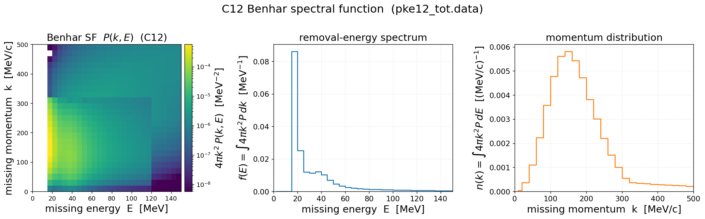
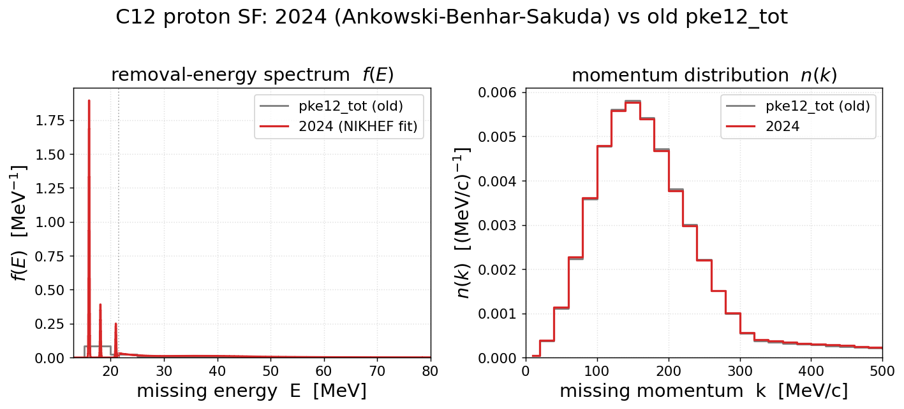
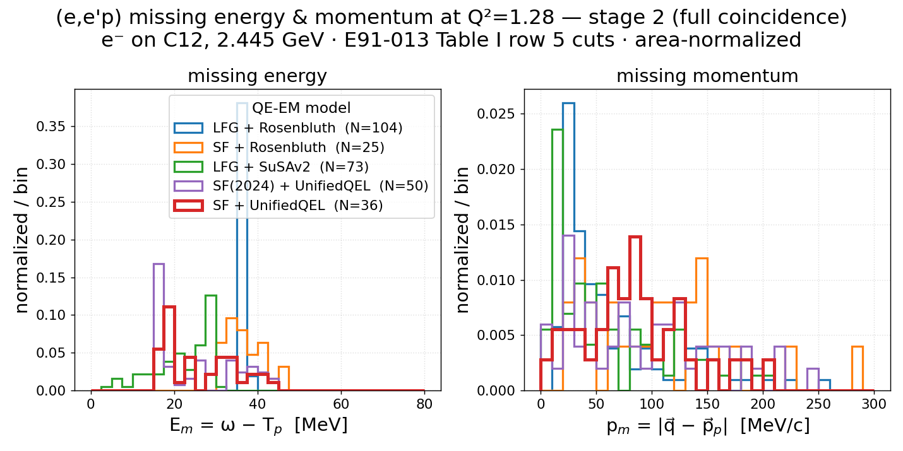
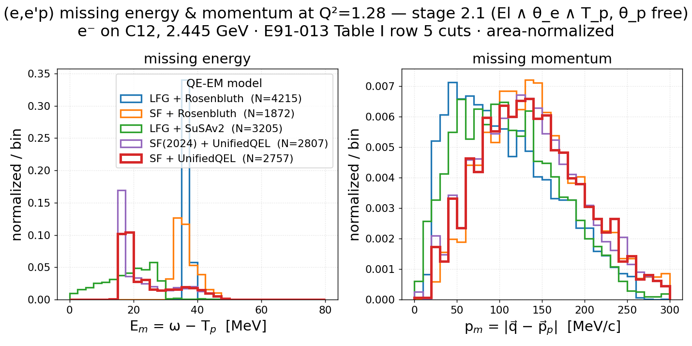
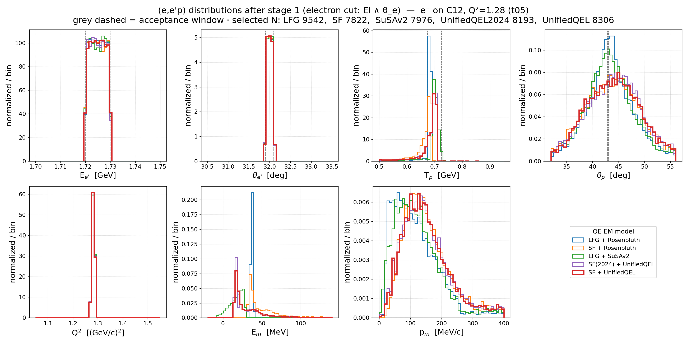
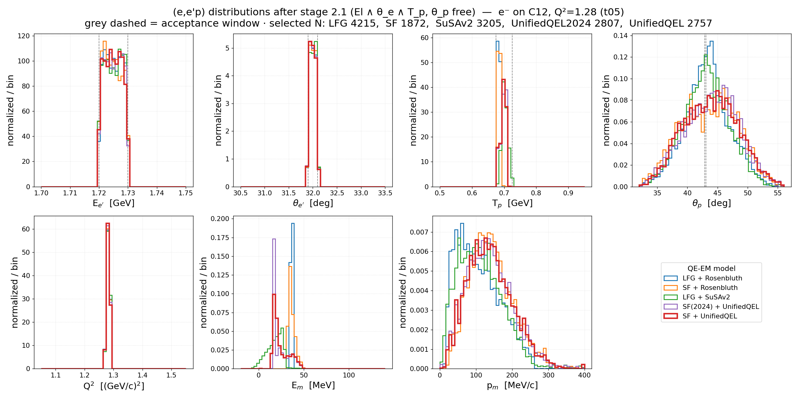
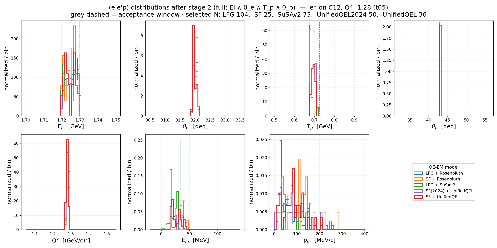
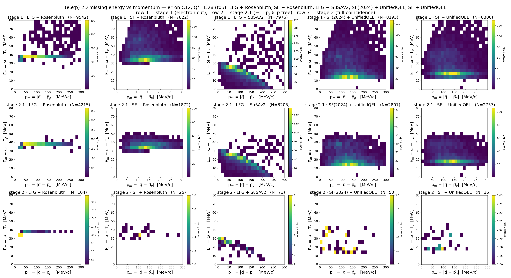
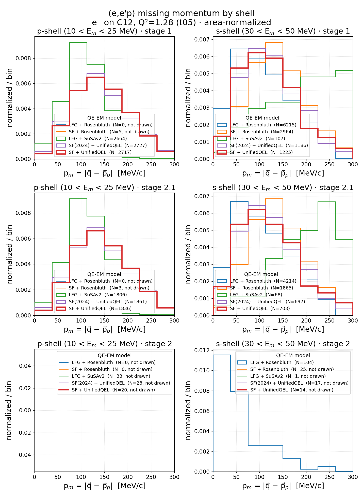

# prd-analyzer — (e,e′p) replication of Dutta et al. (JLab E91-013)

Analysis of the GENIE C12 EMQE grid samples against the Hall C **E91-013** quasi-elastic
(e,e′p) measurement ([nucl-ex/0303011](../../papers/nucl-ex_0303011/paper_nucl-ex_0303011.md)).
Targets **Table I row 5** — the **Q² = 1.28 GeV²** spectrometer setting at E_beam = 2.445 GeV —
applying the HMS/SOS acceptance cuts and comparing missing energy / missing momentum to the
paper's Figs 9/10 across **five QE-EM models**:

| model | tune | QE-EM cross section + ground state | install |
|-------|------|------------------------------------|---------|
| **LFG + Rosenbluth** | `GEM26_11a_05_000` | Rosenbluth + Local Fermi Gas          | genie_inclxx |
| **SF + Rosenbluth**  | `GEM26_22a_05_000` | Rosenbluth + Benhar Spectral Function | genie_inclxx |
| **LFG + SuSAv2**     | `GEM21_11a_05_000` | SuSAv2-QEL + Local Fermi Gas (`HybridXSecAlgorithm`) | genie_dev |
| **SF(2024) + UnifiedQEL** | `GEM26_33b_05_000` | UnifiedQEL (SF-consistent) + 2024 Ankowski-Benhar-Sakuda SF | genie_inclxx |
| **SF + UnifiedQEL** *(Variant 05, focus model)* | `GEM26_22b_05_000` | UnifiedQEL (SF-consistent) + Benhar Spectral Function | genie_inclxx |

Four clean axes: **LFG vs SF** isolates the **ground state** at fixed Rosenbluth cross section;
**LFG+Rosenbluth vs LFG+SuSAv2** isolates the **QE-EM cross section** at fixed Local Fermi Gas;
**SF+Rosenbluth vs SF+UnifiedQEL** isolates the **QE-EM cross-section model** at fixed Benhar
spectral-function ground state; **SF vs SF(2024), both UnifiedQEL,** isolates the **spectral
function itself** — the old broad-p-shell `pke12_tot` vs the 2024 quasiparticle-peak
`pke12_2024` ([page](spectral_function_c12_2024.md)) — at fixed SF-consistent cross section.
**SF + UnifiedQEL (Variant 05)** is the focus model — drawn on top and emphasized (thick C3
line) in every figure, with its new-SF sibling (`33b`, C4) beside it.

Each is ~10M `e⁻`-on-C12 events at generation cut **t05** (EM-MinQ2Limit = 1.18 GeV², so Q² ≥ 1.18
brackets the Q² = 1.28 setting). The samples are **streamed straight off dCache over XRootD** — no
local copy — see *Workflow*. Note SuSAv2 was generated with the `genie_dev` build, the other
four samples with `genie_inclxx` (a build difference to bear in mind).

## Workflow (XRootD stream → cache → plot)

The grid gst lives on `/pnfs` (~6–9 GB/model). Instead of pulling it, the analysis streams it over
XRootD and caches only the tiny selected subset:

1. **`samples.py`** — the 5-model registry. Maps `/pnfs/dune/…` →
   `root://fndca1.fnal.gov:1094//pnfs/fnal.gov/usr/dune/…` (dCache namespace) and lists each
   model's gst URLs (`gst_urls(model)`).
2. **`build_cache.py`** — streams every gst over XRootD, applies the stage-1 (electron-arm)
   selection, and writes `cache/<model>.npz` (~2 MB each: the ~40k stage-1 survivors + the stage-2
   mask + total event count). Needs a dCache token:
   ```bash
   export BEARER_TOKEN_FILE=<token>          # refresh with: htgettoken -i dune
   pixi run python results/prd-analyzer/build_cache.py        # ~8 min, 50M events
   pixi run python results/prd-analyzer/build_cache.py UnifiedQEL2024   # just one model
   ```
   Re-run only when the sample list or selection changes (new models: pass their keys).
3. **`plot_*.py`** — read the cache (instant) and draw the figures.

Streaming needs `xrootd` + `fsspec-xrootd` in the pixi env (uproot opens `root://` directly).
Because the five models have **different total QE cross sections**, the 1D overlays are
**area-normalized** (shape comparison); the selected count `N` — a rate proxy — is in each legend.

## Selection & cuts

Replicates the E91-013 **Q² = 1.28 GeV²** spectrometer setting (Dutta et al., Table I row 5): the
narrow HMS/SOS acceptance windows on the scattered electron and the leading proton, reconstructed
from the GENIE gst. All of this lives in `selection.py`.

**Leading (knocked-out) proton.** The reconstructed proton is the **highest-momentum final-state
proton** in the event — post-FSI, `pdgf == 2212`, maximal `pf`
(`lead = ak.argmax(ak.where(isp, pf, -1))`). Its 4-momentum gives the proton kinematic energy
`T_p = E_p − m_p` (with `m_p` from the PDG module) and angle `θ_p = arccos(p_z/|p⃗|)`. An event with
**no** final-state proton (`has_p = false`) cannot form the coincidence and is dropped at stage 2.

**Reconstructed per-event kinematics:**
- `ω = E_beam − E_e′` — energy transfer
- `q⃗ = p⃗_beam − p⃗_e′` — 3-momentum transfer (`Q²` is read from the gst `Q2` branch)
- `θ_e′ = arccos(cos θ_l)` — scattered-electron angle
- `E_m = ω − T_p` — **missing energy** (heavy-recoil approx, `T_{A−1} ≈ 0`)  [MeV]
- `p_m = |q⃗ − p⃗_p|` — **missing momentum** (unsigned magnitude)  [MeV/c]

**The cuts** — acceptance window = centre ± half-width (`selection.CUTS`):

| cut | variable | window | paper (E91-013) | arm |
|-----|----------|--------|-----------------|-----|
| `El`      | scattered e′ energy `E_e′` | 1.725 ± 0.005 GeV | E_e′ = 1.725 GeV         | electron |
| `theta_e` | scattered e′ angle `θ_e′`  | 32.0 ± 0.1°       | θ_e′ = 32°               | electron |
| `Tp`      | leading-proton KE `T_p`    | 0.700 ± 0.025 GeV | T_p = 700 MeV            | proton   |
| `theta_p` | leading-proton angle `θ_p` | 43.0 ± 0.1°       | θ_p ≈ 43.5° (conjugate)  | proton   |

The angular windows are **±0.1° (~±1.7 mrad) pencil cuts** — the tightest variant of this
analysis (cf. the ±0.5°/±1° baseline on `prd/electron/angle_cut_1_degree` and the ±6°
acceptance-scale windows on `prd/electron/angle_cut_6_degree`). `Q²` is **not** cut directly —
it is **pinned** by the electron arm:
`El ∧ θ_e′ ⇒ Q² = 4 E_beam E_e′ sin²(θ_e′/2) = 1.28 ± 0.01 GeV²`.

**Three stages** (`select_electron` → `select_proton_e` → `select`):
- **Stage 1 — electron arm**: `El ∧ θ_e′`. Tags the scattered electron and fixes Q²; the proton
  side is still unconstrained. This is what `build_cache.py` caches.
- **Stage 2.1 — + proton energy, θ_p free**: `has_p ∧ El ∧ θ_e′ ∧ T_p`. Adds only the
  leading-proton KE window, leaving the proton angle unconstrained — isolates what the `T_p`
  window does before the conjugate-angle window carves the momentum acceptance. Computed from
  the stage-1 cache (`selection.cache_stage_masks`), no re-streaming.
- **Stage 2 — full (e,e′p) coincidence**: `has_p ∧ El ∧ θ_e′ ∧ T_p ∧ θ_p`. Adds the leading-proton
  angle window — the coincidence the HMS/SOS spectrometer pair actually measures.

Acceptance is extreme: ~0.08–0.10 % of events survive stage 1, ~0.02–0.04 % stage 2.1, and only
**25–104 events of 10M** (~3×10⁻⁴ %) survive stage 2 — the ±0.1° pencil windows are
statistics-starved even at 10M events/model. `cut_summary(ev)` prints the N−1 cut flow per
variable.

## Figures

### 0. Input ground state — Benhar spectral function (see [page](spectral_function_c12.md))



The **input** both SF models sample from, read straight from `pke12_tot.data`: `P(k,E)` in the
(missing energy, missing momentum) plane plus its `f(E)`/`n(k)` marginals (`∫4πk²P dk dE = 1.0000`,
`f(E)` peak 17.5 MeV, `n(k)` peak 150 MeV/c). SF+Rosenbluth (`22a`) carries this `f(E)` through to
`E_m` unchanged; SF+UnifiedQEL (`22b`) reshapes it lower via its De Forest off-shell weighting. Full
write-up on the [dedicated page](spectral_function_c12.md).

### 0b. Updated ground state — Ankowski-Benhar-Sakuda 2024 (see [page](spectral_function_c12_2024.md))



The 2024 Ankowski-Benhar-Sakuda ¹²C proton SF (`data/pke12_2024.table`), fit to high-resolution
NIKHEF (e,e′p) data. It **resolves the p-shell into discrete quasiparticle peaks** (15.9 / ~18.5 /
~21 MeV) where the old `pke12_tot` had one broad 5-MeV bump, while leaving `n(k)` essentially
unchanged. Full write-up on the [dedicated page](spectral_function_c12_2024.md).

### 1. Missing energy & momentum (full coincidence)



Reconstructed `E_m = ω − T_p` and `p_m = |q⃗ − p⃗_p|` after the full (e,e′p) selection — with the
±0.1° pencil windows only **N = 104 LFG / 25 SF / 73 SuSAv2 / 50 SF(2024)+UnifiedQEL /
36 SF+UnifiedQEL** survive from 10M each, so the shapes are statistically ragged; read only the
gross features. Those gross features persist: **LFG** spikes at its fixed removal energy
(~36 MeV), **SF** sits at 30–50 MeV, **SuSAv2** lower (~28 MeV), the two **UnifiedQEL** models
lowest with the `33b` strength concentrated at the ~16 MeV quasiparticle peak, and `p_m` is
clipped to low values by the pencil θ_p window. At fixed luminosity LFG keeps **~4×** more
coincidences than SF (104 vs 25) — Fermi smearing pushes SF protons out of the pencil
acceptance. For the model-shape discussion use the wider-window branches
(`prd/electron/angle_cut_1_degree`, `prd/electron/angle_cut_6_degree`).

**Stage 2.1 — the same observables with θ_p free:**



Dropping only the proton-angle window (N = 4215 LFG / 1872 SF / 3205 SuSAv2 /
2807 SF(2024)+UnifiedQEL / 2757 SF+UnifiedQEL) leaves `E_m` essentially unchanged — the shell
structure is set by `ω − T_p`, not by the angle — but transforms `p_m`: the spectral-function
models peak broadly at ~120–140 MeV/c (their full momentum content within the `T_p` slice)
instead of being clipped to low `p_m`. With the ±0.1° pencil θ_p the clipping at stage 2 is
near-total (only ~1–2.5 % of the `T_p`-selected events survive), so stage 2.1 is where the
usable statistics live on this branch.

### 2. Cut-stage distributions

**Stage 1 — electron arm only (`El ∧ θ_e`):**



`El`, `θ_e` sit in their (now pencil-thin) windows and **Q² is pinned at 1.28 ± 0.01** (the
electron arm fixes it), while `T_p`, `θ_p`, `E_m`, `p_m` are still free/broad (N = 9542 LFG /
7822 SF / 7976 SuSAv2 / 8193 SF(2024)+UnifiedQEL / 8306 SF+UnifiedQEL). Grey dashed = the
acceptance windows (not yet applied to `T_p`/`θ_p` here).

**Stage 2.1 — + proton KE, θ_p free (`El ∧ θ_e ∧ T_p`):**



`T_p` is clamped to its window while `θ_p` stays free (N = 4215 / 1872 / 3205 / 2807 / 2757):
the proton-angle panel shows each model's full conjugate-angle distribution around the dashed
43 ± 0.1° pencil window — broadest for the spectral-function models (Fermi motion tilts the
proton away from the q⃗ direction), narrowest for LFG — and `p_m` is correspondingly broad.

**Stage 2 — full coincidence (`El ∧ θ_e ∧ T_p ∧ θ_p`):**



All four cut variables are clamped to their windows, leaving the residual `Q²`, `E_m`, `p_m`
(N = 104 / 25 / 73 / 50 / 36) — at pencil-cut statistics these panels are indicative only.

### 3. 2D missing energy vs momentum (stage × model)



`p_m` vs `E_m`, rows = stage 1 / stage 2.1 (+ `T_p`, θ_p free) / stage 2 (full), columns =
LFG / SF / SuSAv2 / SF(2024)+UnifiedQEL / SF+UnifiedQEL (Variant 05, rightmost). **The
spectral-function models show the `(E_m, p_m)` ridge** — removal energy rising with missing
momentum, the `P(k,E)` correlation — while **LFG is a flat fixed-removal-energy band**,
independent of `p_m`. In the `33b` column the ridge sits on the sharp 16-MeV quasiparticle line
of the 2024 SF instead of the old broad p-shell band. Reading down a column: the `T_p` window
(row 2) keeps the ridge intact across the full `p_m` range; the θ_p window (row 3) then cuts it
off at low missing momentum.

### 4. Missing momentum by shell (E_m slices, both stages)



`p_m` sliced by missing-energy window — **p-shell: 10 < E_m < 25 MeV** (left), **s-shell:
30 < E_m < 50 MeV** (right) — for stage 1 (top), stage 2.1 (`T_p` in window, θ_p free, middle)
and stage 2 (bottom), area-normalized. A model with N < 50 in a window is listed in the legend
but not drawn (a near-empty density histogram is all spikes).

The two columns show the textbook shell signature in the observable: the **p-shell slice rises
from a node at `p_m` ≈ 0 to a broad ~100 MeV/c peak** (l = 1), while the **s-shell slice peaks at
low `p_m`** (l = 0). Which models populate which window is itself the story:

- **LFG** (fixed removal energy ≈ 36 MeV) has **no p-shell strength at all** (N = 0 at every
  stage) — everything sits in the 30–50 MeV window.
- **SF + Rosenbluth** is nearly as empty in the p-window (stage-1 N = 5): without the De Forest
  reshaping its `E_m` strength stays at 30–50 MeV.
- **SuSAv2** populates the 10–25 MeV window (stage-1 N = 2664), but as a Fermi-gas model it has
  no shells — the slice is just the low-`E_m` kinematic tail of its distribution; its s-window
  content is marginal (stage-1 N = 107).
- **The two SF + UnifiedQEL models** are the only ones with genuine strength in *both* windows
  (p: 2727 `33b` / 2717 `22b`; s: 1186 / 1225 at stage 1). Their p-shell `p_m` shapes lie on
  top of each other — the 2024 SF changes *where* the p-shell sits in `E_m` (the 16-MeV
  quasiparticle peak vs the old broad bump) but not its momentum content (`n(k)` unchanged). In
  the s-window the `33b` slice is the cleaner s-shell sample: its resolved p-shell peaks sit
  below 25 MeV, while the old SF leaks smeared p-shell strength into 30–50 MeV.
- **Stage 2 is starved by the pencil θ_p**: every model falls below the N = 50 draw threshold in
  both windows except LFG's s-shell (N = 104) — the bottom row is essentially legend-only.

## Scripts
- **`samples.py`** — 5-model registry; `xrootd_url()`, `gst_urls(model)`, `load_cache(model)`,
  `lw(model)`/`zorder(model)` (the `HIGHLIGHT` = Variant 05 gets a thick line, drawn on top).
- **`build_cache.py`** — XRootD stream + stage-1 selection → `cache/<model>.npz`.
- **`selection.py`** — shared selection + missing-kinematics util (unchanged; `load_events(path)`
  works on a local path *or* a `root://` URL):
  - `CUTS` — acceptance windows (center ± half-width): `El` 1.725±0.005 GeV, `theta_e` 32±0.5°,
    `Tp` 0.700±0.025 GeV, `theta_p` 43±1°.
  - `load_events` — leading (post-FSI) proton, `E_m = ω − T_p`, `p_m = |q⃗ − p⃗_p|`, `Q2`, angles.
  - `select_electron(ev)` — stage 1 (El ∧ θ_e). `select_proton_e(ev)` — stage 2.1 (+ T_p, θ_p
    free). `select(ev)` — stage 2 (full). `cache_stage_masks(c)` — all three masks from a
    stage-1 cache. `cut_summary(ev)`.
- **`plot_missing.py`** → `missing_e_p_q2_1.28.png`, `missing_e_p_q2_1.28_stage21.png`
- **`plot_dists.py`** → `dists_stage1_electron.png`, `dists_stage21_proton_e.png`, `dists_stage2_full.png`
- **`plot_2d.py`** → `missing_2d_e_vs_p.png` (3 stages × 5 models)
- **`plot_missing_shells.py`** → `missing_p_shells.png` (p_m in the p-/s-shell `E_m` windows, all 3 stages)
- **`plot_spectral_function.py`** → `spectral_function_c12.png` (parses `pke12_tot.data`; no gst needed)
- **`plot_spectral_function_2024.py`** → `spectral_function_c12_2024.png`, `spectral_function_c12_2024_vs_old.png` (parses `data/pke12_2024.table`; two-segment energy grid)

## Data
GENIE gst (post-FSI), `e⁻` on C12, E_beam = 2.445 GeV, cut **t05** (EM-MinQ2Limit = 1.18, Q² ≈ 1.28),
10M events/model, on dCache:
```
/pnfs/dune/scratch/users/liangliu/jobsub-agent/prd_paper/EM/
  genie_inclxx/GEM26_11a_05_000/eminus_C12_20260602-131202_gev/…   (LFG,             100×100k)
  genie_inclxx/GEM26_22a_05_000/eminus_C12_20260602-131216_gev/…   (SF,              100×100k)
  genie_dev/GEM21_11a_05_000/eminus_C12_20260601-153754_gev/…      (SuSAv2,           20×500k)
  genie_inclxx/GEM26_33b_05_000/eminus_C12_20260610-095820_gev/…   (SF(2024)+UQEL,   100×100k)
  genie_inclxx/GEM26_22b_05_000/eminus_C12_20260604-103343_gev/…   (UnifiedQEL,      100×100k)
```
streamed over XRootD (never copied locally). The narrow spectrometer cuts keep ~0.4 % at stage 1 and
~0.01–0.05 % at stage 2, so the full 10M/model is needed for usable statistics.

## Notes
- The EMQE samples are pure QEL (the `EMQE` generator list is QEL-EM only), so no RES/DIS split.
- 1D overlays are **area-normalized** — the five models have different total σ, so raw counts are
  not a fair overlay; the rate information lives in the legend `N` (and the stage-2 efficiencies).
- `p_m` is the unsigned magnitude (matches the paper); the p-shell dip at `p_m≈0` is the l=1 node.
- SuSAv2 (`genie_dev`) vs the Rosenbluth pair (`genie_inclxx`) is a cross-build comparison.
