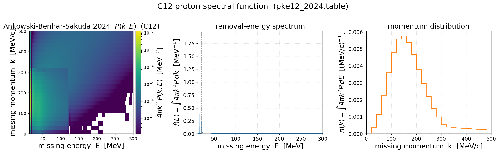

[← prd-analyzer](README.md) · [← Results home](../README.md)

# C12 proton spectral function — Ankowski-Benhar-Sakuda 2024

The updated Benhar-family ¹²C **proton** spectral function `P(|k|,E)` from
**A. M. Ankowski, O. Benhar, M. Sakuda, "Determination of the proton spectral function of
¹²C from (e,e′p) data"** (Suppl. Material, 3 Nov 2024 — `data/suppl_mat_ankowski_et_al.pdf`),
plotted in the same (missing energy, missing momentum) plane as the older
[`pke12_tot.data`](spectral_function_c12.md). The 2024 table fits the **high-resolution
NIKHEF (e,e′p) data** (Van der Steenhoven 1988) in the p-shell region `13 < E < 21.5 MeV` and
matches the Benhar model (Saclay + nuclear matter) for `21.5 < E < 300 MeV`.

## Standalone view

*2D `4π k² P(k,E)` (log color, linear E 13–300 MeV), `f(E)=∫4πk²P dk`, `n(k)=∫4πk²P dE`.
The 0.025 MeV fine grid resolves the p-shell as a razor-sharp spike, so the `f(E)` panel's
continuum is squashed on linear-y — see the comparison figure below.*

## 2024 vs old `pke12_tot.data`

This is the informative comparison (both per-proton, ÷Z=6):

- **`f(E)` (left):** the old table (grey) has one broad ~5-MeV-binned p-shell bump at ~17.5 MeV;
  the 2024 table (red) **resolves it into discrete quasiparticle peaks at 15.9 / ~18.5 / ~21 MeV**
  — what fitting the high-resolution NIKHEF data buys. Past the 21.5 MeV segment boundary
  (dotted) both agree on the smooth Benhar continuum.
- **`n(k)` (right):** the two momentum distributions are **essentially identical** (red on grey,
  peak 150 MeV/c). The 2024 update refines the *energy* structure but **preserves the momentum
  distribution** — integrating the sharp peaks recovers the same total p-shell strength. Also a
  cross-check that both tables parse and normalize consistently (`∫4πk²(P/Z)dk dE = 1.0000`).

`<E>` drops 40.9 → 26.0 MeV — not because strength moved, but because the resolved peaks
concentrate the p-shell weight at lower E instead of smearing it across a 5-MeV bin.

## File format (verified against the PDF)

| Header | Meaning |
|--------|---------|
| `40  20.000` | 40 momentum bins, 20 MeV wide (centers 10…790 MeV/c) |
| `340 0.025 2785 0.100` | energy grid: 340×0.025 MeV (13–21.5, NIKHEF fit) + 2785×0.1 MeV (21.5–300, Benhar) |

Body = 40 `|k|` blocks, each `|k|` then 3125 `(E, P)` pairs. `P(|k|,E)` in **MeV⁻⁴**,
**normalised to Z=6**. Total 31322 lines / 250046 tokens. The per-bin energy width is a
**vector** (0.025 in the fine segment, 0.1 in the coarse) — used for every energy integral.

## Sources

- Ankowski, Benhar, Sakuda (2024), suppl. material — *this table*.
- Van der Steenhoven et al., Nucl. Phys. A480, 547 (1988) — NIKHEF (e,e′p), p-shell fit.
- Benhar, Fabrocini, Fantoni, Sick, Nucl. Phys. A579, 493 (1994) — finite-nucleus LDA model.
- Benhar, Fabrocini, Fantoni, Nucl. Phys. A505, 267 (1989) — nuclear-matter correlation part.
- Mougey et al., Nucl. Phys. A262, 461 (1976) — Saclay (e,e′p) continuum.

## Scripts & data

- **Generator:** [`plot_spectral_function_2024.py`](plot_spectral_function_2024.py) —
  `pixi run python results/prd-analyzer/plot_spectral_function_2024.py`
- **Data:** `data/pke12_2024.table` (+ `data/suppl_mat_ankowski_et_al.pdf`). Not wired into a
  GENIE `SpectralFunc` slot — analysis input only.
